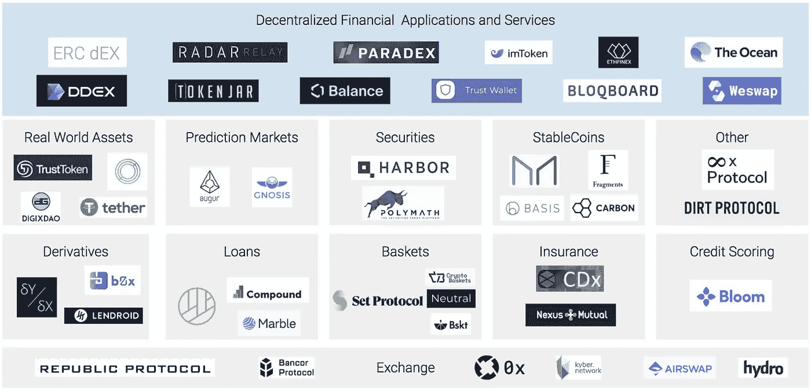
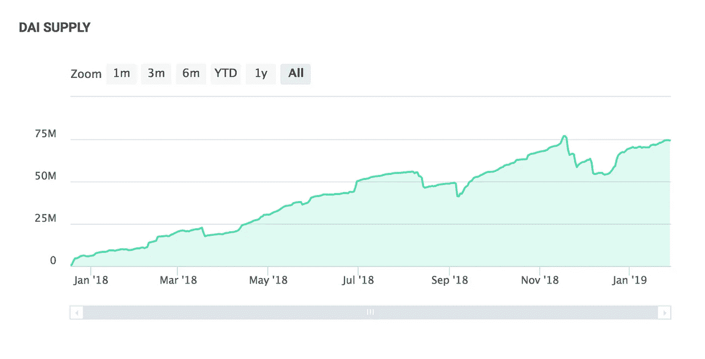

# 论风险对称性与代码即法律

> 原文：<https://medium.com/hackernoon/on-risk-symmetry-and-code-is-law-c8823fd494ea>

游戏中的皮肤是加密网络环境中的一个基本概念。利益相关者通过拥有货币价值的代币参与游戏，因此在经济上受到激励，集体为网络工作。这是一个强有力的概念，也是确保风险对称性的一种手段，风险对称性是指当人们承担风险时，他们会直接暴露于潜在的有利因素和不利因素。也就是说，下行风险不能在感觉合适的时候随意转移给别人。你自己承担风险。

在一个设计良好的加密网络中，令牌持有者直接对他们采取的行动负责。现实情况是，很难设计出按预期运行并实施风险对称的激励结构。[工作代币已经提供了对第一代交换媒介代币的改进设计。](/@patrickmayr/improving-network-incentives-through-work-tokens-94193b0dd922)在工作令牌模型中，服务提供商标记网络的本地令牌以获得执行工作的权利。高质量的工作会得到额外的现金流和初始股份的回报，而糟糕的回报会通过削减初始股份来惩罚。然而，网络设计中需要增加粒度，以确保激励结构发挥作用，并保持风险对称性。

**金融系统中利益相关者的日益对称**

crypto 中一个特别有趣的领域是开发一个开放的金融系统，试图消除当今系统中的一些结构性缺陷。

正如纳西姆·塔勒布(Nassim Taleb)在《游戏中的皮肤》(Skin in the Game)一书中所阐述的那样，如今的金融机构有能力承担巨大的风险来创造收益，但基本上不会受到潜在的负面影响。2008 年的全球衰退就是一个最好的例子。银行能够从高风险的次级抵押贷款支持证券中获取可观的利润，但随之而来的崩溃成本却转移到了拯救它们的纳税人身上。当前体系中的风险转移创造了一种环境，在这种环境下，承担风险与适当的下行风险敞口并不匹配。

可以说，金融机构的决策者，如最高管理层、董事会成员和拥有治理权的大股东，事实上通过股权或期权参与了这场游戏。虽然这可能是真的，但这群人与普通纳税人之间的不对称值得关注。银行的最高管理层可以分享过度风险的巨大好处。然而，普通纳税人没有办法分享这种上涨，并通过来自税收的数十亿美元的紧急救助承担了下跌的风险。

要合理地宣称大规模分散金融网络解决了风险对称问题，还有一段路要走。许多网络仍然非常年轻，令牌模型还没有被更正式地设计。然而，一个做了非常有趣的工作的加密网络的例子是 MakerDAO 网络。

Projects that are building out the decentralized financial ecosystem. Courtesy of [Felix Feng](https://medium.com/u/fac08728c433?source=post_page-----c8823fd494ea--------------------------------) at [Set Protocol](https://setprotocol.com/): [https://twitter.com/felix2feng/status/1022227214698303488](https://twitter.com/felix2feng/status/1022227214698303488)

## **MakerDAO:一个由负责任的决策者组成的金融网络**

MakerDAO 是一个双令牌金融网络，它使用一个稳定硬币(Dai)和一个治理令牌(MKR)。

当用户[锁定抵押债务头寸(CDP)中的抵押品，并获得以 Dai 计价的贷款时，就产生了 Dai。](/makerdao/dai-cdp-user-stories-36735f095fda)

[MKR 持有者充当分散风险管理社区](/makerdao/what-is-mkr-e6915d5ca1b3)。他们决定了几个参数，以确保网络的鲁棒性。作为对他们服务的回报，MKR 持有者可以获得酬金。当用户想要关闭 CDP 时，他们需要为以代币购买的戴氏货币贷款支付利息，这些代币会被系统自动烧毁。焚烧 MKR 代币对代币供应造成了通货紧缩压力，从而提高了流通中的代币价格。Scalar Capital 的 Cyrus 在这里提供了一个很好的设计概述。

MKR 持有者的主要职责之一是，当用户开立 CDP 时，决定接受哪些代币作为抵押品。目前只接受 ETH，[但这种情况将会改变](/makerdao/the-code-is-ready-2aee2aa62e73)。例如，允许太多低质量、高波动性的硬币被用作抵押品，会增加系统的风险。这相当于 2008 年危机前投资银行将越来越多的次级抵押贷款打包，从而隐藏风险，并作为优质产品出售。

如果大量 CDP 由于波动性增加而变得抵押不足，则通过**强制 MKR 稀释**触发自动资本重组。该系统自动铸造新 MKR，并在市场上出售，以筹集资金和调整系统资本。MKR 持有者的股权被稀释，实际上降低了他们现有股权的价值。

> MKR 持有者给系统带来的额外风险是对称分布的。

接受更多硬币作为抵押品可以向更多潜在用户开放市场，从而增加 MKR 持有者收到的费用。另一方面，增加硬币也增加了对 MKR 代币价格产生负面影响的可能性。不管是哪种情况，MKR 持有者都直接暴露于他们决策的结果。

Supply of Dai has been steadily increasing since the beginning of 2018\. Outstanding supply is currently around $74m. Source: [https://mkr.tools/](https://mkr.tools/)

**通过代币购买激励进行救助**

通过强制 MKR 稀释的救助机制很有趣，因为它通过铸造新的代币来救助系统。当新的 MKR 代币被拿出来购买以对系统进行资本重组时，现有的持有者可以，并且实际上被激励去购买新发行的 MKR 代币以减轻稀释。这一体系中的救助并不依赖于债务的转移。其他人不会在晚些时候被留下来买单。

然而，该系统带来的一个风险是，该网络严重依赖足够的激励来购买新创建的 MKR。可能会出现现有 MKR 持有者资金不足以购买新代币的情况，或者激励措施不足以吸引有偿付能力的各方进行投资。这就是所谓的破产问题，也是当今许多稳定硬币面临的普遍问题。

## **势不可挡的金融网络**

值得注意的是，在 2008 年全球经济衰退的余波中，银行在很大程度上得到了各自政府的救助。如果任由自由市场的力量摆布，更多的银行可能会破产，并经历它们给金融体系带来的额外风险的负面影响。在去中心化的金融网络中，风险对称性可以被编码到软件中。没有帮助转移风险的任意救助。风险参数在系统中是编码和透明的。在做市商系统中，相当于政府救助的是一个软件，它自动执行并铸造新的代币，稀释现有的 MKR 持有者。

这种不可阻挡的新型金融基础设施的长期影响仍有待观察。历史表明，新技术是一把双刃剑。 [Julien Genestoux](https://twitter.com/julien51) 在他的帖子[不可阻挡](https://www.tokendaily.co/blog/unstoppable)中完美地总结了这一点:

> “矛盾的是，加密网络可以通过减轻腐败的政治和金融官员的影响来帮助我们摆脱自我，但这一特性同时也会将我们引向自我毁灭和奴役的道路。”

这凸显了加密网络治理中包容性和透明度的重要性。如果决策过程是不透明的，并且是由封闭的圈子驱动的，那么它们很可能是剥削性的，而不是解放性的。“代码即法律”的解放程度取决于代码开发的开放程度。

## **那又怎样？**

建立这种新的金融基础设施还处于早期阶段。设计良好的系统有潜力创造一个更加公平和有效的金融体系。他们也伴随着巨大的责任。建立在这种基础设施上的金融服务提供商无法隐藏风险。好演员会继续经营，差演员会出局。这些都是开放金融服务前所未有的创新和最终增强用户权能的要素。