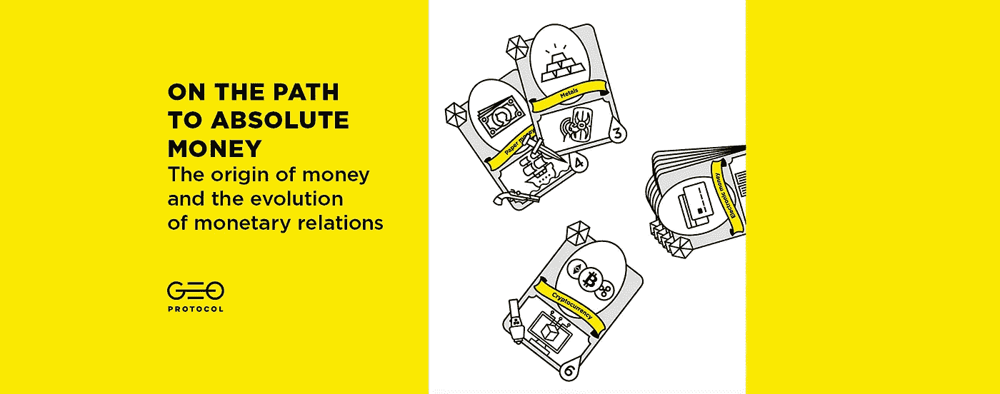
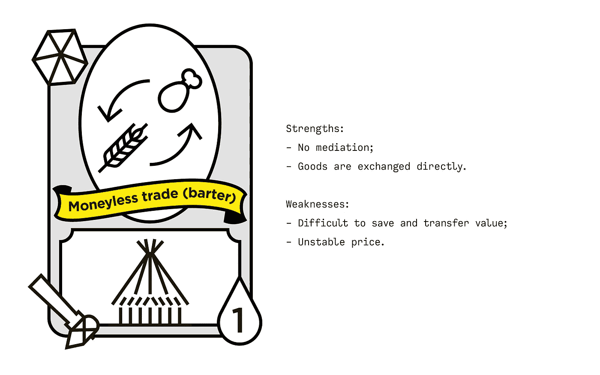
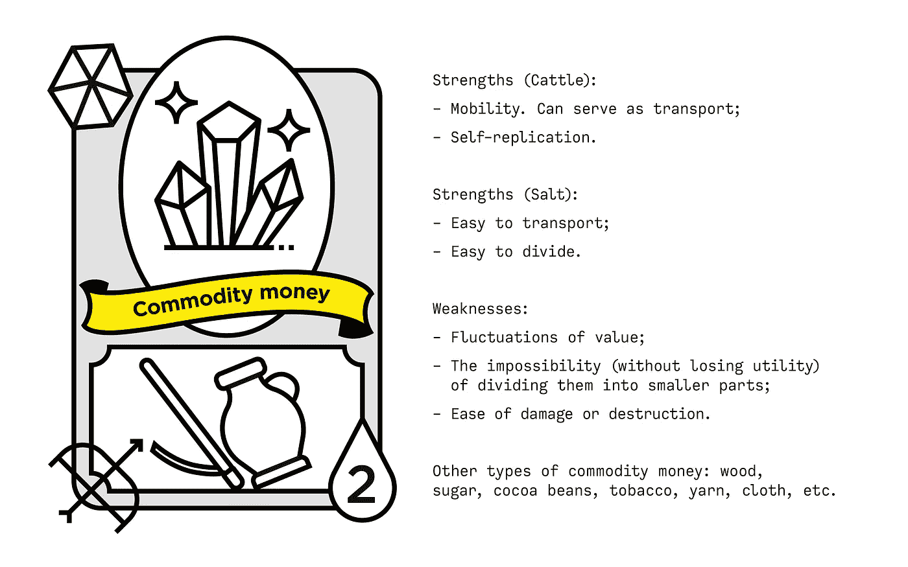
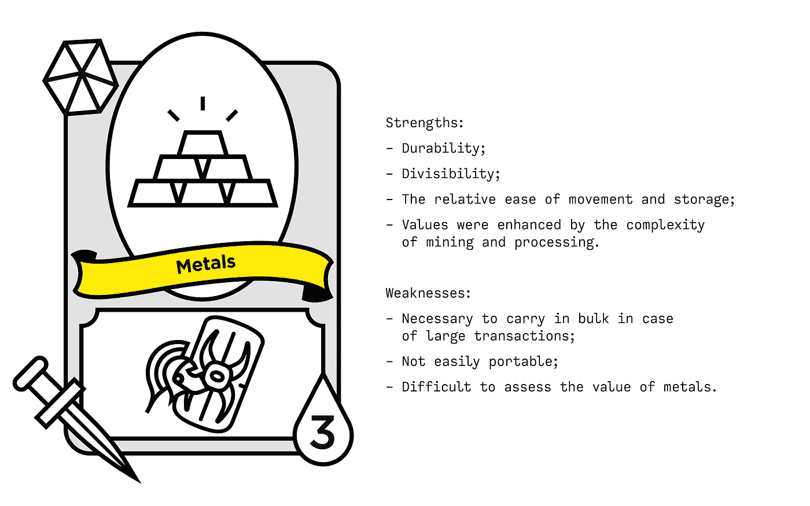
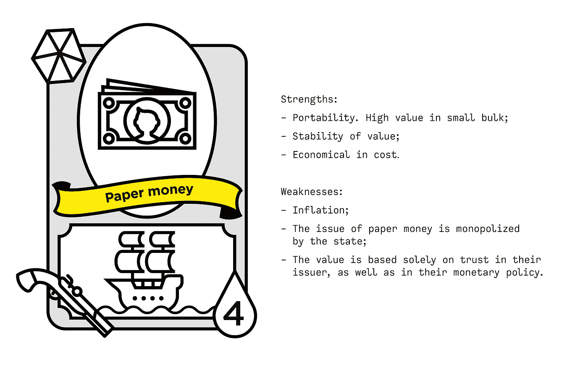
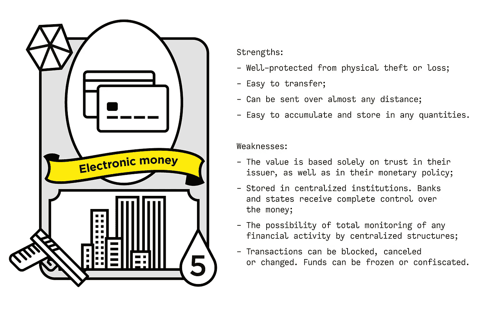
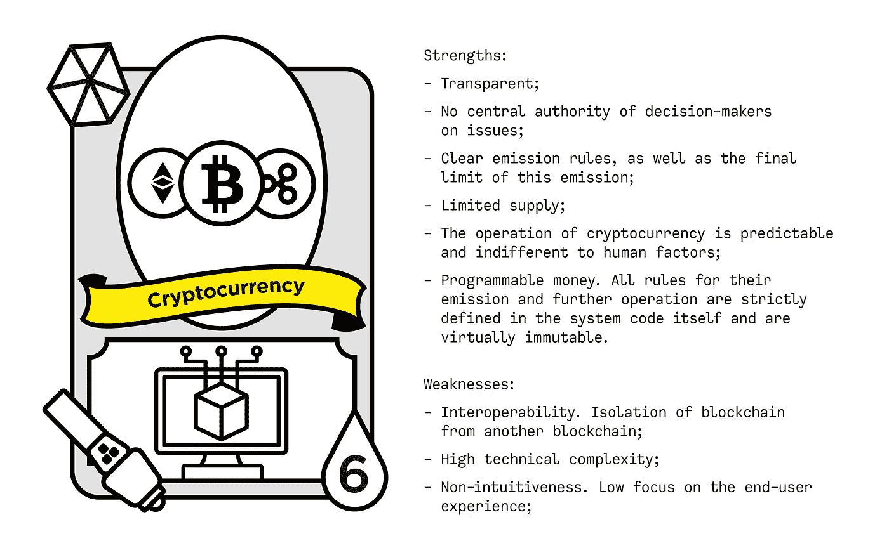

# 在通往绝对金钱的道路上

> 原文：<https://medium.com/hackernoon/on-the-path-to-absolute-money-4621cf024108>

## 货币的起源和货币关系的演变

从本质上讲，货币是社会契约的一种形式。它是用来衡量所有商品和服务价值的通用当量。从更广泛的意义上说，货币是表达、转移和积累价值的通用手段。

当我们考虑它的起源时，我们意识到尽管货币在其历史过程中呈现出各种各样的形式(甚至是物理形式)，但它实际上是一种抽象，只有在特定的历史时期和人类社会的框架内才有特定的意义和价值。但是价值的概念本身也是一种抽象；没有社会经济关系的背景是没有意义的。

这一思想值得更深刻的推敲，但首先，让我们简单地考虑一下货币的起源，以便更好地把握大局。在这个考虑过程中，我们还将把注意力集中在一般货币关系演变的重要方面。

# 易货贸易:无货币贸易

在社会发展的初始阶段，货币本身并不存在。社会主要从事自给农业，用自己的剩余商品交换其他人或团体所需的剩余商品是通过物物交换进行的。例如，如果一个社区捕获的鱼比它需要的多，它可以用多余的鱼交换另一个社区种植的谷物。我们的渔民通常是这种谷物的最终消费者；交换鱼的消费者是那些收获谷物的人。

换句话说，在文明之初，人们直接交换他们的商品，没有任何价值等价物的中介。

由于商品是在自然状态下交换的，物物交换给潜在的更活跃、更有成效的交换带来了一定的障碍。保存和转移价值也相当困难。因此，人类社会被迫寻求解决市场发展过程中出现的问题。

# 商品货币:作为价值尺度的功利物品

第一个也是最明显的解决方案之一是商品货币的出现。商品货币是某些类型的商品，由于其物理和消费特征，是一种更方便的交换手段，适合价值等价物的作用。

在许多情况下，这些货物是牛或盐。除了直接的商业价值之外，牛还具有流动性和自我复制的优势，并提供额外的服务(例如运输)。相反，牛也有天生的劣势:生病或死亡的可能性。盐被用作味道改良剂，以及食物防腐剂。它相对来说很难获得，并且局限于特定的地理范围(主要是在大陆的边缘或靠近咸水的海域)，这赋予了它额外的价值。储存、运输和积累也非常简单。

这两种商品货币对文明产生了重大影响，这反映在语言中。比如葡萄牙语单词 *pecunia* (金钱)来源于拉丁语单词 *pecus* (牛)；*大写*一词来源于拉丁语*capital*(头)。英语单词 *salary* 和西班牙语、葡萄牙语 *salário* (薪水)都来源于拉丁语 *sal* (盐)。

不同国家不同时期的其他商品货币包括木材、糖、可可豆、烟草、纱线、布料等。

商品货币的问题是其价值的波动，不可能(在不损失效用的情况下)将其分割成更小的部分，以及容易损坏或破坏。所有这些都阻碍了它们在更高级形式的商业贸易中的充分应用。

# 金属和价值衡量抽象的最初标志

金属及其加工技术的发现不仅导致了武器和工具生产的革命性变化，还导致了新的货币实物形式的出现。

除了直接的实用属性外，金属作为交换手段的优势还包括其耐用性、可分割性以及相对容易的移动和储存。此外，采矿和加工的复杂性以及相关领域的知识和技能增强了它们的价值，而这些知识和技能对大多数人来说是有限的或难以获得的。

最初，金属很可能以其自然形态进行交换，就像其他类型的商品货币一样(在这个阶段，它们是)。但后来它们被用于手工制作的形式(锭、珠宝等)。最初的硬币是作为实物商品的微型金属仿制品出现的，类似于早期的商品货币。因此，在中东，剑、刀或钥匙的微小复制品在流通；在希腊，小动物皮形式的铜和青铜硬币。

这是非常重要的一点，因为在这里我们已经可以看到抽象在衡量价值方面的最早表现:即赋予物体(仍然是物理的)一种价值，这种价值就其直接效用而言可能不是固有的。因此，货币开始获得真正等价的特征，而不仅仅是容易交易的物品(商品货币)。

随着硬币随着其社会的发展而演变，这些特征变得更加强烈，变成了或多或少标准化的形状、大小和重量的小金属片，发行者的印章保证了它们的(表面)价值。

## 金银:稀缺与文化因素

很明显，硬币的价值已经是一个抽象概念，因为当时最珍贵的金属(金和银)的实用价值最低。它们不太适合生产比珠宝更实用的东西，但比更便宜的铁或铜更稀有。

事实上，在这里，普遍价值等价的一个最重要的特征——稀缺性——被非常清楚地证明了。为什么我们认为这个特征是最重要的？我们稍后将回到这个问题。

除了稀有性和抗腐蚀性等客观特征，纯粹的主观因素也将黄金和白银推上了货币奥林巴斯的顶峰。

首先是这些金属的美学之美，这既不是真正自然的也不是客观的，因为美(众所周知)在旁观者的眼中。其次，宗教传统和习惯可能在这里发挥了作用。在原始文明(尤其是巴比伦)中，精通天文学的祭司教导黄金和太阳、白银和月亮之间的密切神秘和神圣的关系。这激发了人们对这些金属以及由它们制成的物品的神奇特性的信念。最终控制了贵金属开采和铸造的古代统治者利用这些信仰来神圣化他们自己的权力。马其顿的亚历山大大帝是最早将自己的头像印在硬币上的历史人物之一，他也因宣称自己是各种神的后裔，甚至自己是神而闻名。

黄金白银盛行的另一个可能原因是格雷欣法则的结果——*“劣币驱逐良币”*。如果流通中有两种形式的商品货币具有相似的面值，更有实际价值的商品将逐渐从流通中消失。

这些和类似的因素只是加强了贵金属和由其制成的硬币的抽象本质和价值制约性，与更古老的衡量、交换和积累手段相比，这使它们更接近于抽象价值概念的真正等价物。

# 纸币:前数字时代价值抽象的巅峰

事实证明，由贵金属制成的货币是一项如此成功的发明，至少在相当长的一段时间里伴随着西方文明:事实上，一直到上个世纪。但是最后，下一个提取货币的阶段到了。于是纸币开始发挥作用。

第一张纸币出现在中国古代(公元 9 世纪)。在欧洲，它的前身在中世纪开始出现。尽管储存和移动金属货币相对方便，但用它来结算仍然相当困难(尤其是当我们谈论运送大笔金额时)。此外，我们现在所称的国际贸易的扩展需要一种更方便的支付方式。

大量资金的运输，即使是或多或少无关紧要的距离，也充满了许多风险:从微不足道的抢劫到损失，例如，在海上发生海难。因此，越来越普遍的做法是把钱和贵重金属制成的物品存放在相对安全的珠宝商那里，作为交换，珠宝商会出具一张特别收据，说明他从某某人(或公司)那里取走了某某数额的钱用于存放。这些文件不仅可以方便地存储和运输，而且还可以很容易地转让给他人，(从而转移了存放在安全地方的贵重物品的所有权)。

正是这些做法后来不仅成为了银行系统的原型，也成为了纸币的原型。在那一刻，抽象的价值不再用实物的效用来表达。它只通过写在纸上的面值来表达；也就是说，在物理介质上，它本身甚至没有它所代表的价值的一部分。

因此，纸币可以被认为是前数字时代所有价值衡量迭代中抽象的顶峰。

不出所料，很多人最初对纸币持不信任态度。从贵金属硬币到纸币的转变，对于更广泛的大众来说，是一种过于抽象的程度。然而，自从货币出现以来，价值计量逐渐抽象化的过程实际上并没有中断过；相反，它不断获得动力。

但纸币本身也经历了自身的内部演变，这是由信用关系的发展以及增加货币供应以满足国家和世界经济需求的需要所驱动的(事实上，这是纸币开始取代金属硬币的主要原因之一)。因此，国家货币经历了进一步的价值提取过程，并最终脱离了所谓的金本位制(当纸币由发行者的实际贵金属库存支持时，这些货币可以——至少在理论上——以一定的汇率进行兑换)。最后，它导致了大多数国家的国家货币完全转换成法定货币(来自拉丁语 *fiat* —法令、命令)或信托货币(来自拉丁语 *fiducia* —信托):即信用和无担保纸币，其价值完全基于对发行者及其货币政策的信任。

值得一提的是，正如早期铸造贵金属硬币的情况一样，纸币的发行最终也由国家以中央银行的形式垄断。因此，对法定货币的信任实质上是对发行法定货币的政府、对其货币政策的信任，更广义地说，是对这些国家经济的信任。

实践表明，这种基础并不十分可靠，原因有很多——主要是由于直接影响特定法定货币的当前和未来价值的人为因素，(或者更确切地说，是由于需要对其无条件的信任)。

正如我们所见，就价值抽象过程而言，纸币成为了货币进化的顶峰。但与此同时，它加剧了基于法定货币的货币体系的总体稳定性和可预测性问题，以及对发行者信任的需要。

我们已经看到，有意识和无意识地滥用这种信任已经在整个国家的经济中反复导致灾难性的结果，特别是导致人们的储蓄在法定货币中大规模损失。

然而，在我们试图找到这样一个挑战的答案之前，我们将继续考虑货币发展的进化阶段。

# 电子货币:绝对的抽象概念

这条道路上的下一个重要里程碑是信用卡，以及更广泛意义上的电子货币。

正如对金属(“真实”)货币向纸币过渡的不信任一样，一些人最初对信用卡和电子货币持谨慎态度。在他们眼里，“真正的”钱是他们可以拿在手里的东西(也就是纸)。

但事实上，电子货币只是我们已经熟悉的抽象过程的另一个阶段。这一次，电子和通讯领域的技术进步使之成为可能。

在这一阶段，以前以实物转让的信用票据形式存在的货币转变为账户和交易的电子记录，存储在中央机构(中央银行和商业银行)或其他类型电子货币提供商(在非国家货币的情况下)服务器上的特殊电子会计表(分类账)中。

从经济学的角度来看，我们仍然在处理法定货币，其价值是基于对其发行者和货币政策的信任。

但从形式上看，这种货币几乎已经是一种理想的抽象概念，因为它甚至不再存在于物理介质中，而是作为纯粹的信息存在。一方面，这种类型的钱给我们提供了前所未有的便利和机会。电子货币受到很好的保护，不存在物理盗窃或丢失的可能性，比以往任何时候都更容易转移，可以简单快速地发送到几乎任何距离，更容易积累和存储几乎无限的数量，等等。

但与此同时，传统电子货币的集中形式有许多新的缺陷和非常严重的威胁。

首先，它代表着将个人和组织对资金的几乎完全控制权交给其他人(银行、国家、金融服务提供商等)。).还有一种可能性是，银行和国家以及其他中央集权机构对任何商业和私人金融活动进行全面监控，这些机构的意图可能并不总是好的(尤其是在极权国家)。中央系统中的交易可能被阻止、取消或更改，资金可能被冻结或没收，等等。

此外，潜在的攻击者不仅限于控制中央系统的人。第三方恶意行为者通过黑客攻击或其他恶意行为获得非法访问，只会增加潜在威胁的数量。

简而言之，集中的电子货币带来的新挑战和老问题的解决方案一样多。但最重要的是，它没有解决任何法定货币的根本问题——对发行者及其货币政策的信心需求问题，以及这种政策的可预测性和合理性问题。

因此，尽管事实上普通电子货币是一种价值尺度的绝对抽象，使其成为“绝对货币”称号的有争议的要求者。

幸运的是，进化并没有就此结束。

# 加密货币:绝对货币？

仅仅十年前，在 2000 年代末的全球金融危机期间，化名为中本聪的一名不知名的程序员(或一群程序员)创造了比特币，这是世界上第一种基于受密码保护的分布式账本的数字货币:一种叫做区块链的新技术。

与传统的数字货币不同，加密货币有许多优势；传统数字货币和一般法定货币问题的答案。

主要优势在于加密货币本质上是可编程的货币，这意味着其发行和进一步操作的所有规则都在系统代码本身中严格定义，并且实际上是不可改变的。一旦系统启动，即使是创造者也不能干预代码，只有在整个社区一致支持特定加密货币的情况下，任何改变都是可能的。此外，这些规则对所有参与者都是透明的。加密货币的操作因此尽可能可预测(因为每个人都提前知道所有规则)，并且几乎不考虑人为因素。在加密货币及其货币政策等问题上，决策者没有中央权威——这与法定货币或任何其他类型的货币不同。

如前所述，除了透明的操作规则，加密货币还有另一个重要特征:即明确的发射规则，以及这种发射的最终限制。这一特性将加密货币与所有其他类型的货币明显区分开来，没有人(甚至发行者也不知道)确切知道在任何特定时刻有多少货币在流通，也不知道未来会有多少。就加密货币而言，我们总是确切地知道现在有多少在流通，未来会有多少，以及何时会有。这使得对通货膨胀的控制及其可预测性达到了前所未有的水平。此外，加密货币允许任何可编程的操作模式，包括通货紧缩模式(其中货币数量不会随着时间的推移而增加，而是可预测地减少)。

但不管是哪种模式，几乎所有加密货币(除了极少数例外)都有一个最大供应量的终极指标。这意味着将被发行的硬币的最大数量是确定的，并且在特定的加密货币中不可能发行超过指定数量的硬币。例如，比特币的最大供应量只有 2100 万枚。

于是，人类历史上第一次产生了真正的分布式数字稀缺。

上面我们谈到了稀缺性，这是货币的重要特征之一。黄金、贵金属和其他稀有材料是天然存在和自然稀缺的，理论上可以在各种情况下失去稀缺性。例如，一个以前未知的矿床可能被发现，或者获得资源的另一个来源可能出现；或者，科学家可以学习如何以相对较低的成本人工合成或生产一种资源(就像钻石、铝和其他资源一样)。如果资源是功利的，那么当找到更便宜的替代品时，它的价值可能会下降，或者使用它的产品变得过时。简而言之，人类无法完全控制任何物质或自然资源的稀缺性，因此其未来价值无法得到保证。

同时，数字稀缺性的限制程度可以清楚地陈述和编程。这创造了前所未有的确定性和可预测性。

但加密货币真的是绝对的货币吗？不太可能，如果我们谈论的是纯加密货币的话。毕竟它们也有缺点。

各种区块链解决方案之间不可能直接集成——每种加密货币或生态系统都与其他类似的解决方案以及传统金融世界隔离开来。此外，传统加密货币的高度技术复杂性极大地限制了大多数人对其功能原理的理解。非直观性，以及通常对最终用户体验的低关注，导致了当前现有解决方案的可扩展性问题以及其他技术和意识形态限制。

所有这些都继续阻碍市场和用户采用加密货币(在某种程度上，这可能是该技术应得的)。虽然单个加密货币可能不是绝对的货币，但作为最新的货币和经济现象，加密货币总体上预示着货币和货币关系概念的演变。

# 对货币和货币关系的新看法

加密货币的出现不仅为许多看似永恒的货币问题提供了解决方案，还可以作为改变货币本质的催化剂。现代社会习惯于将货币视为“官方的”、“全球性的”和“严肃的”，由其发行者(主要是国家)的权威支持。

然而，货币首先是一种抽象的价值尺度。价值可以是非常多样的，比一种国家法定货币所能解决的更具体。价值可以采取多种不同的形式:关注(内容浏览量)、认可(社交网络上的赞)、支持(众筹、慈善)、委托(选举)等等。

以前，所有这些都可以用一种单一的货币形式来概括(世界货币，或者至少是某个国家或地区的主要货币)。现在，创建加密货币和代币的便利性使几乎每个人都可以为自己独特的目的创建一种具有可编程特征的货币。甚至可能存在用于单一目的、或用于某类活动、或用于不同金融用途(国际支付、小额支付、结算、贷款、储蓄)等的单独货币。并且它们中的每一个都可以针对其特定任务被设计和优化到极致。

此外，新货币可以选择根本不宣称自己是“通用的”，也不努力争取被广泛接受(任何货币都将为此而奋斗)。任何至少由两个人组成的共享某种价值的群体都可以创造一种货币来进行转移、储存和交换，而这种货币只需要被这个群体所接受。

我们甚至很难想象所有的可能性，更不用说这种“货币自由化”的社会和经济影响了。

但是想象这样一个未来所面临的挑战要容易得多。其中一个更明显的问题是所有现有和潜在的加密货币的有效交互。如何将所有这些多样性联系到一个单一的全球金融和经济体系中，对最终用户来说简单而直观——大多数最终用户并不总是愿意和能够掌握一个系统或技术的所有技术和经济微妙之处。

# 那么下一步是什么？

研究货币的历史和货币关系的演变，以及受到区块链技术出现的机遇和前景的启发，我们得出结论，有必要创建一个开放的分布式系统，不仅要克服现有加密货币解决方案的局限性，还要将数字资产世界与现实世界的资产和价值联系起来。

换句话说，最终目标是将各种现有的和未来的经济、货币以及更广泛意义上的价值生态系统整合成一个单一的宇宙生态系统，在这个系统中，无信任系统可以与基于信任的系统有效共存。

因此，创建地理协议的想法诞生了。

## 遵循 GEO 协议:

[ [媒体](https://medium.com/geoprotocol/) | [推特](https://twitter.com/geo_protocol)|[GitHub](https://github.com/geo-protocol)|[Gitter](https://gitter.im/GEO_Protocol/)|[电报](https://t.me/geoprotocol)|[LinkedIn](https://www.linkedin.com/company/geoprotocol/)|[YouTube](https://www.youtube.com/channel/UC3jEvQvZAmCUXa7dCoX9_Lg/)]