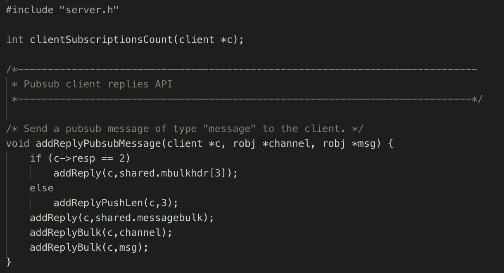

# 成为优秀软件工程师的一个秘诀是:阅读代码

> 原文：<https://medium.com/hackernoon/one-secret-to-becoming-a-great-software-engineer-read-code-467e31f243b0>

## 通过建立阅读代码的常规和习惯，成为一名更好的程序员

*这是我偶尔系列的一个帖子，* [*给一个年轻软件工程师的笔记*](https://www.nemil.com/on-software-engineering/index.html) *。报名* [*这里*](http://eepurl.com/cxs5Zr) *。*

A code snippet from [Redis](https://github.com/antirez/redis)

如果有一天你醒来，决心成为一名伟大的作家，你会听到两条简单的反馈:多写，多读。

在软件领域，很多人写代码，但是很少有人花时间去阅读——尤其是日常工作之外的代码。这是一个错误。在你职业生涯的早期，表现得像一个有抱负的作家，并乐于阅读不同的代码。

广泛阅读，经常阅读。这可能是成为一名优秀的软件工程师和一名伟大的软件工程师之间的区别。

## 我为什么要读代码？

伟大的作家是他们读过的作家的函数。想想琼·狄迪恩，她 16 岁就能打出海明威的句子，这样她就能了解句子是如何运作的。或者想想亚伯拉罕·林肯，他后来的抒情诗出自他心爱的詹姆斯国王圣经。

类似地，当需要编写自己的代码时，看到不同的编码实践可以让您扩展自己的调色板。阅读他人的代码会让你接触到新的语言功能和不同的编码风格。

阅读你的依赖关系会让你成为一个更有生产力的程序员。您将了解依赖项提供的全部功能。你将确切地知道它们是如何工作的，以及它们在做什么样的权衡。当出现问题时，您将知道在哪里调试。

舒适地阅读代码也减少了你过分偏爱你的代码的可能性。你读得越多，你就越容易扩充别人的代码，而不是构建自己的代码。这一改变将降低你被“不是这里发明的”综合症所困扰的可能性。

无论你是 web 开发人员、数据工程师还是密码学家，培养定期阅读会教会你不同于日常工作的工具和产品。

作为一名 web 前端工程师，阅读一小部分[光线跟踪器的代码库](https://news.ycombinator.com/item?id=13563577)会让你受到完全不同的约束。作为一名数据库工程师，阅读高度抽象的 web 代码可以向您展示您的用户是如何思考的。对于所有工程师来说，你会发现定期阅读你每天工作语言之外的语言的价值。

正如唐纳德·克努特[所说](http://www.gigamonkeys.com/code-reading/),【阅读代码】对你的大脑有益，真的值得。你越是学会阅读别人的东西，你将来就越有能力发明自己的东西……”

以下是如何让你的代码阅读尽可能的轻松和高效。

## 我应该如何“阅读”代码？

像对待一本典型的书一样对待代码库——从头到尾阅读——是失败的[秘诀](http://www.gigamonkeys.com/code-reading/)(尽管具有讽刺意味的是，这就是计算机自己阅读代码的方式)。

从头开始阅读意味着忽略重要的上下文，对将要出现的结构毫无概念。被动阅读——你不写测试或修复错误——会阻止你真正理解代码。

不像一本书，几乎我所有的朋友都在没有特定目标的情况下努力阅读代码。在阅读新的代码库之前，确保你有一个想要实现的目标。这将使代码库看起来更易于管理，并在旅程不可避免地变得艰难时提供动力。

对于任何复杂的代码库(简称 RSDW)，我都采用四步策略:

*   **(R)un** :编译、运行并理解代码应该做什么。
*   **检查(S)结构**:学习高级结构并复习关键的集成测试。
*   **(D)ive in** :跟随关键流程，读取重要数据结构。
*   **(W)rite tests** :编写测试并对简单的特性和错误修复进行优先级排序。

RSDW 方法是一个起点，但随着时间的推移，你应该定制适合你的方法。一些人发誓要编写测试和修复 bug，而另一些人总是喜欢从审查集成测试开始。

首先，从 RSDW 方法开始。

## 1.奔跑

阅读代码的第一步并不是真的阅读代码。就是用软件。

只有当你理解了软件所提供的功能后，才阅读代码。在此阶段，您应该能够对代码进行总结，并了解输入和输出是什么。

使用软件迫使你让它运行。这意味着追踪依赖关系，在某些语言中，还要编译代码。对于库来说，这意味着调用一些流行的函数。这是运行测试和检查输出消息的时候了。

如果您在第一次运行系统时遇到困难，那么这是为其他人记录运行软件实际需要做什么的最佳时机。

## 2.结构

接下来，确定代码中最关键的部分。这个过程是和看书最不一样的部分。你不必从头开始，而是必须跳来跳去找出代码中的关键点。

从理解代码的结构开始。至少，运行一些自动化工具(比如`tree`和`cloc`)来找出代码库的语言和文件。

要识别关键文件，查看修改最多的文件，并使用[或任何其他高级工具](https://github.com/gilesbowkett/rewind)。回顾最重要的集成测试，列出被调用的函数。标记这些测试以备后用。

有一个简单的方法可以简化这个过程:找一个以前做过代码的人。理解结构是白板会议的首要任务。

## 3.深潜

一旦你有了地形，就开始挖掘。

阅读代码时，您应该查看代码流(查看正在创建的操作)和数据结构/对象(存储操作结果的地方)。

从关键的集成测试、重要的 PRs 或您对源文件的审查中挑选三到五个您已经发现的关键流程。然后潜得更深。从特定操作的顶部开始，跟踪代码。一些开发人员相信调试器能让你通过。其他人更喜欢构建[统一建模语言](https://en.wikipedia.org/wiki/Unified_Modeling_Language) (UML)图或者[火焰图](http://www.brendangregg.com/flamegraphs.html)。

FlameGraph

*来源:* [*火焰图库*](https://github.com/brendangregg/FlameGraph)

**UML Diagram of Process Flow**

*来源:维基媒体*

**UML Data Structure**

其他时候，我会在一个重要函数中间的断点处停下来，然后遍历堆栈，了解我是如何到达那里的。如果您决定手动遵循代码，请确保您的编辑器设置为允许您使用“转到定义”和“查找所有引用”进行快速导航。

对于数据结构，检查数据类型以及何时设置关键变量。使用调试器在关键时刻询问这些数据结构。

除了集成测试之外，[评审重要的拉请求](https://twitter.com/marccataford/status/1108059456603066368)是接近新代码库的一个强有力的方法。PRs 通常更容易理解，因为它们封装了一个孤立的特征。除了增加代码的原因和方式之外，PRs 还提供叙述性背景。

在这些深度潜水中，我打开了两个 markdown 文档。第一个是“提高我的编码水平”文档，在这里我列出了我看到的新语法和我觉得对自己的学习有兴趣的代码模式(其他人称之为[词汇表](https://news.ycombinator.com/item?id=9786011))。第二份文档列出了我对代码库开发人员的关键问题。在这个阶段，当我注意到差距时，我也会添加到文档中。

与知道密码的人搭档时，深潜尤其有效。如果我和开发人员在项目上的时间有限，我总是让他们通过几个关键流程跟踪我。一旦我对一些关键流程有了基本的了解，我自己钻研起来就容易多了。

## 4.写代码

与文学不同，在文学中，阅读和编写是分开的，而“阅读”代码的关键部分实际上是编写代码。不写代码，几乎不可能将代码库内在化。开始的两个简单方法是编写测试和解决简单的特性/错误。

写测试是阅读的一种主动形式，迫使你去关注特定交互的实际输入和输出。编写测试会把代码印在你的记忆中，这是阅读所不能做到的。

对我来说，单元测试是一种简单的开始方式。一旦我掌握了一些基础知识，我就会转向集成测试，这迫使我理解代码库中越来越大的部分。有时我甚至会重写现有的集成测试，以测试我对关键调用如何工作的理解。

另一个简单的方法是编写简单的特性或解决容易出现的错误。这两项任务都不需要完全了解代码库，但仍然迫使您面对代码。贡献 bug 修复和文档也是一种回馈依赖的简单方式。

这些方法在你最需要的时候提供了立竿见影的效果。通过给 RSDW 增加一些更广泛的课程，阅读代码将变得不那么令人畏惧。

## 阅读的一些技巧

RSDW 进程不是教条式的。不可避免地，工程师们会找出他们喜欢的挖掘新代码库的个人方式(这个过程也会根据语言、可用的工具和您面前的代码库的类型而有很大的不同)。

尽管如此，当你看到新代码时，RSDW 过程确实主张系统化的方法。它还鼓励对代码进行主动自省，无论是编写测试还是主动使用调试器来询问数据结构。阅读代码的过程和更被动的阅读书籍的过程有很大的不同。

你也会发现阅读新代码是令人疲惫的。您正在错综复杂地追溯代码流，并试图在头脑中同时容纳数十种新的数据结构和函数。当你接近一个新的代码库时，积极地休息一下。当我开始一个新的代码库时，每天阅读几个小时是我感到高效的全部需要。

虽然培养良好的阅读技能至关重要，但对你所读的内容深思熟虑也同样重要。

## 你应该读什么代码？

在你职业生涯的早期，我认为你 60%的时间应该花在阅读代码上。也许其中的三分之一应该是你实际构建的直接代码库之外的代码。时间太长了，你应该读些什么呢？

开始阅读最简单的方法，也是投资回报率最高的方法，就是了解你的依赖。内化依赖项的工作方式可以让您更容易地调试和推理整个系统。

另一个高投资回报率的途径是在你的公司里挑选一个重要的系统，并通读它。这不仅对你的工作有价值，而且专业代码库不同于开源代码库。

除了与你互动的直接系统之外，培养一种广泛阅读的开放性。在我职业生涯的早期，我建议在每天的工作之外，在早上或晚上留出一个小时来通读代码。辛苦工作一天后，这听起来很痛苦，但是选择一个让你兴奋的代码库，尝试一周。

例如， [Redis](https://github.com/antirez/redis) 被认为是 c 语言中一个流行的起点，对于可读性较差、更复杂的代码库，一个简单的起点是读取一个特定的子系统。

课外项目是一种强有力的阅读方式，因为它们迫使你去了解一个不同的世界。您将需要阅读新的依赖项，并为您正在构建的内容探索不同的代码库。虽然这看起来不像阅读，但这是一个迫使你主动阅读你将要使用的东西的项目。

工作之外，你应该阅读与你日常工作大不相同的工具。如果你习惯于高层次的抽象，那就向下学习一个(或三个)抽象层次。如果你用一种语言工作，选择另一种语言在你的空闲时间阅读。如果您必须始终考虑一个约束(例如，图形编程中的下一次屏幕刷新时间)，请找到另一个约束(例如，在移动编程中节省电池寿命)。

阅读代码的另一个好方法是阅读和重写你尊敬的代码。年轻的 Didion 写海明威或亨特汤普森[打出了不起的盖茨比](http://www.openculture.com/2017/06/hunter-s-thompson-typed-out-the-great-gatsby-farewell-to-arms.html)，写出 antirez 的或 gaearon 的或 mrdoob 的代码从一个简单的库开始。阅读他们的其他代码库。了解他们最新的作品。

斯蒂芬·金告诫作家们，“如果你没有时间阅读，你就没有时间(或工具)写作。就这么简单。”同样，对于软件工程师来说，编写新代码可能是最有趣的，但是(积极地)阅读代码将使你与众不同。

*这是我偶尔系列的一个帖子，* [*给年轻软件工程师*](https://www.nemil.com/on-software-engineering/index.html) *的笔记。报名* [*此处*](http://eepurl.com/cxs5Zr) *或* [*关注 RSS feed*](https://www.nemil.com/feed.xml) *。本系列的所有文章都以草稿形式发布，并纳入了相关的社区反馈。感谢* [*布兰德·利奇*](https://brandur.org)*[*杰克·克雷吉*](https://twitter.com/jakecraige?lang=en)*[*布雷克·斯多吉*](https://twitter.com/bstodghill2?lang=en) *的反思和反馈。***

## **链接**

## **关于阅读代码的文章**

*   **[问黑客新闻:你如何熟悉一个新的代码库](https://news.ycombinator.com/item?id=9784008)**
*   **[问黑客新闻:如何理解一个开源项目的庞大代码库？](https://news.ycombinator.com/item?id=16299125)**
*   **[在不熟悉的代码库中快速变得高效的策略](https://news.ycombinator.com/item?id=8263402)**
*   **熟悉大型代码库的最好方法是什么？**
*   **[阅读代码的技巧](http://wiki.c2.com/?TipsForReadingCode)**
*   **[软件工程广播:迪夫·托马斯的软件考古](http://www.se-radio.net/2009/11/episode-148-software-archaeology-with-dave-thomas/)(播客)**

## **书**

*   **[代码阅读:开源视角](https://en.m.wikipedia.org/wiki/Code_Reading)(本书)**
*   **[有效地使用遗留代码](https://www.amazon.com/Working-Effectively-Legacy-Michael-Feathers/dp/0131177052)(图书)**

## **要阅读的基本代码**

*   **[好的 Python 代码库阅读](https://news.ycombinator.com/item?id=9896369)**
*   **[好围棋代码库阅读](https://news.ycombinator.com/item?id=14462125)**