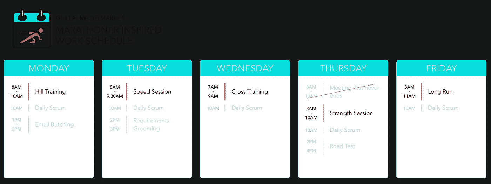
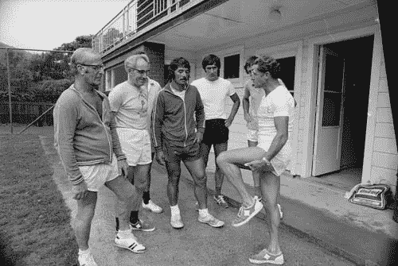

# 通过这 4 次工作会议来组织你的马拉松周

> 原文：<https://medium.com/hackernoon/organize-your-weeks-as-a-marathoner-with-these-4-work-sessions-2a473aba9da9>

## 从马拉松训练中获得灵感将会——真的——让你更有效率。

作为一名产品经理，我的几周充满了许多不同的目标、截止日期和救火工作。在这些噪音中，我发现了一个不断提高效率的习惯，那就是在我的日历中划出几个小时，专门用于以下四个阶段:长跑、速度训练、交叉训练和山峰训练。

不管你是想每个月在工作中完成更多，还是想在个人层面上取得更多，这应该适合许多不同的目的。当你阅读不同的课程时，试着想想如何根据你自己独特的情况和目标来调整它们。

但是在你开始阅读之前，关键的一点是:如果你正在寻找一种快速的胜利，一种可以在眨眼之间摆脱工作中的所有救火工作或其他紧急情况的东西，你现在应该停止阅读它。就像跑步者为了马拉松而训练一样，在坚持几周之前，益处是看不到的。但是神圣的 moly，当你开始撕毁的好处！你再也不会回来了。

我真正喜欢今天这个时间表的是，与许多自助建议相反，这是我能够在我的生活中现实地实施的事情，而不用动天动地。时间限制不是太严格，我可以试验不同的方法，迭代它们，并找出对某些特定结果来说什么是最好的结果，或者我应该放弃什么。明天我可能会超越这个工作流程，但只要它能显示结果或者我找到更好的东西，我就不会。

# 1.长距离跑

大多数跑步者都熟悉长距离、稳定的跑步。这些跑步通常持续 2 小时，每周增加里程，最终平均每次跑步 15 到 20 英里。

这里有三个目标:

*   教导身体处理降低的血糖水平，以及优化身体使其更经济，
*   挑战身体和精神的极限，坚持跑步，
*   同时测试自己的跑步装备和营养计划(赛前、赛中、赛后)。

在这些长跑中，跑步者特别注意倾听自己的身体，找到舒适的配速，并专注于表现出最佳状态:头部倾斜、肩膀、手臂、躯干、臀部、步幅、脚踝和脚都在完美的跑步状态中发挥着重要作用。

## 上班怎么做长跑？

我真的很喜欢长跑，因为它有很多好处，我想出了一个办法，在我的每周工作计划中安排一次类似的训练。这很简单，是常识，但是在每个工作日的比赛中，大多数人都没有给它足够的时间和注意力。不知何故，这种方法类似于 Cal Newport 的深度工作(以一种更温和、更容易实现的方式)。

要点如下:

1.  远离社交媒体、Slack、微信，退出你的电子邮件应用，把你的手机调成飞行模式。给自己准备一份健康的零食和一些水，这样你就可以一路上补充能量，没有借口离开办公桌。你可以开始播放列表(但不要开始跳过歌曲或选择特定的轨道！听一些有助于你集中注意力的东西，最好没有歌词)。专注于你想要达到的目标。
2.  安排严格的时间来集中注意力。假设 2 小时。给自己一个目标。
3.  目标应该集中在深层次的工作，而不是浅层次的工作。来自纽波特的识别肤浅工作的经验法则是问你自己这样一个问题:“训练一个在我的领域没有经验的聪明的研究生做这项任务需要几个月？”如果答案仅仅是几天或几周，即使任务很重要，也不被认为是深度工作。

长跑迫使你长时间集中注意力。它应该发展你的核心能力，帮助你关注细节和实质。我们的目标不是完成你的遗愿清单上的所有项目，而是继续最重要的一项。

我喜欢用长时间运行来真正提升我正在开发的最重要功能的产品需求，这些功能通常伴随着大量的细节需要考虑。一个会话通常看起来像:

*   试着用几分钟时间回忆我需要做的事情的状态来热身，然后通过看我的笔记、开放式问题和行动项目来继续热身
*   然后，开始工作，不要强迫自己做太多事情，而是把事情做好。
*   在会议结束之前，确保我记录了会议期间出现的问题以及我的当前状态。

有些问题会在当天晚些时候得到答案，在回家的路上，在淋浴的时候…这个会议实际上是关于稳步改善我正在做的事情，并清楚地确定以后需要解决或改进的事情。

# 2.速度会话

速度训练帮助跑步者逐渐提高长距离跑的速度，并更有效地利用他们的能量。跑步者可以在更长的时间内保持更重要的努力。但这背后的逻辑是什么？

*   跑得快会让你呼吸困难，长跑也是如此。
*   最大摄氧量是你在一分钟内可以消耗和使用的氧气量的峰值。虽然以最大摄氧量跑步(尽可能用力呼吸)相当痛苦，但这也非常有益，因为高摄氧量与长跑成绩密切相关。
*   达到最大摄氧量的最快方法是以最快的速度持续努力 6 分钟。这不是最明智的做法，因为你最终很可能会筋疲力尽。跑步者应该将训练分成几次较短的努力，强度稍高，中间休息一下。

## Pomodoro 作为一个速度会议

工作中的快速训练可以帮助你:1。培养快速思维，2。每分钟交付尽可能多的东西(如果你愿意，你可以称之为“Productivitymax”)。

在我尝试过的不同生产方法中，有一种是番茄工作法。即使它带来了很多结果，我也不能每天都这样做。

最初的番茄工作法步骤非常简单:

1.  决定一项任务
2.  设置一个计时器(通常是 25 分钟)
3.  从事这项工作
4.  时间到了之后，休息一会儿(5 分钟)
5.  重复四次

番茄工作法本身并不关注执行的速度或质量，它主要是让你在一段时间内专注于某件事情，以优化注意力。

我对番茄的看法是，与长跑相反，我喜欢快速做事，而不是太关注所有的细节。当我需要为新功能奠定基础或为客户做一些产品演示时，我经常使用它。

这是基于一个单一的法律:

*   帕金森定律:“工作扩大以填满完成工作的时间”。或者，正如艾萨克·阿西莫夫所说:

> “每天 10 个小时中，你有时间比每天 5 个小时中落后两倍。”

(所以，赶紧搞定，要快。)

目标是在不花费太多时间的情况下完成初稿。这将有助于看到你正在做的事情的结构。我在这里写了更多关于[结构的重要性](/pminsider/3-lessons-from-an-amateur-sculptor-turned-product-manager-701d95386ebd)。

# 3.交叉训练和常规力量训练

交叉训练(如游泳、骑自行车、划船、拳击……)和一般力量训练旨在发展不特定于跑步运动的能力，或不直接有助于跑步的能力(又名:让你前进)。这些训练有助于你成为一名更平衡、更强壮的运动员，最终让你能够应对更大的工作量。

跑步是一种真正的重复运动，就此而言，使用或不使用的肌肉总是相同的。因此，非跑步活动以及跑步相关伤害的风险增加。

有氧健身(通常称为“有氧运动”，即身体运输和利用氧气的能力)的发展速度将超过你的肌肉。因此，虽然跑步者可能感觉良好，并能够在 10 英里的跑步中保持对话(指的是人们应该以“对话的速度”跑步)，但一个常见的损伤是胫骨夹板。实际上，[根据丹麦的研究](https://journals.plos.org/plosone/article?id=10.1371/journal.pone.0099877)，这是新跑步者最常见的损伤，占跑步损伤的 15%。胫骨骨折可能会在接下来的几天里限制跑步者，因为他们需要休息来恢复。

在你的训练中包括一个一般性的力量训练，基本上是让你的肌肉系统跟上有氧健身的速度。

## 力量训练如何应用到工作中？

简单地说，没有任何其他学科的知识或缺乏实践将使你容易出现问题，或者它可能会限制你的职业发展。

我将这种交叉培训的理念应用到我的产品管理岗位上，专注于学习 UX 设计理论，并在 2018 年期间尽可能多地尝试实践。我很幸运能与一个非常有才华和开放的 UX 设计团队一起工作，这个团队就在离我办公室几英尺远的地方，这对我帮助很大:

*   为了理解他们为什么做他们正在做的事情，
*   他们是如何做到的，
*   以及如何增强跨团队的沟通与协作。

它还允许我产生更多“完整”的想法和需求，并能够提供粗略的原型来进行对话。虽然这已经是一个重要的好结果列表，但还有一个好处是，它可能阻止了许多问题的发生，这些问题可能是由于缺乏理解或缺乏提问造成的。

考虑到这一点，我计划在 2019 年更加专注于软件开发。不是为了成为开发者，远非如此。只是为了不断进步，避免误解，不断提高和我的开发者的沟通。

# 4.山地训练

Arthur Lydiard 是新西兰的一名优秀运动员教练，目标是登上奥运会领奖台，也是我们今天所知的慢跑之父。他将他的训练系统建立在获得强大耐力的基础上，每周跑 100 英里(160 公里)。

但是他的训练计划和遗产不仅仅包括长跑。正如在他的书《与莱迪亚一起跑步》中所解释的，他的秘诀之一就是进行山地训练。“跑上山迫使膝盖抬得更高，这对任何跑步者来说都是最理想的发展之一，因为这决定了步速和步幅。它还能发展肌肉纤维，增强力量。”

Arthur Lydiard giving advices to joggers in 1975.

接近一座山可能会令人害怕。相对于速度训练，我们知道过一会儿就会有一些，山地训练是一个持续的努力，休息仍然意味着慢跑。我对此没有太多要说的，除了事实上它可以在两个训练量相似的跑步者之间产生差异。

同样，我认为一些高难度的训练，比如山地训练，可以帮助你完成职业任务。这将帮助你处理更严重的问题，并建立弹性。

我试着确保我不会忘记每周做一些我不期待的事情，而不使用任何特定的形式。你可能正在想一些你现在并不期待的话题或任务。解决这些问题只会帮助你在你喜欢的事情上做得更好，获得内心的平静，并把你和那些只会做简单工作的同事区分开来。如果你最终做到了，很多人可能会心存感激。或者可能是你不太熟悉或者害怕做的事情，比如当你很害羞的时候和你的用户说话。

无论如何，试着在一天的早些时候或一周的早些时候做，就像他们说的，“早上先吃一只青蛙，然后…

我确信你会在至少一个这样的会议中找到自己的窍门，让它为你工作，我只希望你会应用它，坚持它，并从中获得更多的收获。

现在，是时候告诉我，你做成事情的秘密秘诀是什么了？