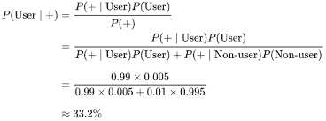
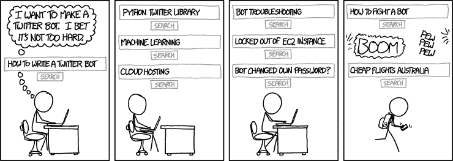
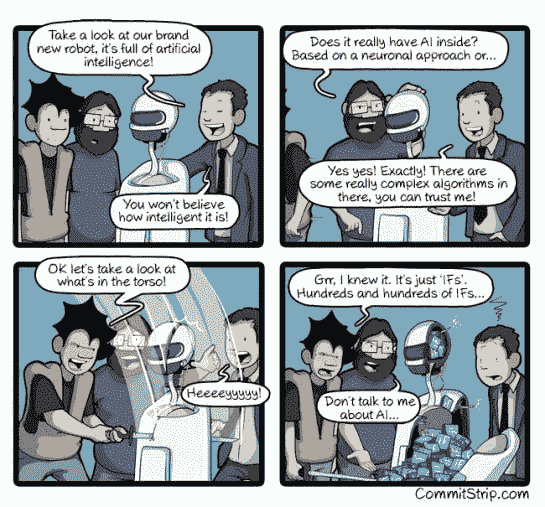
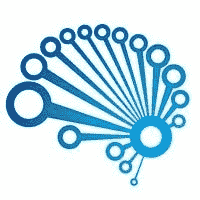
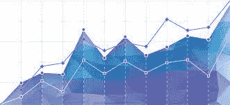

# 从哈佛到 Udemy，我们最喜欢的 25 门数据科学课程

> 原文：<https://medium.com/hackernoon/our-25-favorite-data-science-courses-from-harvard-to-udemy-9a89cac0358d>

> 原贴[此处](https://www.coriers.com/25-of-the-best-data-science-courses-online/)

学习数据科学的每个方面都需要时间。我们以前在不同的资源上写过文章。但我们真的想专注于课程，或者 youtube 上的视频课程。

有如此多的选择，能有一份值得选修的课程清单是很好的。

我们将从免费的数据科学选项开始，以便您可以决定是否要开始在课程上投入更多资金。

**提示:Coursera 可以让人们觉得唯一的选择是购买课程。但是他们确实在最下面有一个审计按钮。现在，如果你欣赏 Coursera，无论如何，你应该购买他们的专业化，我仍然不确定我对它的感觉。但是，我喜欢上 Coursera 的课程。**

选择“审计课程”选项，不支付课程费用

# 训练营和专业化

## 1.概率与数据导论

本课程向您介绍数据采样和探索，以及基本的概率论和贝叶斯法则。你将检视各种类型的取样方法，并讨论这些方法如何影响推论的范围。将涵盖各种探索性的数据分析技术，包括数字汇总统计和基本的数据可视化。您将被指导安装和使用 R 和 RStudio(免费统计软件)，并将使用该软件进行实验室练习和期末项目。本课程中的概念和技术将作为专业中推理和建模课程的基础。

[参加课程](https://www.coursera.org/learn/probability-intro?specialization=statistics)

## 2.完整的统计课程

在本专业中，您将学习分析和可视化 R 中的数据并创建可再现的数据分析报告，展示对统计推断统一性质的概念性理解，执行 frequentist 和 Bayesian 统计推断和建模以理解自然现象并做出基于数据的决策，正确、有效地在不依赖统计术语的情况下交流统计结果，评论基于数据的声明和评估基于数据的决策，以及使用 R 包争论和可视化数据以进行数据分析。

[参加课程](https://click.linksynergy.com/deeplink?id=GjbDpcHcs4w&mid=40328&murl=https%3A%2F%2Fwww.coursera.org%2Fspecializations%2Fstatistics)

## 3.数据科学家的工具箱

在本课程中，你将学习如何用 R 编程，以及如何使用 R 进行有效的数据分析。您将学习如何安装和配置统计编程环境所需的软件，并描述用高级统计语言实现的通用编程语言概念。本课程涵盖了统计计算中的实际问题，包括用 R 编程、将数据读入 R、访问 R 包、编写 R 函数、调试、分析 R 代码以及组织和注释 R 代码。统计数据分析的主题将提供工作实例。

[参加课程](https://click.linksynergy.com/deeplink?id=GjbDpcHcs4w&mid=40328&murl=https%3A%2F%2Fwww.coursera.org%2Flearn%2Fdata-scientists-tools%3Fspecialization%3Djhu-data-science)

# Python 课程

## 4.面向所有人的编程(Python 入门)

本课程旨在教大家使用 Python 进行计算机编程的基础知识。我们涵盖了如何从 Python 中的一系列简单指令构建程序的基础知识。这门课程没有先决条件，除了最简单的数学之外，它避开了所有内容。任何有一定计算机经验的人都应该能够掌握这门课程的内容。

[参加课程](https://www.coursera.org/learn/python?action=enroll&specialization=python)

## 5.面向所有人的 Python 专门化

该专业建立在 Python for Everybody 课程的成功基础上，将使用 Python 编程语言介绍基本的编程概念，包括数据结构、网络应用程序接口和数据库。在顶点项目中，您将使用在整个专业化过程中学到的技术来设计和创建自己的数据检索、处理和可视化应用程序。

[参加课程](https://www.coursera.org/specializations/python)

## 6.Python 数据结构

本课程将介绍 Python 编程语言的核心数据结构。我们将跳过过程化编程的基础，探索如何使用 Python 内置的数据结构(如列表、字典和元组)来执行日益复杂的数据分析。本课程将涵盖教材《Python 面向所有人》的第 6-10 章。本课程涵盖 Python 3。

[参加课程](https://www.coursera.org/learn/python-data)

## 7.哈佛数据科学专业证书

这一哈佛认证计划将教会您关键的数据科学基础知识，包括使用真实世界案例研究的 R 和机器学习，以启动您的数据科学职业生涯。该沉浸式课程涵盖 9 门课程，是领先的电子学习平台 edX 上评分最高的在线硕士课程之一。构成该计划的课程包括 R 基础知识、可视化、概率、推理和建模、生产力工具、争论、线性回归、机器学习以及测试和尝试您在课程中学到的所有内容的顶点项目。

[参加课程](https://www.edx.org/professional-certificate/harvardx-data-science)

## 8.Python 用于数据科学和机器学习训练营

该课程被描述为新兵训练营，但没有 18-30k 的价格标签。现在，这并不能取代新兵训练营。然而，对于任何已经有计算机科学或技术背景，只需要快速掌握数据科学概念的人来说，这是一个非常好的入门。

我们向那些希望帮助自己的内部员工过渡到新职位的公司推荐这门课程。你可以快速提升工程师或科学家的技能，成为更全面的数据专家。这也比雇一名顾问来教你的团队要便宜得多(我们知道，我们以前教过课程，我们的价格往往接近每人每天 100 英镑)。这门课相当于 2 周左右的课程。

是的，面对面通常更好、更全面，因为这样可以概括问题和更具体的例子。然而，这对于自学者和可能需要快速起步的人来说是一个很好的机会。

[参加课程](https://click.linksynergy.com/deeplink?id=GjbDpcHcs4w&mid=39197&murl=https%3A%2F%2Fwww.udemy.com%2Fpython-for-data-science-and-machine-learning-bootcamp%2F)

## 9.麻省理工学院数据科学与统计认证(edX)

这一系列的 5 门课程将帮助你加强数据科学、统计学和机器学习的基础。您将学习分析大数据，并了解如何通过统计推断和概率建模进行数据驱动的预测，以提取有意义的数据进行决策。**旅程将从最基础的概率和统计开始，然后转向数据分析技术和机器学习算法。**建议拥有大学水平的微积分、数学推理和 python 编程能力，以充分利用这一认证。完成该认证后，您可以申请各种工作角色，包括数据科学家、数据分析师和系统分析师等。

[参加课程](https://www.edx.org/micromasters/mitx-statistics-and-data-science)

## 10.斯坦福大学的机器学习

谷歌大脑和百度人工智能小组的前负责人吴恩达和斯坦福大学的其他教授一起创建了这个课程。这是最受欢迎的在线机器学习课程和认证之一。您将了解监督学习、非监督学习以及其他关键领域，该课程包括多个案例研究和应用，以帮助您学习如何应用算法来构建智能机器人。这是你可以选择的最好的数据科学课程之一。

[参加课程](https://www.coursera.org/learn/machine-learning)

## 11.微软数据科学专业计划

微软的这一专业项目除了一个项目之外，还包括 9 门课程，每门课程大约需要 16-32 个小时。这是一个 10 门课程的项目，如果你愿意，你也可以选择单独的课程。**您将了解如何使用 Microsoft Excel 浏览数据，如何使用 Transact-SQL 查询关系数据库，如何使用 Excel 或 Power BI 创建数据模型，**如何将统计方法应用于数据，以及如何使用 R 或 Python 按照数据科学方法浏览和转换数据。该计划分为 4 个主要单元，进一步包括 10 门课程。接下来是一个项目，帮助你应用你在整个课程中所学的知识。

[参加课程](https://www.edx.org/microsoft-professional-program-data-science)

# Udemy 机器学习和数据科学课程

## 12.机器学习 A-Z:数据科学中的 Python & R 实践

本课程内容全面，讨论了 Python 和 r。本课程不仅关注 Scikit learn，还关注一般的机器学习。此外，这门课程的创建者是 SuperDataScience.com 的所有者，这是一个很棒的网站，有播客、课程等等。所以如果你不想为课程付费，你可以随时免费收听播客！

当然，Python 不是数据科学的唯一语言。另一种流行的语言是 R(同样，这不是仅有的两种语言，还有其他人们喜欢使用的语言…除了 Matlab..我们不谈 Matlab)

> ***回顾*** *:* 机器学习 a-z 是 ml 的绝佳入门。通过大量的算法让学生更熟悉 scikit-learn 和其他几个包的大旅行…对于初学者来说，Ml-az 是一个很好的课程，可以激发他们深入 Ml 的动力。

[参加课程](https://click.linksynergy.com/deeplink?id=GjbDpcHcs4w&mid=39197&murl=https%3A%2F%2Fwww.udemy.com%2Fmachinelearning%2F)

## 13.用 Python 实现机器学习、数据科学和深度学习

**Frank Kane 还有一门关于这个话题的很棒的课程**，他将会涉及到比上面提到的书更多的内容。他还将讨论集成学习和偏见权衡。另外，如果你是一个视觉学习者，这可能会让你受益更多。还有一整节是关于 Apache Spark 的机器学习，它让您可以将这些技术扩展到在计算集群上分析的“大数据”。

[参加课程](https://click.linksynergy.com/deeplink?id=GjbDpcHcs4w&mid=39197&murl=https%3A%2F%2Fwww.udemy.com%2Fdata-science-and-machine-learning-with-python-hands-on%2F)

## 14.数据科学 A-Z:包括现实生活中的数据科学练习

我们提到的之前的[基里尔·叶列缅科](https://www.udemy.com/datascience/?ranMID=39197&ranEAID=GjbDpcHcs4w&ranSiteID=GjbDpcHcs4w-H0fnGm2etno0NrPGrYGSSg&LSNPUBID=GjbDpcHcs4w#instructor-1)课程更加全面和理论化。它没有进入数据科学的进程。本课程将介绍数据科学家和 BI 工程师使用的几种工具。本课程混合了一点商业智能，但实际上，许多“数据科学”角色需要商业智能技能。所以根据你要找的公司和角色，这是一个很好的选择。

> ***回顾:*** 对于对数据科学超级兴奋的人来说是一门极好的课程。但是我想说这个课程也应该包括 r 或 python 练习。数据可视化、数据准备和数据通信部分很棒，但数据建模部分有点薄弱，因为它对现实世界的问题没有影响，但这部分课程需要改进。然而，这门课程很吸引人，学完之后你会从中学到很多东西。

[**参加课程**](https://click.linksynergy.com/deeplink?id=GjbDpcHcs4w&mid=39197&murl=https%3A%2F%2Fwww.udemy.com%2Fdatascience%2F)

## 15.深度学习 A-Z:动手操作的人工神经网络

好吧，假设你真的对深度学习感兴趣，而不是数据科学。那么这门课总体来说很棒。

正如它所讨论的，人工智能正在呈指数增长。这是毫无疑问的。自动驾驶汽车行驶了数百万英里，IBM Watson 比大批医生更好地诊断病人，谷歌 Deepmind 的 AlphaGo 击败了围棋世界冠军——直觉在围棋比赛中发挥了关键作用。

但是人工智能越进步，它需要解决的问题就变得越复杂。只有深度学习才能解决如此复杂的问题，这就是为什么它是人工智能的核心

在这门课中，我们将研究真实世界的数据集，以解决真实世界的商业问题。(绝对不是我们在每门课程中看到的无聊的虹膜或数字分类数据集)。在本课程中，我们将解决六大现实挑战:

*   人工神经网络解决客户流失问题
*   用于图像识别的卷积神经网络
*   预测股票价格的递归神经网络
*   调查欺诈的自组织地图
*   玻尔兹曼机器创造了一个推荐系统
*   堆叠式自动编码器*挑战**网飞 100 万美元大奖**

[参加课程](https://click.linksynergy.com/deeplink?id=GjbDpcHcs4w&mid=39197&murl=https%3A%2F%2Fwww.udemy.com%2Fdeeplearning)

# 自动化和运营 Python

不是每个对数据科学感兴趣的人都想成为研究者。有些人想成为更多的开发人员、工程师。这可以说是非常不同的数据科学家类型，有些人只是喜欢构建、自动化和开发。作为一名数据科学家，这是一个非常有价值的特质，因为你可以在你的团队中发挥重要作用，自动完成大量需要完成的工作。

为了做到这一点，您需要对脚本语言有一个坚实的理解。

## 16.面向所有人的 Python 自动化||学习 Python 3

这门课程是为绝对初学者或有编程经验的人设计的，他们希望学习 Python，这是 IT 行业雇主最需要的技能之一。使本课程与众不同的关键点是它快速而详细。本课程为您设计和开发自己的 Python 解决方案提供了足够的细节。与许多其他 Python 课程不同，本课程简明扼要，您可以在一个周末内完成。

[在此参加课程](https://click.linksynergy.com/deeplink?id=GjbDpcHcs4w&mid=39197&murl=https%3A%2F%2Fwww.udemy.com%2Flearn-python-from-scratch-python-3%2F)

## 17.掌握编码面试:数据结构+算法

类似 python 的东西，但不是我们之前提到的那种专注于像 Pandas 和 Scikit learn 这样的库。相反，我们指的是可操作的 python。这通常需要对数据结构有一个大致的了解，比如哈希映射、循环、文件系统管理等。这就是下面的课程派上用场的地方。它将为您的编程技能提供一个良好的基础。

[参加这里的课程](https://www.udemy.com/master-the-coding-interview-data-structures-algorithms/)

# Youtube 教程和“课程”

假设你不想为一门课程付费。那很好。同样，这些课程永远不会取代经验，它们只是提供一个良好的基础。有些人似乎需要付钱才能有动力完成课程。但是 youtube 有很多不错的选择。所以我们想免费展示几个选项。

现在，我们确实想提供一个警告，这是前谷歌技术主管帕特里克在他的 youtube 频道上提出的。不要把所有的时间都花在开始新的教程上。做一两个，把基础做下来然后开始找项目。当你做这些项目的时候，你应该学会如何使用资源，比如 API 文档，和特定问题的视频来提高你的技能。

否则，你永远也不会在你的技能上取得真正的进步。你基本上只会花时间一遍又一遍地重新学习 ABC，而不会学习单词、句子、段落、文章等等。

## 18.Python OOP 教程 1:类和实例

我们将参考 Udemy 课程，该课程稍后会涉及类似的主题。然而，如果你正在寻找一套教授面向对象编程以及数据结构和算法的视频，那么可以考虑看看科里斯查费频道。他做得很好，有一套非常完整的视频，几乎涵盖了你可以从 python 在线库的前几页学到的一切。这对于学习如何构建自动化的

[查看视频](https://www.youtube.com/watch?v=ZDa-Z5JzLYM&t=1s)

## 19.CS Dojo Python 和更多

youtube 上的另一个很棒的频道是 CS Dojo，它不仅会帮助你学习教程，还会提供一些更具体的问题视频(相对于一般教程)。这个频道涵盖了从面试、编码、设计等各个方面。如果你真的想学编程，想找工作，这是一个很好的渠道。还是那句话，不是所有的数据科学家都想了解 python 和编程，但是有些人想。如果这是你想成为的数据科学家的风格，了解它是有价值的。

[查看视频](https://www.youtube.com/channel/UCxX9wt5FWQUAAz4UrysqK9A)

## 20.R 数据科学导论—数据分析第 1 部分

这是一个深入的实践教程，向读者介绍 R 编程的数据科学。该视频提供端到端的数据科学培训，包括数据探索、数据争论、数据分析、数据可视化、特征工程和机器学习。所有视频的源代码都可以从 GitHub 获得。

[查看视频](https://youtu.be/32o0DnuRjfg)

## 21.R & ggplot2 数据可视化简介

最棒的是，David Lagner 在数据科学 Dojo 频道上有更多完整的教程

在本次网络研讨会中，Dave Langer 将介绍 ggplot2 软件包的数据可视化。网上研讨会的重点将是使用 ggplot2 对您的数据进行可视化分析，并特别关注发现您业务的潜在信号/模式。

与会者将学习如何:

*   制作 ggplot 可视化，包括定制渲染输出。
*   根据手头的数据类型和分析性质选择最佳的可视化方式。
*   利用 ggplot2 强大的分段功能，实现“数据的可视化钻取”。
*   从 RStudio 中导出 ggplot2 可视化效果，以便在文档和演示中使用。

## 22.如何在 R-Part 1 中进行泰坦尼克号卡格尔比赛

现在，一些人可能有兴趣了解更多关于 Kaggle 的知识，以及如何成功地创建能够在该平台上竞争的模型。好消息是 data science dojo 又支持你了。下面的视频是一个更大的教程的第一部分，它很好地完成了一个真实问题的例子。

[观看视频](https://youtu.be/Zx2TguRHrJE)

# 数据可视化课程

## 23.Tableau 10 高级培训:数据科学大师 Tableau

本课程有数小时的专业 Tableau 视频培训、考虑到多年行业经验而设计的独特数据集、引人入胜的练习，这些练习既有趣又能让你领略真实世界的**分析。**

在本课程中，您将学习:

*   如何使用组和集将工作效率提高 10 倍
*   关于表格计算的一切，以及如何在您的分析中使用它们的能力
*   如何在 Tableau 中执行分析和数据挖掘
*   如何在 Tableau 中创建动画
*   还有很多很多！

[在此参加课程](https://www.udemy.com/tableau10-advanced/)

## 24.用 D3.js 和 Firebase 构建数据可视化

我们第一次接触 D3 是在大学课堂上，由库的一个共同创建者介绍的。我们在 UW 大学上了一门生物信息学课程，杰弗里·赫尔来演示了如何使用这门课程。

D3.js 是一个强大的 JavaScript 库，用于轻松创建数据可视化。在本课程中，我将教你如何利用 D3 的力量来创建各种不同的数据驱动可视化，如条形图、饼图、折线图、气泡图和树形图。

我们将学习 D3 select，改变 SVG 属性&样式、比例、轴、过渡、分层数据等等…

[参加此处的课程](https://www.udemy.com/tableau10-advanced/)

# 我们最近喜欢的课程

## 25.数据科学和商业分析统计学

现在，这个课程更多地是为数据分析师而创建的，而不是专注于 python。相反，它使用 Excel。很多人觉得 excel 不够用。Excel 和 R 是 Jupyter 笔记本的最初版本。它允许分析师和统计学家展示他们的发现。这就是为什么我们仍然觉得让一些数据科学家去研究是非常有用的。

统计学在你想进入的行业中是一种驱动力吗？你想做市场分析师、商业智能分析师、数据分析师还是数据科学家？

那么，你来对地方了！

***数据科学和商业分析的统计数据在这里为您提供，包括 Excel 中的模板！***

**这是你开始的地方。这是一个完美的开始！**

很快，你将获得基本技能，使你能够理解复杂的统计分析直接适用于现实生活的情况。

[参加这里的课程](https://www.udemy.com/statistics-for-data-science-and-business-analysis/)

现在，作为一名数据科学家、数据工程师或数据分析师，你可以参加很多其他很棒的课程。但我们只是想涵盖我们已经采取的措施。我们现在已经跳过了 Hadoop，我们正在写一篇文章，最终会涵盖所有我们喜欢的关于这个主题的资源。只知道 Frank Kanes hadoop 课程在 Udemy 上很棒，是个不错的选择。

请在评论中告诉我们你最喜欢的课程，如果你想看到更多类似的内容，请订阅。

此外，如果您想了解更多关于数据科学、数据工程、商业等方面的信息。请查看下面的文章。

您对学习数据科学或技术感兴趣吗？

[学习数据科学:我们最喜欢的数据科学书籍](https://www.coriers.com/learning-data-science-our-favorite-data-science-books/)

[一位前 FAANG 数据科学家所说的数据科学到底是什么](https://www.coriers.com/what-really-is-data-science-told-by-an-ex-microsoft-faang-data-scientist/)

[算法如何变得不道德和有偏见](http://www.acheronanalytics.com/acheron-blog/how-do-machines-learn-bias-data-science)

[如何用 SQL 加载多个文件](/coriers/how-to-load-multiple-files-into-your-database-with-python-and-sql-94e9c417da47)

[如何开发鲁棒算法](/@SeattleDataGuy/how-to-develop-a-robust-algorithm-c38e08f32201)

[将 CSV 数据动态批量插入 SQL 服务器](https://www.youtube.com/watch?v=2bBsYmQjzSE&t=4s)

[4 数据科学家必须具备的技能](https://www.theseattledataguy.com/4-skills-data-scientist-must-have/)

[SQL 最佳实践—设计 ETL 视频](http://www.acheronanalytics.com/acheron-blog/sql-best-practices-designing-an-etl-video)