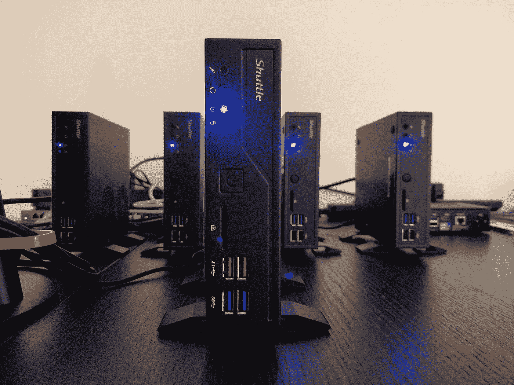

# 我们的区块链扩展体验

> 原文：<https://medium.com/hackernoon/our-blockchain-scaling-experience-bd2be41f06c8>

## 以 100 TPS 的速度运行区块链两周需要什么

最近，位于卢加诺的杰卢里达区块链实验室发布了 Ardor 平台的[负载测试报告](https://www.jelurida.com/ardor-loadtest-report)。

简而言之，我们能够连续运行超过 14 天的“区块链”负载测试，同时保持每秒超过 100 个事务的平均吞吐量。

在本文中，我将讨论这一成就的意义，我们在这一过程中学到了什么，以及我们将何去何从。

**前言**

当查看区块链产品及其扩展报告时，您会看到一个奇怪的二分法:一方面，现有的生产区块链停留在每秒 15 个事务左右，在过去几年中没有显著的进步。另一方面，当您查看项目白皮书时，您会看到理论上扩展到每秒数百万事务的承诺。由于某种原因，似乎很难弥合现有的平庸结果和梦幻般的承诺结果之间的差距。那么，为什么区块链如此难以衡量呢？

基本的区块链操作，如签署事务、生成块等，通常并不代表真正的伸缩障碍。这些操作中的大多数甚至可以在商用笔记本电脑上每秒执行数百万次。极限一定在别处。我们来探索一下。

**完全一致性与最终一致性**

当唐纳德·特朗普(Donald Trump)向他的数百万粉丝发布他的“智慧之言”时，他不在乎他们是否会在一秒钟、一分钟或一小时内收到他的消息，只要他们最终收到他的消息。这就是我们所说的“最终一致性”，它代表了给定行为最终将发生的保证。最终的一致性通常由另一个名为“阅读你自己的文章”的保证来补充，这确保至少老唐纳德自己可以在睡觉前立即看到他的推文，不管他的粉丝是否已经看到他的信息。

几乎所有的社交网络都遵循这种一致性保证，这使它们比遵循“完全一致性”保证的传统数据库具有更好的可扩展性，这意味着，直观地说，每个人在任何给定的时间都能看到完全相同的数据。

很明显，管理价值象征的区块链不能使用最终一致性。如果实现了这样的区块链，用户将能够利用事务在节点之间传播的时间间隔，在其他节点还不知道初始事务的存在时，加倍花费他们的令牌。

**结论:** *区块链产品必须使用全一致性型号。*

**完整复制与部分复制**

即使是完全一致的系统也可以达到 100 TPS 以上。例如，在 Software AG，我管理了多年的 JIS 大型机集成产品的开发，当使用强大的服务器时，它能够扩展到大约 2000 TPS，同时保持大型机中应用程序状态的完全一致的视图。许多数据库应用程序也是如此。对于 JIS 产品，限制与可用内存量、CPU 消耗或网络拥塞有关，无论是在中间件级别还是在大型机本身。我们使用部分复制实现了这一点:负载和数据都被分配到几个服务器上，每个服务器只保存部分数据，只为部分负载提供服务。

与区块链的不同之处在于，在区块链环境中，每个节点必须独立地同意与其他每个节点相同的状态。没有单一的“主机”系统或“数据库”(或“协调器”)来代表正确的状态。每个节点需要通过处理所有事务并与每个其他节点就区块链的现有状态达成一致，即达成共识，来自己达到这种状态。但是这需要在节点之间完全复制数据，这比扩展的集中式系统使用的部分复制要昂贵得多。最终，与集中式数据库相比，这种大规模(完整)复制需求限制了任何区块链的扩展潜力。

**Ardor 100 TPS 负荷试验的教训**

在完全分散的区块链中，缩放首先受到共识算法本身的限制。即使您的服务器没有最大限度地利用 CPU、内存、磁盘、网络或它们的本地软件，您的事务处理能力仍然受到共识本身的限制。如果太多的事务处理得太快，节点就无法就事务的顺序以及如何将它们组织成块达成一致。

这有几个含义:

1.单节点性能通常不是限制因素。因此，与使用提供更好性能的低级语言(即 C/C++)相比，使用提供更好安全性且更易于维护的高级语言(即 Java)来实现区块链节点更有意义。

2.节点达成共识的能力是一个限制因素，因此共识算法必须尽可能简单。它必须基于一个简单的公式，可以快速有效地计算。我预测，需要多轮投票的复杂 PoS 算法将无法很好地扩展。类似地，需要过于频繁地达成共识的共识算法，如具有非常短的阻塞时间的 DAG 或区块链，将倾向于在负载下快速发散。

3.在负载较重的情况下，节点会同时独立生成数据块，导致区块链分叉。解析这些分支是资源密集型操作，因为切换到更好的分支的节点需要撤销其所有现有块直到公共块，然后切换到由另一个节点提供的更好的分支。理想情况下，应该通过增加足够的阻塞时间来尽可能地限制分叉，以减少两个或多个同时生成的阻塞的机会。

4.应该控制块的大小。使用大块时间会导致性能瓶颈，因为块大小会增加，并且在块之间的长时间内，未确认的事务数量会增加。如果不加以控制，这些大数据块和许多未确认的事务会耗尽节点资源，从而导致内存不足问题和不希望的性能峰值。

5.基于这些权衡，我们发现在我们现有的分散网络中，阻塞时间的最佳点在 5 到 10 秒之间。

**共识算法及其扩展潜力**

PoW 算法不同于 PoS 算法，因为在 PoS 中，块之间的等待时间大部分是空闲的，而在 PoW 中，块之间的等待时间专用于散列，以尝试生成下一个块。因此，电源链将始终保持 CPU 密集型。这意味着节点运营商将总是需要升级他们的硬件来竞争下一个块的生成，因此商品硬件的使用是不可能的。

理论上，dpo 可以有效地伸缩，因为当预先知道块生产者(代理)的顺序时，分叉应该不那么频繁地发生。如果当前代理生成的块没有在自己的块生成时隙内按时到达下一个代理，DPoS 中仍会发生分叉。限制因素似乎是当前委托的负载和块传播时间。dpo 本身有额外的投票事务开销。在极端负载下，区块链可能无法足够快地处理投票，以就代表的顺序达成一致。我很想看到一些 DPoS 链的负载测试结果，以便进行比较。

DAG 实现最容易受到一致性相关问题的影响，因为它们需要对每个事务达成一致，而不是对每个块。这可能是我们在 DAG 实施中总是看到某种形式的集中化的原因。

通常在许可区块链中发现的其他共识算法，例如 BFT 的变体，通常假设在节点生成器的序列上的信任协议，从而以需要信任节点操作符为代价消除分叉。

一旦其他团队执行了与 Jelurida 的区块链实验室类似的负载测试，我预测我们会看到以下趋势:

PoW 和 PoS 将大致缩放到相同的水平，尽管有 PoW，这将需要更强的硬件和大量的能量浪费。

dpo 有可能比 PoS 和 PoW 更好地扩展，因为分叉频率较低，但会牺牲一些集中化。

预计 DAG 的可扩展性不会比区块链更好。

在各种 PoS 算法中，我认为算法越简单，扩展性越好。

## **我们会被区块链扩展限制在 100 TPS 左右吗？**

不一定。有两个有希望解决共识瓶颈的方向:

**非连锁交易**

在我看来，涉及在主链上锁定资金，同时在链外执行大部分工作的链外交易是一个尴尬的解决方案，但它可以证明对有限的应用程序(如闪电网络支付通道)有用。我看不出它如何用于合同执行或更复杂的应用程序。

**各个击破**

Ardor 子网研究项目等算法似乎是一种更可行的扩展解决方案，将区块链分成松散依赖的链，从而消除了每个节点处理每个事务的要求，这是“完全复制”的限制因素。

除此之外，我们将看到大量的混合区块链解决方案在分散化和性能之间提供某种程度的权衡。

为什么运行可靠的负载测试如此困难？

几个原因:

负载测试需要非常稳定的产品。以 100 TPS 跑的时候，不能虚张声势。您的数据库必须完全优化。节点网络通信代码必须工作正常。您需要调试并解决所有的竞争条件、内存泄漏和同步错误。能够在负载下运行稳定的产品是产品质量的证明。

您不能在生产 mainnet 或在线 testnet 上运行负载测试，因为不可能在这些环境中实现测试所需的必要实验室条件。相反，您必须能够用一个干净的 Genesis 块设置一个新的区块链实例。这意味着您的产品应该能够将区块链代码从特定的 genesis 块中分离出来。一项艰巨的任务。

接下来，您需要了解如何有效地对您的区块链进行负载测试，并掌握所需的工具和技术。做好这一点并不是一件小事，它需要对区块链的工作原理有深刻的理解。

在负载测试期间监控您的区块链是另一项必需的任务。您不仅需要监控服务器容量，还需要监控软件本身。

将所有这些整合到一个持续运行 14 天以上的稳定负载测试中是一项艰巨的任务。难怪 Ardor 是唯一一个接受这种测试的区块链。

举个例子，当我们开始负载测试时，在服务器开始最大化它们的 CPU 之前，我们只能达到大约 20 TPS。运行一些诊断发现，在提交事务后立即捆绑事务的默认模式导致了过多的数据库访问。为了解决这个问题，我们将服务器配置为仅在生成数据块之前执行绑定。这解决了瓶颈，但让我们进入了下一个问题。在类似的负载下，节点开始将彼此列入黑名单，导致每个节点继续自己的分叉。解决这个问题需要对节点通信代码进行长时间的调试，这导致解决了几个错误和竞争条件，并更新了一些配置。直到那时，我们才能够满负荷运行测试。

负载测试是主流应用的关键要求！

在 mainnet 上部署区块链需要全面了解其伸缩能力。就像组织应该在将任务关键型 web 应用部署到生产之前对其进行负载测试一样，区块链开发人员应该定期对其区块链性能进行基准测试，并测试其区块链在长时间负载下的稳定性。