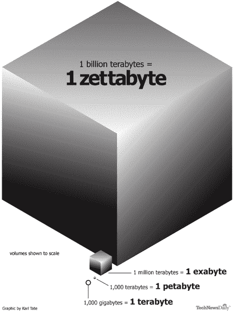
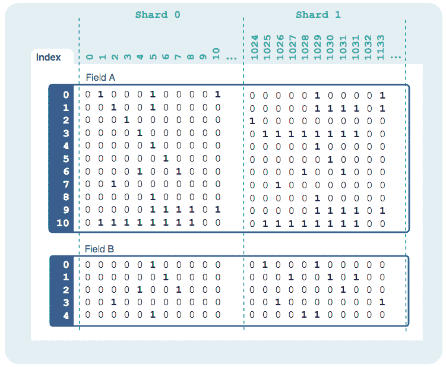
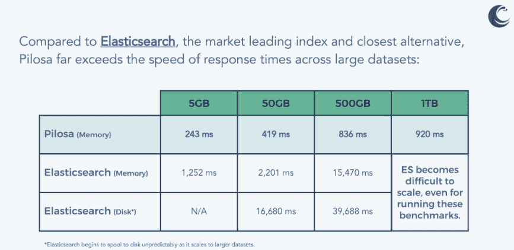

# 一个可扩展的高性能位图数据库索引

> 原文：<https://medium.com/hackernoon/pilosa-a-scalable-high-performance-bitmap-database-index-82023c0c8ebc>

大数据是一个大问题，至少从中获得任何有用的东西。[每天](http://www.storagenewsletter.com/rubriques/market-reportsresearch/ibm-cmo-study/)大约有三万亿(下一步是六次方或一个 zettabyte)字节的数据被创建，其中只有大约 20%是结构化的，可以轻松处理。几乎所有有用的处理都依赖于一种哲学，这种哲学与我们在夜班期间生成并分发到世纪之交的绿条报告没有什么变化。整个 map/reduce 流程是一夜之间的批处理，您不是在处理实时数据，而是在处理快照，这对于一些公司来说可能没问题，但对于其他公司来说，他们需要能够近/实时地对高速入站数据做出决策。

典型的关系数据库使用 b 树索引，这通常适用于从大量数据中检索较小的数据子集。众所周知，随着索引的填充，它们在添加数据时速度很慢，尽管像 [TokuDB](https://en.wikipedia.org/wiki/TokuDB) 这样的分形索引可以加快上传过程。这让我想到了位图索引，它与您所习惯的索引类型完全不同。它们的速度令人难以置信，并且执行的搜索必须使用基数较低的多个列来组合查询，例如一年中的几个月或鞋码，而不是像你住在离北极的距离这样有大量变化的东西。位图索引的问题一直是它们的伸缩性不好，这让我想到了 [Pilosa](https://www.pilosa.com/) 。

Pilosa 是一个开源位图索引[项目](https://github.com/pilosa)，现在由 [Molecula](https://www.molecula.com/) 维护，最初在 [Umbel](https://www.umbel.com/) 开发它的同一批人已经经历了一些组织变革。在一次 [Cassandra](http://cassandra.apache.org/) 会议上的一次对话中，位图索引的话题被提及，受此启发，人们意识到这可以解决他们在需要索引和分析大量高速数据时遇到的许多问题。该小组花了几年时间来构建和完善他们的技术，到目前为止已经获得了 8 项专利(是的，它仍然是开源的)。

使用数据存储库、云和操作系统不可知的方法，Pilosa 充当一个附加的索引系统，可以应用于现有的存储库，包括平面文件。请看下面的例子，如果您想象列标题表示 Customer_ID，字段 A 中的行表示产品库存，那么每个 1 表示每个 Customer_ID 购买的产品..你还会注意到这被分成碎片，这就是 Pilosa 如何如此有效地水平扩展，也是他们在这个项目中解决的巨大技术障碍之一。这些位图非常小，除此之外还进行了压缩，不需要解压缩就可以读取。Pilosa 的软件可以在内存中存储底层数据的知识表示，使其数量级更小，速度超乎想象。

记住这种不可知论的方法，您实际上可以让 Pilosa 跨数据存储库建立索引，将不同的数据源联系在一起，并允许您一次对所有数据源执行非常快速的查询。当你想一想它的时候，这种影响真的令人震惊，在商用云硬件上，一个简单的查询可以在一秒钟内遍历超过 20 亿条边，你没有理由不能实时进行关键分析。

(这张图来自 2017 年，自那以后有了显著的改进)

这项技术的一些真正聪明的应用是，能够从你的底层数据创建一个虚拟数据源，并通过让他们访问 API 来与客户或合作伙伴共享它，现在他们可以返回索引数据，就像洛杉矶 8 月份出售的所有 XL t 恤一样，但不允许他们访问底层数据。这里的含义是巨大的，想想看，能够将来自同一空间的许多不同公司的数据聚合到一个匿名的存储库中，您可以报告吗？这是另一个独特而强大的功能，我不记得在任何地方看到过，Molecula 将其称为数据的 VMWare。

现在，我要说的是，他们的文档可能需要加强，但你可以在这里了解他们的模式语言和他们的查询语言( [PQL](https://www.pilosa.com/docs/latest/query-language/) )不是你所习惯的那样，简单但不同，这就是挑战，(重新)编写你的代码以利用它。Pilosa 的安装和设置并不太难，但是你真的要考虑你在做什么，并计划好，这样你才能充分利用它。索引速度非常快，取决于数据密度，你可以在半小时内做 10 亿条记录，因为它不会复制数据。问题是你需要重新构建你的代码来使用它，他们有可用于 Golang、Java 和 Python 的[客户端库](https://www.pilosa.com/docs/latest/client-libraries/)。不得不重做代码不一定是件坏事，但这是一件耗时的事情，许多人都希望看到一种神奇的替代方式，让他们的所有代码运行得更快。Molecula 已经着手解决这些挑战，其中一个重点是 Kafka 的插件，这样你就只需要处理管道，而不是大量的程序。

该系统与数据可视化仪表板的合作已经成熟，这将是一个很好的组合，让企业拥有一个实时仪表板来显示某些类型的高波动性数据。在至少达到 4tb 之前，使用 Pilosa 是没有意义的，所以请记住这一点。如果你想了解更多关于位图索引的知识，我真的很喜欢这篇文章。