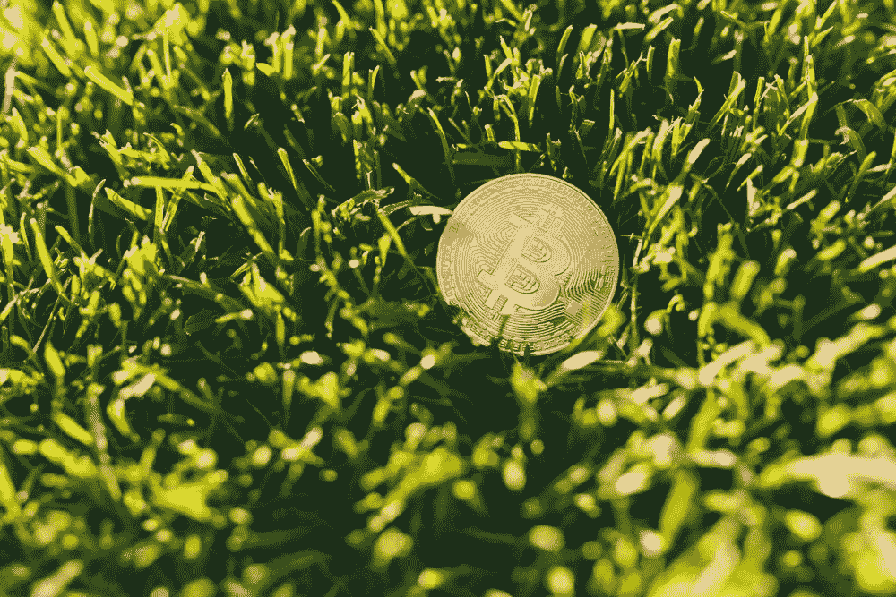
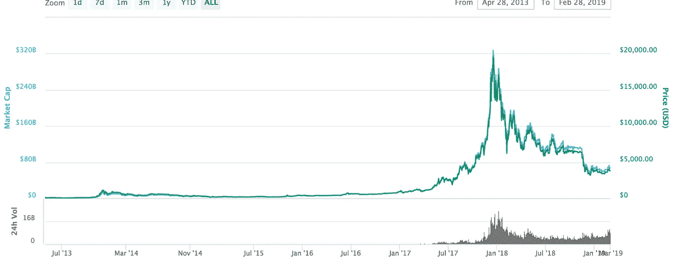
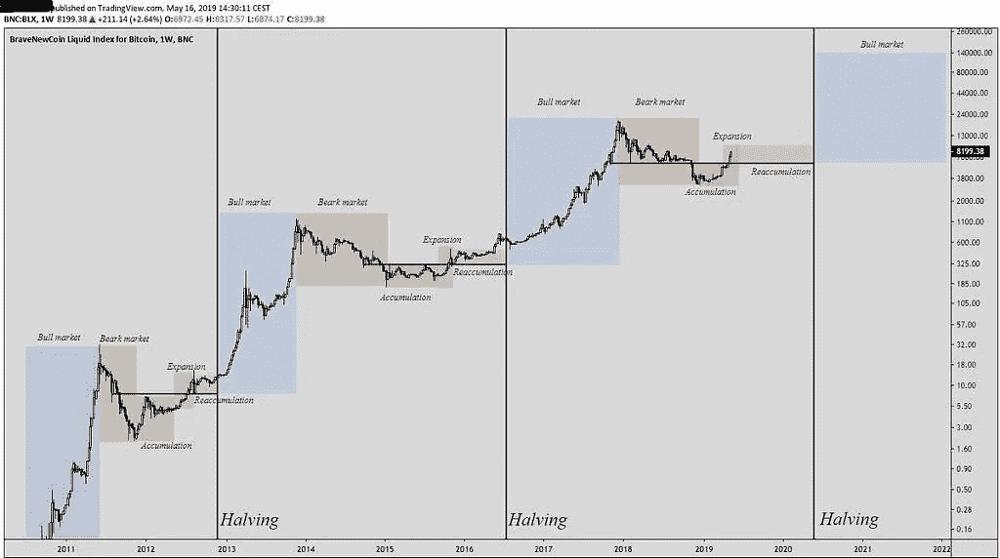
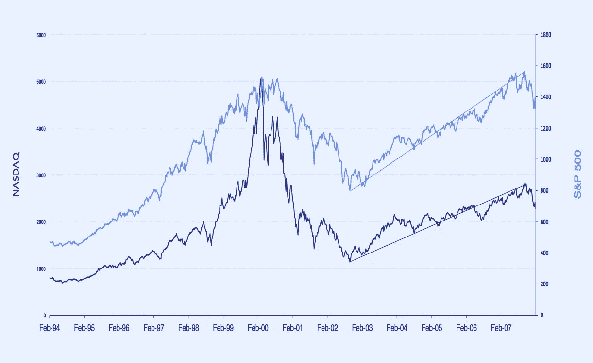

# 预测 2021 年有一个神秘的夏天

> 原文：<https://medium.com/hackernoon/predicting-a-crypto-summer-in-2021-1b1266806d23>

Now is a good time to HODL

自 2018 年初以来，加密货币市场急剧下跌。与之前的崩盘一样，许多人声称市场不可救药，比特币已死。相反，有理由相信，加密市场周期性地经历熊市，只是为了复苏并达到新的高度。我相信这个周期大约每四年发生一次。因此，我认为我们将在 2021 年迎来另一轮牛市。

根据这一论点，2018 年和 2019 年形成了一个“隐秘的冬天”，2017 年的泡沫破灭了。因此，2020 年，比特币将在被称为“加密春天”的时期重新崛起。2021 年，比特币和以太坊将达到新的高度。因此，现在是一个在 crypto 建立一个位置的有利时机，以收获将是一个史诗般的牛市的好处。

# 比特币在 2014 年打破纪录，但随后回落

# 比特币 2017 年史诗般的表现让 2014 年的飙升变得难以察觉

When analyzed logarithmically, cryptocurrency remains on track for impressive growth.

什么可能引发下一轮牛市？首先，预计 2020 年 5 月比特币整体奖励将减半，这可能会引发看涨的市场情绪或“秘密的春天”。2016 年 7 月，市场对比特币减半的反应是引发比特币价格小幅上涨，随后在随后的一年中出现了史诗般的飙升。2020 年比特币减半后，一次奖励将从 12.5 个比特币减少到 6.25 个比特币。到这个时候，85%的流通比特币将被开采。减半是在 210，000 个区块被开采后发生的事件，大约每 4 年发生一次，由于每个区块开采的比特币数量减少，随着矿工持有他们的比特币，出售的比特币供应量减少。2012 年的减半将每块开采的比特币从 50 BTC 降至 25 btc，随后价格从 12 美元飙升至 120 美元，而 2016 年的减半将奖励降至 12.5 btc，随后在 2017 年从 650 美元飙升至近 2 万美元。因此，2020 年减半事件的出现提供了进一步的证据，表明价格飙升可能会在 2020 年 5 月至 2021 年发生，随后可能会在 2022 年出现熊市，并在 2024 年减半后在 2025 年出现牛市；这种模式会一直重复，直到 2140 年最终的比特币被开采出来。

此外，在 2018 年 12 月，比特币的 hashrate(用于挖掘新比特币的计算能量)开始重新上升，表明加密社区对比特币价格的未来前景有了新的信心。同样值得注意的是，脸书预计将在今年晚些时候推出一种与 WhatsApp 整合的稳定币，以方便从印度汇款。在饱受高通胀困扰的委内瑞拉，莱特币和比特币等加密货币已经被用于向该国汇款，因为它们比美元更容易跨境传输。一笔 100，000，000 美元的比特币订单在 4 月初引发了一波小反弹，投资者或“鲸鱼”的积累将继续导致加密货币的反弹。此外，有迹象表明，传统市场即将陷入衰退，这将推动与股票或固定收益工具无关的加密货币。债券收益率曲线向下倾斜，表明到 2020 年底经济衰退的可能性很大。此外，美国的量化宽松导致公司债务达到了 GDP 的 40%。如果经济衰退确实来袭，资产管理公司可能会通过增加加密货币的配置来尝试多样化并最大化其基础投资组合的回报。

有迹象表明，机构投资者正在提升对这一资产类别的兴趣，这进一步证明了加密春天即将到来。例如，[2018 年 10 月，294 亿美元的耶鲁捐赠基金，美国最大的捐赠基金之一，全国第二大大学捐赠基金，投资了两个加密基金:Andreessen Horowitz Cypto 和 Paradigm](https://www.bloomberg.com/news/articles/2018-10-05/yale-is-said-to-invest-in-crypto-fund-that-raised-400-million) 。[120 亿美元的密歇根大学捐赠基金紧随其后](https://www.bloomberg.com/news/articles/2019-02-19/university-of-michigan-boosts-investment-in-cryptonetwork-fund)，很可能许多其他捐赠基金也会效仿。事实上，根据《信息报》的[报道，达特茅斯大学、麻省理工学院和斯坦福大学的捐赠基金已经进行了加密货币投资](https://www.theinformation.com/articles/harvard-stanford-mit-endowments-invest-in-crypto-funds)。[哈佛捐赠基金在 2019 年 4 月投资了 Blockstack 的首次硬币发行](https://www.bloomberg.com/news/articles/2019-04-11/harvard-takes-plunge-into-crypto-with-a-token-sale-investment)。2019 年 2 月，弗吉尼亚州费尔法克斯县养老基金投资了摩根克里克数字加密基金。此外，剑桥咨询公司(Cambridge Associates)发布了一份报告，鼓励客户考虑在这一领域有所投资。该公司是许多养老金和捐赠基金的顾问，管理着 3890 亿美元的资产。此外，有传闻称，著名的传统对冲基金正在探索秘密策略。富达数字资产于 3 月推出，为机构客户提供加密保管解决方案。如果 2017 年的泡沫是由散户投资者推动的，那么 2021 年的飙升将由机构投资者推动。

2021 年不太可能出现 2017 年那样的投机泡沫。机构投资者将避免推动加密货币价格过快上涨，以免引发另一场泡沫。因此，比特币将开始缓慢而稳定的上升，就像纳斯达克在 2001 年互联网泡沫后跌至谷底一样。

纳斯达克让标准普尔 500 黯然失色，从低谷到高峰，其回报率为 146.5%对 95%。它将在 2015 年超过 2000 年的峰值。

总之:隐秘的冬天已经解冻。有理由预计比特币将经历一轮巨大的牛市，最终在 5 万美元到 15 万美元的区间内结束。我邀请你和我一起去。