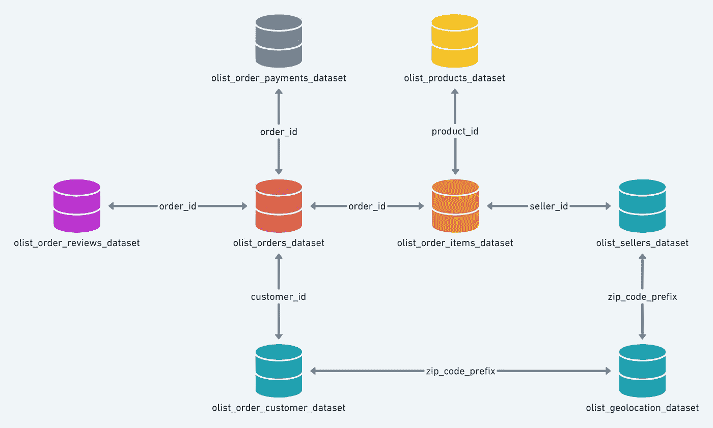
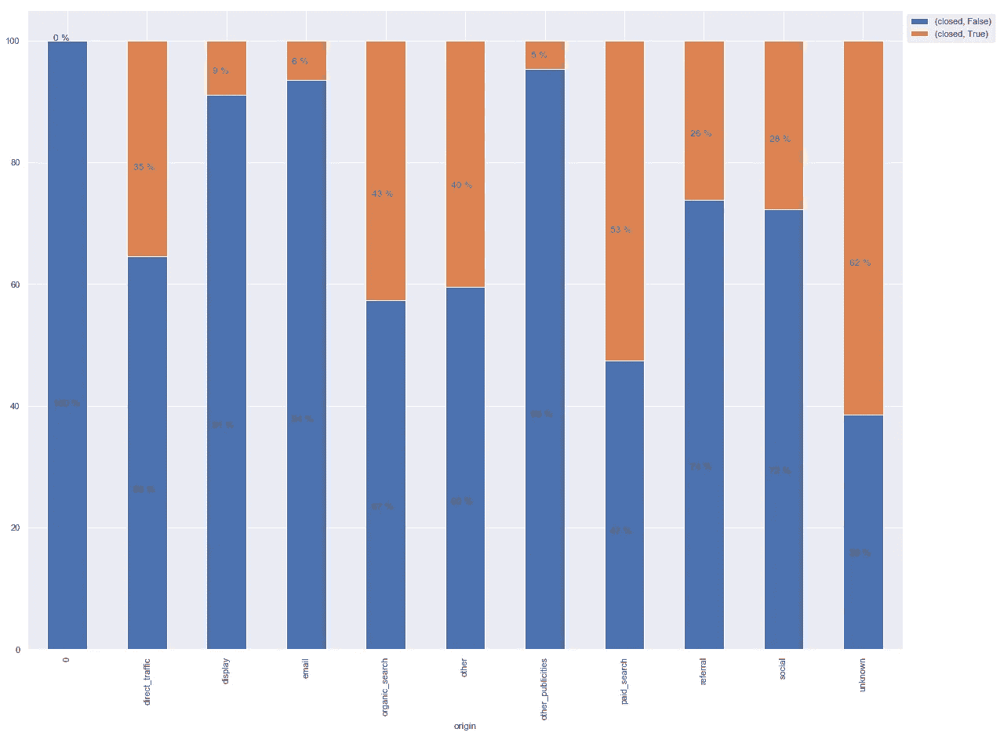
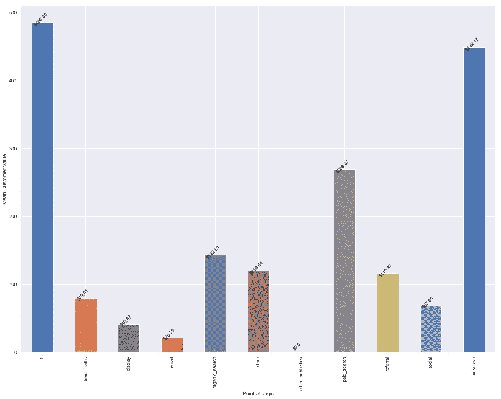
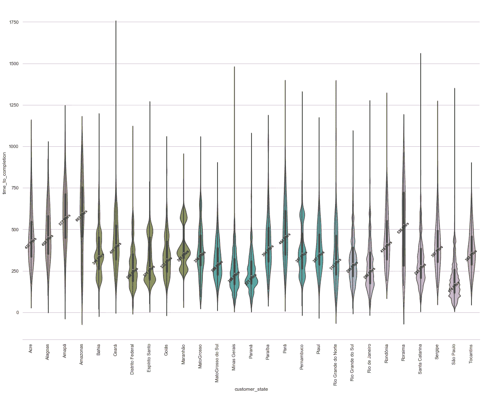
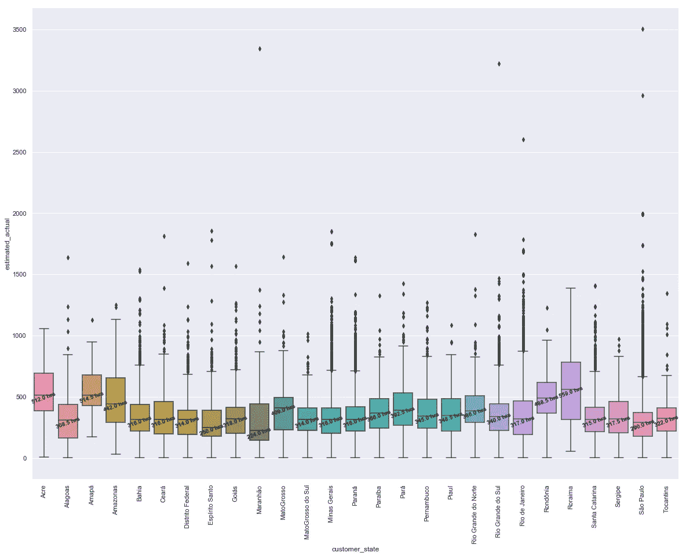
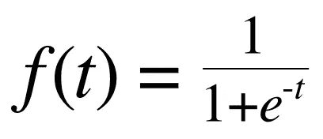

# 使用逻辑回归预测客户重复购买的可能性

> 原文：<https://medium.com/hackernoon/predicting-the-likelihood-of-a-customer-to-make-repeat-purchases-using-logistic-regression-b430c9719994>


Source: Furaffinity

对于一个企业来说，获得一个客户是令人兴奋的，不仅因为它通过带来急需的收入来帮助你“保住袋子”，而且它还创造了一个与这个新发现的客户建立忠诚度的机会，这反过来可以帮助你通过重复购买来“保住更多袋子”。


Safe Bag

假设你的企业继续推动和优化对创造重复购买有最大积极影响的行动，你创造了更多的有机品牌大使，他们会推荐朋友到你的企业，而不需要你额外付费。此外，根据这些回头客的购买规模，这将增加平均客户终身价值。在所有因素不变的情况下，平均生命周期价值越高，你在现有和/或新渠道上获取新客户的回旋余地就越大。然后，你可以利用这一点说服投资者给你更多的钱，让你搬进更凉爽的办公室，给你的员工提供午餐，并购买更大的台球桌，以“吸引新人才”。

首先，你需要了解顾客旅程中对增加顾客重复购买可能性更重要的因素，然后:I .)努力优化这些因素，ii .)也许可以开始向更有可能成为回头客的客户测试个性化的电子邮件营销，以确保他们再次购买你的产品——这当然可能包括了解他们更倾向于感兴趣的产品类型。

在这种背景下，我决定分析巴西电子商务平台 Olist 上的 [Kaggle 数据集，其中包括探索性数据分析部分，以探索和了解更多关于数据本身、用户行为和潜在有价值的趋势的信息，以及机器学习/分析部分，用于使用分类算法，根据客户在平台上的以往行为预测他们重复购买的可能性。](https://www.kaggle.com/olistbr/brazilian-ecommerce#olist_sellers_dataset.csv)

**探索性数据分析**

在 EDA 过程中，我重点回答了以下问题:I .)Olist 每个营销渠道的效率如何，查看每个渠道的转化率，每个渠道将用户从第一次接触转化为“结束”销售线索所需的平均时间长度，ii .)源自每个渠道的客户的中值，以更清楚地了解每个渠道应该分配多少资金来获得客户，iii。)购买日期和订单交付给每个州和 iv 的客户的日期之间的中间时间差。)实际交付时间和估计交付时间之间的时间差。

```
merged_list = pd.merge(closed_deals,mark_qualified,on='mql_id',how='outer').fillna(0)
frames = [merged_list,seller_data,order_list]
seller_merged = reduce(lambda left, right: pd.merge(left,right,on='seller_id',how='outer'),frames).fillna(0)more product a customer purchases the greater the the customer is customer purchases#calculate different between won date and first contact date
seller_merged['time_to_close'] = pd.to_datetime(seller_merged['won_date']) - pd.to_datetime(seller_merged['first_contact_date'])#extract days from time to close
seller_merged['days_to_close'] = seller_merged['time_to_close'].apply(lambda x: x.days)
```

由于数据集在 Kaggle 上被分成几个表，我采取的第一步是合并这些表，选择一个完整的外部连接。与 SQL 类似，完整的外部连接合并了所有数据集中的所有数据。与这个表和其他表合并需要理解 Kaggle 上的数据模式。



Data Schema

每个带有指向和来自数据库的指针的箭头表示连接两个数据库的公共键，这是我用来合并每个表以构建数据库的键。

在连接了相关的表并计算了赢得日期(销售线索关闭的日期)和第一次联系的日期之间的差异之后，我创建了一个 lambda 函数来从这个时间增量中提取日期。在衡量完成一个营销线索所需的平均时间时，考虑到该数据集中涉及的时间表，使用天数作为衡量标准似乎更合适。

```
#closing success rate by point of origin
seller_merged['closed'] =  np.where(seller_merged['won_date']!=0, "True","False")#percentage of deals closed/not closed by point of origin
closed_or_not = seller_merged.groupby(['origin', 'closed']).agg({'closed': 'size'})
ax = closed_or_not.groupby(level=0).apply(lambda x: 100 * x / float(x.sum())).unstack().plot.bar(stacked=True)
for p in ax.patches:
    width, height = p.get_width(), p.get_height()
    x, y = p.get_xy()
    horiz_offset = 1
    vert_offset = 1
    ax.legend(bbox_to_anchor=(horiz_offset, vert_offset))
    ax.annotate('{:.0f} %'.format(height), (p.get_x()+.15*width, p.get_y()+.4*height))
```

为了直观地显示来自每个渠道的潜在客户的转换率，并将其转化为付费客户，我创建了一个列，根据获胜日期是否包含 0 来返回布尔值 true 或 false。随后使用 lambda 函数将关闭和未关闭的导联总数除以通过每个通道的导联总数。我将每个数字乘以 100，以百分比的形式返回这些数字，并将这些数字绘制在 100%堆积条形图上。



Visualising the efficiency of each marketing channel

从视觉效果来看，通过付费渠道进入的销售线索比有机渠道的关闭率更高。这大概是因为，如果用户键入相关关键词，看到广告并点击，就会有更强烈的购买意愿。然而，我们不能简单地将这些转化归因于付费搜索，因为其他营销渠道可能创造了知名度，而付费搜索只是推动了最后的转化点击。


A dog jaded from seeing banner ads

展示广告似乎是表现最差的广告之一，但正如上一段所指出的，展示广告等渠道可能会提高初始认知度，从而导致客户在稍后阶段点击付费搜索广告。用品牌回忆等其他指标来衡量展示可能更合适。

**显示完成销售线索所需的平均时间**

```
#length of time to close deals by origin
closing_deals = seller_merged.query('closed == "True"')
medians =  seller_merged.query('closed == "True"').groupby('origin')['days_to_close'].median().values
median_labels = [f'{m} days' for m in medians]
pos = range(len(medians))
ax = sns.violinplot(x='origin',y='days_to_close',data=closing_deals)
for tick,label in zip(pos,ax.get_xticklabels()):
  ax.text(pos[tick],medians[tick]+0.5,median_labels[tick],
         horizontalalignment='center',size='xx-large',color='b',weight='semibold')
sns.set(rc={'figure.figsize':(20,15)})
```

Seaborn 库提供了一个小提琴图，看起来非常直观，不仅有助于可视化中间时间增量，而且有助于关闭线索的时间增量范围。我假设任何负值都被错误地记录下来，并从我的观想中过滤掉，只留下时间增量等于或大于零的值。我认为这样做还会过滤掉没有“成功日期”的潜在客户，因此不会被关闭或转化为付费客户


Time to close each leads

有趣的是，可视化显示，关闭一个付费搜索线索的平均时间是 7 天，是所有其他渠道中最短的，而社交和电子邮件是惊人的 42 天和 35 天。需要注意的是，0 和 unknown 都是未知通道，它们被包含在这些可视化中只是为了完整地表示数据集中呈现的所有数据。

**渠道客户价值中位数**

EDA 过程的下一部分包括可视化每个渠道的客户终身价值中值，最终目标是试图了解哪个营销渠道产生更高价值的客户。

```
#average value by origin
geolocation = pd.read_csv(r"/Users/emmanuelsibanda/Downloads/olist_geolocation_dataset.csv")
customer_db = pd.read_csv(r"/Users/emmanuelsibanda/Downloads/olist_customers_dataset.csv")
orders_db = pd.read_csv(r"/Users/emmanuelsibanda/Downloads/olist_orders_dataset.csv")
#merge on zip code
geolocation = geolocation.rename(columns={'geolocation_zip_code_prefix':'zip_code'})
customer_db = customer_db.rename(columns={'customer_zip_code_prefix':'zip_code'})
seller_merged = seller_merged.rename(columns={'seller_zip_code_prefix':'zip_code'})
#crashing my ram
seller_customer = pd.merge(seller_merged,customer_db,on='zip_code',how='outer').fillna(0)
```

为了能够进行这种分析，我需要将现有的表与包含客户 id 的客户数据库合并。

```
#unique identifiers for duplicate zero values
seller_customer['customer_id'] =seller_customer['customer_id'].mask(seller_customer['customer_id'] == 0 , seller_customer['customer_id'].eq(0).cumsum())#currency conversions
seller_customer['usd_price'] = seller_customer['price'].apply(lambda x: x*0.26)
seller_db = pd.DataFrame(seller_customer.groupby(['origin','customer_id'])['usd_price'].sum()).reset_index()
ax_chart = seller_db.groupby('origin')['usd_price'].mean().plot.bar()
ax_chart.set_xlabel("Point of origin")
ax_chart.set_ylabel("Mean Customer Value")
for x in ax_chart.patches:
  ax_chart.text(x.get_x()+.04,x.get_height()+10,\
               f'${round(x.get_height(),2)}',fontsize=11,color='black',
               rotation=45)
```

数据集的一个问题是，许多 customer _ ids 被记录为零，即使这些可能是不同的用户。简单地使用 groupby 函数而不纠正这一错误，会导致将所有为零的客户 id 计为一个用户，从而推高平均客户生命周期值。为了纠正这个错误，我假设每个记录为零的客户 id 都是一个唯一的用户，并添加了唯一的标识符来区分每个零——通过向每个零添加 n，n 是零出现的数字顺序，例如，第一个零是 0+1，第二个零是 0+2，等等。

为了便于理解，我将每次购买的交易价格从巴西雷亚尔转换成美元。在分析时，汇率约为 0.26，1 巴西雷亚尔约等于 26 美分。这样做是为了便于阅读，因为这些数字看起来比实际高得多。


So much money

然后，我返回了每个渠道的平均消费总额，或者每个渠道的平均终身客户价值。



虽然均值对异常值并不稳健，但在这种情况下返回中值似乎并不合适，因为大多数销售线索并没有导致转化，因此其值为零，因此许多渠道的中值为零。从呈现的图表来看，付费搜索似乎正在回报一个显著的平均客户终身价值——比来自社交渠道的客户的平均价值高出约 401%。然而，应该注意的是，该分析中的未知变量是客户获取成本。通过付费搜索获取客户的成本可能会高得多。真正的价值是每个渠道的平均客户终身价值和平均客户获取成本之间的差值——差值越大，渠道越有效。

**完成一份订单所需的时间**

```
#time to deliver orders
seller_customer = pd.merge(seller_customer,orders_db,on='customer_id',how='outer').fillna(0)
```

为了寻找物流过程(从购买到交付)中的任何瓶颈，我必须从执行 orders 表的外部合并开始。

```
def reformat_date(df, column):
  df[column] = pd.to_datetime(df[column])
reformat_date(seller_customer,'order_purchase_timestamp')
reformat_date(seller_customer,'order_approved_at')
reformat_date(seller_customer,'order_delivered_carrier_date')
reformat_date(seller_customer,'order_delivered_customer_date')
reformat_date(seller_customer,'order_estimated_delivery_date')#calculating time delta
seller_customer['purchase_to_approval'] =(seller_customer['order_approved_at']-seller_customer['order_purchase_timestamp']).apply(lambda x: x.total_seconds()//3600)
seller_customer['time_to_completion'] =(seller_customer['order_delivered_customer_date']-seller_customer['order_purchase_timestamp']).apply(lambda x: x.total_seconds()//3600)
seller_customer['estimated_actual'] =(seller_customer['order_estimated_delivery_date']-seller_customer['order_delivered_customer_date']).apply(lambda x: x.total_seconds()//3600)#filter negative values
seller_customer2 = seller_customer[((seller_customer.purchase_to_approval > 0) & (seller_customer.time_to_completion > 0))]
```

因为我需要分析交付时间，所以我创建了一个函数，将相关的日期列转换为 datetime 格式，然后计算采购到交付周期中每个阶段的时间增量，包括计算估计交付时间和实际交付时间之间的时间增量。我过滤掉了完成时间低于零的行，假设这些记录被错误地记录了。

大概每个州的交付时间会有所不同，为了捕捉这些差异，我选择按州对数据集进行分组，并按州返回中间时间和时间范围。我选择使用 seaborn 图书馆的 violinplot 来捕捉完整的交付时间。



Delivery times per state

然后，我对预计交付时间和实际交付时间之间的时间差进行了可视化处理——假设经常低估交付时间可能会对客户满意度产生负面影响。



Estimated time v actual delivery time

如箱线图所示，在估计交付数据和实际交付日期之间通常有相当大的时间差。这可能会低估实际交付时间，从 9 天到大约 23 天不等。

**预测重复顾客**

在分析的这一部分，我假设根据对第一次购买的观察来预测回头客将会揭示趋势，这可能有助于识别更有可能重复购买的客户。这可以帮助我建立一个模型，我可以在未来使用它来预测新客户是否会重复购买，并根据客户的情况调整我的营销工作。

```
#column of number of purchases made
seller_customer['no_purchases'] = seller_customer.groupby('customer_id')['customer_id'].transform('count')#create column for repeat and non repeat purchases
seller_customer['repeat'] = seller_customer['no_purchases'].apply(lambda x: 1 if x > 1 else 0)
```

在准备这个分类任务时，我首先使用布尔值 True)和 0(False)来识别重复购买的客户。

**绝对数字**

```
#categorical to numerical
seller_customer['customer_city'] = seller_customer['customer_city'].astype('category')
seller_customer['customer_city'] = seller_customer['customer_city'].cat.codes#origin to numerical
seller_customer['origin'] = seller_customer['origin'].astype('category')
seller_customer['origin'] = seller_customer['origin'].cat.codes#lead behaviour profile
seller_customer['lead_type']=seller_customer['lead_type'].astype('category')
seller_customer['lead_type']=seller_customer['lead_type'].cat.codes#removing purchase dates with value 0
seller_customer_clean = seller_customer[seller_customer['order_purchase_timestamp'] != 0]#sort orders by purchase date
seller_customer_sorted = seller_customer_clean.sort_values(by='order_purchase_timestamp')#return first purchase made by each customer
seller_customer_sorted.drop_duplicates(subset ="customer_id",keep = 'first', inplace = True)
```

由于我将使用逻辑回归进行分类任务，因此我需要将分类变量转换为数值变量，我将使用分类变量作为我的机器学习算法的特征。然后，我删除了所有购买日期为零的订单——因为没有日期可以归类为零。因为我想根据客户的第一次购买进行观察，所以我按照购买日期对订单进行排序，并使用 drop duplicates 函数只保留每个客户的第一个订单。

**相关矩阵**

为了了解用于预测客户是否会重复购买的潜在功能，我返回了一个相关矩阵，显示了数据集中所有数值变量之间的相关性


Correlation Matrix

返回所有数值变量的相关矩阵的想法是通过理解数据集中存在的关联来更好地了解潜在的特征。这还可以通过了解数据集中的依赖关系来缓解多重共线性。这是特别有用的，因为我计划在这个任务中使用一个线性模型(通过逻辑函数转换)。

从相关矩阵中突出的是评论分数、运费价值和成为回头客的可能性之间的强关联。这些属性似乎为我的逻辑回归模型提供了最强的预测能力。然而，由于一些变量之间看似很强的相关性。

**建立逻辑回归模型**

虽然回归算法通常最适合预测连续变量，但逻辑回归返回二元事件发生的概率。虽然从技术上讲，我们可以使用线性回归算法来完成同样的任务，但问题是，使用线性回归，您需要通过样本拟合一条直线“最佳拟合”。基于事件发生的概率使用这种方法来解决分类问题，可能会得到概率低于 0 或高于 1 的结果([在 Coursera](https://www.coursera.org/learn/machine-learning) 上的斯坦福机器学习专业化中有最好的解释)。



1 represents the maximum value of the S-cruve and t denotes the steepness of the curve

对于逻辑回归，我们使用 sigmoid 函数将直线转换为 S 形曲线，该曲线不会低于 0 或 1，返回这两个数字之间的概率。


Logistic function s-curve

在我的数据集的上下文中，逻辑回归模型将返回客户成为回头客的概率，如果该概率超过 0.5，则该客户将被归类为回头客。我选择使用这种算法是因为它易于解释，而且似乎非常适合这个任务。

```
from sklearn.linear_model import LogisticRegression
from sklearn.metrics import accuracy_score 
from sklearn.model_selection import train_test_split
#defining features and target
X = seller_customer[['origin','review_score']].values
y = seller_customer['repeat'].values
X_train, X_test, y_train, y_test = train_test_split(X, y, test_size=0.2, random_state=0)
logisticModel = LogisticRegression()
#training data with logistic regression model
logisticModel.fit(X_train,y_train)
#predicting with models
predicts = logisticModel.predict(X_test)#test model accuracy
from sklearn.metrics import classification_report
#print(classification_report(y_test,predicts))
print("Accuracy:", accuracy_score(y_test, predicts))
```


Classification report and accuracy score

我的代码中的[分类报告](https://scikit-learn.org/stable/modules/generated/sklearn.metrics.classification_report.html)显示了多个度量，包括:精确度、f1 分数、召回和对每个类的支持。整个报告被用作评估分类算法所做预测质量的方法。精度显示了模型在此上下文中对每个二元结果做出的正确预测的百分比(模型的准确性/准确性分数)。Recall 返回分类器找到每个结果的所有正面实例的能力的分数，而 f1 分数和 support 分别返回被证明是正确的正面预测的百分比和每个结果中真实响应的数量。将此转化为直观的结果，该模型可以基于通过我的分析做出的假设(定义什么是回头客的假设)，以大约 91.05%的准确度预测客户是否可能是回头客。

该模型可以更好地预测一个人是否会成为回头客，这种预测的精确度约为 95%。可以将此模型推广到与品牌互动的新客户，以预测他们重复购买的可能性，这通常主要取决于客户的评论得分和为产品支付的运费。

**交叉验证**

测试/训练分割方法的一个可能的缺点是可能得到过于乐观的准确度分数。即使我的数据的 30%被保留作为测试数据来评估我的模型的准确性，假设 30%相当于 2000 行，我的模型可能会在一组随机的 2000 行上表现得非常好，而在另一组随机选择的 2000 行上表现不好。为了全面了解我的模型有多准确，我可以选择进行某种形式的交叉验证。这将涉及到在我的数据的不同子集上运行模型。为了便于应用，我选择了 k-folds 交叉验证。用这种方法，我将把我的数据分成‘k’个不同的折叠，k 指的是数据样本将被分成的组的数量。根据我的研究，k=10 或 k=5 是 k 的最佳经验值。由于我选择使用 10 个折叠，k-folds 将通过使用 9 个子集来训练我的数据，将第 10 个子集作为验证集，并在此过程中迭代 10 次，验证集随每次迭代而变化。这个过程将以我在每次迭代中平均出准确度分数而结束。

需要注意的是，k 倍交叉验证并不总是可行的。K-fold 涉及运行类似于测试/训练分割方法的东西 k 次，对于较大的数据集来说成本更高。


Source: Raheel Shaikh (Cross Validation Explained: Evaluating estimator performance, Towards Data Science) — Visualising the cross validation process

```
from sklearn.model_selection import KFold
kfold = KFold(n_splits=10,shuffle=True,random_state=0)
#running 10 fold cross validation and returning scores in list
scores = []
for train_index, test_index in kfold.split(X):
  print("Train Index:", train_index, "\n")
  print("Test Index:", test_index)
  X_train,X_test,y_train,y_test = X[train_index],X[test_index],y[train_index],y[test_index]
  logit.fit(X_train,y_train)
  scores.append(logit.score(X_test,y_test))
#printing out averaged accuracy as percentage
print("Accuracy: {}%".format(np.mean(scores)*100))
print("Variance: {}".format(np.var(scores)))###results###
>>> Accuracy: 91.00565131889124%
>>> Variance: 2.6873619430516173e-06
```

运行交叉验证会返回与测试/训练分割方法相同的准确性分数，这为我的准确性分数的有效性增加了一点可信度。

由于这一过程涉及从 10 个不同的准确度分数中获取平均值，因此关注这些分数的变化是一种很好的做法。方差来自我的模型的随机性和我的训练数据中的噪声。较高的方差意味着每次运行我的模型时，我会得到不同的准确度分数。在我的交叉验证中，方差非常低。

我的故事就这样结束了。

欢迎在我的 Twitter @Emmoemm 上提出任何批评、反馈、建议和/或复仇者联盟决赛的免费门票