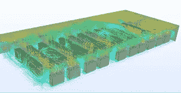
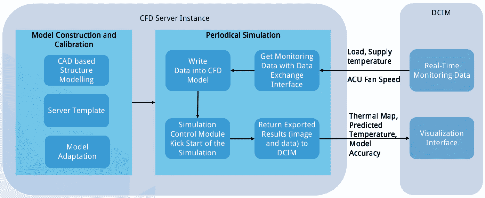

# 三维预测:阿里巴巴推出基于 CFD 的实时沙盒

> 原文：<https://medium.com/hackernoon/prediction-in-three-dimensions-alibaba-launches-its-live-cfd-based-sandbox-c3c452ae5418>

## 通过其模拟数据中心变化的新方法，阿里巴巴展示了沙盒模拟如何更好地预测问题，并使设施更接近无人值守。

随着阿里巴巴数据中心(DC)的规模随着其业务足迹的扩张而增长，日常操作(如演习和优化)的频率越来越高，给系统带来了指数级的复杂性。这使得 DC 专家越来越难以预测系统变化可能导致的故障，而 DC 故障对业务的影响继续超出估计。

为了应对这些问题，DC 运营商需要一个可靠的、标准化的验证系统，该系统可以指示变更是否会影响 DC 的安全，以及是否有更合适的选项可用。现在，经过一年的不懈努力，阿里巴巴-NTU 新加坡联合研究所已经实施并推出了一个基于在线计算流体动力学(CFD)的沙盒系统，用于高精度实时监控。

本文详细介绍了这个原始沙盒的开发，从它的研究起源到在现成的 CDF 软件上的测试和验证。

# 沙盒的起源:以前解决方案的局限性

与电力拓扑结构的变化相比，加热、通风和空调(HVAC)调节中涉及的更无形的热和气流组织变化相对难以在现实世界中模拟。为此，阿里巴巴的 IDC 运营优化团队对 CFD 如何有效实现 DC 房间模拟的生产标准进行了广泛的研究。

CFD 提供了一个通用的 DC 房间模拟解决方案，用于检查 DC 房间中各种变化的热力学。通过构建物理模型和加载特定的热力学设置，例如热源体积和冷供应气流体积，CFD 建模可用于计算隔间内的气流分布和温度。因此，它是一种相对成熟的技术，广泛应用于空气动力学和热力学相关领域。对于数据中心，CFD 模拟应用范围从隔间级到芯片级，但由于精度限制，通常仅用于预设计和规划目的。

*A visualization of streamline data for data center compartments*

为了建立一个沙箱系统作为数字测试环境，CFD 提出了许多挑战。

首先，商业上可用的计算流体动力学软件基于舱室模拟获得热量和气流模式数据，在设计阶段信息不完整导致准确性低。因此，粗略的模拟结果可能会与真实场景相差很大。例如，在温度预测中，模拟可能会误算 3 摄氏度或更多，而沙盒系统要求更高的精度。

第二，现有的 CFD 软件是为人机交互而设计的，而不是自动化操作。因此，它不能满足自动数据获取和结果输出的要求，这使得它难以成为 DC 操作流水线的重要模块。

最后，模拟所需的关键热源和空调配置数据只能在运行时获得。这些数据只有经过精确验证，才能保证精确建模。或者，建模过程可以推断设计和实现之间的差异，并可以促进 DC 配置和操作数据的存储标准化。

# 达成解决方案

阿里巴巴与新加坡南洋理工大学计算机科学与工程学院的温永刚教授合作进行了近一年的研究、开发和测试，成功推出了具有实时监控功能的高精度 CFD 沙盒。这项工作将阿里巴巴数据中心房间指定为试点测试平台，重点是目标数据中心的物理建模、模型校准和项目实施。

## 物理建模

物理建模过程主要定义 DC 房间空间的物理结构，从而为模拟提供基础。为了在复制中达到尽可能高的精度，项目团队实施了几个建模操作。

通过结构建模，为中心设置了房间结构、墙壁、通风口、天花板和管道布局；通过 IT 部署建模，设置了一排排机柜和服务器插槽位置；通过环境建模，在模型中配置空调设备和传感器；在设备建模中，服务器根据供应商类型安装到模型中。

## 模型校准

模型校准旨在实现 DC 室三个关键方面的真实再现。

首先，它需要再现 DC 房间产生的热量和供应的冷却源。第二，它需要再现 DC 室内气流变化的所有原因，并确认所得的气流模型与实际情况一致。最后，它需要确保模型预测的房间温度与实际条件一致。

为确保模型达到工业级精度，项目组进行了大量的数据审核和模型调整工作。通过这些努力，对整个 DC 室的所有相关信息和设置进行了全面梳理和验证，积累了一套完整的标准化校准文档，为建模和推广奠定了基础。这些校准工作可以分为两类:数据审核和模型调整。

数据审核又可分为两类:服务器审核(如服务器位置冲突清理和服务器功耗校准)和传感器审核(包括空气供应温度、ACU 风扇速度校准以及冷热通道中传感器的位置和读数)。

模型调整包括调整热空气泄漏设置(因为热空气泄漏会导致冷通道温度升高)，调整模拟模式以满足精度要求，以及调整服务器风量设置。

上述校准操作使最终模型达到了设计阶段 CFD 模型从未达到的精度水平。这种精确度归功于团队对硬件布局的精确复制、每个操作级别的数据审计以及服务器流量的精细计算。

## 项目执行

上面的流程图说明了基于 CFD 的沙箱的实施。在达到模型精度的预定目标后，团队向 CFD 模拟自动化又迈进了一步；通过访问阿里巴巴自主开发的数据中心基础设施管理系统(DCIM)，团队获得了实时服务器功耗和空调设置的数据，并将这些数据写入带有数据交换层的 CFD 模型，使模型能够实时模拟真实的 DC 条件。这意味着一旦模拟完成，模拟结果(包括图像和数据表)会自动导出并传输到 DCIM 系统。

通过这些步骤，团队实现了沙盒系统到 DCIM 系统的集成，这样整个过程可以自动化。这为今后沙盒的进一步应用和推广打下了坚实的基础。

# 结果

在模型准确性方面，该团队使用真实监控数据作为沙盒系统的输入，以计算冷通道和热通道中指定传感器的预测和真实监控数据之间的平均绝对误差(MAE)。经过足够长时间的测试，它的准确性符合阿里巴巴 DC 标准的要求。理论上，沙盒系统可以取代 DC 房间中的传感器来监控运行状态。

在成功实现方面，目前该模型已经成功访问 DCIM，可以自动从 DCIM 中检索数据并返回结果。目前的模拟时间大约是一个小时，预计这将加快到 10 分钟。有了这个实时 CFD 模拟系统，阿里巴巴的 DCIM 系统成为全球唯一一个提供高精度、实时 CFD 模拟模块的数据中心云管理系统。

## 关键实用优势

基于 CFD 的沙盒系统在 DC 可视化、故障发现、设计验证、设计优化、HVAC 控制建议和服务器调度通信方面具有重要优势。

关于 DC 可视化，该模型将显示模式从 2D 数字可视化升级到 3D 数字和图形可视化，涵盖 3D 布局、热状态和气流模式。有了它，数据中心管理专家可以更好地评估 DC 室的状态。借助沙盒系统，操作员可以快速识别房间内发生的热量和通风问题。

关于故障发现，模拟结果是厘米级粒度，能够检测细粒度的温度上升(或局部热点)。这支持更快、更强的风险识别能力，以防止温度上升的出现。

出于设计验证的目的，建模过程所需的物理设置信息通常在设计阶段确定。在建模过程中获得的错误反馈信息可以直接验证设计和实现之间的差异。

通过设计优化，该模型可以引导变化并模拟不同数据中心设计的操作。因此，它可以用作设计优化和数据中心变更的*先验*平台。

对于 HVAC 控制建议，该模型允许用户应用不同的空调设置，以从最低能耗的角度确定最佳冷却控制方法，从而实现 DC 冷却的可靠、智能控制。

最后，对于服务调度建议，该模型可以提供 DC 室内详细的温度分布，为服务调度系统提供参考。服务分布可以实现更均匀的温度分布，以减少冷却能量消耗并改善服务器健康。

# 展望未来

该模型的一个未来方向是将其开发为行业级应用程序，目标是使其成为行业标准。沙盒系统可以应用于阿里巴巴数据中心的更多 DC 房间，以进一步验证 DC 设计并优化运营控制。

在未来，该团队希望将沙盒系统扩展到整个暖通空调系统，包括位于 DC 房间外的制冷设备等元素。这可以实现对整个冷却链的模拟，并实现对整个 HVAC 系统的设计验证和控制优化。

总之，沙盒系统将显著提升从数据中心设计到运营和维护等领域的自动化水平，并将为更稳定和高效的数据中心管理提供支持。这反映了“从零到一”的努力，因为它标志着实时、高精度沙盒系统的首次完成，以帮助数据中心运营商验证变化是否会导致问题，从而降低停机的可能性。此外，阿里巴巴可以将沙盒系统应用于构建操作建议，甚至实现自动 DC 重新配置等操作。通过这种方式，阿里巴巴正在接近其无人管理 DC 的目标。

***(The original article is written by Chen Li 陈丽)***

# 阿里巴巴科技

关于阿里巴巴最新技术的第一手深度资料→脸书: [**“阿里巴巴科技”**](http://www.facebook.com/AlibabaTechnology) 。推特: [**【阿里巴巴技术】**](https://twitter.com/AliTech2017) 。