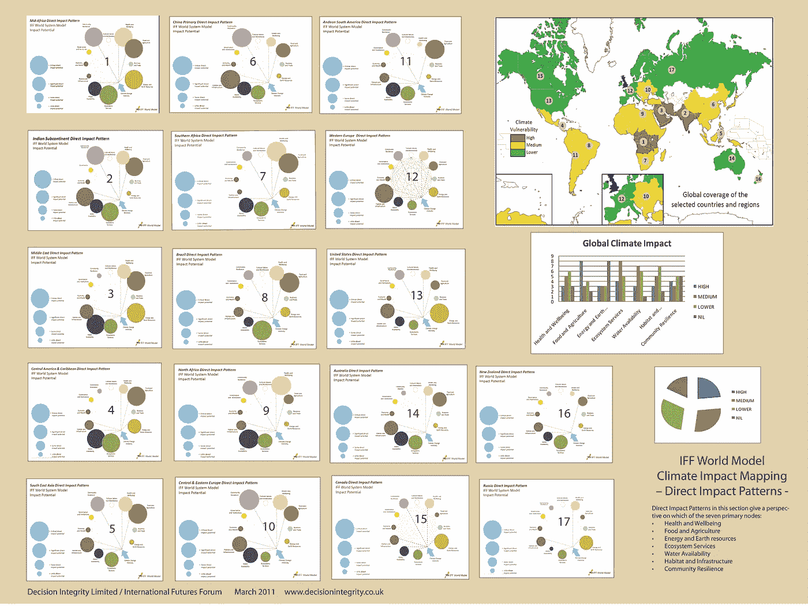
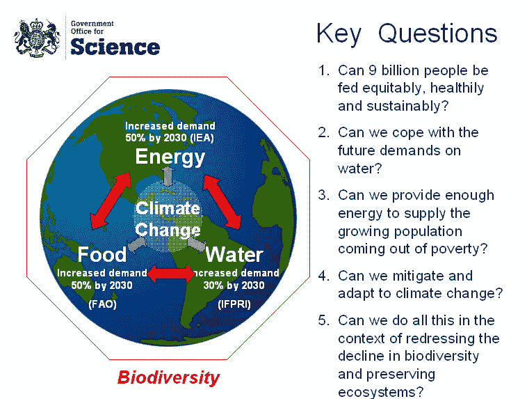
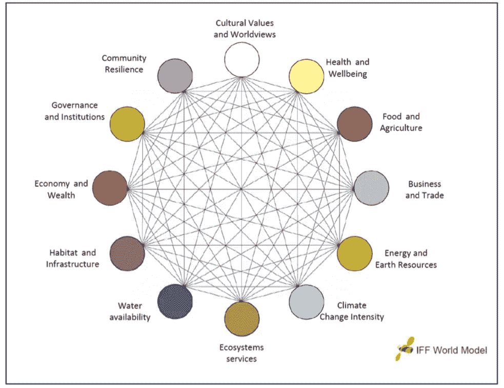
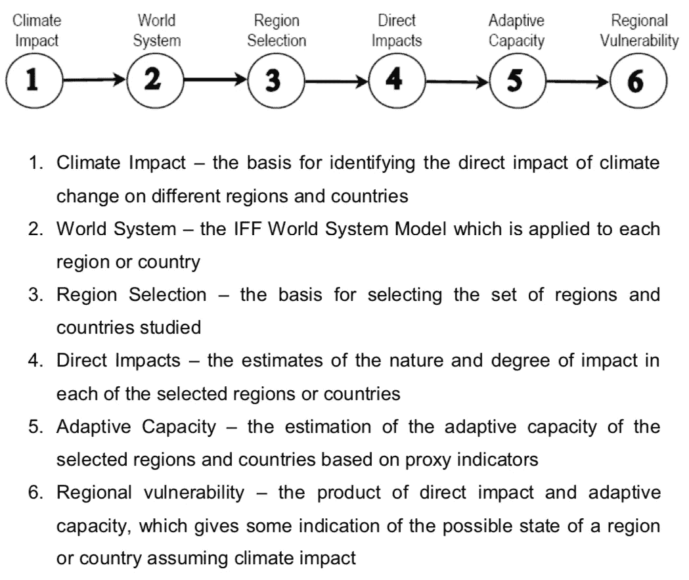

# 为“完美风暴”做准备

> 原文：<https://medium.com/hackernoon/preparing-for-the-perfect-storm-21ae6468003e>

## 世界系统模型应用于绘制气候变化影响脆弱性图，为抗灾能力建设提供信息

Mapping the Impact on the UK of Climate Change Impact in Other Regions of the World ([Hodgson, Leicester, Wahl & Hodson, 201](http://www.decisionintegrity.co.uk/DIL%20Impact%20Profiles%20Poster.pdf)1)

最近，我在一个名为“系统思维生态学”的脸书小组中转贴了一段“设计再生文化”的摘录。这篇文章介绍了世界系统模型和世界游戏，这是我的朋友和导师托尼·霍奇森在国际未来论坛的支持下共同开发的，我很高兴成为该论坛的一员。

你可以在这里阅读摘录“IFF 世界系统模型”。

虽然在过去的三年里，我已经把同一本书的节选贴了几次，但这一次它突然引发了热烈的反响和兴趣。有人问了不同的实际应用，作为回应，我找出了一些托尼和我以及我们的同事格雷厄姆·莱斯特和丽贝卡·霍奇森在 2010 年为英国政府的未来部门“英国前瞻”所做的工作，当时该部门是商业创新和科学部的一部分。

该小组由 John Beddington 教授领导，他在 2009 年尽力提醒政策制定者和议员，在我们试图用现有方法满足这一需求时，气候变化将变得越来越严重，与此同时，日益严重的气候混乱将影响我们满足这些需求的能力，而能源、食品和水资源需求的增加将导致能源、食品和水资源短缺。他称之为“T2 完美风暴 T3”，并预测风暴将在 2030 年重创我们。

Some important questions to ask if we want to avoid the Perfect Storm (Source: Prof. Sir John Bebbington, 2009)

我们正在进行的项目是为复杂的相互关联的因素提供一些视觉系统映射，如果英国想为气候变化对英国的影响的'[国际层面做准备，就必须考虑这些因素。虽然我们被列入报告的贡献者名单，但最终我们使用世界系统模型(WSM)的制图技术没有被采纳或用于该报告。](https://assets.publishing.service.gov.uk/government/uploads/system/uploads/attachment_data/file/287853/11-1042-international-dimensions-of-climate-change.pdf)

在我回应今天的 WSM 应用程序的例子的请求时，我记得托尼在他的网站上有我们写的报告。我自发地认为，这项工作以及我们开发和使用的方法/方法可能会引起许多地方的人们越来越多的兴趣，因为我们都意识到我们必须为剧烈的气候变化影响做好准备——这种影响已经存在，而且在未来几十年内只会恶化。

> “采用系统观点的系统测绘被用作这项工作的基本方法，以解决这一主题明显的复杂性和相互关联性。…特别是，它探索了气候变化影响的非线性本质，以及从生态系统到整个文明系统中常见的̳overshoot 和崩溃的典型系统行为。
> 
> 气候变化的影响在三个主要方面是复杂的:
> 
> 气候变化科学本质上是复杂的，具有高度的不确定性
> 
> 气候变化的影响是一系列社会生态因素的作用，这些因素本身的相互作用也很复杂
> 
> 人类/生态/气候作为一个整体系统在许多方面都是自反的:即接下来发生的事情取决于人类和环境系统的反应。它本质上是一个非线性的复杂适应系统。
> 
> 除此之外，报告讨论了更深层次的复杂互动。它没有关注气候变化对英国的直接影响，而是提出了一个问题:
> 
> 世界其他地方的气候变化会对英国产生什么影响？"
> 
> — [霍奇森，莱斯特，瓦尔&霍奇森，201](http://www.decisionintegrity.co.uk/DIL%20Impact%20of%20Climate%20Impact%20Book%201.pdf) 1

因此，我假设到现在为止，您已经了解了我们必须处理的多层交互不确定性，并以某种方式研究、关联、有意义地集成和可视化表示，以降低复杂性并给出某种形式的仪表板指示。作为我们团队中为这项更大的研究工作的首席气候变化研究员，我热爱这项挑战，并深入研究了当时最新的 IPCC 和其他数据。

我们不得不做出许多假设和猜测，以使这项任务成为我们能够处理的事情:

> “其他国家和地区将自己规划适应、缓解和气候风险管理——有些比其他国家更有效。因此，为了了解气候影响在其他地方的不同影响，对所考虑的每个国家和区域的适应能力或社会复原力进行了评估。这使得能够对世界不同地区易受气候变化影响的脆弱性进行总体衡量；脆弱性是一个国家面临气候风险的程度及其在气候变化影响发生的情况下可能的应对能力的函数。”
> 
> ——[霍奇森，莱斯特，瓦尔&霍奇森，201](http://www.decisionintegrity.co.uk/DIL%20Impact%20of%20Climate%20Impact%20Book%201.pdf) 1

我们决定使用世界系统模型作为绘制复杂性和相互联系的一种方式，同时将相互关联问题的复杂性减少到模型中的 12 个节点，我们之前已经确定这些节点是关键要素，如果我们能够创建一个可行的系统，就必须将其纳入维持生命和再生的关系中。WSM 可以应用于社区、城市、生物区域(我期待着很快做更多的工作)以及国家和全球范围。这在系统术语中被称为递归。

简而言之，我们将全球划分为 17 个区域，考察了气候变化对该区域的预测影响，选择特别关注 WSM 的 8 个节点，考虑了预测的气候影响对这些区域节点的影响，估计(非常粗略地)了区域“适应能力”，并使用该能力和影响研究来提出和估计“区域脆弱性”。然后将这些结果与英国与该地区的文化、历史、政治和贸易关系联系起来，以粗略了解这些地区的气候变化对英国的影响。…所有这些都不是精确的科学，是的！…然而，超级邪恶问题的混乱复杂性对于那些旨在精确或希望保持预测和控制神话的科学来说是相当难以捉摸的。

Source: [Hodgson, Leicester, Wahl & Hodgson, 2010](http://www.decisionintegrity.co.uk/DIL%20Impact%20of%20Climate%20Impact%20Book%201.pdf)

我必须再次更详细地研究我们当时的工作，看看如何利用它来绘制严重依赖国际贸易的生物区域的脆弱性，并利用这种绘制来增加生物区域对未来动荡时期的复原力([持久性、适应能力和转型复原力](/@designforsustainability/what-exactly-are-resilience-and-transformative-resilience-a0783595023f))。

我们在 2010 年为英国远见所做的工作总结在两个相当大的出版物中:

**世界其他地区气候变化对英国影响的研究—** [**第一册:影响的影响**](http://www.decisionintegrity.co.uk/DIL%20Impact%20of%20Climate%20Impact%20Book%201.pdf)

**世界其他地区气候变化对英国影响的研究—** [**第二册:世界故事和更广泛的影响**](http://www.decisionintegrity.co.uk/DIL%20Impact%20of%20Climate%20Impact%20Book%202.pdf)

我将保持这篇文章的简短，因为那些想深入了解的人可以点击提供的链接。

这里是我们提炼出来的一些模式。请持保留意见，因为在一个基于有限预测确定性的有限数据集合成的动态变化系统中，impact of impact 显然具有多层次不确定性的模糊程度，这种不确定性总是可以被质疑，但仍然可能有助于了解气候变化影响的总体模式并明智地应对它们。

**丹尼尔·克里斯蒂安·沃尔**——在面临多重危机时催化变革性创新，就再生整体系统设计、再生领导力以及再生发展和生物区域再生教育提供建议。

如果你喜欢这篇文章，**请鼓掌**，记住如果你非常喜欢，你可以鼓掌**多达 50 次**；-)!

国际知名书籍[设计再生文化](https://www.triarchypress.net/drc.html)的作者