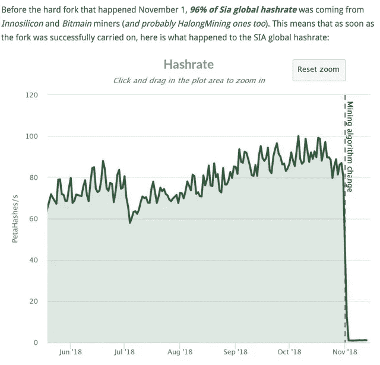
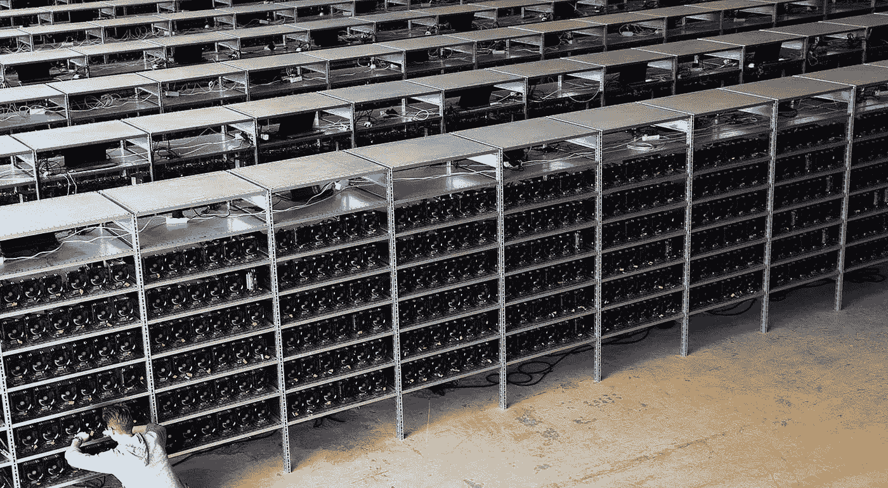

# 随着 ASIC 矿商开始主导 Hashrates，以太坊开发者的压力越来越大

> 原文：<https://medium.com/hackernoon/pressure-mounts-for-ethereum-developers-as-asic-miners-eagerly-await-next-weeks-hardfork-76f558b1d2d>

以太坊定于本月晚些时候推出的 hardfork 可能会产生一些不可逆转的后果。以太坊矿业再也不会像以前一样了——这不是因为利润率下降，也不是因为一些愚蠢的争议来创造以太坊现金。这是一个由几乎整个以太坊社区支持的有计划的事件——除了矿工。我们都知道开采以太坊很快就要结束了；这是以太坊的路线图，以切换到股权共识的证明。尽管以太坊在 PoS 的那一天到来之前仍然可以开采，但是为这个艰难的分叉所做的一些决定将会给以太坊的矿工带来可怕的后果。

# 以太坊在 GPU 矿业中的意义

以太坊过去是(现在仍然是)GPU 挖掘的典型代表。它肩负着加密货币开采的巨大象征性形象。到 2017 年“加密货币狂热”时，比特币采矿已经在那些持有大量强大 ASIC 矿商的控制之下。另一方面，以太坊对我来说非常有利可图——任何人都可以做。从拥有强大 GPU 卡的游戏玩家，到有一些钱进行实验的爱好者，到从宿舍“借用”电力的大学生，当然还有早期采用的企业家，他们向设施投入大量资金，大赚一笔。以太坊采矿不仅对所有受益者具有象征意义，对整个区块链和加密货币行业也是如此:它带来了“采矿”主流的思想和概念。

那些黄金时代早已过去。2018 年对于加密货币投机者来说是残酷的一年，矿工也不例外。NVIDIA 是上个季度标准普尔 500 表现最差的公司，数百个采矿设施已经暂时或永久关闭，数万人已经停止在家采矿。AMD 的 RX 580 去年早些时候的价格几乎是 600 美元，现在不到 150 美元就能买到。在 Craigslist、易贝和 Reddit 等网站上可以找到大量的采矿设备清算。GPU 短缺已经结束，全球游戏玩家欢欣鼓舞，因为价格现已达到正常水平。

往事追忆到此为止，让我们回到现在。

# 君士坦丁堡的哈德福克

当 Casper 实现时，君士坦丁堡的 hardfork 只是以太坊最终切换到股份证明的又一步。本月的 hardfork 将发生在编号为 7，080，000 的区块(预计在不到两周的时间内发生)，并将实施五个 EIP(以太坊改进提案)。

1.  [**EIP 145**](https://eips.ethereum.org/EIPS/eip-145) **由 Alex Beregszaszi 和 pawebylica**提出——简单概括:“以与其他算术运算不相上下的成本提供原生按位移位。”如果你不是开发人员，这个 EIP 对大多数人来说几乎没有影响，所以不要担心这个“简单”的总结对你来说没有意义——我自己也很难理解。
2.  [**EIP 1014**](https://eips.ethereum.org/EIPS/eip-1014) **由 Vitalik Buterin** 提出——简单的总结:“允许交互(实际上或反事实地在通道中)与链上尚不存在的地址进行，但可以依赖于只有可能最终包含由特定的一段 init 代码创建的代码。”同样，如果您不是开发人员，您不必担心这种变化。
3.  [**EIP 1052**](https://eips.ethereum.org/EIPS/eip-1052) **由 Nick Johnson 和 pawebylica**提出——简单总结:“指定一个新的操作码，它返回一个契约代码的 keccak256 hash。”这个 EIP 将允许契约以更便宜、更有效的方式执行字节码检查。
4.  [**EIP 1283**](https://eips.ethereum.org/EIPS/eip-1283) **由汤唯**提出——简单总结:“此次 EIP 提出对 SSTORE 操作码进行净天然气计量变更，启用合同储存的新用途，并在与大多数实施方式不匹配的地方降低过多的天然气成本。”以太坊网络的另一项改进解决了高气体使用量问题，这在宏观层面上非常有益，但与 99.9%的人无关。
5.  [**EIP 1234**](https://eips.ethereum.org/EIPS/eip-1234) **由 Afri Schoedon** 提出——难度炸弹延迟和格挡奖励调整。这个提议是这篇文章的重点——所以让我们开始吧。

# EIP 1234:为什么它可能会在整个 GPU 采矿社区引发涟漪

## 以太坊采矿的现状

取决于你住在哪里和你支付的电费，以太坊对我来说还是有利可图的。然而，对于绝大多数人(即加利福尼亚州的人们支付每千瓦时 0.13 美元至 0.16 美元)，简单地达到收支平衡要么无利可图，要么不值得。

如今，一台装有 8 台 RX 580s 的采矿钻机每周可为你带来约 0.13 ETH 的净收益。按照今天的价格，这大约是 20 美元/周，按照以太坊 1422 美元的历史最高价，这大约是 185 美元/周。巨大的差异。如果有人正在开采以太坊，这个人要么可以获得非常便宜的电力，要么有“霍德勒”式的心态，用现在的损失换取未来的收益。然而，仍然有大量的资源花费在挖掘以太坊上。它仍然保持着最大的散列能力——当然是在比特币之后。这种影响力的很大一部分来自全球各地的小型矿商和采矿设施。

这一切即将改变。

## 难度炸弹延迟

2016 年末，一枚难度炸弹被放置到位，以缓慢然后快速增加采矿难度，从而降低采矿的经济吸引力，因为预计不可避免地会转向股权证明。这个“冰河期”之前已经被推迟了，现在又被推迟了 12 个月，因为以太坊开发商在实施利益证明以及路线图中对网络未来具有重大意义的其他几个项目方面落后于计划。

但是等等，这种延迟对矿工来说不是好事吗？是也不是。它附带了一个最重要的警告，但这个警告在很大程度上被忽视了。奖励调整。

## 整体奖励调整

每当一个方块被开采，发现池将在以太坊获得一个方块奖励。整体薪酬调整并不是什么新鲜事，事实上，它是秘密经济学的一个关键部分。上一次减少发生在 2017 年末，当时区块奖励从 5 ETH 减少到 3 ETH。大约一周后，这一奖励将再次从 3 ETH 减少到 2 ETH——大约每天 150 万美元的奖励。

正如我之前说过的，降低整体薪酬并没有什么不寻常的，而且在经济上是有益的。但在我看来，这种减少发生在最糟糕的时候。

## 减少奖励的危险时机

这种减少不会产生与 2017 年末减少相同的效果。开采以太坊非常有利可图，以太坊的价值一飞冲天。矿工仍然很高兴，投资者也很高兴。然而，在有如此多的矿工在观望是否采矿的时候，33%的奖励减少将绝对积极地动摇他们远离以太坊采矿。保本的矿工将会突然大幅亏损，再次远离以太坊。

但是等等，这不就意味着矿工离网，采矿困难会重新调整吗？是的，但是镇上出现了新的威胁。

## 以太坊 ASIC 矿商的崛起

四个字母“ASIC”可以让这两个项目以及矿工在恐惧或厌恶中颤抖。专用集成电路，或称 ASICs，是专门设计用来执行一项任务的芯片:高效有力地采矿。一旦为算法开发了 ASIC 芯片，通常意味着一件事:GPU 矿工很快就会变得与挖掘硬币无关。我喜欢将小规模的 GPU 矿工比作“夫妻店”，将 ASIC 矿工比作沃尔玛。

这导致了一场持续不断的猫捉老鼠的游戏，在这场游戏中，hardfork 计划采用一种新的功耗算法，而这种新算法又被更新的 ASIC 芯片所利用。另一方面，一些项目欢迎 ASICs，因为新发现的散列能力可以帮助他们的网络更加安全。

Ethereum 的 PoW 算法 Ethash 的 ASIC 矿工终于来了。一些公司已经开始销售，许多其他公司已经宣布更强大和更有效的 Ethash 矿工。以太坊，曾经被认为是 ASIC 矿商的避风港硬币，很快就会看到这些机器涌入市场。

重申一下:随着中小型 GPU 矿工离开网络，很快就会有仓库排列着 ASIC 机器(就像你在比特币纪录片中看到的那样)开采以太坊。

# ProgPOW 的可能后果和案例

由于规模较小的矿商离开网络，而规模较大的“沃尔玛”型企业进入，最终结果将是更加集中化——这是 Vitalik Buterin 强烈反对的。这违背了加密货币的核心基本价值。许多社区成员呼吁临时实施 ProgPOW(计划性工作证明)来应对 Ethash ASIC 矿商的崛起。最终，开发者[认为对于即将到来的分叉](https://github.com/ethereum/pm/issues/66)没有必要。

几天前，在一次核心开发者会议上，也许是在巨大的以太坊采矿社区的压力下，他们就这个问题进行了一次[非常有趣的讨论](https://youtu.be/iSc3TbjZu1k?t=3171)。“Else 先生”指出，目前用于 Ethash 的 ASIC 仅比普通 GPU“略好”——*但*下一代 ASIC 将“比 GPU 好两倍”。他们继续称之为 GPU 制造商和 ASIC 公司之间的“慢军备竞赛”。**最后，我们决定，只要在大量未经测试的算法中没有发现任何关键问题，ProgPOW 将在未来实施。然而，这可能需要几个月的宝贵时间来实现，更不用说物流方面的麻烦和网络举行另一次硬分叉所需的资源了。**

事实是，没有人真正知道中长期的后果是什么。但在我看来，短期后果是相当明显的。数千名矿工离开以太坊将对整个采矿业产生连锁反应。当他们切换到不同的硬币来采矿时，其他 GPU 可采矿硬币的难度率将大幅增加。客观来看，Monero 是市值第二高的 GPU 可挖掘硬币，每天的奖励约为 12 万美元。以太坊的每日奖励将**减少 1.5mil** 美元。简单的经济学告诉我们，这将取代大量的 GPU 矿工，进一步巩固 ASIC 矿工的权力。另一方面，这可能会导致价格飙升，因为供应将减少。但这也可能需要几个月的时间，因为市场将继续与熊市抗争。

# 结束语

如果需要太长时间，ProgPOW 的实现最终可能是一个有争议的问题。3-4 个月的实施时间表是乐观的。该网络也将后退一步，因为 ProgPOW 的确认时间比 Ethash 长 1.5 到 2 倍。相反，在新的 ASIC 矿商开始积累不成比例的以太币之前，应该有尽快实施 PoS 的巨大压力，使 PoS 比一开始就期望的更加集中。似乎 ASICs 最终总是会赢，即使在加密货币领域，“富人变得更富”这句话也肯定是正确的——这在任何意义上都是讽刺的，但并不令人惊讶。

不可否认，巨大的 ASIC 矿池会带来问题，从权力集中到对较弱硬币甚至 51%的攻击。然而，话虽如此，我并不反对 ASIC 矿业或矿商——事实上，我自己也有一些。我们生活在一个资本主义社会，只要有利润可赚，就会有人抓住机会。抛开财务激励不谈，它们实际上在保护大型网络方面提供了巨大的价值。它们还刺激了加密技术的创新，导致了像 Grin 这样的项目，Grin 使用了所谓的抗 ASIC mimble 协议。无论如何，想到对大多数矿工来说，对 GPU 采矿最有影响力的加密货币可能正在接近尾声，这有点令人难过。除非核心开发人员快速行动，否则以太坊将不再被称为 GPU 可开采的硬币。以太坊将成为 ASIC 币。GPU 挖矿再也不会一样了。正如我们所知，以太坊采矿的终结正受到严重威胁；以太坊 GPU 采矿结束的开始很可能就在我们身边。

欢迎在[推特](https://twitter.com/hanyoon)上关注我，或者给[发邮件](mailto:han@lunardigitalassets.com)。