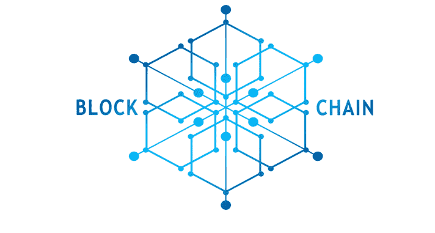

# 区块链技术的琐碎问题

> 原文：<https://medium.com/hackernoon/problems-with-blockchain-technology-d614ea123279>

区块链技术不仅在金融领域，而且在技术领域都已经成为最大的流行语之一。区块链的支持者认为，这项技术将彻底改变金融服务，因为它没有中央权威机构。该技术还以防篡改的方式存储数据，这是该技术的另一个优势。据信，新兴的区块链技术将有利于金融和技术之外的许多行业，特别是那些必须保留大量书面记录的行业，如医疗保健、法律和房地产。

尽管区块链技术有许多好处，但缓慢的交易速度和缺乏标准化也减缓了区块链的发展。一些人甚至认为这项技术被过度宣传了，而且这项技术需要克服区块链的某些问题才能被广泛采用。

**区块链技术的问题**

**缺乏法规**

缺乏监管为用户创造了一个危险的环境，人们也发现密码市场极其不稳定。由于缺乏监管，诈骗和市场操纵在区块链和密码世界变得司空见惯。有数不清的骗局从投资者那里掠夺了数百万美元。即使投资者选择坚持像比特币、以太等既定的货币。人们存放数字资产的钱包或交易所有可能因为他们的不正当行为而被政府黑客攻击或关闭。这些都是缺乏监管的后果。

**性能问题**

区块链就像一个会计账本，不同之处在于它记录了一个巨大网络上的交易，而且它在本质上是分散的，这意味着区块链不需要任何中央机构来监督它。尽管区块链技术的支持者认为这对于跟踪金融交易和其他数据是一个巨大的优势，但这也存在一个问题。根据德勤最近进行的一项研究，权力下放让区块链变得缓慢。一些传统的事务处理系统每秒可以处理数万个事务，而区块链每秒只能处理几个事务。由于复杂性和分布式的性质，区块链上的交易可能需要一段时间来处理。在某些情况下，比特币交易也需要几个小时才能完成。由于区块链的低性能，许多观察者认为区块链不适合大规模应用。

**缺乏标准化**

随着区块链的知名度越来越高，区块链玩家的数量也在飞速增加。由于在区块链技术领域中不存在标准化，因此这些网络将能够彼此交互成为关注的问题。缺乏互操作性给区块链开发人员和编码人员带来了自由，也给 IT 部门带来了问题，因为没有翻译帮助，平台就无法通信。在编码网站 GitHub 上，有超过 6500 个活跃的区块链项目，它们使用不同的平台，采用不同的编码语言、共识机制、协议和隐私措施。区块链行业的标准化可以帮助企业在应用程序开发方面进行协作，共享区块链解决方案，并验证概念证明。

**更高的成本**

对比特币区块链最常见的批评之一是，它依赖于密集的计算能力，这意味着它需要大量的能量来运行。为了保持网络正常运行，矿商们使用大型计算设备，提供多种服务。根据 Elite Fixtures 进行的一项研究，在韩国挖掘一个比特币的成本超过 26，000 美元，我们都知道韩国是世界上最大的加密交易市场之一。尽管比特币矿工的努力获得了报酬，但高昂的成本可能会成为该技术广泛采用的一个问题。

虽然这些问题可能会对区块链技术的广泛渗透构成重大障碍，但开发者正在尽最大努力解决这些问题。区块链技术很可能会在未来几年不断发展。