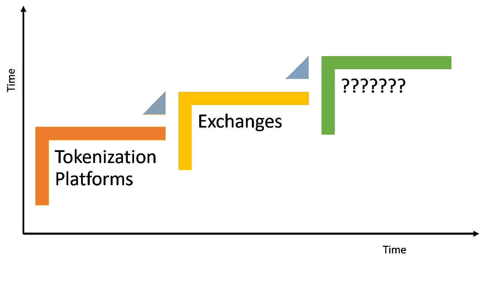
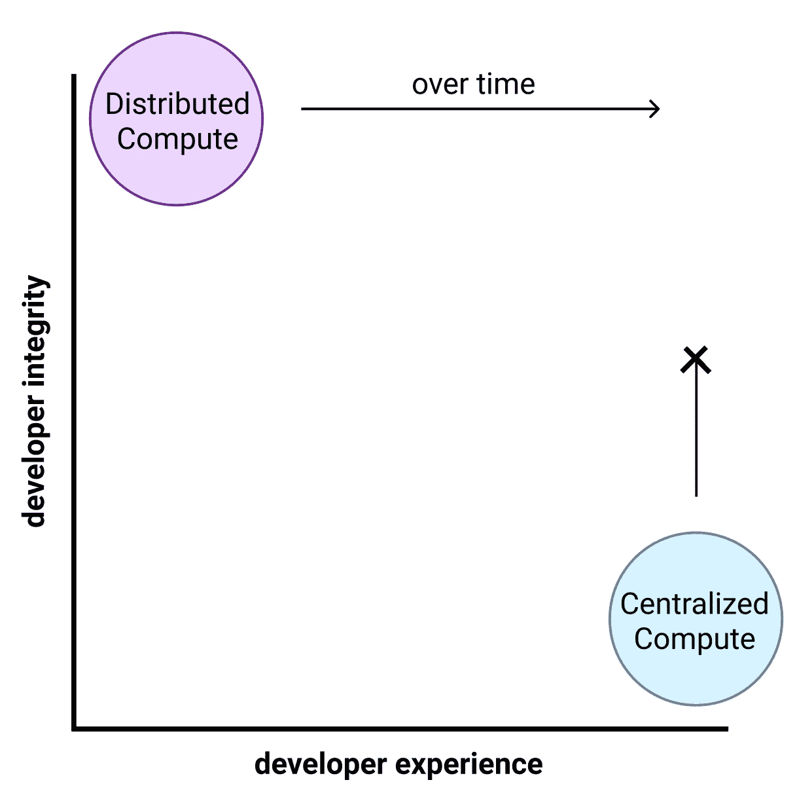
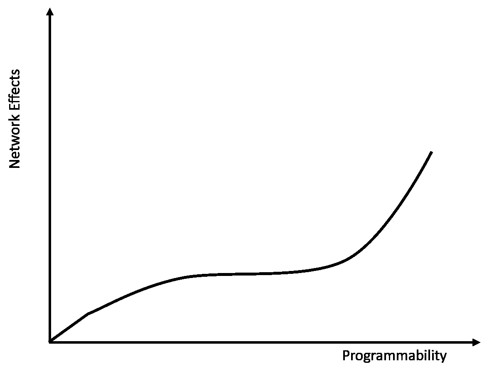

# 安全令牌中的可编程性和产品与网络摩擦

> 原文：<https://medium.com/hackernoon/programmability-and-the-product-vs-network-friction-in-security-tokens-b01f106c88fa>

构建隔离产品与构建网络生态系统之间的困境是安全令牌生态系统中的一个现实摩擦。过去，[我曾详细写过这个想法](https://hackernoon.com/platforms-vs-networks-decentralization-vectors-in-security-tokens-ae0a97212922),但最近我在这个领域发现了一些涉及可编程性主题的新想法。我想探讨的基本论点与安全令牌中的可编程性和去中心化之间的关系有关。更具体地说，我相信*“如果可编程性成为加密证券的一种相关能力，这个空间将不可避免地被更分散的网络模型所吸引”*(对于那里的纯粹主义者，请注意我使用了更分散和非分散的术语😉 ).

可编程性是安全令牌中最终的去中心化载体的想法源于三个基本前提:

I .安全代币中的当前价值分布模型被打破，并且不可持续地创建有意义的生态系统。

二。需要网络效应来将安全令牌的价值主张扩展到相关的金融工具中。

三。可编程性是安全令牌网络效果的最终实现者。

让我们更详细地探讨这些想法。我们可以从理解在当前的安全令牌市场浪潮中价值是如何不被信任开始。

# 安全令牌中的价值累积模型

安全令牌生态系统的当前 DNA 是基于孤立的发行平台和少数支持这些资产交易的市场。在这种动态中，金融价值最初由代币发行平台积累，并最终转移到市场中。安全令牌协议从根本上依赖于集中的参与方而不是分散的网络，这一事实间接意味着，从长远来看，协议中没有积累任何价值。因此，价值创造模式在交易所结束，不会渗透到生态系统的其他部分。当然，矿工和以太坊网络的其他基础设施元素可能最终受益于安全令牌传输，但这与我们所寻求的效果相反。在一个强大的技术生态系统中，价值应该沿着不同抽象层次的链条向上波动，而不是向下波动到基础设施层次。

为什么这是一件大事？嗯，一个价值主要由两个要素积累的生态系统相当脆弱，不太可能创造长期价值。

# 产品与网络摩擦

网络效应是扩大安全令牌生态系统价值分布的显而易见的答案。然而，在一个完全基于孤立产品的市场中，创造网络效应几乎是不可能的。一个没有网络效应的生态系统在很大程度上容易受到能够完全改变价值链的现有者的攻击。过去，我概述了安全令牌市场集中化的四个基本风险:

**碎片化风险:**从技术角度来看，构建加密证券相对简单，这意味着我们可能会看到许多代币发行平台在特定的司法管辖区和行业中发挥作用。如果没有一个供这些参与者互操作的网络，安全令牌生态系统可能会变得越来越分散，以至于变得不太有用。

**领导者影响力风险:**在集中式安全令牌模型中，与生态系统的其余部分相比，一些早期市场领导者可以实现不对称的影响力水平。在这种情况下，这些公司可以决定推动市场向有利于他们的方向发展的规则。

**鲸鱼风险:**短期内安全令牌平台有多成功并不重要，它不太可能与高盛、富达或摩根大通相提并论。在一个集中的生态系统中，只需要一家大型金融机构进入这个领域，就能成为主导市场的力量，并从本质上回到我们试图摆脱的混乱局面。

没有分叉的风险:分叉是丑陋的，但却是有助于加强加密网络平衡的因素之一。集中式安全令牌模型可防止任何分叉机制，使其易受市场领导者的影响。

如果我们认为安全令牌市场需要网络效应，那么我们需要从孤立产品到网络模型的某种程度的过渡。这种观点可能并不新鲜，但至少在我的案例中，它缺少了一个关键要素。

# 有缺陷的安全令牌广义挖掘理论

之前已经讨论过创建实体网络生态系统的想法，如验证者、数据提供者或其他参与安全令牌传输的角色。所有这些想法都源于广义挖掘的概念，这一概念旨在将加密网络中的价值创造从基础设施挖掘者扩展到为交易的不同方面做出贡献的特定领域知识工作者。

广义挖掘的想法在概念上可能有意义，但我认为在应用于安全令牌时存在根本缺陷。乍一看，广义挖掘理论中主要缺失的论点是，安全令牌生态系统缺乏激励模型来促进网络参与者的创造。如果没有可转移的价值单位，至少在原则上很难想象一个繁荣的网络生态系统。然而，我们应该考虑到，科技行业充满了具有巨大网络效应但没有有形激励机制的平台。有没有可能在没有基础货币的情况下为安全令牌创建一个可行的网络模型？那个问题把我们带到了我论文的最后一点。

# 可编程性是最终的去中心化元素

我坚信可编程性是安全令牌对金融生态系统最重要的贡献，但我从未在网络效应的背景下思考过这个问题。这个想法是在阅读了联合广场风险投资公司(USV)最近的一篇文章后形成的，这篇文章解释了分布式计算模型的发展。在 USV 的论文中，技术生态系统最初由集中的提供商主导，直到开发者体验改善到开发者网络效应接管的程度。

将类似的推理应用于安全令牌空间，我们可以认为，随着加密证券变得更加可编程，它们将影响更多 DApps 的创建，这反过来将自然地在生态系统中创建网络效应。更具体地说，在安全令牌模型中整合我们之前讨论的所有元素(如验证器、监管器、法律实体)需要可接受的可编程性水平。

网络效应对于安全令牌行业的长期生存是必要的。我相信可编程性是将有意义的网络模型引入加密证券的关键因素。虽然集中式模型正在推动安全令牌的第一波创新，但可编程性很可能会将钟摆转向更加分散的基于网络的模型。