# 渐进式网络应用(PWAs) FTW — Pt。2

> 原文：<https://medium.com/hackernoon/progressive-web-apps-pwas-ftw-pt-2-31c2779e55c4>

## 介绍

在本系列的第 1 部分中，我们了解了什么是渐进式网络应用，并讨论了它们如何改善移动网络中的用户体验。这些文章基于我在[黑白棋峰会](https://summit2018.reversim.com/session/5b1041fd892ac30014816955.html)上的演讲。如果你喜欢看视频，你可以在这里看到它:

让我们从上次停止的地方继续，深入研究 Web Workers。网络工作者是实现 PWAs 的核心技术。

## 网络工作者

如果你以前对 [Javascript](https://hackernoon.com/tagged/javascript) 有所了解，你可能会注意到它是单线程的。如果您在客户端进行任何昂贵的计算，这是显而易见的。在这些情况下，在运行计算的脚本完成之前，页面会变得没有响应。一个 web 工作者来解决我们所有的 Javascript 在主线程上运行的问题。web worker 是在后台运行的 JS，独立于脚本，不影响页面的性能。

## 服务人员

服务工作者是网络工作者的一种。这意味着它是一个独立于主浏览器线程运行的 Javascript 文件。服务工作者是事件驱动的，是利用所有先进的 web 应用技术的基础。

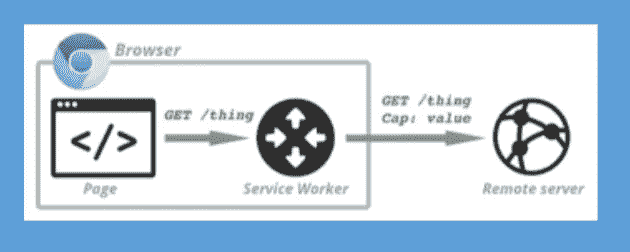

## 我们能为服务人员做些什么？

*   服务人员可以作为可编程的网络代理。这就是为什么它只能在 https 上工作(否则中间人攻击将非常容易！).
*   服务人员有一个可预测的生命周期。如果你曾经使用过 React、原生 Android 甚至 Chrome 扩展，那就非常相似。我们将监听浏览器或应用程序触发的特定事件。
*   服务人员还将允许我们以编程方式控制缓存管理。
*   还有更多！

## 服务人员生命周期

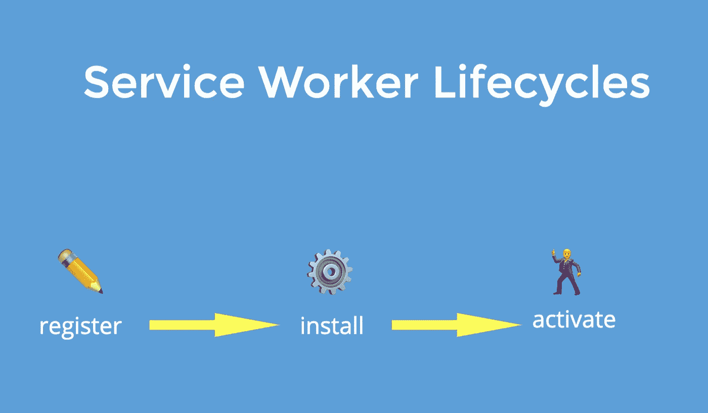

重要的事情先来。在监听服务工作者事件之前，我们必须注册我们的服务工作者。这很简单。我们只是检查当前的浏览器是否支持服务人员，如果支持，我们就注册我们的服务人员文件。

现在我们已经注册了我们的服务工作者，我们可以设置事件监听器。注册后触发的第一个事件是 *install 事件。*

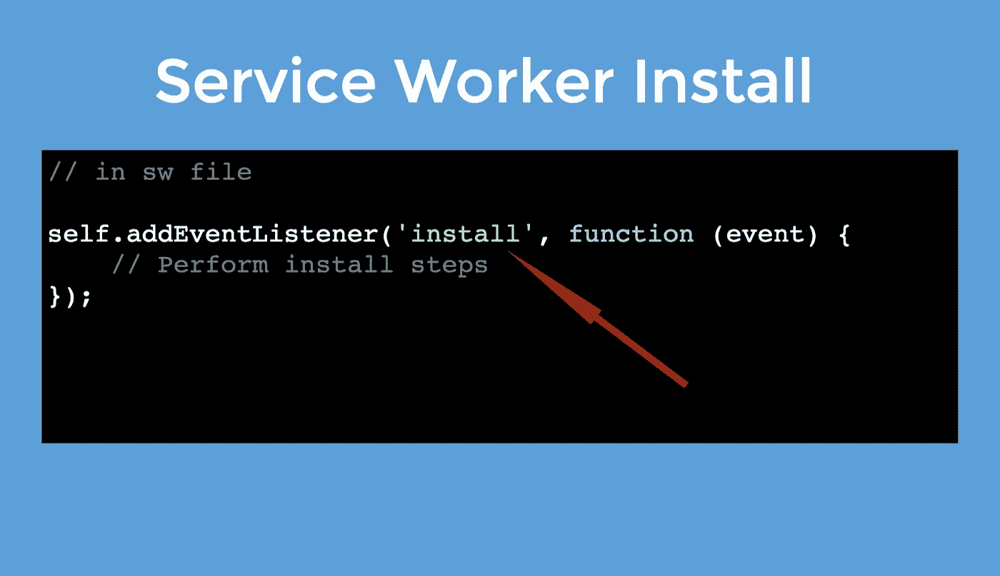

最后，我们可以监听激活事件。

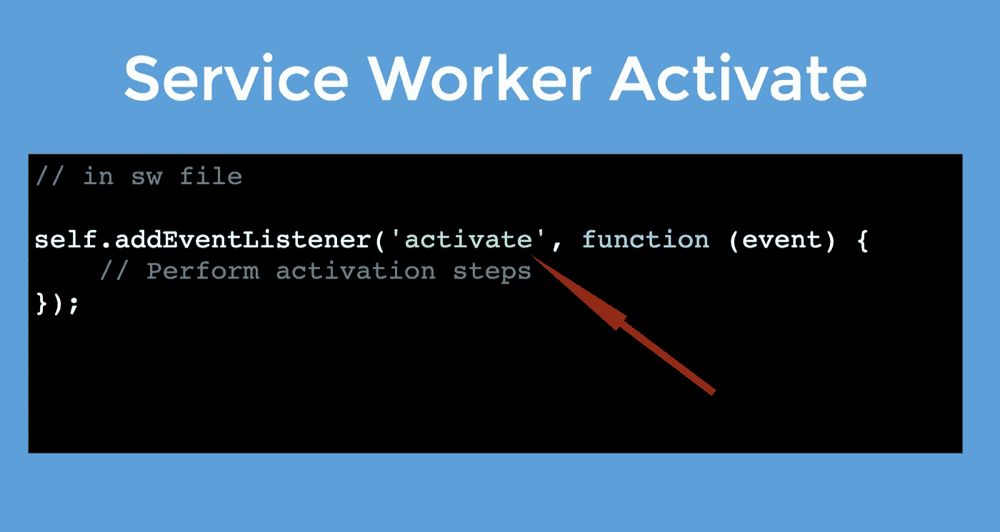

我们已经看到了如何监听这些生命周期事件。随着我们的深入，我们将看看如何利用每个事件来注入我们自己的定制逻辑。让我们用我们的第一个端到端例子来把它付诸实践。

## 我们的第一个服务人员

让我们实现一个简单的服务工作者。我们将包括我们的服务人员文件，注册并记录基本事件的触发。

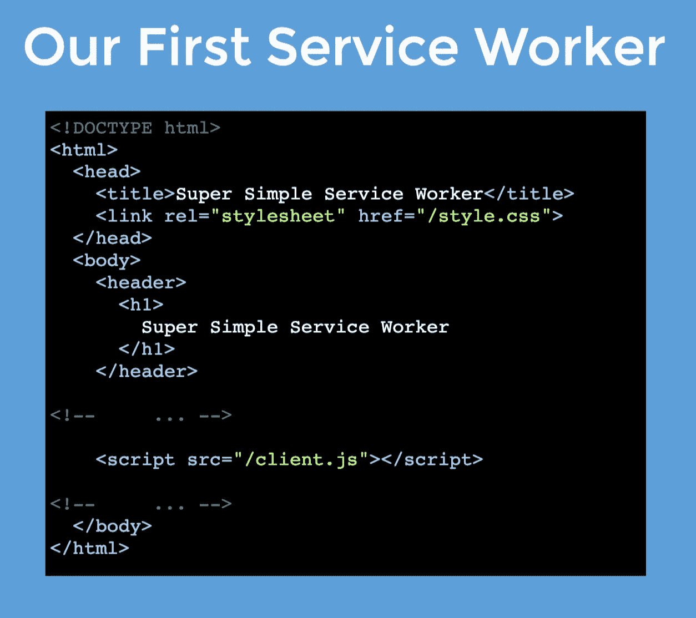

在我们的主 JS 文件中，我们检查是否支持服务工作者。如果是，让我们注册，然后记录注册尝试的结果。

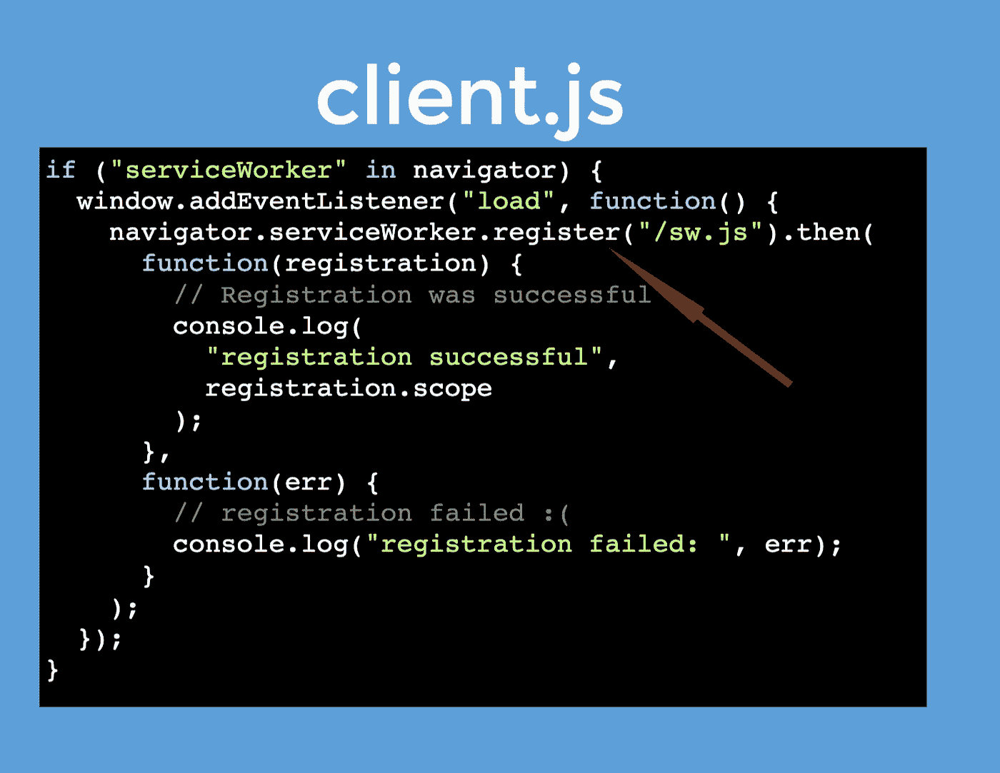

现在，让我们看看我们的基本服务人员日志。

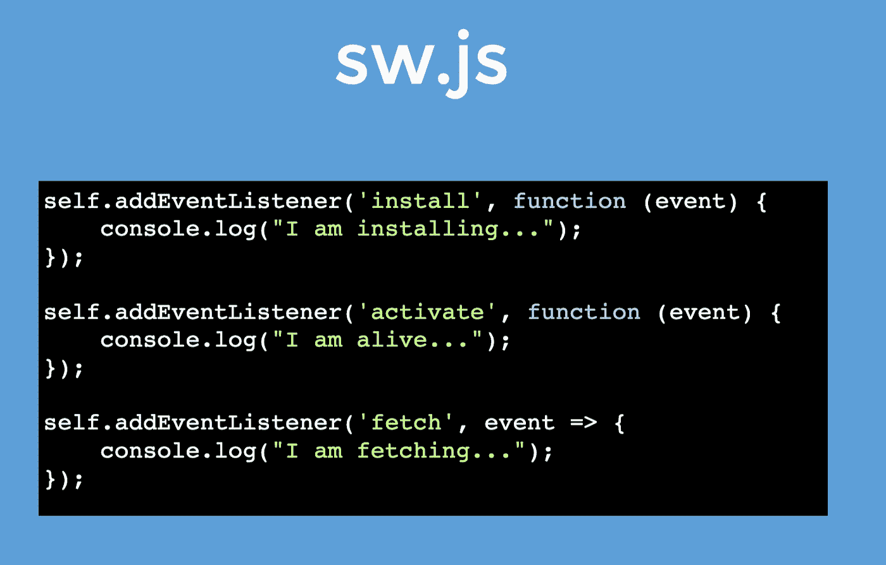

最后，我们可以验证服务工作者事件是否按预期触发！

## 拦截网络请求

服务人员可以用来拦截任何网络请求。我们现在可以观看 JS，CSS，HTML 和 XHR 请求！让我们熟悉一下 API。我们将简单地监听浏览器触发的 *fetch* 事件。

作为参数提供给回调的事件对象有几个属性，使我们能够容易地检测每个传出获取请求的来源和方法。

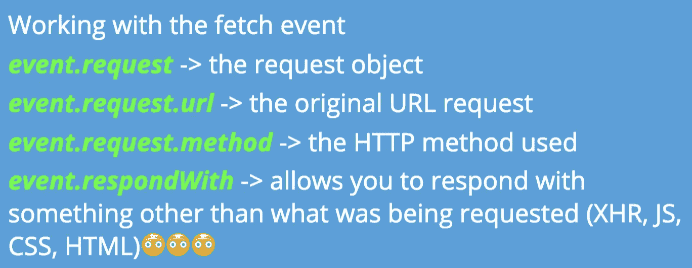

婴儿第一步！对于每个传出的获取请求，让我们返回静态 HTML。

在了解缓存 API 之后，我们将再次讨论拦截[网络](https://hackernoon.com/tagged/network)请求的能力。

## 缓存 API

缓存 API 允许我们通过注册的服务工作者以编程方式控制浏览器缓存。我们可以存储和检索网络请求和相应的响应。想象以下情况:

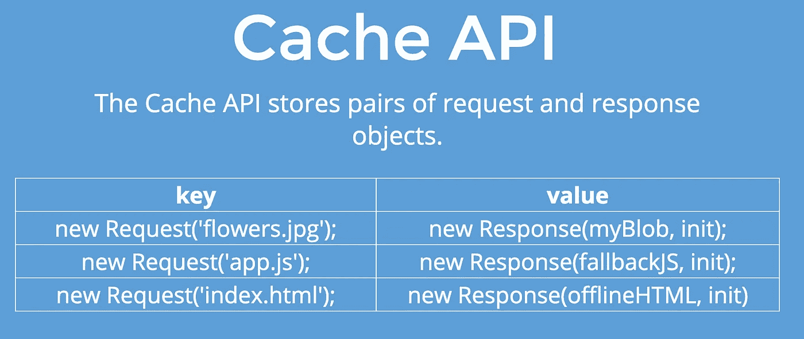

因此，我们可以在服务工作器中为 web 应用程序发出的请求设置字典。如果我们有应该缓存的数据，或者如果我们想减少网络流量，这正是这样做的地方:)让我们看一些代码。

*waitUntil* 方法告诉浏览器不要杀死服务工作者，直到我们的代码块执行完毕。本质上，我们将这段代码定义为关键代码。最后，我们用 put 方法写入浏览器缓存。这将更新缓存字典中的现有键，或者创建一个新键(如果它尚不存在)。

## 缓存策略

缓存 API 引入了许多有趣的选项，用于以编程方式控制浏览器缓存。我们来看看吧！

**仅缓存**

对于每个传出的网络请求，我们将尝试从缓存映射中做出响应。如果我们没有适当的回应，那就没运气了:/

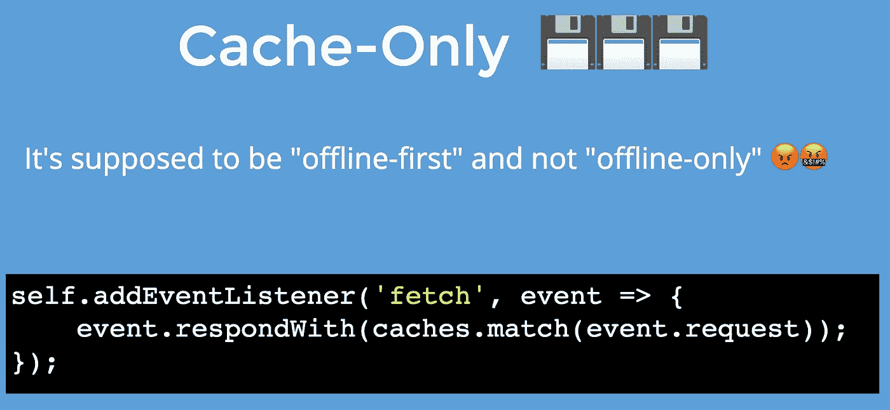

**仅网络**

对于每个传出的获取请求，我们将忽略缓存并将其转发到网络。这正是我们不缓存任何东西时会发生的情况。

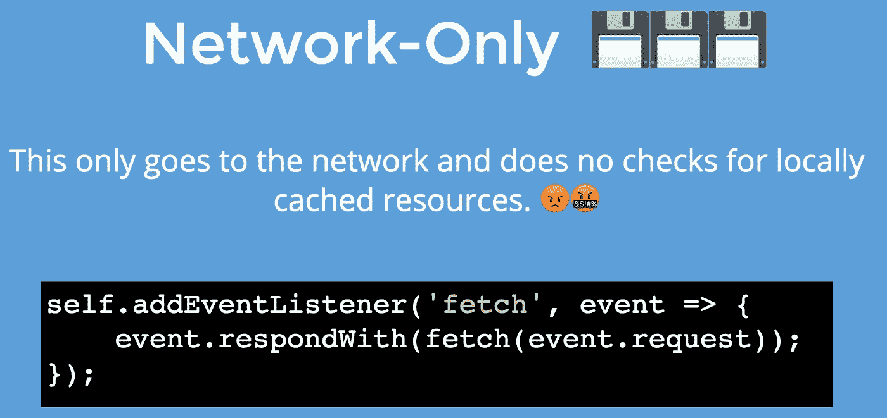

尽管这不是最佳的！我们可以做得更好！

**混合缓存策略**

我们来看看**带网络备份策略的缓存。**对于每个传出的获取请求，我们检查以确保响应是否已经存在于我们的缓存映射中。如果是的话，我们就退回去。否则，我们继续发出获取请求。当我们偏爱陈旧数据时，这种方法是首选。例如，对于不经常更新的静态资源。

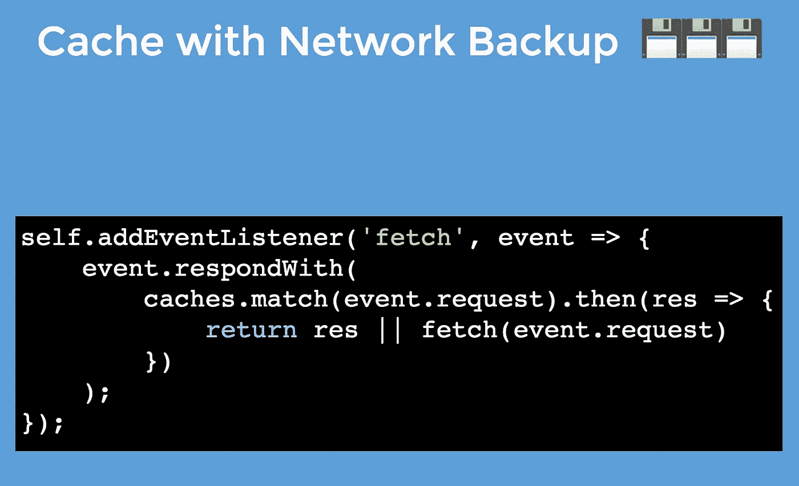

现在让我们来看一看**具有缓存备份的网络。对于给定的请求，我们尝试发出网络请求。如果由于任何原因失败，我们会尝试从缓存中提供响应。当我们偏向于新数据时，这种方法是首选的。**

**缓存 API —处理 404 张图片**

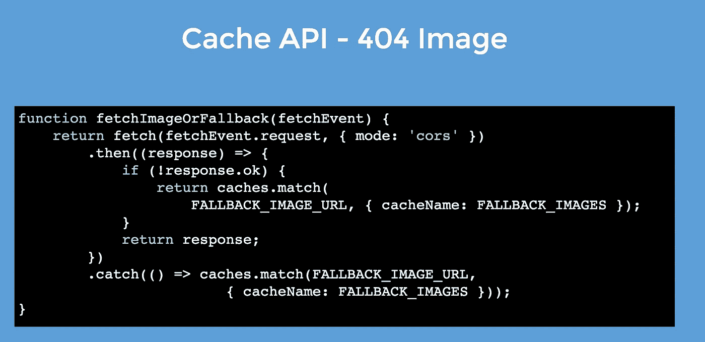

## 网页推送

**什么是网页推送？**

网络推送是向用户浏览器发送推送通知的能力。这是一件大事！以前，这只能通过移动应用程序实现！所有主流浏览器都支持网络推送。

web 推送是如何工作的？

所有主流浏览器都有云推送服务。这意味着有了适当的许可，我们的服务器可以向他们的推送服务发出请求，向我们的用户浏览器发送通知。关于这个更深入的解释，请查看上面的会议视频。这里只做最基本的。

**获取网页推送权限**

相当简单！

**向推送管理器订阅推送通知**

从我们的 client.js 文件(不是我们的服务人员)来看，它看起来像这样:

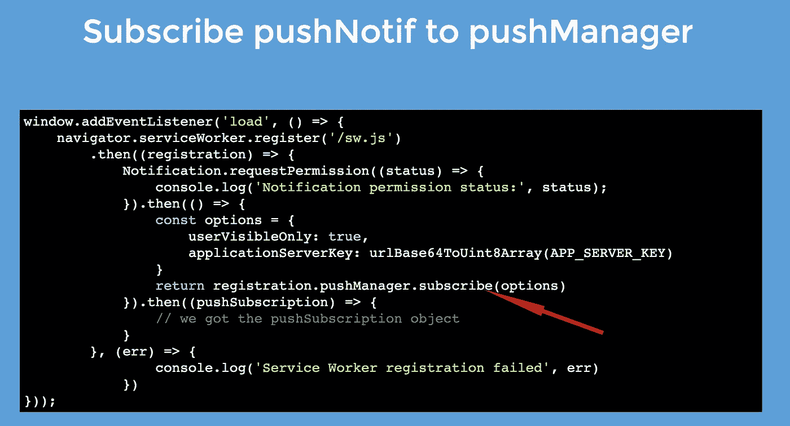

**如何处理来自浏览器推送服务的客户端推送事件**

我们简单地监听客户端上的**推送事件**，如下所示:

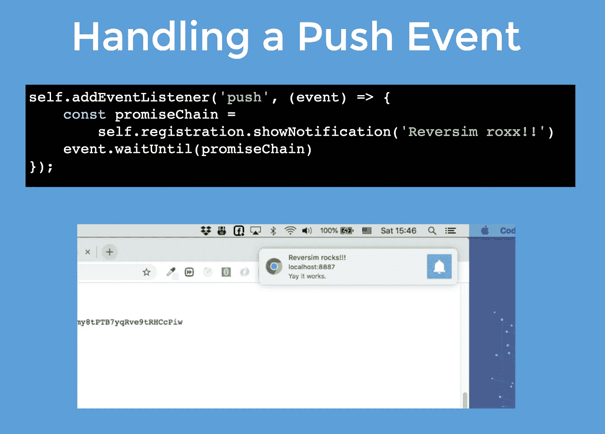

## 结论

在本系列的第 1 部分和第 2 部分中，我们已经看到了 PWAs 的威力。我们仅仅触及了表面，但是我希望您在离开时能够理解这是多么简单和强大。

## 如果这篇文章有帮助，请订阅并点击鼓掌👏按钮以示支持！⬇⬇

你可以在 [Instagram](https://www.instagram.com/omeragoldberg/) 、 [Linkedin](https://www.linkedin.com/in/omer-goldberg-680b40100/) 和 [Medium](/@omergoldberg) 上关注我，了解更多科技相关内容！