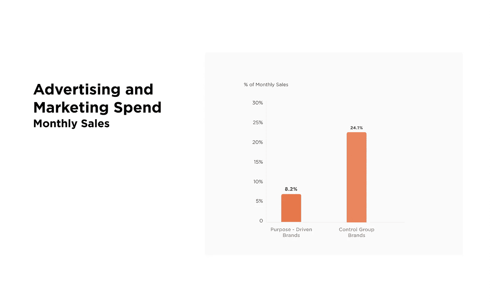

# 以目标为导向的品牌获得了 3 倍的投资回报

> 原文：<https://medium.com/hackernoon/purpose-driven-brands-see-a-3x-return-on-investment-43bb6f3e2bae>

[阅读更多我们的博客文章](https://brex.com/blog/purpose)

随着电子商务的扩张，以目的为导向的品牌正在激增，并越来越受消费者欢迎。埃森哲最近在[进行的一项研究](http://accenture.com/brandpurpose)强调，63%的消费者更愿意从一个品牌购买能引起他们共鸣的产品。目的驱动型品牌被定义为那些在他们的交流和广告工作中始终坚持“为什么”的品牌。

虽然目的驱动、可持续、有机和其他类似术语之间的区别并不总是很清楚，但判断一个品牌是否是目的驱动的一个简单方法是，它将利他或其他非商业目标放在网站的显著位置。目的驱动可以表现为特定的使命或一致的(而非一次性的促销)承诺，将收益、商品或服务捐赠给与购买相关的特定事业。

Brex 分析了使用其信用卡的电子商务企业，并将它们分为两类——那些在其主要网站上突出非商业目的的企业和那些没有这样做的企业。第一组是目的驱动型品牌，平均每月花费 8%的广告和营销费用，如在线广告、平面广告和户外广告。第二组，那些没有在网站上突出特定目的的人，花费了 3 倍多，平均每月销售额的 24%用于广告和营销。

虽然相关性不一定等于因果关系，但广告中的显著差异确实表明，目的驱动型品牌为突出其品牌目的所做的努力获得了可观的投资回报。这方面的潜在驱动力可能是增强的口碑、推荐和媒体——每一种都是客户增长的主要免费途径——取代付费营销渠道。

有趣的是，目的驱动型品牌在电子商务的所有领域都很常见。根据 Brex 的数据，最受欢迎的三种目的驱动型电子商务品牌是食品和饮料，其次是配饰和家居家具。有趣的是，宠物护理是最少的目的驱动品牌之一，尽管人们经常与他们的宠物保持高度的情感依恋。

[阅读更多我们的博客文章](http://Read more of our blog posts here: https://brex.com/blog/purpose)