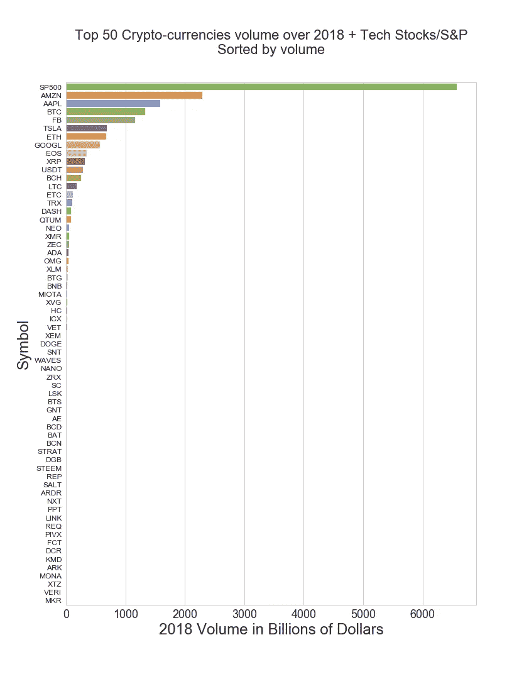
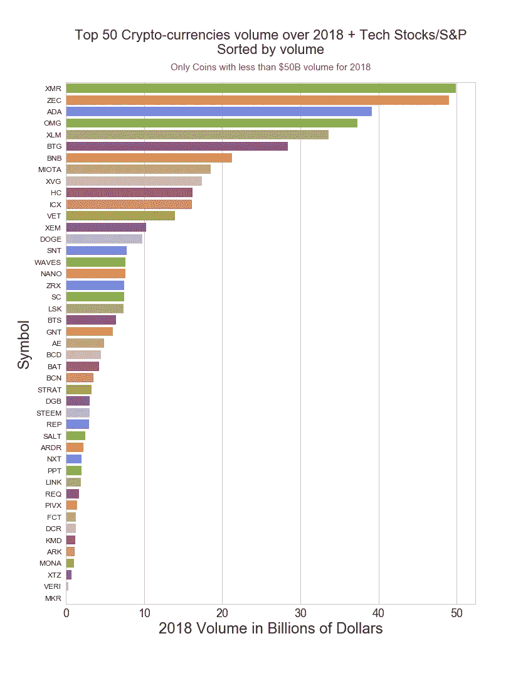
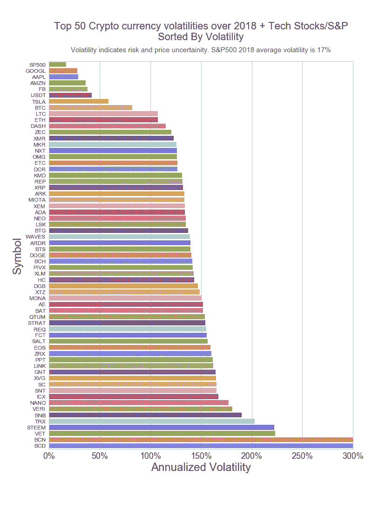

# 用 4 张图定量分析 2018 年加密货币市场

> 原文：<https://medium.com/hackernoon/quantitative-look-at-the-2018-cryptocurrency-market-in-4-graphs-918ff073efda>

## 此外，与股票市场相比

既然 2018 年已经结束，我决定从华尔街经常在大多数投资组合和投资决策中考虑的 4 个重要投资角度客观地看待加密货币市场:

1.  年度绩效
2.  交易量(流动性指标)
3.  波动性(不确定性和风险的指标)
4.  比特币相关性(加密市场是多样化的吗？)

为了让事情变得有趣，我还添加了 S&P(使用间谍 ETF)和 5 只科技股(亚马逊、特斯拉、谷歌、苹果、脸书)，为投资不同资产类别的投资者和好奇的非加密投资者提供了一个独特的整体画面。

这四个方面对于理解投资者在个人和机构层面的成功至关重要。以下见解为希望在未来进入加密市场的小型和大型参与者提供了更严格的理解。

我决定只看市值最高的 50 枚硬币。即使是前 50 名硬币，交易量也下降得很快，这对任何认真的投资者来说都是一个公平的表现。

这些见解的所有数据都来自我在 https://stockquanta.com 建立的一个新的量化绩效搜索引擎的后端。

# 1.2018 年业绩

所有人都知道 2018 年很糟糕。在排名靠前的加密公司中，BNB 的跌幅最小(约为-34%)。对于加密市场来说，这令人印象深刻。BTC 下跌了-73%，这实际上与其长期波动性相关！(见下文)。一些硬币像盐几乎失去了所有的价值！请注意，兽医是一个异常现象，因为他们在这一年的硬币互换。

回想起来，S&P 下跌了 4.6%。亚马逊和特斯拉表现不错。脸书的跌幅很大，为-26%。但它仍然领先于 BNB。最差的加密性能和最差的股票市场性能之间仍然存在差距(对于顶级资产，忽略低容量硬币)。这主要归因于加密市场仍在努力解决的各种市场动态和公平价格发现问题(IMO 认为这是采用和现实世界使用的一个函数)导致的该领域的高波动性。随着后者的改善，这一差距应该会缩小。

# 2.2018 年以美元计的交易量

2018 年 BTC 的交易额约为 1.3 万亿美元！间谍交易量(标准普尔 500 交易的主要 ETF)为 6.5 万亿美元。它们在同一数量级内具有可比性，这本身就令人印象深刻。

SPY、亚马逊和苹果:2018 年的销量都高于 BTC。

以太坊的交易额相当于特斯拉和谷歌的 6700 亿美元！

另一件要注意的事情是，即使是前 50 名硬币的交易量也下降得非常快！顶级硬币之一 XMR (Monero)的 2018 年交易量为 490 亿美元，约占比特币交易量的 4%。与股票市场相比，这是加密货币市场的一个主要问题，在股票市场中，投资者的兴趣在硬币之间高度倾斜。下面的另一张图更清楚地显示了较小硬币的体积。

出于流动性原因，只有少数硬币能够吸引更高的机构兴趣。但如果收养挑战能在 2019 年得到解决，这种情况可能会在未来发生变化。

**体积较小的硬币按体积计算【2018 年 500 万美元。**

# 3.2018 回报波动

什么是波动性？简而言之，它表明了一年后回报的不确定性。回报越不确定，投资的风险就越大。这和失去不一样。一些东西可能会以可预测的方式损失大量资金，因此仍然具有低波动性。

下图显示了所有加密货币以及科技股的波动性。

SPY 2018 年波动率为 17%。这高于其 11-12%左右的长期平均水平。比特币的波动率为 82%。令人惊讶的是，这与它在 2018 年损失的价值相差不远。年度波动率往往是一个相当好的指标，表明实际上表现会有多大变化。

与加密货币相比，这里显示的所有股票都具有较低的波动性。特斯拉的波动率为 59%(3.5 倍 S&P！)，对于一只大盘股来说是相当高的。但是它比 BTC 低得多。

当我们看其他硬币时，波动性急剧上升。例如，NANO 的波动率为 177%,这与其动荡的一年相符。是的，波动性可以超过 100%，事实上，对于几乎所有的加密货币来说，波动性都非常普遍，这表明了交易它们所涉及的性能不确定性的数量。BCD 的 2018 年波动率为 1244%！(BCD 是比特币钻石)

# 4.2018 相关性和多元化

最后，我们来看一个经常被谈论的谣言:密码市场都向 BTC 转移，而且彼此转移。这可以通过相关性的度量来近似。很简单，它衡量的是投资之间的相互关系。100%的相关性意味着它们在所有的日子里都是一致的，0%的相关性意味着它们是完全独立的。低相关性、良好的业绩和低波动性的组合对于多样化很重要！

这里我们展示了前 50 名硬币的图表以及它们与 BTC 的相关性。几乎所有与 BTC 的隐关联都大于 50%。这相当高，并不令人惊讶。LTC 的相关性为 85%(！)，最高。ETH 紧随其后，这表明在你的投资组合中同时拥有 BTC 和 ETH 在实践中并没有分散多少投资，尽管如果你的长期观点不同且强烈，它可能仍然有意义。

另一个有趣的事实是，S&P 与 BTC 的相关性很低，只有 6%。所有其他股票的相关性甚至更低，除了谷歌，其相关性几乎为 8%。总体结论是，加密市场在 2018 年确实独立于股票市场，如果加密性能和风险在中长期具有吸引力，它们可能成为股票以外的良好多元化资产。

# 结束语:关于分权、价格稳定和公平价值的思考

无论如何，这都不是对加密市场(以及科技股和 S&P)的完整看法。但是这四个方面(性能、交易量、波动性和相关性)对所有想了解加密市场的加密和非加密投资者来说都很重要。虽然加密货币的分散性经常被强调为金融稳定和独立的前兆，但在实践中，波动性和从众心理(如相关性所示)对于较大的投资者来说仍然非常极端，难以负责任地介入。需要发生一些具体的事情来解决这些问题，但这是另一篇文章的主题！

简而言之，关键是要有一个客观的“公允价值”机制，超越共识驱动的价格决定方法。密码市场对去中心化的极度依赖既是福也是祸，至少在短期内是如此。

**关于作者**

Ashish Gupta 是前谷歌和华尔街数据科学家。他为 AdWords 的转换优化建立了机器学习模型，并为股票期权的算法交易编写了系统。他目前正在创建 https://stockquanta.com 的[(T3)和 http://coinquanta.com 的](https://stockquanta.com)[(T5)，目标是找到具有上述量化洞察的优秀趋势投资。可以在 ash@stockquanta.com 找到他，也可以打电报到尼鲁勒兹找他。](http://coinquanta.com,)