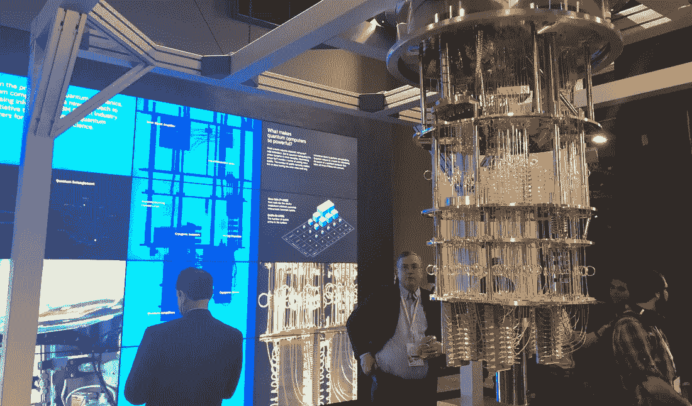
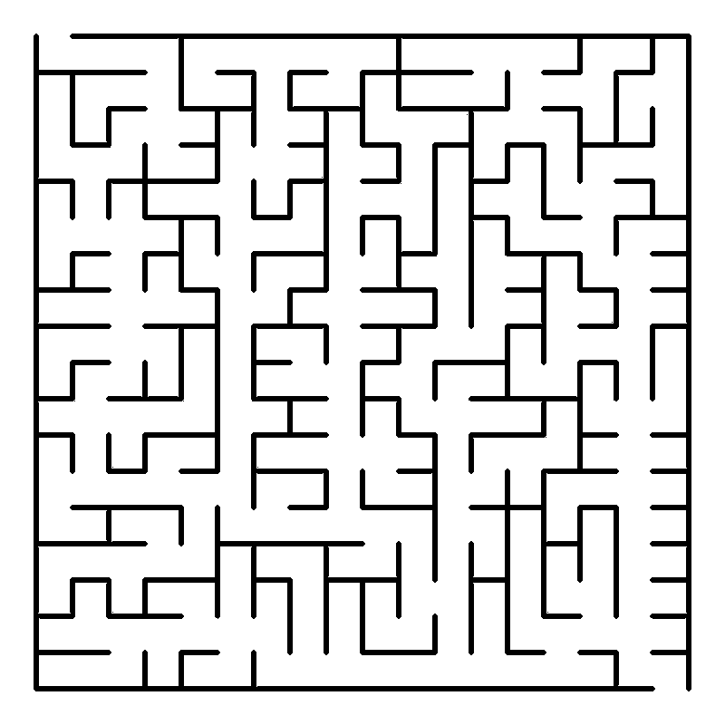

# 量子计算解释了

> 原文：<https://medium.com/hackernoon/quantum-computing-explained-94125280fabb>

# 介绍

计算的进步需要合适的硬件。虽然随着时间的推移，计算机变得越来越小，功能越来越强，但普通计算机(也称为经典计算机)的能力是有限的。

量子计算机是为解决指数缩放问题而构建的新一代计算机(例如，为一个经典计算机无法分析的存在太多可能性的问题找到最优解)。

# 经典计算机背景

经典计算机有许多组件(包括主存储器、算术单元、控制单元和其他)。它们通过这些组件来表示、处理和控制数据。计算机芯片包含模块，模块包含逻辑门，逻辑门又包含晶体管。

计算机模块是电路板上电子电路的集合。逻辑门是计算机内部的微型计算机。它们查看两位，并将其中一位作为输出推出。他们的工作是读取任何输入，以产生一个输出。晶体管是一个开关，允许或拒绝信息通过它。逻辑门的组合形成了允许计算机基本功能的模块。如果我们把晶体管想象成一个电开关，当开关打开时，电就从一个地方转移到另一个地方。如果开关关闭，电子就会被阻挡。

计算机部件越来越小。今天晶体管的典型尺寸是 14 纳米，比一个红细胞小 500 倍。随着这些晶体管尺寸的减小，电子可以移动到被阻挡通道的另一侧，导致它根本没有被阻挡。这个过程被称为‘量子隧道’，它正在减缓我们的技术进步。

我们的计算机基于二进制系统(也称为以 2 为基数的数字系统)，它使用 0 和 1 作为位。从“二进制单位”衍生而来的一个比特，是计算机的信息单位，它保存 0 或 1 的值。例如，64 位计算机一次可以处理 64 个二进制数。

这些位的组合用于表示更复杂的数据和操作。逻辑门执行布尔函数，产生单个二进制输出。布尔逻辑是代数的一个分支，用于创建真假语句。由于经典计算机以二进制运算，它们的逻辑用布尔术语表示。计算机使用 AND、OR 和 NOT 等运算符来表示值，并返回 true 或 false 输出。例如，如果你有 x 和 y 的值和逻辑表达式状态 x 和 y，如果两个都为真，计算机将返回真，而如果它说 x 或 y，如果至少一个*为真，它将返回真。*

一个简单的编程示例(不包括编程语言)是:

x = 2，y = 4

x 和 y 大于 1:这将返回 true。

x 或 y 大于 2:这也将返回 true，因为 y 大于 2。

在经典计算机中，一个真的语句可以(例如)返回值 1，而一个假的语句可以返回值 0。这构成了经典计算的基础:虽然大多数计算需要不止一个简单的对/错语句，但经典计算机是这些二进制语句的大量组合。从点击鼠标到打开浏览器，一切都基于此。

# 什么是量子计算机

对于经典计算机解决的某些问题，你可能只需要很少的逻辑门。然而，如果你想找到一个极大的数字的因子，这将需要大量的逻辑门(经典计算机不会有)。

量子位被称为量子位，是一种能够同时保持两种不同状态的计算机位，这意味着它可以同时保持 0 和 1 的位置。常规位在特定时间只能保存两者之一。

一个量子位可以是任何两能级的量子系统——一个自旋和一个磁场，或者是一个单光子(代表光量子的粒子)。这个系统的可能状态是 0 和 1。在量子领域内，量子位元可以同时处于两种状态的任何比例；这种现象叫做叠加。

叠加可以让量子计算机分析出远比经典计算机更多的可能性。一旦你通过一个过滤器来测试光子的值，它需要决定垂直或水平偏振。您无法预测它将决定位置 0 还是 1。当处于叠加态时，光子同时处于 0 和 1 的某种组合中。然而，一旦你测量了它的值，它就折叠成一个已定义的状态。

An exhibit of an IBM quantum computer.

# 数例

想出 4 个可以开或关的位。这样的系统将有 2⁴(所以，16)种可能的组合。在传统设置中，您只能使用其中一种。然而，量子位可以同时容纳所有这 16 种组合。这个数字随着每增加一个量子位而呈指数增长。

# 纠缠

量子位可以保持“纠缠”的属性，量子位之间的紧密联系使它们能够立即对另一个状态的变化做出反应，无论它们相距多远。因此，在测量一个纠缠的量子比特时，你可以直接推断出它的伴侣的性质，而不必测试它。

# 量子比特操纵

由于传统的逻辑门接收一组简单的输入，它产生一个确定的输出。量子门操纵叠加态的输入，旋转概率，最终产生一个确定的状态作为它的输出。为了分解这些步骤，量子计算机:

1.  设置量子位
2.  应用量子比特门来纠缠它们并操纵概率
3.  测量结果，将量子位元压缩成一个定义好的状态:0 和 1 的序列。这意味着不再有叠加。

这样，设置中的所有计算都在完全相同的时间完成。

# 简单概述

量子计算机的本质力量在于你可以同时考虑许多状态。为了让它工作，它的算法必须能够产生可读的最终状态(所以，你最终读出的信息不能有叠加)。这意味着量子计算机需要更复杂的算法设计才能发挥作用。

# 量子计算机有效的地方

量子计算机很可能不会取代我们的家用电脑。然而，它们在数据搜索等领域更胜一筹。为了在数据库中找到某样东西，经典计算机必须测试它的每一个条目。一台量子计算机会用那个时间的平方根得出同样的答案。

量子计算机可以挑战现有的 IT 安全措施。目前，数据受到不同加密级别的保护。在这种情况下，您可以给每个人一个公钥来编码只有您可以解码的消息。虽然从技术上讲，通过在经典计算机上反复试验，这个公钥可以用来计算您的秘密私钥，但这将花费太长时间，不值得任何人花费时间。具有指数级更高速度的量子计算机将能够更快地完成它。

# 量子计算机工作原理的两种概念性解释

***例一***

你有一个 10 人的晚宴。你需要想办法让每个人都入座。有 10 个！= 3，628，800 种方法(其中“10！”读作“十阶乘”,代表 10 x 9 x 8 x…x 1。一台经典的计算机将不得不单独经历 360 万种方式中的每一种，然后比较它们以找出最佳的优化。

量子计算机将会:

1.  取量子位，进入所有可能状态和配置的叠加
2.  当这个问题被编码到量子计算机中时，编码器对每个状态应用一个相位。当各路同相时，振幅相加。当它们异相时，振幅相消。这是一个类似于噪音消除耳机的想法，它产生噪音来消除外部噪音。
3.  你用干涉来放大一些答案，同时消除其他答案，最终接近一个答案。

***例 2***

这里我们有一个迷宫。想象你在它的中心，想从两个出口中的任何一个出去。你可以开始探索每一条道路，一个接一个。经过大量的尝试，你最终会走出迷宫。

现在，想象你有几个自己的克隆体。每个人都可以开始探索不同的方法，其中一个克隆人会直接找到正确的出路。你和你的克隆人同时探索所有不同的道路，这意味着你们在同一时间都在不同的地方。你处于叠加态，就像一个量子比特。这可以让你快速找到可能的最佳解决方案。

这些简化的概念性例子有助于解释为什么量子计算机(当被创造出来的时候)在解决大型复杂问题时会有巨大的帮助。

—

[沙恩雷](http://www.shaanray.com)

关注 [Lansaar Research](https://medium.com/lansaar) on Medium，了解最新的新兴技术和新的商业模式。

延伸阅读:

1.  [量子计算将如何影响区块链技术](/blockstreethq/https-medium-com-shaanray-how-quantum-computing-will-impact-blockchain-technology-f69e4a3af25e)
2.  区块链面临的量子威胁:肖尔的&格罗弗的算法