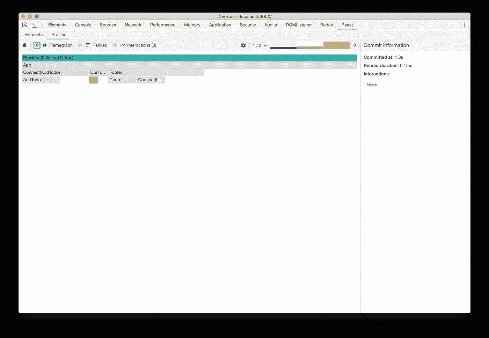

# 反应性能底漆

> 原文：<https://medium.com/hackernoon/react-performance-primer-64fe623c4821>


Photo by [Denisse Leon](https://unsplash.com/@denisseleon?utm_source=medium&utm_medium=referral) on [Unsplash](https://unsplash.com?utm_source=medium&utm_medium=referral)

在过去的几个月里，我使用了一个非常大的 React 和 Redux 应用程序，这个应用程序是由一个大约 20 人的团队积极开发的，他们的经验各不相同。

工作分配的主要形式是将人分配到屏幕上。我不太喜欢这种方法，因为这会导致代码重复和同一代码库中的混合实践(最好将屏幕分解成组件，让人们实现组件)。

这种工作分配，加上大量的需求、延迟和匆忙发布，导致了一些糟糕的性能场景。

在这篇文章中，我将介绍一些与 React 性能相关的常见问题，以及如何评估和解决这些问题。

# 压型

即使一些性能问题可以简单地通过视觉测试来发现，你也应该始终剖析你的应用程序，以真正知道问题出在哪里。有可能你会发现并非所有事情都如你所料。

> 被测量的被管理——彼得·德鲁克

分析 web 应用程序的最佳解决方案是使用任何浏览器的开发工具。您不仅可以调试您的应用程序并使用观察表达式来了解值是如何随时间变化的，而且在 Profiler 选项卡中也有强大的功能。

谷歌有几个[指南](https://developers.google.com/web/tools/chrome-devtools/evaluate-performance/)，教你如何使用 Chrome profiler 工具来分析你的应用程序的运行时。


Chrome Developer Tools (v71.0)

除了浏览器分析器之外，React DevTools 除了已经拥有的惊人特性之外，最近还推出了 [React 分析器](https://reactjs.org/blog/2018/09/10/introducing-the-react-profiler.html)。

React profiler 将让您深入了解 React 应用程序的运行时。您可以单独检查每个更新对 DOM 的提交，并找出触发了哪些交互，以及每个组件渲染需要多长时间。

它还将兼容即将推出的 React 功能，如悬念。查看 [React 文档](https://reactjs.org/blog/2018/09/10/introducing-the-react-profiler.html)了解更多信息。



React Profiler (v16.7.0)

除了剖析之外，你可以使用 React DevTools 的*高亮更新*选项或者 [DomListener](https://github.com/kdzwinel/DOMListenerExtension) 扩展来找出你的应用程序的哪些部分正在被更新以响应某些交互。您可能会发现，有些部分只是因为耦合而被意外更新

**注意:**记住 React DevTools 的*高亮更新*选项会让你知道每次[虚拟 Dom 被更新](https://reactjs.org/docs/optimizing-performance.html#avoid-reconciliation)，而 DomListener 扩展只会显示 React 提交给 DOM 的内容。

# 防止不必要的重新渲染

React 有不同的[生命周期方法](https://reactjs.org/docs/react-component.html)，可以让你在特定的时间挂接逻辑，比如组件挂载或更新的时候。其中一个方法是[*shouldcomponentdupdate*](https://reactjs.org/docs/react-component.html#shouldcomponentupdate)*，它让你编写一些逻辑来决定组件是否应该重新渲染。*

**

*React Lifecycle Methods Diagram, courtesy of [Dan Abramov](https://twitter.com/dan_abramov)*

*注意:此图表可能会有所更改，您应该可以在此处找到最新版本[。](http://projects.wojtekmaj.pl/react-lifecycle-methods-diagram/)*

*每次组件收到新的道具或改变其状态时，都会调用 *shouldComponentUpdate* 方法，这是优化 React 应用性能的主要方法之一。*

**shouldComponentUpdate* 接收组件的下一个状态和属性，我们可以用它来与组件的当前状态进行比较，然后返回一个*布尔值*来决定我们是否要重新渲染。*

```
*class ProfileSection extends React.Component {
  shouldComponentUpdate(nextProps, nextState) {    
    return this.props.id !== nextProps.id && nextState.visible;
  } render() {
    // ...  
  }
}*
```

## *PureComponent & React.memo*

*React 团队确定，在大多数情况下，人们只是简单地比较道具或状态是否发生了变化，以触发重新渲染。这就是为什么他们创造了 React 的[*PureComponen*](https://reactjs.org/docs/react-api.html#reactpurecomponent)*t .**

```
*import React, {PureComponent} from 'react';class ProfileSection extends PureComponent {     
  render() {
    // will only happen if props and state are different
    //...
  }
}*
```

*最近，React 团队发布了[*React . memo*](https://reactjs.org/docs/react-api.html#reactmemo)*，*，这意味着您不再需要为了利用这一功能而将功能组件重构为类组件。*

```
*import React, {memo} from 'react';const ProfileSection = props => (
  // ...
);export default memo(ProfileSection);*
```

**PureComponent* 和 *React.memo* 使用默认的 *shouldComponentUpdate* 方法，该方法执行道具的*浅层*比较(和状态，在 *PureComponent* 的情况下)。这里的关键词是 *shallow* 因为如果我们不牢记这一点，有很多方法可以打破这种优化。*

*确保不破坏优化的一个好方法是尽可能使用基本类型作为道具和状态。这是因为当我们比较非原始类型时，如*数组*或*对象*，我们不是遍历对象和比较值(这将是深度比较，而不是浅层比较)，而是比较引用。*

*这意味着如果在组件更新路径的某个地方我们创建了一个新的*对象*或*数组*，它们将成为状态的一部分或作为道具传递，那么我们就触发了不必要的重新渲染。*

***重要提示**:人们认为如果他们把所有组件的*都变成纯组件*，那么他们会立即优化他们的应用程序。情况并非总是如此，瑞安·弗洛伦斯写了原因。TL；DR 是，当我们使用 *PureComponent* 时，我们会产生额外的差异成本。React 已经执行了一个元素 diff 来确定组件树中发生了什么变化。通过使用 *PureComponent* 我们还执行了不同的状态和道具，当某个组件大量重新渲染时(意味着它总是获得新的道具/改变状态)，这可能是昂贵的。如果你的组件更新很多，它可能不会从成为一个纯组件中受益。请在过早优化之前进行基准测试。*

# *绑定功能*

*每当我们使用 React 时，我们都需要将事件处理程序绑定到组件，否则我们将失去它们执行的上下文，这意味着我们不能从事件处理程序中调用诸如 *setState* 之类的方法(这是很常见的)。如果你想了解更多关于为什么我们需要绑定函数的信息，请查看[和](https://medium.freecodecamp.org/this-is-why-we-need-to-bind-event-handlers-in-class-components-in-react-f7ea1a6f93eb)。*

## *构造函数与箭头函数中的绑定*

*随着 [ES2015](https://babeljs.io/docs/en/learn/) 的发布，我们现在能够使用箭头功能。箭头函数的行为类似于普通函数，只是它们保留了周围的上下文。这意味着它们将保持对词法`this`的相同引用，而不是创建一个新的引用(因为常规的 Javascript 函数创建了一个新的上下文)。*

*这意味着如果我们使用类函数，我们需要在构造函数中显式地绑定它们*

```
*class Button extends React.Component {
  constructor(props) {
    super(props);
    this.handleClick = this.handleClick.bind(this); // explicit bind
  }

  handleClick() {
    console.log(this.props);
  }

  render() {
    return (
      <button onClick={this.handleClick}>
        Click Me
      </button>
    );
  }
}*
```

*或者利用箭头函数作为类属性*

```
*class Button extends React.Component {
  handleClick = () => {
    console.log(this.props);
  }

  render() {
    return (
      <button onClick={this.handleClick}>
        Click Me
      </button>
    );
  }
}*
```

*大多数人更喜欢后者，因为它消除了大多数时候编写构造函数的需要(特别是因为有了现代特性，我们可以编写`state = {}`，这是拥有构造函数的另一个常见需求)，而且它还有更简洁的语法。*

*然而，它们之间是有区别的。常规函数被添加到组件的*原型*中，而箭头函数成为实例属性。了解其中的区别很重要，因为如果你有一个创建了成百上千次的组件，那么每个实例都有自己的方法，而不是重用原型链中的方法。*

*这可能是也可能不是一个问题，同样，你不会知道，直到你测量它。阅读更多[此处](/@charpeni/arrow-functions-in-class-properties-might-not-be-as-great-as-we-think-3b3551c440b1)了解两者之间的区别以及周围生态系统的更多细微差别。*

## *在`rendering`时避免绑定/内联*

*在某些情况下，render 中的绑定函数可能是无害的，但对于其他情况，它可能会导致不希望的副作用*

```
*class Button extends React.Component {
  handleClick() {
    console.log(this.props);
  }

  render() {
    return (
      <button onClick={this.handleClick.bind(this)}>
        Click Me
      </button>
    );
  }
}*
```

*当我们内联函数时，也会发生同样的情况*

```
*function Button() {
  return (
    <button onClick={() => console.log(this.props)}>
      Click Me
    </button>
  );
}*
```

*要知道 Javascript 中的两个函数永远不会相等，即使它们的主体是相等的(如果使用`toString`函数进行比较，可以检查它们是否具有相同的主体)。*

*这意味着，如果您在渲染中执行某种内联或绑定，您总是会触发重新渲染。现在，这对于简单的组件(可能)是好的，但是在一个有很深的子树的组件中，这可能是一个问题。如果接收函数的组件是一个 *PureComponent* ，那就更糟了。这将触发每次重新渲染，因为组件总是收到一个新的道具，有效地导致更差的性能，因为它每次都会检查道具是否不同，而且它们总是不同的。*

# *没有使用(正确的)钥匙*

*这是一个非常基本的规则，但我认为它需要特别提及，因为我发现了很多这样的规则*

```
**// eslint-disable-line react/no-array-index-key**
```

*React 在呈现列表[时需要一个`key`道具，以便它知道哪些元素被添加、删除或更改了](https://reactjs.org/docs/lists-and-keys.html#keys)。这提高了列表的呈现性能，因为如果在缺少键的情况下发生了变化，React 将重新呈现整个列表，您可以想象在呈现一个大列表时所承受的代价。*

*使用索引作为键也是一个不好的做法，因为这样你的列表就变得依赖于元素的顺序，如果你试图对列表进行排序或者添加新元素，就会导致错误。这不是一个直接的性能瓶颈，但是可能会有不良的副作用，尤其是当列表元素的顺序不一致时。*

*在构建通用组件时，很容易依赖索引，因为您不知道组件将接收的数据。在这些场景中，组件 API 可以/应该接受一个属性，该属性标识可以用作`key`的字段，该字段应该是唯一的标识符(例如，电子邮件、用户名)。*

*查看来自 [Robin Pokorny](/@robinpokorny) 的以下示例，查看这个问题的实际应用*

*[](https://jsbin.com/wohima/edit?output) [## JS Bin

### 适用于 HTML、CSS 和 JavaScript 以及一系列处理器的实时 pastebin，包括 SCSS、CoffeeScript、Jade 等等...

jsbin.com](https://jsbin.com/wohima/edit?output) 

Photo by [Sandro Katalina](https://unsplash.com/@sandrokatalina?utm_source=medium&utm_medium=referral) on [Unsplash](https://unsplash.com?utm_source=medium&utm_medium=referral)

# 去抖动和节流

好的 UX 有时要求我们分析用户的每一次击键。一个常见的用例是根据某个规则集验证表单字段，或者在自动完成的输入字段中呈现一个过滤列表。

在这些情况下，去抖动或节流就派上了用场，因为我们可以避免触发一个特定动作太多次。如果我们的自动完成字段为了根据用户所写的内容获得新的建议而发出了一个昂贵的请求，我们不想发送垃圾请求。我们可能希望等待一段时间，每隔几毫秒或者当用户停止输入时才执行一次请求。

了解节流和去抖之间的区别也很重要。

节流延迟了函数执行的次数。将指定时间间隔内的呼叫次数减少到一次。`throttle(func, 500)`只会每隔 500 毫秒执行一次`func`。

去抖有点棘手。一旦去抖动功能停止被调用，去抖动功能将在指定时间后触发原始功能。

如果我们声明了下面的`const debounced = debounce(func, 200)`，我们将只在`debounced`的最后一次调用已经过去 200ms 时调用`func`。这在我们想要对某个事件作出响应，但只是在交互停止之后，是很有用的。一个常见的用例是通知分组。不是发送 5 个通知，应用程序会等待一段时间，直到通知流结束，通知用户他有新的 X 个通知。

有了这些技术，我们可以用相对较少的努力来维护应用程序的性能和响应能力。100 毫秒左右的响应时间让应用程序的响应速度[感觉很快](https://www.nngroup.com/articles/response-times-3-important-limits/)，这意味着任何更快的速度都不会对用户体验产生具体影响。这意味着我们可以在大约 100 毫秒内实现去抖/节流功能，应用程序将保持快速响应的感觉。

此外，大多数去抖和节流的实现都有一个*前导*选项，这意味着您可以立即触发原始函数并节流/去抖后续调用。这可以应用到自动完成的例子中，在这个例子中，我们希望在用户开始输入以显示一些结果时就发出一个请求。

最后，请确保不要去抖或抑制您的 change 事件处理程序，否则您可能会失去对事件对象的访问。正如[丹·阿布拉莫夫建议的](https://github.com/facebook/react/issues/1360#issuecomment-333969294)，根据用户输入抑制/去抖你需要执行的额外工作，但保持改变处理器同步，以免损害用户体验。

如果你对实现感兴趣，lodash 的[节流](https://github.com/lodash/lodash/blob/master/throttle.js)和[去抖](https://github.com/lodash/lodash/blob/master/debounce.js)源是一个常见的参考。此外，如果你想查看关于如何在 React 中去抖和节流自动完成字段的解释，请查看由 [Peter Bengtsson](https://www.peterbe.com/plog/how-to-throttle-and-debounce-an-autocomplete-input-in-react) 撰写的[这篇文章](https://www.peterbe.com/plog/how-to-throttle-and-debounce-an-autocomplete-input-in-react)。

# 拆分大组件

组件驱动的开发促进了封装和单一责任，但是如果你在构建时没有考虑规模或者你受到期限的压力，这很容易被忽略。我使用的最后一个代码库的组件是真正的怪物(1000 多行代码)。将屏幕直接连接到你的商店(我们的是 Redux ),你就有了一个性能灾难的配方。

每当接收到新的道具或组件的状态发生变化时，React 都会重新渲染组件。这意味着频繁更新的组件应该被封装，这样它们的更新就不会导致其他组件不必要的渲染。

这在将组件连接到应用程序的存储时也很重要。您不需要将所有的 Redux 逻辑( *connect，mapState/DispatchToProps* )连接在一个地方。

以下代码是对 [redux 的 todos 示例](https://github.com/reduxjs/redux/tree/master/examples/todos)的修改。我们有一个组件来呈现待办事项列表并显示可能的过滤器(*活动*、*已完成*、*全部*)。这是一个非常基本的例子，说明了为什么我们应该按照组件的职责来划分组件，因为每次我们添加一个新的待办事项或将待办事项的状态更改为活动/完成时，我们不仅会重新呈现待办事项列表，还会重新呈现下面的过滤器。

简单地重构并将过滤器移动到它们自己的组件(原始示例中的 *Footer* )将会阻止这个组件在我们每次修改 todo 列表时重新呈现。

```
const TodoScreen = ({ *todos*, *toggleTodo* }) => (
  <div>
    <ul>
      {todos.map(*todo* =>
        <Todo
          *key*={todo.id}
          {...todo}
          *onClick*={() => toggleTodo(todo.id)}
        />
      )}
    </ul>
    {*/* The code below should be moved to its own Component */*}
    <div>
      <span>Show: </span>
      <FilterLink *filter*={VisibilityFilters.SHOW_ALL}>
        All
      </FilterLink>
      <FilterLink *filter*={VisibilityFilters.SHOW_ACTIVE}>
        Active
      </FilterLink>
      <FilterLink *filter*={VisibilityFilters.SHOW_COMPLETED}>
        Completed
      </FilterLink>
    </div>
  </div>
);
```

Ohans Emmanuel 写了一篇关于这个(和其他)问题的[详细文章](/@ohansemmanuel/how-to-eliminate-react-performance-issues-a16a250c0f27)。

# 延迟加载和代码分割

延迟加载的概念是只在你需要的时候初始化对象(或者等同物)，而不是在程序启动的时候才初始化(急切加载)。

延迟加载的一个常见用例是任何类型的提要。提要(比如你在新闻和社交媒体网站上找到的那些)实际上没有尽头，因此没有停止加载数据的点。您可以使用分页，也可以在用户滚动页面时延迟加载更多数据。通过避免一次加载大量数据，你可以保持应用程序的交互性和高性能。

React 组件中只有一小部分会加载数据，而且只有一小部分会从延迟加载方法中受益。web 应用程序中更常见的场景是为应用程序的不同部分加载不同的模块，这被称为代码分割。

通过使用动态导入语句，代码分割在大多数 Javascript 模块捆绑器中是普遍可用的(示例取自 [React 文档](https://reactjs.org/docs/code-splitting.html)

```
import("./math").then(math => {
  console.log(math.add(16, 26));
});
```

这让捆绑器知道它应该为数学模块*创建一个单独的文件，您现在可以延迟加载它。这提高了性能，因为在第一次打开应用程序时，您将下载较小的包，而不是加载一个大的 Javascript 包。*

通过使用新的 *React.lazy* API，我们可以在需要的时候延迟加载组件(示例摘自 [React 文档](https://reactjs.org/docs/code-splitting.html)

```
const OtherComponent = React.lazy(() => import('./OtherComponent'));

function MyComponent() {
  return (
    <div>
      <OtherComponent />
    </div>
  );
}
```

也可以使用动态导入来*预取*或*预载*模块。当资源可能在当前页面中使用时，你应该*预加载*模块，当资源可能在未来的导航中使用时，你应该*预取*。

阅读关于代码分割的 [React 文档](https://reactjs.org/docs/code-splitting.html)和关于*prefetch/preload*的 [Addy Osmani 的文章了解更多信息。](/reloading/preload-prefetch-and-priorities-in-chrome-776165961bbf)

# 针对生产进行优化

如果你正在构建一个网络应用程序，你可能会使用模块捆绑器，比如 *webpack* 、*package*或 *rollup* 。所有这些捆绑器都提供了一个[生产构建设置](https://webpack.js.org/guides/production/)，它将去除你的代码中不必要的开发代码，并可能执行缩小和优化。

你总是希望尽可能少的发布代码，这样你的用户就可以下载更少的字节来运行你的应用。

阅读 Addy Osmani 的文章《Javascript 的成本》( T22 ),找出为什么你应该大幅缩减 Javascript 的大小，尤其是如果你想在移动设备上获得无缝体验的话。* 

# *结论*

***编辑**:所有这些主题都与 React 性能相关，但并非所有主题都与 [swyx 提到的](https://www.reddit.com/r/reactjs/comments/aligo5/react_performance_tips/eff4gbp/)具有同等的重要性。请考虑这一点。例如，记忆化(*pure component/react . memo*)和解耦组件很容易成功，而改变绑定函数的方式只会在特定的场景中带来好处。*

*React 团队在提供良好的 API 和让用户自然地使用正确的方法方面做得很好。和所有事情一样，随着应用程序变得越来越大越来越复杂，你仍然会遇到问题，当这种情况发生时，你可以参考本文中的主题，知道该怎么做。*

*永远不要忘记在优化任何东西之前进行测量，始终将您的绩效改进工作建立在指标的基础上，这样您才能意识到您的工作的影响。*

*我还想提一下，如果 React/Javascript 社区在分享知识方面不那么棒，这篇文章就不会存在。我在这篇文章中链接了几篇文章，但我还会链接更多关于这个主题的资料*

*   *反应文档:[优化性能](https://reactjs.org/docs/optimizing-performance.html)*
*   *共同导师:[提升 React 性能的五大实践](https://www.codementor.io/blizzerand/top-5-practices-to-boost-react-performance-jv6zr89ep)*
*   *CSS 技巧:[通过例子解释去抖动和节流](https://css-tricks.com/debouncing-throttling-explained-examples/)*

*如果你喜欢这篇文章，请考虑为它鼓掌并关注我的 [*中的*](/@carlos.matias) *和* [*推特*](https://twitter.com/CMatiasJunior) *。感谢所有反馈！**