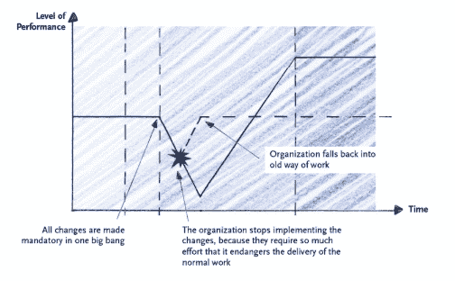

# 准备好雇佣了吗？首先计算规模的隐性成本。

> 原文：<https://medium.com/hackernoon/ready-to-hire-calculate-the-hidden-costs-of-scale-first-25a3c93b9d65>

你的工程团队是一个精简、吝啬、功能强大的机器。你有一个快乐且不断增长的客户群。你的团队接受客户的要求，但有明确的产品方向。事情是忙乱的，但好忙乱。

然后，高管们决定扩大规模的时间。他们要求您的团队将产量提高 20%、50%、2 倍或 10 倍。他们为此提供了 x 美元的预算。

大多数工程经理将这些钱直接用于招聘和雇佣。他们的团队如此努力地走到这一步，所以他们不是试图推动他们在*更少*的时间内做*更多*的事情，而是要通过增加一倍的员工数量来增加一倍的产量。

然而，经历过规模化的经理们担心，扩大团队可能会导致边际回报递减。他们也知道 7 人团队的流程不适用于 20 人或 200 人的团队。为扩展做准备的跑腿工作非常重要，因此应谨慎做出决定。

为了帮助你解决这个难题，我们整理了一份扩展工程团队的成本效益分析(并构建了一个可下载的 [***雇佣或优化计算器***](https://go.codeclimate.com/optimize-vs-hire-calculator) )。

# 招聘的隐性成本

当你在一个敏捷团队中工作时，总感觉你离完成所有事情还差一个人。因此，很容易利用这个机会，再增加一两个人来实现 20%的产量增长。

但是就像每一行代码都会增加技术债务一样，每一次插话都会增加团队的逻辑复杂性。所有这些规模效率低下的核心是通信线路的非线性增长:

随着团队成员的增加，个人之间关系的复杂性呈指数级增长，这使得经理更难:

*   向团队成员传达决策
*   让团队成员对所述决策发表意见或提出建议
*   执行流程变更(稍后将详细介绍！)
*   衡量所述过程改变的有效性

领导和直接下属之间的双向沟通对于保持团队的一致性和确保人们对工作的投入是不可或缺的。没有它，您将会遇到代价高昂的问题，如精疲力竭、高离职率和缓慢/低效的事件恢复。

通常为调整规模而引入的措施通常会占用实际工程的时间:

*   更多的团队会议，确保员工了解他们的工作如何融入大局***(～+30 分钟/周)***
*   更多一对一，确保员工有机会与决策者面对面交流***(～+30 分钟/周)***
*   确保信息不会被一个人或团队成员***(～+20 分钟/周)*** 孤立的更多文档
*   更多的报告，确保在没有直接监督的情况下实施新的变更***(～+20 分钟/周)***

如果你在雇佣第 26 名工程师的转折点上一夜之间增加了这些流程，那就是一周损失了 41 个工程小时——这一损失大于你从一名全职工程师那里获得的回报。这种影响已经被[布鲁克定律](https://www.timsommer.be/famous-laws-of-software-development/) : *在一个后期的软件项目中增加人力会延迟它*。

虽然看起来你雇佣更多的人是在帮你的工程团队的忙，但实际上你引入了规模机制，这会让他们慢下来。不管团队规模有多大，让工程师更快乐的唯一方法是消除阻碍他们自主、不受干扰地工作的障碍。

为了扩大生产力，您必须首先通过尽可能精简现有流程来为这些变化腾出空间。而且，对大多数经理来说，这个机会比他们意识到的要大得多。

# 流程优化的隐性成本

关于流程优化有两种常见的误解:

1.  几乎没有相关的成本，而且
2.  好处微乎其微，常常微不足道

两者都不一定正确。

假设一位经理加入了一个工程团队，他惊恐地发现几乎没有任何流程可以确保持续交付。该团队自称敏捷，但实际上，每个人都在从事数量不确定的项目，几乎没有人坚持在计划会议上讨论的截止日期。经理可能会尝试强制一个新的结构，配备追溯、燃尽图和更结构化的代码审查过程。

所有这些变化在理论上都是好的，但是当团队成员适应新的约束时，一下子做出所有这些变化会极大地影响绩效。如果生产率停滞太久，经理可能会停止整个检修，回到他们混乱但频繁的运输计划。

[*source*](https://resources.sei.cmu.edu/asset_files/Presentation/2009_017_001_22328.pdf)

大的流程变更需要每个现有团队成员的重新加入，每个成员都已经发现并开发了他们认为有效的工作流程。在看到这些变化的影响之前，您的团队可能会在 3-12 个月内下降到以前的生产力水平以下。

为了减轻与过程变更相关的风险，您可以最小化每个变更的范围。这种“敏捷”的变更管理方法确保团队成员的工作流变更保持最小，并使您能够回滚任何无效的事情，而不会招致太大的损失。

[*source*](https://resources.sei.cmu.edu/asset_files/Presentation/2009_017_001_22328.pdf)

这种流程优化也能带来远不止边际的回报。就像每周增加几次会议会降低全职工程师的工作效率一样，反之亦然。

如果你为每个团队成员做一些小的优化，就能显著提高产量。一个仅仅提高每个开发人员 1%的个人产出的改变，意味着一个 10 人的团队在仅仅一年结束时工作速度将会提高 185%。

流程优化是不可见的，因此发现优化的机会相当困难。这需要量化你的团队进展有多快，并了解工作停滞的模式。像 Velocity 这样的[工程分析工具可以帮助您快速了解速度和工作习惯，或者您可以跟踪简单的指标，如合并的拉式请求或自己提交量。](http://codeclimate.com)

# 优化或雇佣🤷‍♀️?

到底是(a)优化好还是(b)优化后再雇佣，取决于你想要的结果。你可能无法通过单独优化将产出提高 10 倍，但在招聘之前，要确保你已经尽可能地利用了优化。随着团队的成长，任何过程改进都会变得更加漫长和昂贵。

使用我们的[雇佣与优化投资回报率计算器](https://go.codeclimate.com/optimize-vs-hire-calculator)来确定您是否可以优化您想要的产出。