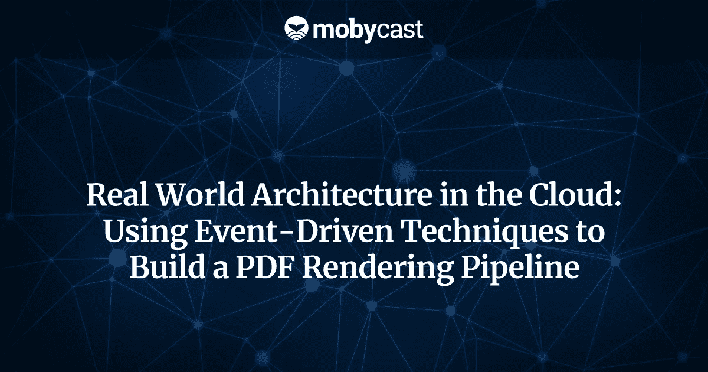

# 云中的真实世界架构使用事件驱动技术构建 PDF 渲染管道

> 原文：<https://medium.com/hackernoon/real-world-architecture-in-the-cloud-using-event-driven-techniques-to-build-a-pdf-rendering-b9f0e94110db>

凯尔萨斯的乔恩·克里斯滕森和克里斯·希克曼讨论了一个真实世界的云中架构的例子，该架构使用事件驱动技术来添加新功能，例如为现有应用程序构建 PDF 渲染管道。

该节目的一些亮点包括:

*   表单/文档/PDF:为企业构建应用程序以自动化以前手工完成的业务流程时的常见请求
*   基于表单的在线应用程序可以在不同的位置执行常规的质量检查，以生成工作被正确安排和执行的证据
*   表单被提交到系统中；应用程序允许其他人通过 PDF 版本查看、共享和转发质量检查结果，而无需登录系统
*   制作 PDF 并不容易，因为它是特定于应用程序的，会产生渲染问题；它耗费大量 CPU 资源和时间，而不是瞬间完成的
*   由于复杂性和涉及的移动件数量，故障是可能的；将它整合到现有的应用程序中具有很大的挑战性
*   松耦合:保持它与其他所有东西分开，使用事件；AWS 提供免费的有线接入设施
*   触发一个事件并不需要做很多工作；使用发布-订阅设计模式发布事件和订阅列表
*   新功能是一个单独的应用程序，只通过使用亚马逊社交网络收听消息；创建亚马逊 SQS 订阅特定的社交网络活动
*   出了问题会怎么样？需要更长时间？内存不足？额外的应用程序代码需要在 Lambda 中，否则它将永远丢失
*   完美的解决方案:一个队列，因为有一项工作需要发生，处理失败并重试，并且有多个工作器/监听器可以完成这项工作
*   立即发生的事情，不提供可观察性；使用 SQS 订阅 SNS 主题，获取大量代码来轮询队列和查找消息
*   从队列中检索的消息在一定时间内对其他人隐藏；可见性超时应该足够长，以处理它并防止它被重建
*   通过承认不同的后台任务使过程更广泛；这种架构可以很好地处理冗长、复杂、需要异步完成的任务
*   去年推出的亚马逊功能为 Lambda 函数提供了订阅 SQS 的能力，以摆脱脚手架代码；然而制作 pdf 仍然不太好
*   制作 PDF:弹出消息以获取提交的数据，这些数据需要采用 HTML 格式

**链接和资源**

[凯尔苏斯](https://kelsus.com)
[秘栈媒体](https://www.secretstache.com/)
[CheckWise](http://blog.etundra.com/food-safety/checkwise-brings-food-safety-palm-hand/)
[AWS](https://aws.amazon.com/)
[亚马逊 S3](https://aws.amazon.com/s3/)
[亚马逊简单通知服务(SNS)](https://aws.amazon.com/sns/)
[亚马逊简单队列服务(SQS)](https://aws.amazon.com/sqs/)
[AWS Lambda](https://aws.amazon.com/lambda/)
[AWS ECS](https://aws.amazon.com/ecs/)
[PhantomJS](http://phantomjs.org/)

**成绩单**

Rich:在 Mobycast 的第 52 集，我们讨论了一个使用事件驱动技术向现有应用程序添加新功能的真实例子。欢迎来到 Mobycast，这是一个关于云原生开发、AWS 和构建分布式系统的每周对话。让我们直接开始吧。

乔恩:欢迎，克里斯，来到又一集的 Mobycast。

克里斯:嘿，约翰。回来真好。

乔恩:很高兴见到你，很遗憾，里奇小姐。我承认我们错过了 Rich，因为我们应该在今天早些时候他有空的时候录下来。但是在我们当地的滑雪山上，我们昨晚下了大约 20 英寸的雪，我们不得不推迟 Mobycast，因为你真的要去滑雪了。这是强制性的。

克里斯:机会来了。

乔恩:是的，是的。所以我才住在这里。克里斯，这星期你在忙什么？

克里斯:你知道，你可能有 20 英寸的雪，但是你在科罗拉多州的山上，对，这是应该发生的。西雅图的雪更多。昨天又下了一英寸的雪，天气很好。这不像几周前的一英尺半，但是，来吧，现在是三月。现在是西雅图的三月，对我们来说——别说了。我准备好迎接春天了。

乔恩:是的，[听不清 00:01:14]。

克里斯:是的，我喜欢。我讨厌雪。我讨厌寒冷。我准备好迎接春天了。甚至去了凤凰城，那里的天气很冷，所以非常期待——来吧，来吧春天。

乔恩:对，对。考虑到现在仍然是寒冷的冬天，也许当你在听这个的时候，或者无论你在哪里听这个，对我们来说，寒冷的冬天意味着让我们开始技术。今天，我们将谈论一些技术性的东西，而不是谈论大的想法和告诉人们的东西。我们将重温一些我们之前已经讨论过的内容。我们将具体讨论一个真实的云中架构，它使用事件驱动技术来构建 PDF 渲染管道。这是一件超级平常的事情。

如果您正在为企业构建应用程序，尤其是如果您正在做一些自动化业务流程的事情，而这些工作以前更多是手动完成的，那么这就是一个常见的请求。人们经常会说，“嘿，我们能不能也要这个表格或者这个文档，”或者不管你正在创建一个 web 应用程序的业务流程的结果是什么。他们说，“我们能不能把它做成 PDF 格式，我们能不能把它放在这个桶里，因为这样可以解决我们的合规性问题，”或者他们有的任何东西。

Chris，也许你可以简单介绍一下现有的应用程序，以及构建该架构的要求和情况。

Chris:其中一部分是我们为一家企业构建了一个基于表单的应用程序，他们需要在他们管理的各个位置执行定期质量检查。他们是一家服务公司，遍布美国成千上万的地方。执行此服务时，他们需要具备审计质量，确保工作正常进行，按计划进行，并有证据证明工作已经完成，因此需要拍照、描述工作等。

我们构建了这个基于网络的应用程序，它响应迅速，因为它可以使用笔记本电脑、手机或平板电脑来完成。它是基于表格的，做质量检查的人可以填写表格，用相机拍照，附加到特定的质量检查中，然后提交。它进入系统，当然，应用程序允许人们查看这些提交，管理人员可以查看已经发生的提交，查询各个位置，查询结果等等。

这是我们现有的应用程序。它们很受欢迎，是业务和业务运作的核心。下一步是这样的，“嗯，现在这是越来越多的牵引，它非常有用。”他们有一些新的要求，“嗯，我们希望能够更容易地共享这些质量检查的结果，能够轻松地将其转发给不同的办公室或不同的经理，而不一定要他们登录系统来做这件事，使用密码或教他们如何使用软件等等。”

这个应用程序中基于网络的这些提交的想法，让我们创建一个 PDF 版本。既然 PDF 是可以共享的原子文件。你可以发邮件给某人，或者你可以把它放在一个文件里，这样你就可以把它扔到 Slack 或者其他任何地方，但这是一个非常简单的方法，不需要任何人登录或者真正了解它。任何人都可以查看 PDF。这就是我们想要添加的功能。

乔恩:他们可以把它打印出来，用它做各种各样的好事。

克里斯:当然，是的。

乔恩:好的。做 pdf 不是问题。这很容易。

克里斯:对。只需告诉他们，“安装 Adobe Acrobat 或 Microsoft Office，只需保存这个 PDF，打印这个 PDF。”说“我们有这些意见书”不是一件小事。从本质上来说，它是数据，然后它周围有模板来表示它，格式化它，你可以在线完成它，因为在应用程序本身中，你实际上是如何制作 PDF 的呢？这就是问题的症结所在。

实际上，有几件事情需要考虑，比如制作一个 PDF 非常耗时，即使你只有一个文档，你去打印它并保存这个 PDF，即使这需要一点时间，也非常耗费 CPU 资源。不是瞬间的。这涉及到过程和时间。这不是一瞬间发生的事情。

Jon:我对此有一些评论，因为它让我意识到这仍然是一个问题。因为在 2011 年，当我经营一家名为 Checkwise 的公司时，我们也在建立人们填写的清单，他们保存温度日志，猜猜看，同样的确切要求，“让我们从这些完成的清单中建立一个 PDF，以便我们可以将它们存储为纸张，”因为我们正在远离纸张流程。这是同一个问题。我不认为这在 10 年内变得更容易，好吧，6 年。六七年了，还是老样子。这让我很不爽。

就像这些低级的事情，“哦，把这些数据转换成每个人都一直在使用和做的数据，”这些事情让我痛不欲生，因为你所说的话。我开了个玩笑，说这很容易，你说，“哦，是的。当然了。你所要做的就是右键点击并保存为 PDF 格式。”世界上的每个人都习惯了这一点，尤其是那些为软件付费的人，他们习惯了这一点。然后当他们听到，“哦，我们必须为此建立一个更大的架构。”我想，“什么？不，你不知道。只需右键单击并保存这个 PDF 文件。很简单。”但事实并非如此，这让我痛不欲生。好吧，继续。

克里斯:这是一个非常具体的应用。是渲染问题。

Jon:PDF 应该有一个非常清晰的类似 JSON 的结构，我们将从这个 JSON 结构切换到那个 JSON 结构。现在，没那么容易了。

克里斯:我们可以一直谈论这个话题。在前世，我又一次构建了一个 PDF 渲染管道。我实际上不得不使用 PDF 语言。实际上有一个 PDF 规范，如果你把文档打印成 PDF 规范，它有 500，600 页长。它几乎是一种编程语言。

乔恩:保存这个 PDF 需要 45 分钟。

克里斯:是的。我们跑题了。但是，重要的是，建立一个 PDF 不是一件简单的任务。它不仅耗时，耗费 CPU，而且很复杂。这样做的代码，不仅仅是这三行代码。意义重大。

乔恩:另一件重要的事情是它可能会有点脆。它可能会失败。

克里斯:当然，是的。每当一件事情变得复杂时，随着它的增加，可移动部件的数量增加，那么失败的几率也会增加。所有这些都是要考虑的问题，并弄清楚我们该如何去做。请再次记住，我们已经有了一个现有的应用程序，它有相当大的代码库，运行得很好。我们如何继续下去，并纳入这一点？这就是我们最喜欢的朋友松耦合发挥作用的地方。

实现它的一个很好的方法是将它与其他东西分开，并使用事件之类的东西。这绝对是这里的策略，我们如何确保我们在构建时考虑到 CPU 成本高、耗时长，因此同步处理不可行。

我们不能做这样的事情，每当有人点击提交按钮来完成质量检查时，他们必须坐在那里等待一两分钟来创建一些 PDF 文件，而在这样做的同时，它可能会影响系统的其他用户。这不是一个选项。同样，我们已经讨论过，尝试将所有这些用于 PDF 渲染的代码添加到现有的代码库中，这感觉也不是很好。

我们需要解耦，所以让我们用事件来做这件事。这是利用事件做到这一点的完美例子，所以这就是我们所做的。

Jon:通常，当我想到使用事件时，我的第一个想法是，“在 AWS 内部，有没有一些自然的东西已经有了一个我可以利用的事件？”你做了类似的事情吗，或者你必须写一些代码来使事件发生吗？

克里斯:在 AWS 中有一些设施，你可以免费得到它，在那里它已经连接好了。

乔恩:对。它不同于 S3 桶，当一个对象被写入时，它会自动生成一个事件。

克里斯:没错。如果我们正在创建的这些提交文件实际上是我们可以转储到 S3 的文件，那么这可能是一个选项，但事实并非如此。这些提交的都是代码。它实际上会进入多个后端商店，有些没有续集，有些是关系型的，这不是一种免费的触发事件的方式。但好消息是，实际触发该事件并不需要太多工作。我们将在这里使用发布-订阅设计模式。我们将发布一个事件，然后我们将有订阅该列表的内容，并对其进行监听和操作。

在 AWS 领域，我们可以使用 SNS 作为发布这些事情、触发这些事件的方式。这变得非常简单，我们的主要应用程序，我们只需在那里做一些代码更改，说，“嘿，当我们收到这些质量检查的提交时，我们已经完成了所需的验证，我们在我们的数据库中创建它们等等，然后我们将成功返回给调用者。”然后我们可以打电话给 SNS 说，“发布这个事件。”我们将向 SNS 发送消息，基本上只是让消息，“嘿，提交刚刚创建。”这就是主应用程序要做的全部工作。作为这一部分，它真的没什么可做的。

它的工作已经完成，开发主应用程序的团队可以继续他们的工作，他们不需要做任何其他事情来添加这个新特性。新的特性现在可以完全独立出来了。这将是非常模块化的，分离的，我们可以建立一个单独的应用程序来做这件事。这个独立的应用程序现在需要做的就是监听这些消息。为了促进这一点，我们可以采取一个管理的 SNS 风扇了。通过发布到 S2 和 SNS 主题，一个消息说，“嘿，这个提交被创建。”任何对此类事件感兴趣的人都可以订阅该主题，有多种方式可以通过不同类型的听众订阅该主题，但任何感兴趣的人都可以这样做。

我们设置了一个 SQS，这是一个订阅特定 SNS 事件的队列，每当有消息发布到该主题时，它就会在 SQS 的该队列上创建一条消息。

Jon:我们的想法是，你想要所有需要构建的 PDF，你想要那些需要排队的工作，这样如果构建 PDF 的东西停机或不可用，或者过载，你就不会丢失任何[听不清 00:16:10]的 PDF。如果你只是去调用一些函数，就像，“好的，我现在正在构建我的 pdf。我已经得到了消息，我正在构建它，”那么你可能会遇到一些麻烦。在那里有一个队列，可以节省你应该做的所有工作，使你的系统有可能出现一点点故障。对吗？

克里斯:对。这绝对是它被设计的目的之一。您可以为这个 SNS 设置的另一个侦听器是 Lambda 函数。你可以说，“哦，我会有一个 lambda 函数来创建一个 PDF。”但是，是的，你可能会问，“好吧，如果失败了会发生什么？如果花费的时间比标准的 Lambda 超时长会怎么样？如果我在 Lambda 函数上用光了内存怎么办？”所有其他各种各样的事情都可能出错。除非您在 Lambda 中添加额外的应用程序代码来增加[听不清 00:17:14]，否则它将永远消失。

乔恩:对。结果就像是，“哈，我毕竟排了一个队。”

克里斯:对。你真的需要做类似的事情。您需要某种持久化的方式来进行重试。这里的队列非常有意义，因为您有一项工作，您需要它发生，您希望能够处理失败并重试，您希望有多个工作器或侦听器可以处理这项工作。

乔恩:另外，关于可观察性，还有一点非常重要。你很容易去排队，然后想，“哦，我的天哪。看那东西。它有 100，000 个本应生成的 pdf 文件，但却没有生成。排队满了，怎么了？”然而，如果事情只是立即进行，你没有那种可观察性，所以这是另一件事。

克里斯:当然。尽管如果你在你的队列中排得那么深，那就是你宣布 SQS 破产的时候了。

乔恩:是的。我用了 100，000，因为我想让它听起来真的像我们在大规模经营。

克里斯:是的。我们用 SQS 队列订阅 SNS 主题，然后大部分代码变成了这个工作进程。它的工作是轮询队列，寻找消息。无论何时，只要有消息可用，它就会将其从队列中取出。它会进行处理，所以它不会解包该消息，查看有效负载，理解为“好的，这是什么提交？”它有自己的应用程序逻辑，用于从数据存储中获取提交内容，制作 HTML 版本，然后转换为 PDF，再将结果存储到其中。完成后，它现在可以从队列中删除该消息。

乔恩:是的，这正是我正要问你的部分。老实说，我没有和 SQS 合作过，但我过去和其他队列合作过。这种提醒其他听众的能力就像，“嘿，我正在做这件事。不要抢这个，因为我已经有了。”然后，“好吧，我受够了。让我们把它从队列中取出来。”这些都是相当容易的工作与 SQS 的特点。

克里斯:这些是你将要面对的决定，我的意思是，一旦你连接上它。一旦一条消息从队列中退出，它将在一定时间内对从该队列中退出的其他人隐藏。这是可见性超时，因为您需要处理如果该工人死亡会发生什么情况？

乔恩:对。你不能指望它告诉你已经完成了。你必须有一种方法来撤销它被从队列中删除的事实。

Chris:这就是为什么你必须真正考虑可见性超时，并考虑处理它需要多长时间。如果你说你的可见性超时是 60 秒，但你花了两分钟来处理它，这将是一个问题，因为它现在意味着你的工人将继续重建它。

乔恩:对 Adobe 来说不是问题。他们确实想要世界上额外的 PDF。

克里斯:当然。或者只是加热宇宙。当然 AWS 爱得太对了。

乔恩:是的。

克里斯:“去花掉所有的 CPU 周期。”

乔恩:但这有道理。可见性超时基本上是指某个东西在一定时间内是不可见的，如果在超时前没有删除它，它就会再次可见。

克里斯:是的。这取决于代码说，“是的，我完成了。我已经完成了这个。继续删除它。”

乔恩:酷。

Chris:对于这样的架构，需要指出的一些有趣的事情是，我们可以直接从我们的应用发布到 SQS 队列，而不是 SNS，但是这样做限制了可扩展性。但是通过发布社交网络，它现在允许我们进一步扩展这一点。我们可能会有这样的需求，无论何时生成提交，都会进行质量检查，如果质量检查失败，就需要在其他系统企业应用程序中创建一个标签，用于管理紧急问题。这使它变得非常简单，除了现在，因为它是一个 SNS 主题，它是一个发布到那个主题的消息，我们可以向它添加另一个侦听器。

现在我们可以这样做，也许它是一个 lambda 函数。它的工作是将自己添加为该主题的订阅者，查看提交的内容，看看它是否失败。如果它失败了，那么它可以负责对其他系统进行 API 调用，并将其注册为必须修复的紧急问题。真的很好扩展。任何 PDF 代码都不必改变，任何应用程序都不必改变，它只是通过使用类似 SNS 的东西来使用这些事件，并帮助 SNS 散开，它允许任何有兴趣了解这一点的人都可以这样做。

这是需要指出的一点。另一个是，对于工人，这个过程，我们可以通过承认各种不同的后台任务来使其更加广泛。这种架构非常适合处理冗长复杂的任务，它们需要异步完成。但基本上，这是一个框架，它本质上是一群工人，他们在监听队列，提取消息，他们了解他们是什么，然后他们在他们身上做工作，然后将他们标记为完成。

您可能还需要构建复杂的数据报告，CSV 格式，这可能需要几分钟的时间来生成或类似的东西。这也可能是另一种消息类型。我们可以扩展我们的 worker 来标记这些消息，它们应该是哪种操作。这是生成的 PDF 还是生成的 CSV 报告，并在您的工作代码中创建这个可插入的模型，这样您就不必为您想要执行的每个不同类型的异步任务重新搭建所有的脚手架。相反，你可以拥有它，非常模块化，你只需编写一个模块，然后你可以插入到工人。

这是我们在这里采用的一种建筑模式。有一件事要稍微提一下，在很长一段时间里，SQS 为了处理 SQS，你不能把 SQS 直接连到拉姆达。如果你想处理 SQS 消息，你必须去写代码。你必须构建一个基本的应用程序，并弄清楚如何运行和部署它，以及诸如此类的事情。

亚马逊去年推出的一个新功能是 Lambda 函数订阅 SQS 队列的能力，对于某些事情来说，这真的很棒。您可以去掉所有的脚手架代码，只保留核心逻辑。在某些情况下，这种模式对很多人来说会非常有效。对于我们来说，对于做 pdf 来说，就不那么好用了。试图在一个 Lambda 函数中构建一个 PDF，这太复杂了，有太多的代码，有太多可能出错的地方，而且太冗长了，简直没有意义。

在这种特殊的情况下，对于我们来说，有了脚手架，有了专门的工人，就有了意义。但是，当人们思考这个问题时，要记住的是，这里有一些选择。你只需要看看你的具体情况，什么对你更有意义。

乔恩:没错，是的，有道理。我们必须结束了，但我知道可能有几个听众想知道，“等等，你说你要制作一些 pdf，”所以他们可能想知道，“你实际上用什么来制作这些 pdf，你把它们放在哪里，它们制作后会发生什么？”

克里斯:对。当这些工作人员看到这些消息并说，“嘿，我需要生成一个 PDF，”他们必须做的第一件事就是去获取提交的数据，这些数据需要基本上是 HTML 格式的。制作 PDF 最简单的方法之一是从 HTML 转换成 PDF。我们做这个的第一次迭代是使用一个叫做 Phantomjs 的库工具。这工作得相当好，但有一些性能问题，其他一些相当沉重，相当资源密集型。

最近，在过去的一年里，我们切换到了无头 Chrome，基本上是用木偶师作为驱动无头 Chrome 的前端。效率更高，我们现在可以更快地制作 pdf。这个 worker 节点运行在 AWS 中 ECS 之上的 Docker 容器中，以便 Headless Chrome 能够正确地使用它。我们遇到了一些问题，特别是 Headless Chrome，它需要 scratchbase 来构建这些 PDF 文件，它希望使用共享内存，而 ECS 不允许为此设置大小，也不允许越过默认的 ISO。

事实证明，我们最初确实想使用 Headless Chrome，但因为这个原因我们不能使用，但后来经过一些游说和其他一些人有同样的问题，亚马逊更新了 ECS，你可以设置它。一旦这个设置可以增加共享内存的大小，我们就可以开始比赛了。现在，我们可以高效、快速地构建这些 pdf，当然，当我们完成后，我们会将它们扔进 S3 桶，现在它们可供下载或流回。

乔恩:非常酷。这很酷，因为这是我们上一集事件驱动架构的一个小前提，但深入到我们用事件驱动架构解决的这个特定问题的细节中，感觉更真实。谢谢你为我们做的这些，克里斯。

克里斯:随时欢迎。很有趣。

乔恩:好吧，下周再聊。

克里斯:好的。谢谢！再见。

亲爱的听众，你坚持到了最后。感谢您抽出时间，并邀请您继续与我们在线交流。这一集以及节目笔记和其他有价值的资源可以在 mobycast.fm/52.获得。如果你有任何问题或其他见解，我们鼓励你在那里给我们留下评论。谢谢你，我们下周再见。