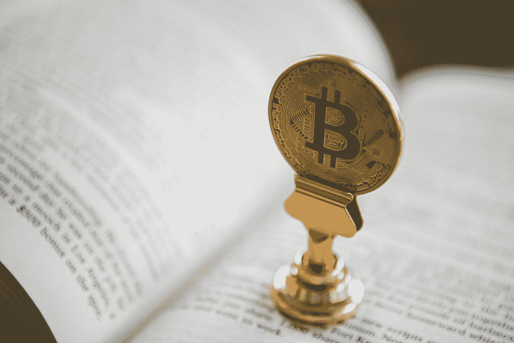

# 关于加密货币和代币经济的法规和观点。

> 原文：<https://medium.com/hackernoon/regulations-and-sentiments-around-crypto-currencies-and-the-token-economy-f91217998eeb>

# 世界各地不同的司法管辖区是如何对待、适应或冷落它的！

Photo by [Lok Yiu Cheung](https://unsplash.com/@yiucheung?utm_source=medium&utm_medium=referral) on [Unsplash](https://unsplash.com?utm_source=medium&utm_medium=referral)

无论如何想象，加密货币、数字代币和底层区块链技术都不再是一个新概念，仍然在某种程度上被包裹在神秘的毯子下。事实上，在描述这一大类下逐渐创造和营销的产品时存在很大程度的流动性，这也于事无补。例如，在泰国、澳大利亚和阿根廷，其中一些产品被称为数字货币，在加拿大、中国和台湾被称为虚拟商品，在德国和瑞士被称为加密/支付令牌，在意大利被称为网络货币，在洪都拉斯和墨西哥被称为虚拟资产，在其他一些国家被称为虚拟硬币、数字令牌和安全令牌。

差异不止于此，在过去一年左右的时间里，这些产品发生了巨大的变化，在不同的国家呈现出不同的结构、解释以及相应的法律和监管有效性水平。某些国家的政府和中央银行(在这些国家，这些产品没有被完全正确地归类为非法)采取了不同的立场，并相应地发布了公开公报，这些公报通常包括澄清并教育公众有关政府对他们的立场，警告他们由波动性导致的陷阱，在损失的情况下缺乏法律追索权，缺乏对促进加密交易的公司的监管监督，以及由此导致的潜在的犯罪用途，如恐怖主义和洗钱。

为此，一些国家(如澳大利亚、加拿大和马恩岛)修改了宪法，将洗钱和反恐融资法律的范围扩大到加密交易和为其提供便利的机构，而其他国家则将这些产品归入加密货币的大范围内，并采取了更严厉的立场，施加了不同程度的限制，例如越南、尼泊尔、巴基斯坦、阿尔及利亚、玻利维亚和摩洛哥完全禁止了涉及“加密货币”的活动；卡塔尔和巴林禁止本国公民在境内交易“加密货币”；孟加拉国、伊朗、泰国、立陶宛、莱索托、中国和哥伦比亚禁止境内金融机构为涉及“加密货币”的交易提供便利，从而实施了间接限制。

即使在采取不那么严厉立场的国家，监管也往往不同——例如，尽管 ico(首次发行硬币)在中国、澳门和巴基斯坦被完全禁止，但在荷兰和新西兰受到监管，并且可能会产生额外的义务(顺便说一下，这可能因情况而异)，取决于硬币是作为债务证券、股票证券、管理投资产品、衍生品还是集体投资提供的。

这并不是说，加密和区块链技术只是在低声说话，并带有负面的含义。一些国家，如比利时、南非和英国，认为密码的市场太小，目前没有任何实质性的问题；而其他一些国家，如马绍尔群岛、委内瑞拉、东加勒比中央银行(ECCB)成员国和立陶宛，已经朝着开发自己的加密货币的方向迈出了步伐；然而，在一些国家，如瑞士、墨西哥、安提瓜、巴布达和马恩岛，加密货币现在甚至被政府机构作为支付手段接受——因此，很明显，在一些圈子里有相当程度的谨慎乐观——如果不是兴奋的话。

然而，接受加密经济的国家面临着前所未有的挑战，其中最主要的是税收问题——鉴于它们固有的虚拟性质和缺乏任何有形支持，它们应该作为金融资产或外币征税吗？个人和公司应该有不同的协议吗？它们应该属于所得税的范围还是应该有资本收益税？应该对采矿业征税还是只对交易征税？增值税呢？能有正当的增值吗？—这样的例子不胜枚举。此外，对于货币和金钱之间的区别也有一些不同意见。例如，在阿根廷，只有中央银行可以发行法定货币，因此比特币交易充其量可以被视为易货交易；然而，该国所得税法的最新修正案规定，出售数字货币获得的利润将被视为收入，从而为它们提供了法律定义的货币地位。

Photo by [André François McKenzie](https://unsplash.com/@silverhousehd?utm_source=medium&utm_medium=referral) on [Unsplash](https://unsplash.com?utm_source=medium&utm_medium=referral)

> 可以说，直布罗陀在加密货币合法化方面取得了最显著的进展，直布罗陀是第一个引入详细框架监管分布式分类账技术的国家(DLT)。

2017 年 5 月，直布罗陀政府首次开始讨论涵盖 DLT 的监管框架，同年 10 月，政府根据《金融服务(投资和信托服务)法》推出了《2017 年金融服务(DLT 提供商)条例》，该条例于 2018 年 1 月 1 日生效。这项立法涵盖在直布罗陀或从直布罗陀开展业务并提供 DLT 服务的公司，旨在保护消费者，通过使用和发展新的金融技术作为繁荣的渠道，并导致机构级代币销售平台和数字资产交易所——直布罗陀区块链交易所(GBX)的诞生。最近，GBX 的母公司——直布罗陀证券交易所(GSX)宣布准备上市证券代币，也称为“数字”、“智能”或“代币化”证券，成为世界上首批提供数字债务证券和数字基金上市服务的证券交易所之一。

总体而言，加密货币和代币的市场价值以及全球对这一新技术的描述出现了相当大的波动，导致围绕代币经济的总体未来展开了许多辩论。然而，我们正处于一个前所未有的急需变革的开端，金融革命才刚刚开始！

> 区块链 Worx 处于这种颠覆的最前沿，并乐观地认为，通过恐惧，不确定性和模糊性，将强烈出现一个可持续和稳健的代币经济，这将带来全球金融市场的范式转变，使其成为一个公平的竞争环境。

想了解更多？一定要去 www.blockchainworx.com，或者给 info@blockchainworx.com 的我们写信