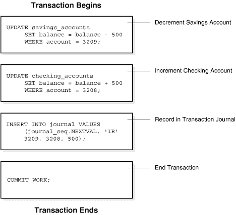
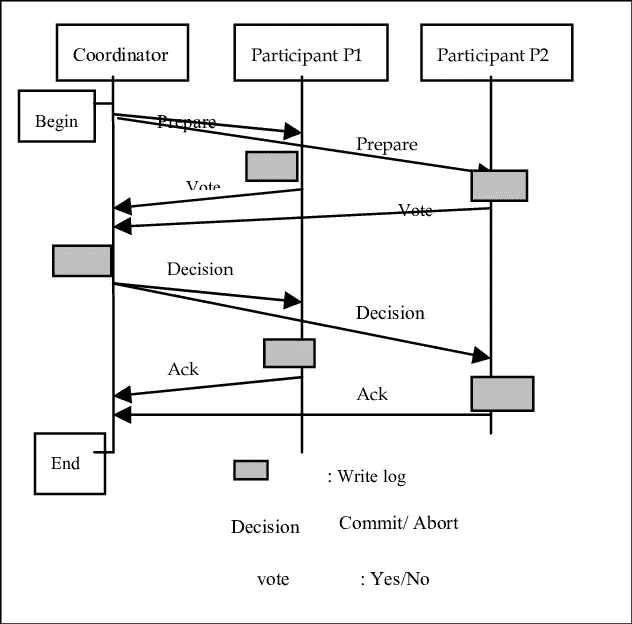
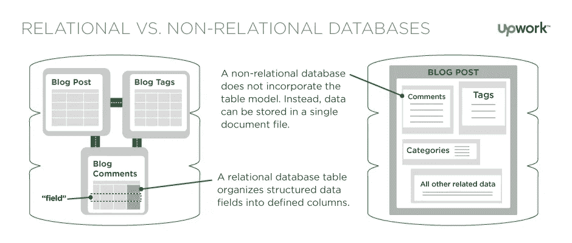
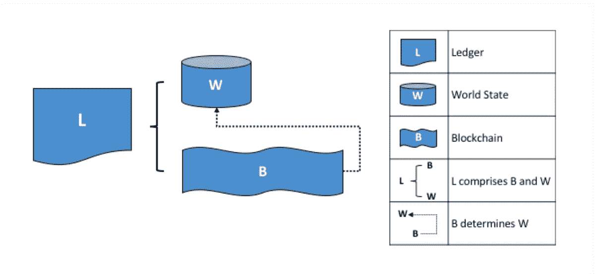
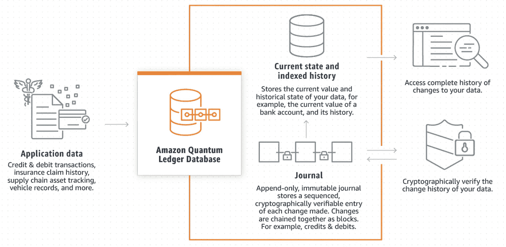
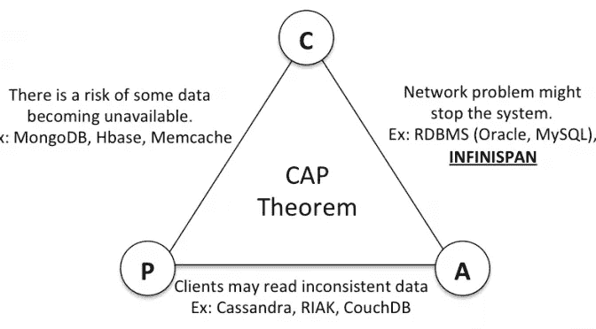

# 关系，NoSQL，分类帐数据库工程，不允许区块链。

> 原文：<https://medium.com/hackernoon/relational-nosql-ledger-databases-work-not-permissioned-blockchains-9ccaef7b3139>

我这篇文章的前提是深入研究数据库的体系结构，并了解为什么它对企业很有效。同时将数据库的弹性与许可链的价值主张进行比较。最后，展望一下如果架构正确，分类帐数据库将如何驾驭下一波创新浪潮。 [*乔恩·蔡(Jon Choi)认为*](https://jonchoi.com/opennetworks/) *我们应该放弃区块链这个词，而使用“开放网络”这个术语。Jon 文章的结论是，开放加密网络“是与参与者共享资源和责任的网络”。通过建立术语，这将允许社区独立于其他社区发展和成长。我认为企业社区应该放弃区块链这个词，而采用“分类帐数据库”这个术语。*

# 进退两难

开发资源、设计框架、治理和验证概念都是有成本的。例如， [IBM 和 Maersk](https://www.coindesk.com/ibm-blockchain-maersk-shipping-struggling) (航运公司)建立了一个联盟，允许航运公司在一个已建立的航运联盟内实现清关、贸易融资和文件传输的自动化。在成立几个月内，马士基在接纳航运公司方面遇到了麻烦，因为他们感到受到了马士基集团的威胁。

这只是在过去 12 个月中失去动力的企业项目的一个例子。在最近的一篇 Coindesk 文章中，来自 IBM 的 J [erry Cuomo 说](https://www.coindesk.com/ibm-blockchain-maersk-shipping-struggling)，*“如果你以小而集中的方式开始，挑战将是如何让下一个大的信任锚上船。另一方面，采用分散的方法，你可以有多个竞争对手和他们的律师都在问问题，这将需要一些时间。你必须选择你的毒药*

# 炒作周期

数据库自 70 年代就已经出现，每秒钟可以管理数百万个事务。有成千上万的开发人员、架构师和管理人员已经建立了数据库基础设施，并以此谋生了几十年。当今天大多数解决方案运行良好时，他们为什么要转换并学习新的东西呢？区块链承诺能够分散信任、隐私和存储防篡改数据，同时创建新的盈利工作流。不幸的是，这种承诺和媒体炒作的结合已经推动它成为一种必须使用的技术。问题是区块链是否准备好大规模采用。 [Gartner 报告称](https://www.gartner.com/smarterwithgartner/the-reality-of-blockchain/)我们目前仍处于对该技术过高期望的顶峰，或者我们称之为**炒作**。[(还记得二十年前的 VR 吗？)](https://www.pcmag.com/feature/343351/the-wacky-world-of-vr-in-the-80s-and-90s)

[Most Enterprise use cases are 5–10 years out. In some cases 10+ years.](https://www.gartner.com/smarterwithgartner/the-reality-of-blockchain/)

我会把区块链的欢欣鼓舞比作淘金时代的塞缪尔布兰南，但有所不同。塞缪尔·布兰南在 1847 年听到科洛马有金矿的传闻。在证实了谣言之后，他去了镇上，并大声喊道:“金子！黄金！黄金！."在接下来的几个月里，四分之三的男性人口前往矿井。与此同时，塞缪尔通过向那些矿工出售采矿设备赚了一大笔财富。矿工从塞缪尔那里购买设备，大肆宣传使他们有能力开采黄金并出售。企业也有类似的情况，但是设备还没有准备好投入使用。

**在接下来的四个部分中，我将回顾关系数据库、非关系数据库、许可链和分类帐数据库的架构和用例。对于已经熟悉技术的读者，你可以直接跳到技术总结和结论。**

# 关系数据库

在[数据库管理系统](https://www.tutorialspoint.com/dbms/dbms_quick_guide.htm)中有四种方式存储数据；分层的、网络的、关系的和面向对象的。在企业中存储数据最常用的方式是关系型。关系模型是由 E . F Codd 在 20 世纪 70 年代提出的，从根本上说，他为使用关系来构造数据奠定了基础。例如，所有数据都必须存储在包含行和列的表中。行和列的关系是唯一的标识符，称为元组。最后，与具有唯一标识符的其他表的关系被称为键。

[A Relational Database Table](http://www.cs.montana.edu/~halla/csci440/n3/n3.html)

当你存储的数据是以一种可以包含行、列和字段名的表格的方式组织的时候，关系数据库管理系统(RDBMS)工作得很好。例如，表格应该有特定类型的信息，如姓名、电话号码和其他标签。为了设计一个关系数据库，数据库架构师使用一种标准的编程语言，称为结构化查询语言或 SQL。SQL 将允许架构师和程序员查询、插入、更新和修改数据。大多数 RDBMS 使用 SQL 作为所有关系数据库(如 MySQL、Oracle、MS SQL Server 和 Azure)的标准语言。

**事务&共识** 事务[事务](https://docs.oracle.com/cd/B19306_01/server.102/b14220/transact.htm)是将 SQL 编写的任务纳入工作流的逻辑工作单元。所有 SQL 语句或事务的结果都可以提交(增加)或回滚(减少)。例如，让我们假设一个银行职员从储蓄账户向支票账户转账 500 美元。

[Transaction Management](https://docs.oracle.com/cd/B19306_01/server.102/b14220/transact.htm)

现在，假设您在世界各地有几个节点需要将上述事务提交到数据库中。如何确保所有节点都在通信并提交最终事务？更重要的是，节点如何在故障中导航？数据库如何保证事务的有效性？

答案是 XA 标准、ACID 和 2PC 协议。

Open Group 提出了 [XA 标准](https://dzone.com/articles/xa-transactions-2-phase-commit)，该标准统一了多个节点的事务，并通过使用[ACID 属性](https://vladmihalcea.com/a-beginners-guide-to-acid-and-database-transactions/)来确保它们保持有效性。ACID 指的是原子性、一致性、隔离性、持久性，是一组保证事务有效或无效的属性。

**原子性**——要么全有，要么全无

**一致性** -提交正确的结果

**隔离** —隐藏事务中的事件

**耐久性** —必须保证承诺的结果。

主机提供了一个事务管理器，负责使用 ACID 创建、管理和执行事务。对于节点进行通信并同意处理事务， [2PC 协议](https://www.researchgate.net/figure/The-2PC-Protocol-damage-or-theft-Even-if-the-logs-are-stored-on-the-fixed-part-this_fig2_252607760)是一种共识算法，允许节点提交事务或由于节点故障而中止。通常，节点可以在很短的时间段内提交，该时间段可以从几毫秒到几分钟。

[2PC Protocol](https://www.researchgate.net/figure/The-2PC-Protocol-damage-or-theft-Even-if-the-logs-are-stored-on-the-fixed-part-this_fig2_252607760)

在 2PC 协议中，协调器是主节点，它确保所有节点在向事务日志提交任务时保持同步。2PC 协议自动假定节点之间的信任，因此更容易提交。

**交易提交的方式如下:**

**步骤 1:** 参与事务的每个服务器将承诺它们将参与事务。它让协调者对这个事务中的所有参与者有一个概念。

**步骤 2:** 一旦协调者了解了参与者是谁，协调者就向每个参与者发送一个信号，指示他们提交。提交后，每个参与者都必须在日志上书写，并与协调员确认。如果一个参与者失败，那么协调服务器将向所有参与者发送一条消息来回滚事务。参与者回滚后，他们会向协调者发送一条已确认的最终消息。

# 非关系数据库(NoSQL)

非关系数据库的工作方式不同。数据库管理系统更加智能，它不需要实际的模式来存储数据。如果您查看下图，RDBMS 的数据必须以具有已知属性的表格格式进行组织，以便数据库系统能够理解和链接数据。使用非关系数据库，您可以将数据存储为单个文档文件。这种类型的数据库非常适合使用 Hadoop 等工具存储大型非结构化数据。

[Diagram of how data is stored. Relational vs Non-Relational](https://www.upwork.com/hiring/data/sql-vs-nosql-databases-whats-the-difference/)

开发非关系数据库是为了应对非关系数据库在存储、处理和分析方面缺乏可伸缩性的问题。为了让这些功能正常工作，必须放宽酸的属性。相对于 RDBMS 的一些改进领域如下:设计更简单、部署成本更低、水平伸缩更容易、对数据可用性的控制更精细，以及速度更快。由于非关系型数据库存储大量的非结构化数据，因此主要用于 web 应用程序或大数据项目。非关系数据库使寻求可伸缩性但不寻求数据一致性的企业变得更加容易。因此，大多数非关系型数据库不会遵循 ACID 模型，而是在很大程度上支持 web 应用程序。

模块化
有许多 NoSQL 数据库，如 Cosmos DB、Apache Cassandra、Hadoop 分布式文件系统、LevelDB、Couchbase 和 Datomic，它们提供或可能提供不可变的、仅附加的数据存储作为企业产品。另一方面， **MongoDB 4.0** 提供了一个具有一致协议的分布式数据库。它还支持符合 ACID 的事务。这意味着该数据的完整性是合规的，但仍不如非关系数据库那样健壮。不过 Mongo DB 4.0 [是 201 年底公布的](https://docs.mongodb.com/manual/release-notes/4.0/) 8 所以很好奇看到企业采用。

# 许可的区块链

有权限的区块链和无权限的区块链之间的区别在于控制访问层。控制访问层允许企业控制去中心化、匿名和治理。目前有许多许可区块链的实现，如 Corda、Hyperledger Fabric 和 Quorum，它们可以在网络参与者之间提供安全性、不变性和信任。基于 GitHub 活动，我将讨论 Hyperledger 结构。

**Hyperledger Fabric** [Hyperledger Fabric 系统](https://hyperledger-fabric.readthedocs.io/en/release-1.3/ledger/ledger.html)的典型部署由节点、执行业务逻辑的智能契约(链码)和维护交易日志和*世界*状态的分类帐组成。world state 是一个非关系数据库，它将跟踪和更新区块链上的最新更改，因此大型组织可以查询信息，而不必搜索事务日志。区块链本身是一个不可变的仅附加分类帐，它逐块记录所有交易。与世界状态不同，区块链不能更新、编辑、更改或回滚事务。更具体地说，世界状态被实现为一个数据库，它为企业提供了一种查询、聚集或遍历大量数据的熟悉方法。Hyperledger 结构与 NoSQL 数据库 CouchDB 和 LevelDB 兼容。

[The ledger consists of the blockchain and a traditional database](https://hyperledger-fabric.readthedocs.io/en/release-1.3/ledger/ledger.html)

Hyperledger Fabric 的区块链看起来和感觉上都像一个传统的区块链，它包含一系列为连续性而链接的事务。块头本身包括块事务的散列。这使数据块具有防篡改性和安全性，因此如果一个节点出现问题，其他节点将拥有相同的副本。区块链的数据结构将存储为文档，而不是数据库模式。

**事务&共识** 许可的区块链不必使用基于计算的挖掘来达成共识，因为节点是*已知的*实体。他们可以使用共识算法，如 Paxos、RAFT 或其他可以达成共识并具有确定性的 PBFTs。Hyperledger 智能合同是用链码编写的，链码是用 Go，Node 编写的程序。Js，或者 Java。Chaincode 独立于签署方运行，因此它提高了交易吞吐量，并提供了隐私范围内的精细控制。

[Hyperledger Fabric Consensus](https://www.hyperledger.org/wp-content/uploads/2017/08/Hyperledger_Arch_WG_Paper_1_Consensus.pdf)

网络节点由那些被邀请进入专用网络的节点操作，并且由客户、对等节点和订购者节点组成。订购者节点由一个可插入的一致算法控制，该算法允许组织选择许多适合其组织的算法。这种模块化可以结合拜占庭容错和崩溃容错一致性算法。

**Hyperledger Fabric 中的共识最终分 4 个阶段完成:**

*   **背书**:对等节点管理总账，并在交易生效时作为背书人。对等节点由预定义的策略管理，该策略将执行。
*   **排序**:一旦交易被批准，它就获得一个数字签名。然后，订购者节点在客户端和对等节点之间进行通信。因此，当客户端启动事务请求时，消息会被发送到所有对等节点。
*   **验证**:一旦收到数字签名，订购者就将消息广播给所有对等节点。
*   **提交:**一旦收到消息，对等节点和世界状态将提交事务。

# 分类帐数据库

微软和亚马逊为寻求部署以太坊、Hyperledger 光纤网络的企业提供全面管理的区块链解决方案。它们提供了一个完全受管的系统，消除了手动设置硬件、软件和持续安全性的需要。Quantum Ledger Database (QLDB)最近已经发布，它采用了一种独特的方法，结合了人们对数据库的熟悉程度，同时实现了类似区块链的特性，如不变性。

**Quantum Ledger 数据库** QLDB 是一个非关系型数据库，它抽象了区块链的重要特征。大多数企业会认为，为了可审计性/不变性而重新构建关系型数据库是低效且复杂的。QLDB 对企业的价值主张是消除管理区块链网络的复杂性，并最大限度地降低基础设施成本、终结时间和数据传播。最后，大多数企业已经在使用 AWS 或 Azure，因此产品必须提供一种与当前基础设施集成的简单方式。

[那么 QLDB 到底是什么？](https://aws.amazon.com/qldb/faqs/) " *QLDB 是一个完全托管的分类帐数据库，它提供一个透明的、不可变的、可加密验证的交易日志，由中央可信机构拥有。QLDB 跟踪每一项应用程序数据更改，并维护一段时间内完整且可验证的更改历史。”*

[Quantum Ledger Database](https://aws.amazon.com/qldb/)

QLDB 的体系结构是一个只附加的日志，它按顺序存储所有数据，并且不能更改。它还提供了查看数据库中所有历史更改的能力，就像事务日志一样。使用 SHA256 对历史更改进行加密保护。有了 SQL 支持，企业可以利用当前的 SQL 开发人员来提供查询和管理数据的可靠方法。因为它是一个非关系数据库，所以它能够使用面向文档的数据模型存储大量半非结构化数据。最后，从可伸缩性和一致性的角度来看，QLDB 实现了 ACID 属性，因此它保持了事务的有效性和安全性。QLDB 没有提供的一个特性是共享共识的能力，因此在节点之间没有共识算法或验证过程。

# 摘要

## 关系数据库

关系数据库因其简单、健壮、高性能和灵活性而主导了企业。关系数据库在单台服务器上可以很好地扩展，但是当扩展到多台服务器时就变得困难了。关系数据库已经在企业中被广泛采用，因为它符合 ACID 模型，该模型更喜欢数据完整性而不是可伸缩性。关系数据库非常简单，并且非常好地执行事务。像任何模型一样，如果您想要可伸缩性，您将不得不牺牲数据的**可用性(参见 CAP 定理)**。当扩展到每秒数百万次读/写时，关系数据库就显得力不从心了。

[CAP Theorem suggest you could only choose between availability and consistency](https://howtodoinjava.com/hadoop/brewers-cap-theorem-in-simple-words/)

## 非关系数据库(NoSQL)

由于非关系型数据库存储大量的非结构化数据，因此主要用于 web 应用程序或大数据项目。非关系数据库使寻求可伸缩性但不寻求数据一致性的企业变得更加容易。因此，大多数非关系型数据库不会遵循 ACID 模型，而是在很大程度上支持 web 应用程序。非关系数据库只能支持某些类型的事务，不像关系数据库那样细粒度。随着最近 MongoDB 4.0 的发布，它提供了一个具有一致协议的分布式数据库，该协议也是 ACID 兼容的和无服务器的。

## 许可链

许可的区块链是一个受控的环境，提供协调信任的能力。它有一个控制访问层，用于指定网络参与者、治理和运营模式。许可链有利于审计，与竞争对手一起创建可信的治理模型并执行业务逻辑。获得许可的区块链确实提供了与 NoSQL 数据库的集成，因此企业可以使用 SQL 查询数据。企业必须驾驭复杂的成本、理解共识、隐私、官僚主义以及与潜在竞争对手建立信任。企业可能会卷入一个多年项目，其中可能包括大批律师、资本和缺乏信任。

## 量子分类帐数据库

Quantum Ledger Database (QLDB)是一个 NoSQL 数据库，它提供一个不可变的、透明的、可加密验证的事务日志，由一个中央机构拥有。QLDB 取消了共识算法、区块链网络和在多个节点上部署网络的复杂性等功能。被区块链吸引但不想处理治理问题的企业可以轻松地部署和管理数据库。它还支持 SQL，因此它允许架构师、数据库管理员和大多数企业轻松地集成到他们自己的基础设施中。QLDB 缺乏分散性，因此需要一个中央机构，不能邀请多方创建类似网络的联盟。

# 结论

数据库开始的前提是企业需要存储大量结构化数据的能力。这让位于关系数据库，使企业能够更好地理解数据和创造洞察力。随着互联网的兴起，非关系数据库允许企业收集大量非结构化数据，并尝试使用机器学习和预测分析等工具来预测见解。许可区块链提供了允许互不信任的企业一起工作的能力，但是数据必须是可移植的。企业生态系统必须成熟起来，并理解更新的工作流需要交换公司数据和信任。再加上许可区块链的复杂性，如今市场并不需要这种类型的工作流程。

[Gartner conducted a poll in March 2018 with 300 Enterprises](https://blogs.gartner.com/avivah-litan/2018/07/10/why-private-permissioned-blockchain-may-fail/)

随着 QLDB 和 MongoDB 4.0 的发明，我相信我们走在了正确的道路上，为企业提供了一种利用类似 ledger 的技术而又不复杂的方法。我不是在谴责区块链企业，而只是建议一条新的前进道路。整个技术社区已经将区块链标记为一种可以彻底改变公共密钥基础设施、企业、消费者业务和其他领域的技术。不幸的是，由于我们站在区块链这个词的后面，我们抑制了许多领域的增长，并使社区相互对立。

在接下来的几年里，我可以看到企业部署共享分类账数据库的未来，这些数据库可以支持以太坊、比特币等开放网络。此外，我可以看到 zk-snarks 和机密/屏蔽交易使企业在开放网络中更容易运营。从根本上来说，我们在这个领域仍然处于非常早期的阶段，我们相信我们必须等待生态系统成熟。

***特别感谢 Mohamad Fouda，Soona Amhaz，Mohamad El Seidy*** [***链接至 Token 每日文章***](https://www.tokendaily.co/blog/goodbye-enterprise-blockchain)

链接及资源:[微软 Azure](https://azure.microsoft.com/en-us/blog/accelerating-the-adoption-of-enterprise-blockchain/) 、[Berkley 的区块链](https://blockchainatberkeley.blog/a-snapshot-of-blockchain-in-enterprise-d140a511e5fd?gi=99d612befe03)、 [IEEE](https://ieeexplore.ieee.org/abstract/document/8525392) 、 [HBR 大数据](https://hbr.org/2016/01/how-big-data-is-changing-disruptive-innovation)、[思科](https://blogs.cisco.com/innovation/making-blockchain-enterprise-ready-2)、 [Ycombinator](https://news.ycombinator.com/item?id=16901673) 、[next think](https://www.nexthink.com/blog/from-sql-to-the-immutable-database/)、[区块极客](https://blockgeeks.com/guides/enterprise-blockchains/)、[去中心化](https://decentralize.today/understanding-hyperledger-in-a-bit-more-detail-3d40a37c74f2)、 [Devteam](https://www.devteam.space/blog/public-vs-private-permissioned-blockchain-comparison/) 、 [Techopedia](https://www.techopedia.com/definition/1245/structured-query-language-sql) 、 [【BlockchainHub】](https://blockchainhub.net/blockchains-and-distributed-ledger-technologies-in-general/)[企业存储论坛](https://www.enterprisestorageforum.com/storage-management/2018-data-storage-market-overview.html)，[区块链不吸，](/@mycoralhealth/why-blockchains-dont-suck-and-the-perils-of-distributed-databases-1a522cc7cfe1) [股票超流量](https://stackoverflow.com/questions/7149890/what-did-mongodb-not-being-acid-compliant-before-v4-really-mean)， [Quorum](https://github.com/jpmorganchase/quorum-docs/blob/master/Quorum_Architecture_20171016.pdf) ， [Apache Cassandra，](https://en.wikipedia.org/wiki/Apache_Cassandra) [Altoros，](https://www.altoros.com/blog/hyperledger-approaches-version-1-0-with-better-scalability-and-security/) [亚马逊，](https://aws.amazon.com/qldb/) [研究门，](https://www.researchgate.net/figure/Outline-of-transaction-flow-in-Hyperledger-Fabric-It-depicts-a-use-case-where-1-A_fig1_323973240) [链码教程，](https://hyperledger-fabric.readthedocs.io/en/release-1.3/chaincode.html) [Hyperledge 共识](https://www.skcript.com/svr/consensus-hyperledger-fabric/)，