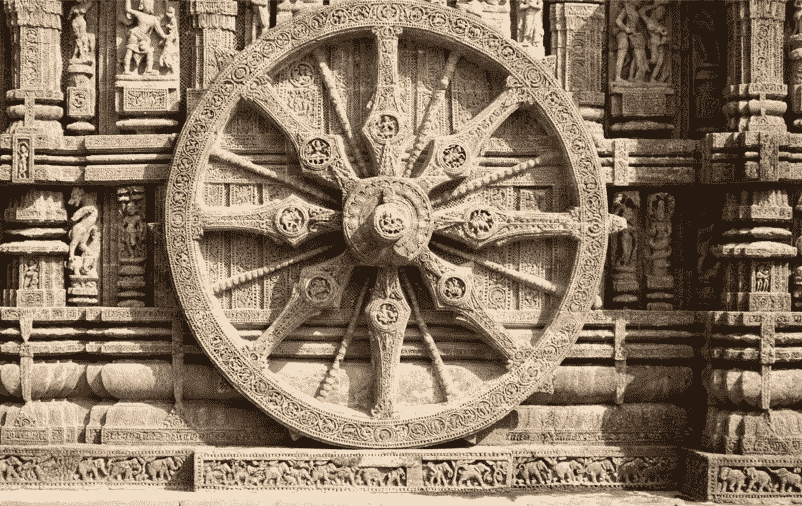
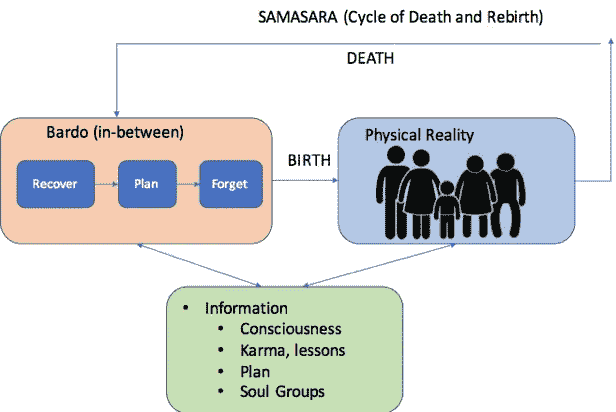
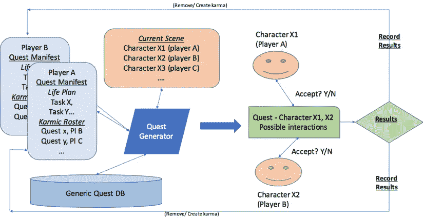

# 宗教和模拟假说，第 2 部分:因果报应是一种探索算法吗？

> 原文：<https://medium.com/hackernoon/religion-and-the-simulation-hypothesis-part-2-is-karma-a-questing-algorithm-e7cd63a5dbe2>

## 视频游戏和黑客帝国为宗教信仰提供了科学依据吗？(第二部分)

*注:在电影《黑客帝国》上映 20 周年之际，麻省理工学院和斯坦福大学的毕业生 Rizwan Virk 发布了他的书，* [*【模拟假设:一位麻省理工学院的计算机科学家展示了为什么人工智能、量子物理学和东方神秘主义者同意我们在一个视频游戏*](https://www.amazon.com/Simulation-Hypothesis-Computer-Scientist-Quantum-ebook/dp/B07M81F1KG/) *中，该游戏探索了这一重要理论的科学、哲学和宗教含义。访问*[*www.zenentrepreneur.com*](http://www.zenentrepreneur.com)*了解更多信息。*

> “知道所有的事情都是这样的:
> 
> 海市蜃楼，云堡，梦想，幻影，没有本质，但有可以看到的品质；
> 
> 当魔术师变出了马、牛、车和其他东西的幻象时，看起来什么都没有。"
> 
> ——*佛*

本系列第一部分，*宗教与模拟假说:上帝是人工智能吗*？我们研究了模拟假说的含义，这一理论认为我们都生活在一个复杂的视频游戏中，作为一个模型来说明有多少本质上与宗教有关的事情实际上可以用科学和技术来实现。我们简单地看了一下开创性的电影《黑客帝国》,以及 20 年前它是如何将这一理念带入大众意识的。我们还研究了西方(或者更准确地说，中东或亚伯拉罕)宗教传统的一些核心原则，以表明它们不仅与这一新理论一致，而且这一理论提供了一种弥合宗教和科学之间日益扩大的差距的方法。

在这个系列的第二部分，我们转向东方的宗教传统，尤其是印度教和佛教(以及它们的一些分支)，并看看它的一些核心租户。虽然我们不得不寻找模拟假说可能隐含在西方宗教的一些核心信仰中的方式，但模拟假说(或者更具体地说，模拟假说的电子游戏版本)似乎几乎是为适应这些传统而量身定制的。

在模拟假说的视频游戏版本中(并非所有的模拟理论家都同意)，在渲染的世界中有个人电脑(玩家角色),他们与渲染的世界之外的有意识的生物(生物的或其他的)相关联并受其控制。在另一个版本的模拟假设中，模拟中的每个人都是 NPC，或非玩家角色，基本上都是被模拟的 AI。虽然博斯特罗姆的模拟论点似乎符合后者，但我的解释倾向于前者，这篇探索宗教和模拟假设的文章依赖于带有 PC(“玩家角色”)的视频游戏版本，而 NPC 在那里做好 NPC 在视频游戏中做的事情:以某种方式帮助玩家实现(或阻碍)他们的目标！

一般来说，东方的神秘文献一方面比西方的宗教文献要古老。另一方面，它们可能被认为是较新的，因为教义并不止于佛陀或任何特定的圣人，也不依赖于任何一本“书”。自从最初的《吠陀经》被写出来(最初的被认为是写于吠陀时期，从公元前 1500 年到公元前 500 年)，在许多年里就有了圣贤和湿婆，而佛陀的话语发生在公元前 500 年左右。虽然许多原始的佛教文献没有在印度保存下来，但它们却以藏语和汉语保存了下来。西藏教义的一个分支可以追溯到来自克什米尔的印度学者那罗帕，其注释一直延续到达赖喇嘛和他的僧侣被迫逃离西藏的时候。

这些神秘主义者这么多年来一直在告诉我们什么？

虽然每个人都听说过印度教的许多神，但当我们进一步看佛教时，它从当时的印度教发展而来(不像基督教从犹太教发展而来)，学者们告诉我们佛陀没有说太多关于神的事情。与其说他说有或没有一个或多个神，不如说他只是在这个问题上保持沉默。相反，他似乎更关心生命、轮回、因果报应的机制，以及这对我们每个人意味着什么。正如我们在第一部分所说的，我们死后会发生什么，这与我们在这个世界的行为有什么关系，这是宗教最初形成的中心原因，这也是我们将在本文中深入探讨的。

这两种传统都同意，我们周围的世界是一种幻觉，就像一场梦，我们“下载”到身体上，在我们的多重生活中扮演不同的角色。如果这听起来很熟悉，那是因为这听起来很像一个超级复杂的视频游戏《黑客帝国》!

## 东中租户#1:这个世界是幻觉还是梦

东方宗教的这一分支明确地告诉我们，我们周围的世界是*玛雅*，或者是一种幻觉，我们所有的行为都被记录下来，并产生必须被播放出来的反响(尽管是在未来的生活中)。

这种错觉的本质是什么？根据《印度吠陀》,它是 *lila* ,是一场盛大的戏剧，我们如此投入，以至于把它当成了现实。当然，舞台剧是一种在当时有意义的隐喻——每一代人都使用当时的技术来描述上帝和宗教隐喻——而电子游戏可能是迄今为止最强大的。这出戏不仅仅是我们观看的电影，而是我们积极参与和改变的事件。

在佛教中，最重要的是认识到我们周围世界的虚幻性——就好像我们在梦中一样。事实上，在西藏的传统中有一整套的练习，梦瑜伽，它的目标是帮助你在睡觉时认识到你是在梦中。

一旦你认识到“梦世界”的虚幻本质，它就像一个在你睡着时发生的小模拟，然后你就准备在醒着的时候做同样的事情。它是那罗帕六种瑜伽之一，在西藏传统中被保留下来。

在像《第二人生》或《《我的世界》》这样的多人游戏中，我们创造出由原材料制成的物体，而这些原材料实际上只是像素。像素由“信息”组成，在渲染时，这些信息会被灯光照亮。看似永恒的事物实际上只有在游戏服务器启动并运行时才可见和呈现，这让我们对“所有事物的短暂性”有了新的认识。

虽然这种梦或海市蜃楼的隐喻已经使用了数百年(甚至数千年)，但从科学的角度来看，这实际上意味着什么从来没有被充分探索过。这意味着我们认为真实的东西实际上是一种投影——就像电影一样，或者更有可能是一种互动的合成体验，让人想起一场梦。用今天的术语来说，我们会说这就像一个电子游戏！

在佛教中，整个思想是通过“觉醒”来达到开悟，脱离轮回之轮。事实上，佛陀的字面意思是“一个清醒的人”。就像《黑客帝国》中的“红色药丸”将尼奥从虚幻的现实中唤醒一样，多年来，圣贤们创造了冥想和瑜伽练习，目的只有一个:将我们从我们周围虚幻的现实中唤醒！

Figure 1: Buddha’s Endless Wheel of samsara, driven by karma

## 东方中心信条#2:轮回、因果报应和佛陀的无尽之轮

多重生命在电子游戏中很常见——任何在街机游戏早期的人都记得为特定数量的生命投入 25 美分，然后投入另一个 25 美分来“继续玩”之前的生命，或者重新开始。第一款被广泛使用的街机游戏是 Pong，由雅达利公司开发，由诺兰·布什内尔在 20 世纪 70 年代创立于硅谷的反主流文化中心

没有人知道当这个术语开始在电子游戏中使用时，他是否认真考虑过东方传统中多重生命的隐喻转世的想法，但这个术语很快流行起来。今天，我们认为电子游戏中的多重生命是理所当然的。

在东方传统中，转世的原则是各种宗教的基本戒律之一。事实上，轮回可能是一个误译——直译是灵魂从一个身体到另一个身体的轮回。

这些宗教的基本思想是，有一个灵魂“下载”到一个肉体上。在一些传统中，有一个跨越遗忘之河的丰富多彩的比喻，这样我们就不会记得我们过去的生活。然后我们“居住”在这个身体里，这样做，当我们经历这个“游戏”或梦想中的行为时，我们创造了新的业力。佛教哲学表达在佛陀无尽的轮回之中，图 1 显示了对轮回的描绘。

我们转世投胎的原因是*因果报应*。在西方，我们习惯于用大体的物理术语来思考因果报应(有人在今生捅了你一刀，你可以在来生报复他们)。更准确的说是因果定律。

假设这些宗教正在描述一个真实的现象，它会如何运作？如何实施呢？

它基本上是在描述一件与演奏 MMORPG 非常相似的事情，以至于我们几乎不需要进行类比。在电子游戏中，尤其是 MMORPG 的游戏，我们是生活在渲染世界之外的玩家。我们在游戏世界里玩“角色”，我们可以暂停角色或者一直玩到角色死去。

Figure 2: An information model for reincarnation and karma

在东方传统中，因果报应储存在哪里？它是存储在视频游戏中渲染世界之外的信息(比如云服务器)。基本上，它的功能就像一个记分卡，但更像是一组任务。当我们在今生采取行动时，我们正在为玩家创造一系列新的任务，让他们在今生或来世完成。*因果*。每次我们玩游戏，我们都会产生更多的任务。

你可以把佛陀的无尽之轮想象成源源不断的追求。当你玩的时候，你创造了更多的任务让你去完成。这些追求从“小因缘”到“大因缘”不等，前者我们可以在梦的状态中很容易地实现(心理印象或藏人所说的“因缘痕迹”)，后者需要我们在“大梦”中经历实际的经历，我们称之为“醒着的现实”。

谁来决定我们接下来要接受什么样的挑战或任务？打个比喻，因果报应的主宰会挖掘我们过去的因果报应，这些因果报应存储在物理世界之外的某个地方，找到其他“角色/玩家”供我们互动(有点像多生命的“朋友列表”)。

你越深入因果报应，它看起来就越像一种非个人的力量，不需要卡拉姆的领主，就像我们在第一部分中看到的伊斯兰或基督教传统中的录音天使。它更像是一个“实现的功能”，而不是一系列人格化的神在监视我们并为我们做决定。

Figure 3: A Video Game Quest Engine for Karma (explored in detail in my book)

作为一名视频游戏设计师，我花了一些时间思考如何实现这一点。图 3 是结果，在我的书中有详细的解释。

事实证明，被多个玩家接受的“个性化任务”是对这个过程最好的描述。远远不需要“业力之主”，如果我们有数十亿灵魂(仅在这个星球上！)每个人都有自己的一套因果报应，有什么比遵守这些定律的人工智能或算法更好的跟踪它呢？

每一个业力可以被认为是一个树状结构中的任务，每一个都可以开启额外的任务。这是视频游戏中使用的常见结构，尽管迄今为止还没有视频游戏实现过如此复杂的任务引擎。每个人都有自己的一套任务，系统会根据谁在玩家的物理场景或附近来决定，现在应该完成哪部分业力(或任务)。

如果两个玩家(我们可以认为他们是游戏中两个角色的灵魂)都接受了这个任务，那么互动就开始了。自由意志和选择当然是存在的，但是有一种无形的力量在引导你走向某些人和某些行为，这导致了这样一种想法，即我们有必须履行业力的灵魂。

虽然这些传统对是否存在“不朽的灵魂”存在一些分歧，但总的来说，印度教倾向于不可毁灭的灵魂，而佛教倾向于更具功能性的描述。在佛教中，一些学者告诉我们，“转世之物”更恰当地说是一个“因果报应的袋子”，而不是一个独立的不可毁灭的灵魂。当一个人觉醒到虚幻状态的现实时，“业力之袋”就被清空了，个人意识就像一滴水一样自由地回到海洋中。流浪之轮停止转动，他们是在游戏中的最后化身。

在使用模拟假设的模型时，这两者中哪一个是正确的几乎无关紧要——因为灵魂是作为信息下载的,“因果报应之袋”存储在渲染世界之外的某个地方——就像堡垒之夜或《我的世界》等游戏中的云服务器一样！

不管对轮回的哪种特定解释，毫无疑问，基本上被描述的就像一个*非常复杂的*视频游戏，有一个我们“进入”的渲染世界，在出生时将意识下载到一个身体中，在死亡时上传。我们不需要真实的存在作为因果报应的主宰，佛陀的无尽之轮可能更好地被描述为生命的*利拉*、盛大游戏或盛大视频游戏的算法！

## 结论:模拟假说解释了无法解释的事情

虽然科学家在关于世界如何运转的发现中援引上帝和宗教曾经很流行，但今天这种情况已经消退，宗教和科学被认为是两个独立的研究和努力领域。事实上，试图用科学解释宗教，或者用科学作为宗教的基础，都是双方都不赞成的。

但我们看到，模拟假说可能是一种理论，它在那些相信“其他东西”的人和那些相信科学规律和技术承诺的人之间架起了一座桥梁。

有了模拟假设，我们这些以科学为导向的人可以理解宗教一直告诉我们的事情:我们生活在一个虚幻的梦一样的渲染世界中，我们的行为被渲染世界之外的存在(或过程)记录下来，就像*《黑客帝国》*中的尼奥一样，我们可以从这个模拟现实中“醒来”到外面的世界！

爱因斯坦曾写道:“没有宗教的科学是瘸子，没有科学的宗教是瞎子。”

多亏了视频游戏和科幻小说，比如《黑客帝国》( The Matrix )( T7 ),我们可能有了一个框架，一个模型，让我们能够弥合这些世界之间不断扩大的差距。

*注:在电影《黑客帝国》上映 20 周年之际，麻省理工学院和斯坦福大学的毕业生 Rizwan Virk 发布了他的书，* [*【模拟假设:一位麻省理工学院的计算机科学家展示了为什么人工智能、量子物理学和东方神秘主义者同意我们在一个视频游戏*](https://www.amazon.com/Simulation-Hypothesis-Computer-Scientist-Quantum-ebook/dp/B07M81F1KG/) *中，该游戏探索了这一重要理论的科学、哲学和宗教含义。访问*[*www.zenentrepreneur.com*](http://www.zenentrepreneur.com)*了解更多。*