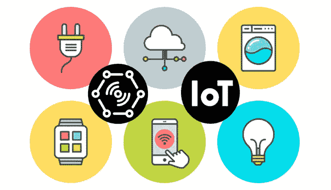

# 利用区块链技术解决物联网安全问题

> 原文：<https://medium.com/hackernoon/resolving-iot-security-issues-with-blockchain-technology-3ffb36357094>

IoT Illustration: threatpost.com

*区块链技术和物联网的应用潜力巨大。这篇文章强调了网络安全。*

区块链技术近年来被越来越多的人采用。许多人赞赏它为[比特币加密货币](https://www.coinreview.com/bitcoin/)和其他加密资产提供底层框架的作用。这已被证明是许多行业所需要的，它的越来越多的采用表明人们越来越认识到这一事实。

**物联网安全挑战**

物联网就是通过系统和链接实时获取和传输大量数据。因为任何企业都需要隐私和安全，所以这里的主要任务是确保所有数据和通信的保护。

现在，想象一下数据在各种集成解决方案和设备之间流动，包括分析能力、机器、设备和平台。此外，数据需要通过各种管理边界，每个边界都有自己的一套策略。在这种情况下，确保物联网系统的安全运行和数据的正确管理变得非常复杂。

此外，除了保护数据之外，确保以正确的方式和时间将数据安全地传送到正确的位置也很重要。

本质上，无论贵公司以何种方式参与物联网生态系统，都会出现一些问题。您将需要应对其中的一些物联网安全挑战。现在，许多公司都在忙于建立适当的安全措施。

**集中式物联网网络的问题**

目前所见的物联网生态系统是一个基于集中式模型的生态系统。这意味着通过提供高数据存储能力的云服务来识别、连接和验证各种设备。即使这些设备被放置在相距两步的地方，互联网仍然充当着信息传递的管道。

在集中式模式中，企业需要处理集成物联网解决方案的高基础设施和维护成本。

此外，需要考虑的一个重要问题是物联网设备的数量。想象一下，当它到达数百万个互联网连接的对象时，成本会增加多少。通信数量也将增加，这将导致可扩展性、经济性和工程方面的问题。

在这些问题被克服的情况下，另一个可能破坏整个网络的瓶颈是云服务的问题。因此，为物联网设备提供安全性将更加困难。

本质上，这意味着如果您选择将集中式模型应用于小型物联网解决方案，就可以实现节约。您可能不会遇到与可伸缩性和维护成本相关的问题。然而，大型物联网生态系统将会看到这些相关问题的出现，并找到解决它们的方法。这需要一种分散的方法。

**区块链技术及其优势**

区块链是一种分布式分类账，维护着越来越多的数据记录和交易。虽然事务是由网络参与者关联的，但它们是以块的形式记录的。这也确保它们以正确的顺序排列，并在添加时分配一个记录时间戳。

由于区块链技术是分散的，因此不需要中央机构或特定的管理员。这种结构不负责批准交易或为交易的使用建立指导原则。随着中介机构的取消，漫长而不方便的银行业务流程可以被绕过，从而降低了成本和时间。

此外，区块链技术基于加密算法，旨在确保防止数据失真并确保高安全性。网络上的每个块都有一个到前一个块的散列，这意味着数据库上的中间块是不可替代的。本质上，虽然一个块可以被扩展，但是你不能改变它。

今天，[区块链各经济部门的技术投资](https://www.coinreview.com/blockchain-technology/)正在上升。从世界各国的[政府](https://www.forbes.com/sites/suparnadutt/2017/12/18/dubai-sets-sights-on-becoming-the-worlds-first-blockchain-powered-government/)、大学和企业来看，似乎越来越多的行业已经看到了他们应该投资这项技术的理由。

**使用分散式区块链方法保护物联网**

最重要的新兴趋势之一是区块链技术和物联网的融合。

物联网网络的分散化将为其提供解决大量安全挑战的能力。该技术的功能，包括可信性、分散性、可扩展性和自主性，使其成为整个物联网生态系统的潜在重要组成部分

在物联网环境中，区块链技术可用于确保多项交易的成功处理、数百万智能设备的跟踪和协调等。

从本质上讲，物联网行业的区块链技术投资可以确保各级数据的正确管理。

此外，由于区块链技术基于密码术，因此将其集成到物联网网络中可以提供额外的隐私和安全性。此外，[区块链科技](https://www.datasciencecentral.com/profiles/blogs/using-blockchain-technology-to-secure-the-internet-of-things-iot?xg_source=msg_appr_blogpost)有序而仔细地记录交易。这意味着可以记录连接设备的历史。

再加上区块链技术不需要中央权威就能运作的事实，你会发现整合的可能性和好处是无穷无尽的。

**两个场景**

现在，使用区块链提供物联网网络安全有两种主要场景。

在第一种情况下，一家公司集成其互联设备以获取和传输数据，然后将它们连接到区块链网络。

该技术为智能设备提供了交换信息、下订单和完成交易的能力。

在第二种情况下，以太坊智能联系人是由一家公司实现的，目的是实现流程自动化。这将在互联设备之间提供无缝、安全的信息交换，就像在区块链的金融交易中一样。

**结论**

虽然使用 Bitmex 信号可以帮助很多人赚钱，但物联网的应用是为了全球利益。这就是物联网技术的深度采用可以在许多方面帮助提升人类的地方。

对整个物联网网络实施区块链分散式方法可以在许多方面提供帮助。它将通过确保各级数据的隐私和保护来确保适当的安全。此外，区块链还可以帮助解决可扩展性问题，并提供系统的有效运行。