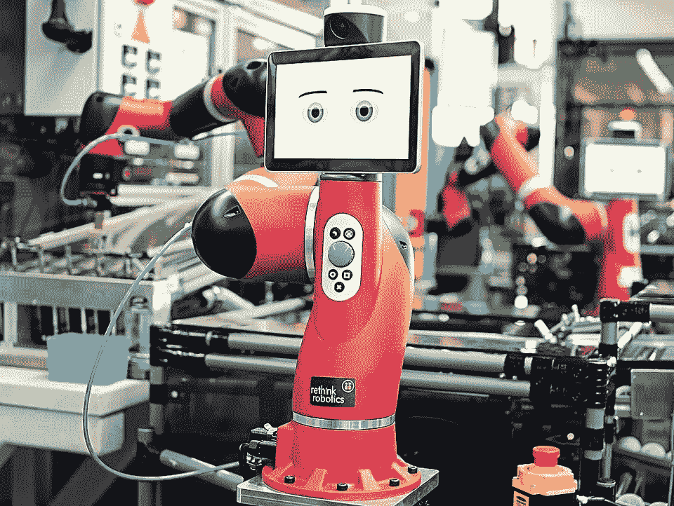
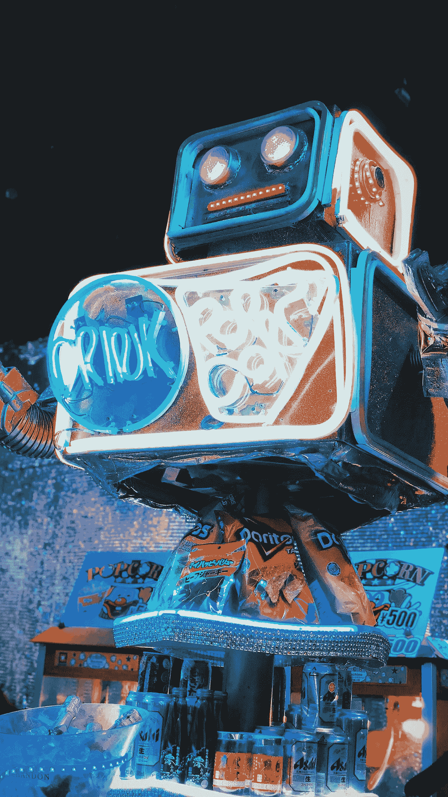

# 机器人初创公司不会成功

> 原文：<https://medium.com/hackernoon/robotics-startups-dont-succeed-cccd35819834>

# 企业家要小心了

撰写人[泽维尔](https://medium.com/u/28487e63a045?source=post_page-----cccd35819834--------------------------------) & [迪杰·杜马达](https://medium.com/u/5cb675a1bfb?source=post_page-----cccd35819834--------------------------------)

Photo by [Dominik Scythe](https://unsplash.com/photos/Sot0f3hQQ4Y?utm_source=unsplash&utm_medium=referral&utm_content=creditCopyText) on [Unsplash](https://unsplash.com/search/photos/robot?utm_source=unsplash&utm_medium=referral&utm_content=creditCopyText)

我们都爱机器人。这就是为什么每年都有数百万人蜂拥而至去看《变形金刚》的最新版本。这就是为什么肯德基决定在他们最新的广告中使用机械战警来保护他们的秘方(老实说，这很奇怪)。我们非常喜欢钢铁侠，所以我们让小罗伯特·唐尼成为复仇者联盟中片酬最高的演员。我们一直很好奇，如果机器人变得司空见惯，世界会变成什么样子，看起来我们不再需要去大屏幕上寻找答案了。到 2023 年，工业机器人市场的全球规模预计将上升至 735 亿美元。工业机器人将变得非常受欢迎。([https://www . statista . com/statistics/728530/industrial-robot-market-size-world wide/](https://www.google.com/url?q=https://www.statista.com/statistics/728530/industrial-robot-market-size-worldwide/&sa=D&ust=1551709441315000&usg=AFQjCNEfyXWDvUVjPAQ0InXXsdY07xTnZQ))

# 为什么机器人初创公司现在准备好要成功了？

**Photo by** [**Andy Kelly**](https://unsplash.com/photos/0E_vhMVqL9g?utm_source=unsplash&utm_medium=referral&utm_content=creditCopyText) **on** [**Unsplash**](https://unsplash.com/search/photos/robot?utm_source=unsplash&utm_medium=referral&utm_content=creditCopyText)

仅仅因为机器人很“酷”并不能真正解释机器人作为一个行业为什么会风起云涌。真正的原因是，机器人已经成为企业多年来面临的许多问题的可行解决方案。[**不断上涨的劳动力成本和较低的劳动力可用性正迫使商业战略家们现在考虑机器人自动化**。今天的机器人将能够全年无休地工作，而不是在工作日一天工作八小时。机器人还提供了提高速度、准确度、精确度和强度的额外好处——更不用说减轻了人力资源部门的负担。受伤和责任的日子已经一去不复返了，因为这些机器人真正被创造出来执行任务，否则对大多数人来说太无聊和危险了。](http://www.dhl.com/content/dam/downloads/g0/about_us/logistics_insights/dhl_trendreport_robotics.pdf)

这种对机器人的商业兴趣并不是什么新鲜事。一个高效的企业总是在寻找降低成本同时增加利润的方法。然而，直到最近，设计和制造机器人仍然太困难和昂贵，不值得投资。但是时代确实变了。

在过去，“哑巴”机器人很快被汽车行业采用，这些行业依赖于装配线或其他简单的重复过程。但是——正如它们的名字所暗示的——这些机器人的功能非常有限，往往过于死板和不适应。由于这些传统机器人的价格如此之高，这项技术只有行业巨头才能获得。传统自动化机器人的起价为 9 万美元，而今天智能得多的机器人的价格约为 3.5 万美元。与传统解决方案相比，这些新型机器人功能更强、适应性更强、更新更容易、部署速度更快。它们是为未来设计的。

由于**技术进步影响了工程研发(R & D)** ，企业主现在可以安心投资机器人自动化。过去，一家公司向客户发布一个工作产品需要几年的研发时间；开发曾经包括太多的阶段和迭代。现在，我们的[计算机辅助设计(CAD)程序让我们可以更智能地设计一切](https://www.scan2cad.com/cad/cad-product-design/)，并在任何东西投入生产之前检查错误。像 Gazebo 这样的软件正在将模拟数字化，让机器人专家在决定建造机器人之前，可以看到他们的机器人将会如何发展。同时，像 [ROS](http://www.ros.org/) 这样的软件已经简化了程序员在传感器和机器人组件之间的通信。[最后，3D 打印技术的创新大大缩短了交付时间，从长达 16 个月缩短到几天，而且成本很低。](http://blog.zmorph3d.com/3d-printing-boost-product-development/)

由于这些新技术，机器人自动化的 R&D 过程发生了革命性的变化，使机器人解决方案成为最实惠的选择。机器人的这种新发现的可访问性及其外围技术的重大进步现在为工业 4.0 铺平了道路——这是一场关于谁能首先完全自动化其设施的狂热。这正在演变成一场类似于军备竞赛的事情。拥有最佳自动化技术的公司现在可以用更少的成本生产更多的产品，那些没有自动化计划的公司可能会倒闭。这是机器人创业公司一直在等待的时刻。现在是他们的全盛时期。

**机器人创业公司为什么不成功？**

Rethink Robotics’ Sawyer collaborative robots on the factory floor at Schramberg in Germany. PHOTO CREDIT: JEFFREY ALAN GREEN

即使有上面提到的所有成功的理由，机器人创业公司仍然失败。为什么？虽然现在开发一个功能机器人肯定更容易，但这并不意味着机器人创业公司一定会成功。我们刚刚见证了 Rethink Robotics 的消亡。这家合作机器人公司于 2018 年 10 月关闭了大门——仅在 1800 万美元的一轮融资后一年。此前，仅在去年一年，一系列其他知名机器人初创公司就迅速落败。那么，为什么尽管有上面提到的所有成功的理由，机器人创业公司还是会失败呢？

**机器人的设计和制造很复杂。**虽然它变得越来越容易，但仍然需要一定水平的专业知识和跨学科技能，而大多数人都不具备。许多机器人企业家问自己的问题是:*我们的银机器的利润值得让它活起来的工作吗？值得花时间去设计和重新设计，去做原型，然后去测试吗？在比代码难编辑 1000 倍的硬件上投入这么多钱和工程人才值得吗？如果第一次没有做对，值得重新开始吗？答案往往是肯定的*不*。即使有犹豫不决的*是*——软硬件弗兰肯斯坦带来的调试足以改变人们的想法。*

赋予机器人生命的过程是一个缓慢而艰苦的过程。这是一个完整的研发运作，即使是老牌公司也难以应对。因此，没有多少工程和商业经验的初次创业者胜算很小。随着时间的流逝，很难保持士气，当你的朋友在一家软件初创公司收集了 100 名新测试用户时，你只能看到你的机器人取得了少量进展。然后你会遇到一位经验丰富的连续创业者，他会过来说，“你投资太多钱，但学得不够快”。所有这些都没有提到，一旦你的市场变得足够大，足以吸引他们的注意力，一家成熟的公司能以多快的速度推出一款可行的产品。

在企业机器人领域，也很容易忘记客户是决策者，而用户是工人。机器人应该让他们的工作变得更容易。然而，许多公司希望只满足高管，因为他们是在一天结束时开支票的人。虽然他们可能会同意加入自动化的行列，但工人们可能不会太欣赏一台只会让工作变得更辛苦并可能降低工资的机器。当心:他们可能是决定是否接受机器人作为解决方案的决定性声音。

最后，机器人创业公司不成功的最大原因很简单，但往往被忽视: ***机器人永远无法替代优质的人力*** 。一个公司的血液是他们的人，他们所做的很多事情不能被分解成机器人功能的步骤列表。他们所做的是一门手艺，他们的一些工作甚至可以被认为是一门艺术。好的企业知道这一点。伟大的企业袖手旁观 it。

# 为什么我们要建立一个机器人创业公司？

Photo by [Alec Favale](https://unsplash.com/photos/2Wasf9zd25A?utm_source=unsplash&utm_medium=referral&utm_content=creditCopyText) on [Unsplash](https://unsplash.com/search/photos/future?utm_source=unsplash&utm_medium=referral&utm_content=creditCopyText)

这些都是阻碍任何机器人创业公司成功的障碍，包括我们的。我们的成功不确定，但可以确定的是未来是自动化的。我们可以喜欢它，也可以不喜欢它，但我们再也不能忽视它了。这并不一定意味着所有的任务和功能都将自动化，因为许多工作不应该自动化。记住，人们在工作中做的很多事情都是一门艺术。

但并不是一个人的工作中涉及的每一项任务都是艺术。实际上，如果你被雇来每周 5 天每天 9 小时从 A 点向 B 点移动箱子，你可能会觉得你的工作重复性比艺术性更强。你甚至可以把它描述为机器人。所有这些可以由机器完成的“机器人”任务——所有无聊、乏味、危险和重复的工作——都应该由机器来完成。人类应该专注于只有人类才能做的较少惩罚和更有创造性的任务。这是一次艰难的跨越，但却是值得的。

> “永不放弃。今天很艰难，明天会更糟，但后天会阳光灿烂。”—马云

机器人有潜力革新生产，催化发现，养活世界，以及许多更令人惊叹的事情，可以将我们这个勇敢的新世界转变为一个更加丰富的世界。通过自动化 3D 打印农场，我们可以让企业和学校更容易获得增材制造。通过[自动化高通量研究](https://labiotech.eu/features/biotech-laboratory-automation/)，我们能够更快地找到改变生活的发现。通过[自动化垂直农场](https://newfoodeconomy.org/vertical-farms-scale-profit/)，我们可以降低让许多农场破产的劳动力成本，让它们专注于养活世界。这就是为什么我们正在建立一家机器人创业公司——因为我们可以看到机器人自动化将帮助我们建立一个更光明的未来。我们希望这也能激励你创造你的机器人。