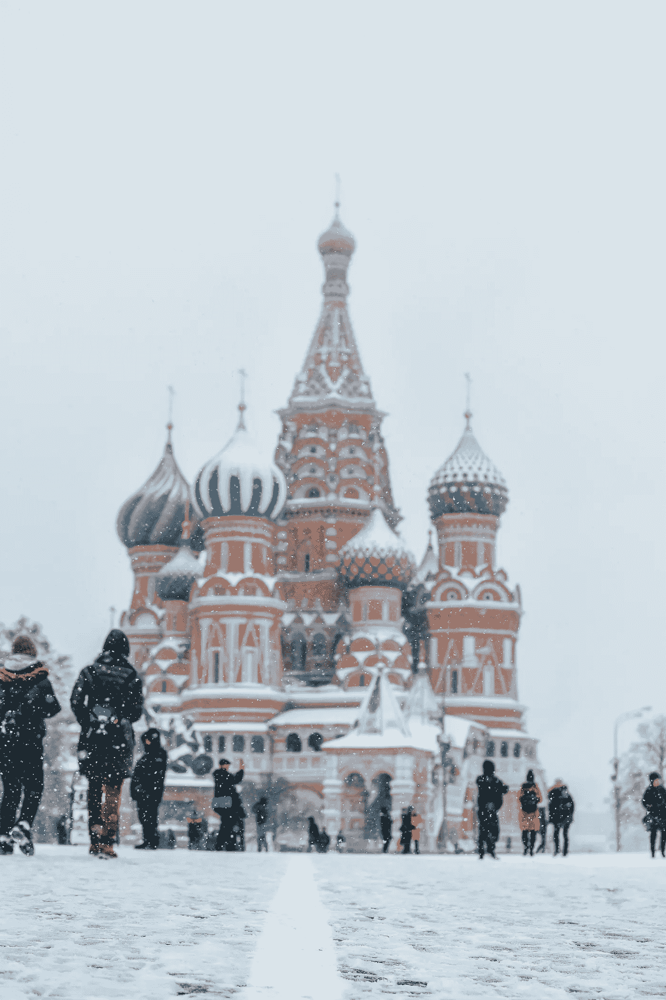
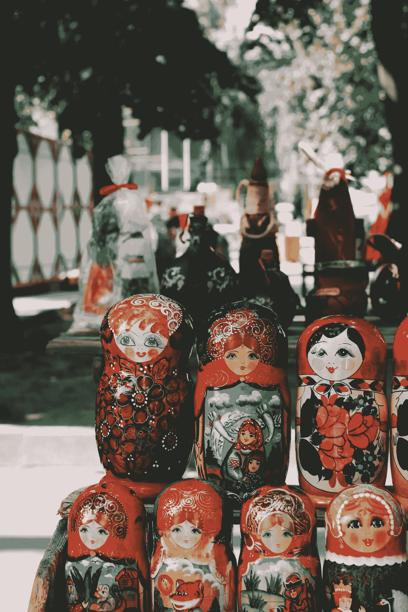
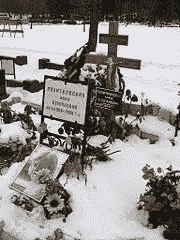
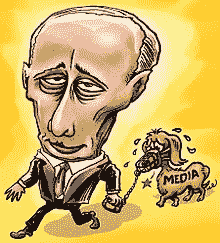

# 俄罗斯对互联网的镇压

> 原文：<https://medium.com/hackernoon/russias-internet-crackdown-a03a762584a6>

普京总统认为他的国家对互联网的控制是俄罗斯从他的对手美国和中国那里获得技术自主的重要一步。然而，对于许多抗议者来说，这一步走得太远了。

Photo by [Tom Grimbert (@tomgrimbert)](https://unsplash.com/photos/oRok9qqdjQ0?utm_source=unsplash&utm_medium=referral&utm_content=creditCopyText) on [Unsplash](https://unsplash.com/search/photos/russia?utm_source=unsplash&utm_medium=referral&utm_content=creditCopyText)

# 新法

对许多人，尤其是西方人来说，这并不奇怪:俄国的独裁领导人弗拉基米尔·普京似乎正在把他的统治和政策带向一个比前几年更加独裁的方向，他的立法者试图通过一项新法案，如果成功实施，将会减少俄国国内的互联网自由。

为了对此进行报复，激进分子已经开始了一系列反对新立法的示威活动。他们认为这是他们的政府试图抑制对政权的公开批评，并在网络审查问题上获得更强有力的控制。

从东西伯利亚到首都，反对这项被称为“主权互联网法案”(sovereign internet bill)的法律修改提案的示威活动不断涌现，所有这些都是为了阻止这项法律在国家杜马(State Duma)获得通过，这项法律需要三轮投票(其中一轮已经通过)。如果这些都成功了，它将被提交到上议院批准。

更多的抗议活动计划在全国其他城市举行。负责这些的是俄罗斯自由委员会(Roskomsvoboda movement)的缩写，它的灵感来自监管该国互联网、通信和媒体活动的政府机构 Roskomnadzor。据报道，普京的死敌、进步俄罗斯未来党领导人亚历山大·纳瓦尔尼的高级助手尼古拉·利亚斯基(Nikolai Lyaskin)曾表示，该法案是当局压制任何形式的互联网自由的又一次努力。他还呼吁俄罗斯人团结起来反对它。Lyaskin 对这个国家的暴行并不陌生，两年前在街上被人用金属管袭击，纳瓦尔尼和其他亲民主领导人认为这是国家批准的对他的袭击。

# 互联网铁幕

随着俄罗斯和西方国家在最近的网络攻击指控上的紧张关系加剧，西方观察家评论说，该法案将在俄罗斯建立一个被称为“互联网铁幕”的防火墙，类似于中国已经发现的防火墙，造成虚拟专用网络(VPN)变得无效的局面。该法案还意味着互联网上的所有流量都将通过基于俄罗斯的服务器提供服务。

对于俄罗斯的言论自由和新生的民主运动，尤其是纳瓦尔尼这样的人——他的政党利用互联网和社交媒体，首先是 YouTube，来传播他的民主信息——这可能是毁灭性的。

因组织反克里姆林宫抗议活动而在狱中度过了 50 多天之后，他于去年年底从监狱获释，对于支持 42 岁的纳瓦尔尼的俄罗斯人来说，这无疑是一个令人担忧的时期，纳瓦尔尼被视为华盛顿和伦敦的主要民主之光。

然而，那些接近普京总统的人支持该法案，认为这种立法可以帮助国家打击任何未来的网络攻击。

其财务成本以及实施的现实是一个正在进行的辩论，但在当今黑客攻击的威胁和网络安全的弱点下，克里姆林宫采取这样的立场并不奇怪。

尽管到目前为止还是非暴力的，但一名为法新社工作的记者报道称看到一名男子*“被从集会上拖走……”*不幸的是，如果抗议升级，更多不愉快的事情只会变得更加普遍。

近年来，审查制度以及随之而来的政府对抗议者的镇压已经不是第一次成为俄国的问题。

自从普京稳定了他的垂直权力层级，并颁布了更多法律来加强这种权力，该国自斯大林和勃列日涅夫最黑暗的日子以来从未出现过的对言论自由的限制和红笔再一次走到了前台。FSB——前克格勃的委婉缩写——被授予全权使用镇压手段自由行使权力。

> 名字可能变了，但方法保持不变。

反俄罗斯的宣传，特别是该国少数群体的反俄罗斯宣传，已经被镇压，要么是关闭同情其事业的报纸或媒体，要么是在极端情况下，克里姆林宫雇佣的暴徒对罪犯进行个人恐吓。

# 谋杀

政治家鲍里斯·涅姆佐夫因反对普京于 2015 年被枪杀，这是最引人注目的案件之一。2006 年，记者兼活动家安娜·波利特科夫斯卡娅在光天化日之下被谋杀。从来没有人因为这些罪行被绳之以法，但是手指，特别是西方媒体，总是指向克里姆林宫。

2009 年，民权律师斯坦尼斯拉夫·马克洛夫和记者阿纳斯塔西娅·巴布罗娃在莫斯科被谋杀。这些都不是孤立的事件。这些年来还有无数其他的。

Grave of murdered journalist Anna Politkovskaya, source: Wiki Commons

记者比这个国家的大多数其他职业更难做好自己的工作——如果做好工作意味着报道真相的话。在今天的俄罗斯，这可能会让你送命，正如波立托夫斯卡娅的垮台所表明的那样。

# 第五纵队的威胁

在普京控制俄罗斯的近 20 年里，一部又一部法律颁布，不仅针对极端恐怖组织的阴险威胁，也针对那些更加无害的社会领域，如新闻出版物、活动团体和同性恋权利运动。

许多专家认为，如果该法律被上议院通过，政府将很难控制任何颠覆性的内容。互联网上的大量材料，以及政府需要监控的人数，超出了政府机构 Roskomnadzor 的范围和资源。

Source: [Welleman](https://commons.wikimedia.org/wiki/User:Welleman) — Own work Creative Commons

随着普京及其亲信对政治活动分子的“第五纵队”和对他的政策的不安的偏执，这样的法律——如果通过，可能会在某种程度上帮助他夺回控制权，尽管根据最近 VTsIOM 民意调查的报告，截至 2019 年 1 月，他在该国的支持率为[33.4%](http://www.intellinews.com/trust-in-putin-slides-to-13-year-low-of-33-4-in-january-155055/)——创下总统的历史新低——他的行动，回想起来，似乎并不令人惊讶。

对于俄罗斯民族主义者，尤其是那些隶属于执政的统一俄罗斯党(United Russia party)的坚定爱国者，罗迪纳等人来说，远离美国和中国科技主导地位的主权俄罗斯互联网的想法可能是一个诱人的前景。这可能意味着，如果外国切断他们的服务器，互联网主权将使该国的网络仍然运行。

然而，许多人认为普京对该法案的叫嚣是白日做梦。

# 昂贵的野心

互联网研究所的总干事阿伦·卡扎良说:

> “但最终，这是行不通的。俄罗斯不是中国。建造这样一个系统非常复杂和昂贵，我们根本没有工程师来实现这个项目。”

Kazaryan 的预测，准确与否，只是众多观点中的一种。普京能否召集人力推进他的意图是另一回事。该国一些专家担心的是，如果他们的领导人成功实施“互联网铁幕”，这将切断俄罗斯在技术和专业知识方面的发展，这在全球范围内令人印象深刻，因为该国拥有高度发达的 it 产业。

> 这个决定可能会让所有的公司走向衰落。

据报道，三月初，有超过 10，000 人走上街头抗议普京的网络审查计划。人群中的大多数人都是受过教育的年轻人——很明显，未来几年，俄罗斯的年轻人、思想家、工程师和设计师在这方面与他们的领导人有着非常不同的想法。

【1783 年 3 月 15 日，乔治·华盛顿将军在给大陆军军官的信中写道:

> “如果言论自由被剥夺，那么沉默寡言的我们可能会像绵羊一样被带到屠宰场。”

这完全是美国式的情绪，不会被当时的俄罗斯帝国领袖凯瑟琳大帝接受。如今，特朗普在演讲台上大声疾呼言论自由，却遭到克里姆林宫对手的嘲笑，我看不出普京还能走什么路。为了加强对权力的控制，俄罗斯的新沙皇将不择手段。

> 而网上铁幕只是众多的第一个。