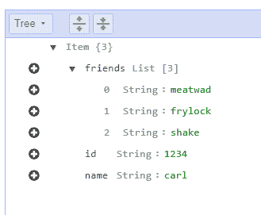
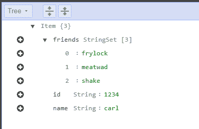
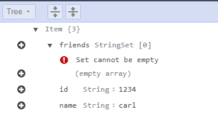

# 使用 DynamoDB 更新安全列表

> 原文：<https://medium.com/hackernoon/safe-list-updates-with-dynamodb-adc44f2e7d3>

亚马逊 DynamoDB 是 AWS 上最通用、最受欢迎的服务之一。在几秒钟内，我们就可以部署一个具有全局复制、事务和[更多功能的高度可用、动态扩展的密钥文档存储库](https://aws.amazon.com/dynamodb/features/)！但是，如果我们修改文档的列表属性，我们需要采取额外的步骤来实现正确性和并发性。下面，我将描述这个问题，并提供几种解决方案。

Are your list updates safe?

*全* [*码*](https://gist.github.com/robzhu/3a6017c85758a682c759176f92e00fa7) *如果你想跟着一起。*

让我们澄清一下这个问题。假设我们使用 [JavaScript AWS-SDK](https://aws.amazon.com/sdk-for-node-js/) 和 [DynamoDB DocumentClient](https://docs.aws.amazon.com/AWSJavaScriptSDK/latest/AWS/DynamoDB/DocumentClient.html) 插入以下文档:

在 DynamoDB 控制台中，文档如下所示:

默认情况下，DocumentClient 将 JavaScript 数组封送为 DynamoDB 列表类型。我们如何从“朋友”列表属性中删除值“frylock ”?这是列表的[删除操作](https://docs.aws.amazon.com/amazondynamodb/latest/developerguide/Expressions.UpdateExpressions.html#Expressions.UpdateExpressions.REMOVE)上的单据。因为我们需要指定要删除的元素的索引，所以我们需要阅读文档并找到索引:

但是这个实现有一个竞争条件；在读取文档、查找索引和发送更新请求之间有一小段时间，在这段时间内，文档可能被另一个源更新，从而导致操作“删除索引 X 处的元素”产生不希望的结果。这个问题也被称为[事务内存](https://en.wikipedia.org/wiki/Transactional_memory)。幸运的是，有几种解决方案。

## 列表内容的条件表达式

DynamoDB 支持一个叫做[条件表达式](https://docs.aws.amazon.com/amazondynamodb/latest/developerguide/Expressions.ConditionExpressions.html)的便利特性，它让我们指定一个必须满足的条件，以便执行操作。在这种情况下，我们希望构建一个规则，规定“仅当目标值在列表中时才执行该操作”:

A Condition Expression is a predicate that prevents execution if it evaluates to false

我们还需要处理不满足条件表达式的错误情况。下面是更新后的函数:

这种技术只能确保对列表属性的更新是安全的。我们如何确保只在文档没有改变时应用更新？

## 版本属性上的条件表达式

借用使用[多版本并发控制](https://en.wikipedia.org/wiki/Multiversion_concurrency_control)的数据库，我们可以在文档的根引入一个“版本”属性。我们可以使用 version 字段来设置一个条件表达式，以便在发生任何其他更新时中止更新。在 put 操作期间，我们可以包含一个初始版本属性，如下所示:

让我们更新条件表达式并添加错误处理:

请注意，更新表达式还增加了版本属性。这种方法的两个缺点是:

1.  我们需要为每个想要实施这种模式的文档/表格添加一个版本属性。
2.  我们需要创建一个包装层，确保所有更新都尊重版本属性，并教育团队禁止直接更新操作。

## 使用设置的数据类型

在实践中，朋友列表将存储唯一外键的列表。如果我们知道条目是唯一的，我们可以将 friends 字段作为 [DynamoDB 集合数据类型](https://docs.aws.amazon.com/amazondynamodb/latest/developerguide/HowItWorks.NamingRulesDataTypes.html#HowItWorks.DataTypes)而不是列表进行封送。与列表相比，集合有一些不同之处:

1.  所有值必须属于同一类型(字符串、布尔值、数字)
2.  所有值必须是唯一的
3.  要从集合中删除元素，使用删除操作，指定一个值的*集合*
4.  集合不能为空

听起来非常适合存储相关文档键的列表。然而，我们看到 DocumentClient 将 JavaScript 数组序列化为列表，因此我们需要用一个定制的[封送拆收器](https://docs.aws.amazon.com/AWSJavaScriptSDK/latest/AWS/DynamoDB/Converter.html#marshall-property)来覆盖该行为。

*注意:文档中的示例使用了一个“DynamoDBSet”类，但这似乎不能作为 aws-sdk JS npm 模块的导入。相反，我们将使用 DynamoDB.createSet 函数，它完成同样的事情:*

在控制台中，我们的新文档看起来几乎相同，除了 friends 属性上的“StringSet”类型。

现在指定删除操作:

使用 JavaScript 中的集合有两个问题。首先:文档中的 set 属性不会反序列化到 JavaScript 数组中。让我们看看它实际返回了什么:

啊哈！DynamoDB 集反序列化为一个对象，其项数组存储在 values 属性下。如果我们希望将一个集合反序列化为一个数组，我们需要添加一个解组步骤，在这个步骤中，我们分配 values 属性，而不是反序列化的集合对象本身。

第二:还记得集合不能为空吗？如果我们试图从集合中删除所有元素，控制台会阻止我们:

The console prevents us from deleting the last element from an existing set, but the SDK does not.

然而，如果我们从代码集中删除最后一个元素，*属性将从文档*中删除。这意味着我们在问题 1 中提到的解组步骤需要考虑属性未定义的情况。这里有一个涵盖这两种情况的帮助函数:

如果您试图将一个空数组存储为一个集合，您仍然会得到一个错误，所以下面是 helper 函数的另一种方式:

## 全局写锁

让我们不要忘记历史悠久的预防问题而不是解决问题的传统。只有当我们允许并发写入时，事务内存才是一个问题。我们可以通过要求任何写入者获得分布式写锁(使用分布式锁服务，如 [etcd](https://github.com/etcd-io/etcd/blob/master/Documentation/dev-guide/api_concurrency_reference_v3.md#service-lock-etcdserverapiv3lockv3lockpbv3lockproto') 或 [zookeeper](https://zookeeper.apache.org/doc/r3.1.2/recipes.html#Shared+Locks) )来避免并发写入。

由于全局写锁模式有许多实现，我将省略示例代码，直接讨论权衡。

这种技术有两个明显的缺点:1)分布式锁服务增加了额外的复杂性和延迟。2)全局写锁减少了写吞吐量。如果您已经在使用分布式锁服务，并且不需要高写吞吐量，那么这个解决方案值得考虑。

## 交易呢？

DynamoDB 最近增加了对多文档[事务](https://aws.amazon.com/blogs/aws/new-amazon-dynamodb-transactions/)的支持，这听起来是一个很有前途的解决方案。但是，正如我的同事达尼洛所说:

> 在交易过程中，项目不会被锁定。DynamoDB 事务提供可序列化的隔离。如果在事务进行过程中在事务外部修改了某个项，则该事务将被取消，并引发一个异常，其中包含导致该异常的项的详细信息。

对于这个用例，事务本质上就像一个较慢版本的条件表达式。

## 就这些了，伙计们

这是我们迄今为止编写的所有代码的要点。你有更好的方法来实现安全列表更新吗？请在评论中分享。我希望这能帮助你充分利用 DynamoDB 和 happy hacking！