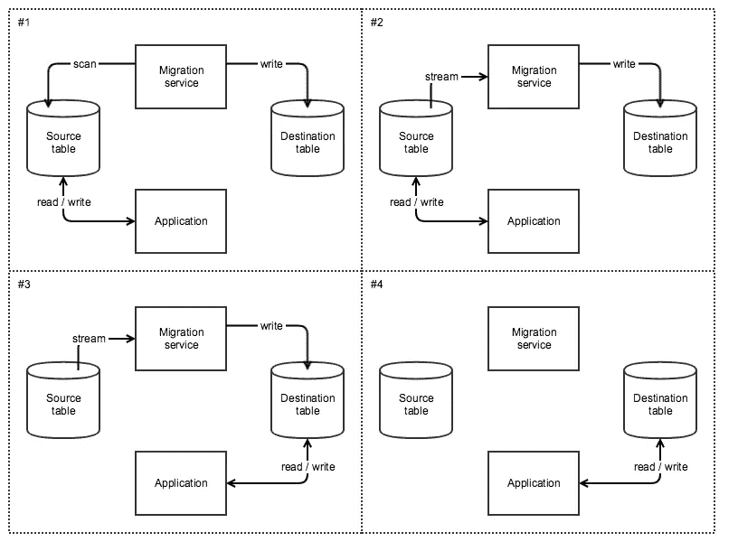
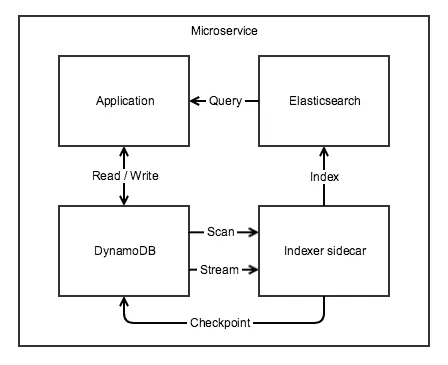

# 搜索 DynamoDB:用于弹性搜索的索引器侧架

> 原文：<https://medium.com/hackernoon/searching-dynamodb-an-indexer-sidecar-for-elasticsearch-6e70f2abf676>

TLDR；

*   DynamoDB 很棒，但是分区和搜索很难
*   我们建立了交流发电机和迁移服务，让生活更轻松
*   我们开源了一个 sidecar 来索引 Elasticsearch 中的 DynamoDB 表，你应该会用到。代码如下。

三年多前，当我们开始使用 Bitbucket 管道时，我们几乎没有使用 NoSQL 数据库的经验。但是作为一个寻求快速生产质量的小团队，我们决定将 DynamoDB 作为一个具有高可用性和可伸缩性的托管服务。三年过去了，我们已经学到了很多关于如何使用和不使用 DynamoDB 的知识，并且我们已经开发了一些可能对其他团队有用或者可以被不断发展的平台所吸收的东西。

# 去 NoSQL 还是不去 NoSQL，这是个问题

首先，关系数据库不是狼人，NoSQL 也不是银弹。关系数据库已经为大规模应用服务了多年，并且它们的扩展远远超出了许多人的预期。举例来说，Atlassian 的许多团队继续选择 Postgres 而不是 DynamoDB，并且有许多完全正当的理由这样做。希望这篇博客能够强调选择一种技术而不是另一种技术的一些原因。在高层次上，它们包括诸如操作开销、表的预期大小、数据访问模式、数据一致性和查询要求等考虑因素。

# 隔板，隔板，隔板

很好地理解[分区是如何工作的](https://shinesolutions.com/2016/06/27/a-deep-dive-into-dynamodb-partitions)可能是成功使用 DynamoDB 最重要的事情，也是避免可怕的[热分区问题](https://cloudonaut.io/dynamodb-pitfall-limited-throughput-due-to-hot-partitions)的必要条件。如果做错了，可能意味着重构数据、重新设计 API、全表迁移，或者在将来系统达到临界阈值时更糟。当然，一个表的分区是不可见的——你可以根据一个表的吞吐量和大小来计算它们，但是这是不准确的，麻烦的，而且我们发现，如果你按照[最佳实践开发者指南](https://docs.aws.amazon.com/amazondynamodb/latest/developerguide/bp-partition-key-design.html)的建议设计了良好分布的键，这是完全没有必要的。幸运的是，我们从一开始就花时间去理解分区，并设法避免了这些问题。作为一个额外的好处，我们现在能够利用自动伸缩，而不用担心分区边界，因为即使分区发生变化，请求仍然均匀分布，吞吐量也在它们之间重新分配。

# 吞吐量、突发和节流

对 DynamoDB 表的读写受到为该表配置的[吞吐量](https://docs.aws.amazon.com/amazondynamodb/latest/developerguide/HowItWorks.ProvisionedThroughput.html)的限制。吞吐量还决定了如何对表进行分区，它会影响成本，因此有必要确保您不会过度配置。DynamoDB 允许在开始限制请求之前的一小段时间内超过吞吐量限制，虽然被限制的请求可能会导致应用程序中的操作失败，但我们发现这种情况很少发生，因为 DynamoDB 的[AWS SDK](https://docs.aws.amazon.com/amazondynamodb/latest/developerguide/Programming.SDKOverview.html)中有默认的重试配置。这一点特别令人放心，因为 DynamoDB 中的[自动缩放](https://docs.aws.amazon.com/amazondynamodb/latest/developerguide/AutoScaling.html)被设计延迟，并允许吞吐量在足够长的时间内超过容量，从而可能发生节流。

> *DynamoDB auto scaling 仅在实际工作负载持续升高(或降低)几分钟时，才会修改调配的吞吐量设置。应用程序自动缩放目标跟踪算法旨在将目标利用率长期保持在或接近您选择的值。*
> 
> *突发的、短时间的活动高峰被桌子内置的突发容量所容纳。*

您仍然希望在超过吞吐量时设置警报，以便在必要时进行监控并采取相应措施(例如，自动扩展有上限)，但我们发现突发容量、默认 SDK 重试、自动扩展和[自适应吞吐量](https://www.youtube.com/watch?v=kMY0_m29YzU)非常有效地结合在一起，因此很少需要干预。


[Source](https://www.carid.com/quality-built/alternator.html)

# 交流发电机:DynamoDB 的对象-项目映射库

在管道获得了绿灯，可怕的 alpha 代码的重构开始后，我们首先构建的东西之一是 alternator:dynamo db 的内部对象-项目映射库(类似于 ORM)。交流发电机从应用程序中抽象出 AWS SDK，并提供基于注释的反应式(rx Java——尽管目前仍在幕后使用阻塞式 AWS API，直到 SDK 的 v2 变得稳定)接口来与 DynamoDB 交互。它还通过 Hystrix 添加了电路中断，删除了系统早期版本中出现的大量样板代码。

```
@Table(
    name = “pipeline”,
    primaryKey = @PrimaryKey(hash = @HashKey(name = “uuid”))
)@ItemConverter(PipelineItemConverter.class)
public interface PipelineDao {
    @PutOperation(conditionExpression = “attribute_not_exists(#uuid)”)
    Single<Pipeline> create(@Item Pipeline pipeline);
}
```

# 迁移服务

DynamoDB 表当然是无模式的，但是这并不意味着您不需要执行迁移。除了在表中添加或更改属性的典型数据迁移之外，还有许多只能在第一次创建表时配置的功能，例如本地辅助索引，它对于查询和排序除主键之外的其他属性很有用。

管道中最初的几次迁移涉及编写定制代码，将大量数据移动到新表中，并与应用程序中通常复杂的更改同步，以支持新旧表，从而避免停机。我们很早就知道有一个迁移策略可以消除很多摩擦，所以迁移服务诞生了。

迁移服务是我们为迁移 DynamoDB 表中的数据而开发的内部服务。它支持两种类型的迁移:

1.  用于在现有表中添加或修改数据的相同表迁移。
2.  将数据移动到新表的表到表迁移。

迁移的工作方式是扫描源表中的所有数据，通过一个转换器(特定于发生的迁移)传递数据，并将其写入目标表。它使用一个[并行扫描](https://docs.aws.amazon.com/amazondynamodb/latest/developerguide/bp-query-scan.html#bp-query-scan-parallel)来在一个表的分区中平均分配负载，并最大化吞吐量，以在尽可能短的时间内完成迁移。



表到表的迁移然后附加到源表的[流](https://docs.aws.amazon.com/amazondynamodb/latest/developerguide/Streams.html)以保持目标表的同步，直到您决定切换到使用它。这允许应用程序直接切换到使用新表，而不必在迁移期间同时支持旧表和新表。

# DynamoDB 中的查询:心痛和痛苦的故事

DynamoDB 通过[本地和全局二级索引](https://docs.aws.amazon.com/amazondynamodb/latest/developerguide/SecondaryIndexes.html)提供有限的查询和排序能力。表被限制为五个本地二级索引，每个索引与表的主键共享相同的分区键，一次只能对一个索引执行查询操作。这意味着在按电子邮件地址分区的“用户”表上，查询操作只能在电子邮件地址和另一个值的上下文中执行。

全局二级索引消除了分区键需求，代价是增加了第二批吞吐量，并且只支持最终一致的读取。这两种类型的索引对于许多用例都是有用的和足够的，并且管道继续广泛地使用它们，但是它们不能满足一些应用程序的更复杂的查询需求。在管道中，这种需求主要来自我们的 REST API，它通常允许客户端同时对多个属性进行过滤和排序。


[Source](https://www.scooterworks.com/Sidecar-10-Wheel-Rocket-Vespa-Large-Frame-Stella-P11587.aspx)

# 我们的解决方案

我们解决这个问题的第一次尝试 MultiQuery 内置于交流发电机中。通过这种方法，我们查询了多个本地二级索引(LSI ),并在内存中汇总了结果，从而允许我们在一个 API 请求中对多达五个值(LSI 的最大数量)执行过滤和排序。虽然这在当时是可行的，但随着我们的表的规模和指数级增长，过滤的值越多，它的性能就开始下降。在 multi query 被取代之前，我们的端到端测试存储库(有大量管道的存储库)上的 pipelines list 页面需要几十秒的时间来响应，并且在分支过滤时总是超时。

搜索 DynamoDB 内容的一种常见模式是在搜索引擎中对其进行索引。AWS 方便地提供了一个 [logstash 插件](https://aws.amazon.com/blogs/aws/new-logstash-plugin-search-dynamodb-content-using-elasticsearch)用于索引 Elasticsearch 中的 Dynamo 表，所以我们开始使用这个插件创建一个索引服务，结果令人鼓舞。查询性能如预期的那样有了很大的提高，但是 logstash 插件还有很多不足之处，需要花费近 11 个小时来索引 700，000 个文档。

对 logstash 插件的一些分析以及我们已经在迁移服务中构建了本质上是高性能索引器的认识，引导我们用自定义索引器实现替换 logstash 插件。我们的索引器主要基于迁移服务的相同扫描/流语义，并利用 Elasticsearch 的批量索引 API，设法在 27 分钟内浏览了近 700 万个文档。

# 步进器边车

自定义索引器后来被重新打包成一个 sidecar，允许任何服务应用程序无缝索引 Elasticsearch 中的 DynamoDB 表。初始扫描和正在进行的流阶段都通过租用/检查点机制(为扫描定制，流的标准 kinesis 客户端)变得高度可用和可恢复。



我们目前利用由 Bitbucket code search 团队构建的优秀的 [elasticsearch 客户端](https://bitbucket.org/atlassian/atlassian-elasticsearch-client)来查询索引，并且已经开始了内部库的工作，该库增加了 RxJava 和 Hystrix，与 alternator 一样。

这里是回购与[的代码和一个自述](https://bitbucket.org/atlassian/dynamodb-elasticsearch-indexer)。

# 最后的想法

如果你以前没有使用过 NoSQL，这肯定需要一个思维转变，但总的来说，我们对 DynamoDB 的体验是积极的。在过去的三年里，这个平台已经被证明是非常可靠的(我不记得它引起过一次重大事故)，我们最大的挑战来自于我们的查询需求。有些人可能会说这是首先选择关系数据库的充分理由，我不会强烈反对他们。但是我们已经成功地用一个解决方案克服了这个问题，这个解决方案在很大程度上是从日常运营中抽象出来的。从好的方面来说，我们一直都没有运行解释查询，也没有处理格式不良的 SQL、复杂的表连接或缺失的索引，而且我们也不急着回去。

这篇文章由萨姆·坦努斯撰写。Sam 是 Atlassian 的高级软件工程师，是将 CI/CD 管道引入 Bitbucket cloud 的团队成员之一。他拥有超过 15 年的行业经验，与人合著了 3 项专利，维护了 1 个开源项目，并拥有向最终用户成功交付大规模基于云的应用程序的记录。在 [*linkedin*](http://www.linkedin.com/in/samuel-tannous) *上和他联系。*

*原载于 2019 年 3 月 28 日*[*bitbucket.org*](https://bitbucket.org/blog/searching-dynamodb-indexer-sidecar-elasticsearch)*。*