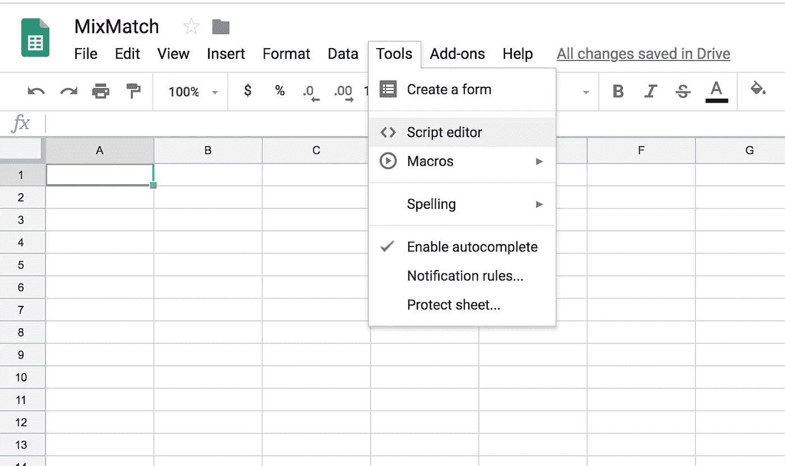
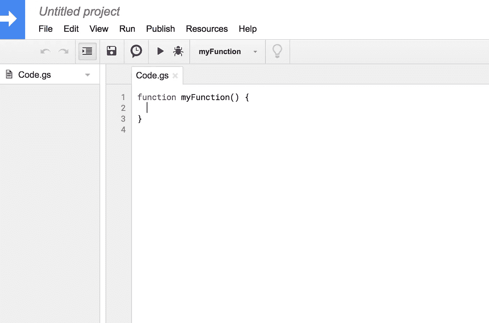
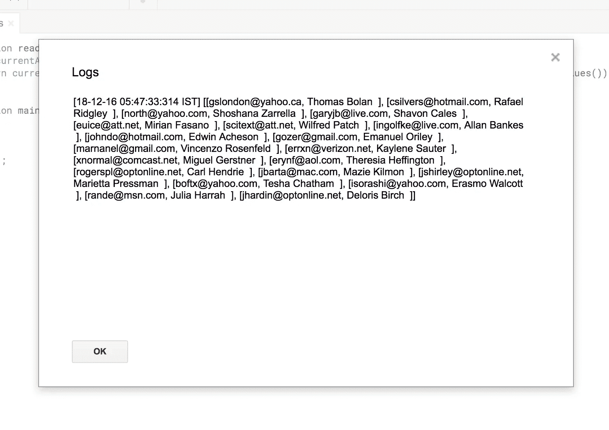

# 用 Google Sheets 和 Apps 脚本解决秘密圣诞老人混搭问题

> 原文：<https://medium.com/hackernoon/secret-santa-mix-match-with-google-sheets-and-apps-script-hashnode-6a7255bbd438>


> 最初发布于[hash node](https://medium.com/u/8ff45ee92f18?source=post_page-----6a7255bbd438--------------------------------):[https://hash node . com/post/secret-Santa-mix-match-with-Google-sheets-and-apps-script-cjptefe 1d 00 rikas 2 z 9 Joel QA](https://hashnode.com/post/secret-santa-mix-match-with-google-sheets-and-apps-script-cjptefe1d00rikas2z9joelqa)

***Google Apps 脚本一直是影子里的工具。许多开发人员不知道这种基于 JavaScript 的强大脚本语言。在本教程中，我将向你展示如何使用 Google Sheets 构建一个非常简单的秘密圣诞老人混搭。***

所有参考链接、代码、随机生成器都列在文章底部。

# 问题是

你有一个巨大的名单，上面有人们的名字/电子邮件/无论什么，现在你想洗牌，然后随机分配他们各自的合作伙伴。

这可能是一项非常耗时的任务，但是我将向您展示如何自动化这个过程，而不是手动完成。

# 解决方案

Google Apps Script 是一种鲜为人知的基于 JavaScript 的轻量级应用程序编程语言，它允许你自动化整个 Google G-suite 并为其构建附加组件。在本教程中，我将教你如何处理谷歌表和自动化一些事情。

在[sheets.google.com](http://sheets.google.com/)中创建一个新的电子表格，让我们称之为 MixMatch，在列中填入用户的电子邮件和他们各自的名字。


接下来，点击脚本编辑器，一个新的标签将打开一个编辑器。



删除内容，重新开始。

# 我们需要完成的步骤

1.  读取当前打开的电子表格中的数据。
2.  排列和打乱数据。
3.  将其保存在新的工作表中
4.  如果需要，通过电子邮件向每个人发送他们各自合作伙伴的详细信息。

# 步骤 1:从工作表中获取数据

```
function readCurrentSheet() { var currentActiveSheet = SpreadsheetApp.getActiveSheet(); Logger.log(currentActiveSheet.getDataRange().getValues()); return currentActiveSheet.getDataRange().getValues(); }
```

`SpreadsheetApp.getActiveSheet()`是 Apps 脚本提供的 API。你可以在这里了解更多信息[。](https://developers.google.com/apps-script/reference/spreadsheet/sheet)

这将返回一个`Range`对象，但是我们需要的是工作表中的数据。为此，我们可以使用`getValues()`方法返回一个多维数组的单元格值。

`Logger.log()`就像是 Javascript 的`console.log()`。您可以使用它来记录数据并验证它。您可以通过单击菜单栏中的查看下拉菜单或使用 ctrl + enter 来查看日志。

当你输入上述函数并点击保存时，点击保存(ctrl+ s)。系统将提示您输入项目名称，填写后继续。

现在，在顶部菜单栏中选择您想要运行的功能。这将运行该函数，并请求您允许访问该表。登录您的帐户，您会看到一个安全错误。别担心，继续吧。是你在访问你自己的表，所以不用担心。



*运行 readCurrentSheet()函数，查看日志。*

# 第二步:打乱数据

现在我们有了数据，我们要做的就是把它混合起来。

```
function shuffle(array) { var currentIndex = array.length, temp, randomIndex; while (0 !== currentIndex) { randomIndex = Math.floor(Math.random() * currentIndex); currentIndex -= 1; temp = array[currentIndex]; array[currentIndex] = array[randomIndex]; array[randomIndex] = temp; } return array; }
```

我们有一个由工作表中的数据行组成的数组。现在我们必须把它一分为二，保存在一个新的工作表中。这里的问题是，人 A 送礼物给 B，现在人 C 应该送礼物给 A，而不是 B。因此，我们将不得不洗牌后半部分，并将其作为送礼物者分配回第一个列表。

# 步骤 3-在最终工作表中保存数据

循环遍历并将混洗后的数组追加到新的工作表中。

```
var firstHalf = shuffledList.splice(0, shuffledList.length/2); var newShuffledGivers = [].concat(firstHalf); var newShuffledGivers = shuffle(newShuffledGivers); var newSheet = SpreadsheetApp.getActiveSpreadsheet().insertSheet('Final list'); for(var i=0; i<firstHalf.length; i++){ temp = []; temp = temp.concat(firstHalf[i] || ['','','']).concat(shuffledList[i]).concat(newShuffledGivers[i] || ['','','']); newSheet.appendRow(temp); }
```

您现在将有一个名为“最终列表”的新表，其中包含每个用户及其各自合作伙伴的详细信息。如果您再次运行这个脚本，这意味着您已经有一个名为“最终列表”的脚本，它将抛出一个错误。因此，请确保在再次运行之前删除工作表，或者修改脚本以更新脚本。

# 步骤 4 —向参与者发送电子邮件

Google Apps 脚本太酷了，你甚至可以在这个脚本中发送电子邮件。

```
MailApp.sendEmail(TO_EMAIL_ADDERSS, TITLE_HERE, MESSAGE_HERE);
```

内置邮件的最终功能。

```
var newSheet = SpreadsheetApp.getActiveSpreadsheet().insertSheet('FinalList'); for(var i=0; i < firstHalf.length; i++){ temp = []; temp = temp.concat(firstHalf[i] || ['','','']).concat(shuffledList[i]).concat(newShuffledGivers[i] || ['','','']); MailApp.sendEmail(firstHalf[i][0], 'You secret santa partner', 'Hello there, your secret santa partner is ' + shuffledList[i][1]); MailApp.sendEmail(shuffledList[i][0], 'You secret santa partner', 'Hello there, your secret santa partner is ' + newShuffledGivers[i][1]); newSheet.appendRow(temp); }
```

最后，你会有一个这样的列表。确保在点击运行前选择功能`main()`


*Yellow to green, Green to Red*

这个脚本实际上需要 15 分钟来编写，并且做了大量的工作。然而，它并不完美，我们需要处理随机性和覆盖边缘情况，但我们不会在本教程中这样做。想象一下用它来完成更大的任务，自动化你的业务，甚至为你的公司建立一个小型的 CRM。下次不要为你的客户构建一个庞大的工具，试试应用程序脚本。

我希望这能帮助你开始使用臭名昭著的 Google Apps 脚本，并帮助你理解如何使用它。应用程序脚本可以做更多的事情，例如，从 docs、sheets 托管网站，与 Firebase 交互…G-suite 的大多数附加组件都是使用应用程序脚本构建的。

如果项目变大，甚至有一个 CLI 和版本控制来管理您的项目。查看[本文介绍](/@theevilhead/clasp-the-clasp-google-appsscript-cli-d3389aaa302b)和[主要文档](https://developers.google.com/apps-script/guides/clasp)。

你可以在这里看到最终的脚本，并一瞥整个设置。(在运行该脚本之前，请对邮件部分进行注释，因为这些是假邮件)

如果你觉得这有用，请告诉我，并随时与你认为可能需要的人分享这个教程😎✌

*最初发表于*[*【hashnode.com】*](https://hashnode.com/post/secret-santa-mix-match-with-google-sheets-and-apps-script-cjptefe1d00rikas2z9joelqa)*。*