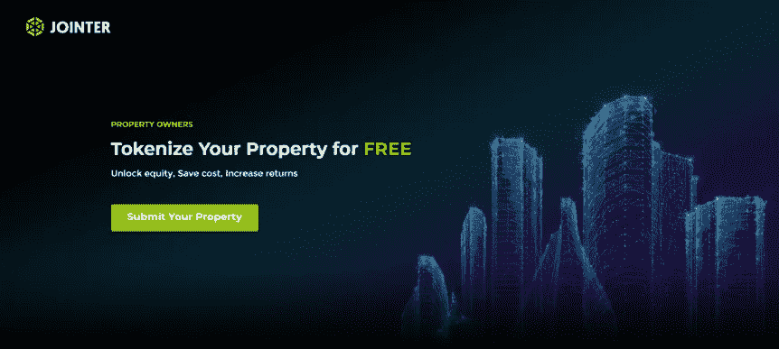

# 区块链驱动的房地产投资创业公司的种子阶段增长战略

> 原文：<https://medium.com/hackernoon/seed-stage-growth-strategy-for-a-real-estate-investment-startup-powered-by-blockchain-c0312a341768>

标记化是我已经着迷了一段时间的新奇事物。在 2018 年被过度宣传，但还不算数。

这里的整个想法是，你把已经存在的东西(如房地产)放在区块链上，这样你就可以买卖代表其价值的代币。

我认为区块链下一阶段的大趋势之一将是那些真正合法地应用符号化的公司。也就是说，公司不会为了令牌化而简单地将某样东西做成令牌。相反，那些创造有用和增值产品的公司只有通过区块链的代币才有可能。

属于这一类的公司之一是 [Jointer](https://www.jointer.io/) 。用他们自己的话说，他们是这样工作的:

> *Jointer 提供免费的端到端令牌化解决方案，允许您在承担监管、流动性和营销责任的同时释放股权。*

嗯。听起来很有趣。据我所知，他们从业主手中购买房地产股权，然后将其转化为代币，可以像股票一样公开、快速地买卖。

# 因此，让我们来简要分析一下他们目前的数字化现状:

他们的网站是使用代码和引导定制的。它看起来不错，而且运行良好。作为一名营销人员，我喜欢看到一个 CMS(最好是 WordPress)，但这个设置是体面的，可能会工作到现在。

他们只有 350 万的 Alexa 排名，没有来自 SimilarWeb 的可见流量。我希望看到改进的地方。

部分原因是他们糟糕的技术搜索引擎优化。用 Moz Bar 快速扫描显示没有 H1 和元描述。呀。

此外，他们在许多网页上的 URL 结构很奇怪。有了/beta/这样的路径，感觉更像是根据需要拼凑起来的，而没有过多考虑网站应该如何作为一个整体组合在一起。

他们的菜单也有一些选项是灰色的。如果没人能点击它们，我不喜欢把它们放在那里。

不过，抛开负面因素不谈，它们的价值支柱是稳固的，尽管有一点隐藏的观众倾向。

他们的 CTA 扎实而直接。

他们的主页上有一个非常好的竞争对手比较表。我想看看他们与传统贷款人以及密码公司的对比。但除此之外，还不错。

最后，他们的应用程序本身看起来很棒，尽管有点粗糙。看上去和感觉上都像一个真正的，合法的 MVP。功能足够的设计和用户界面/UX 思想，使用户体验感觉良好。这些家伙在 MVP 的经历上是正确的。脱帽致敬。

# 高水平增长战略:

对这些人来说，市场的最大障碍将是这个产品有多复杂。他们有多种用户类型，这些类型都受到监管，并以不同的方式纳入平台。

这些都是他们在网站上自我描述的角色:

*   财产所有者
*   投资者
*   贷方
*   赞助商
*   贷款经纪人
*   CRE 代理
*   保险业者
*   加入
*   团体投资人

喜欢他们把自己的角色这样设定。但是伙计，这是复杂的。在 app 中，业主被细分为几种不同的财产类型，这就更复杂了。即多户住宅、商业地产等。

天哪，太多选择了。通过营销努力来单独针对这些人物角色是很昂贵的。但是，另一方面，随着所有这些用户类型的丰富，他们将受益于大规模的网络效应。继续前进。

我想看到这些家伙清理他们的一些复杂和密码为重点的语言。他们需要更好地与可能使用该产品的普通人交流。人们不需要了解区块链是如何工作的。

当有人注册你的 SaaS 产品时，我们是否解释了 SaaS 应用数据库是如何工作的？不，区块链也是如此。它又酷又新，但最终用户并不关心它是如何工作的。他们只关心它能为他们做什么。

这个网站上使用的语言是半途而废。很清楚，而且分解得很好。但仍有一个明确的秘密受众的重点。随着他们继续获得牵引力并扩大规模，这将成为更大市场的障碍。

最后，我认为增长的主要障碍是教育人们这到底是什么。

我可以看到一些问题，比如让房主直接进入房屋评估应用程序，成功地保护信息，发送报价，然后看到不知道他们注册了什么的用户疯狂流失。

这是大多数人不了解的新技术。这些人最感兴趣的是确保他们尽可能地教育更多的人了解他们技术的可能性。

# 一些建议的增长策略

首先，每个人物角色都有自己追求的渠道，但在用户获取上最大的杠杆点大概就是公关和媒体。他们的房主受众足够多，因此他们的影响力非常大。他们的故事非常有趣，我认为他们可以在许多出版物、电视节目、博客、播客等中得到报道。

第二，谷歌广告。这是显而易见的人寻找出售或抵押自己的家园。同样，其他角色也是有针对性的。

第三，Outbrain/Taboola。影响力在那里，观众在那里，这是足够新颖的，他们可以通过这个渠道有很多吸引力。

第四，脸书广告。人口统计目标定位功能可以用正确的信息击中正确收入阶层的房屋所有者。例如，低收入阶层的人可能对赚外快更感兴趣。高收入阶层可能对释放股本和增加流动性更感兴趣。针对房地产市场的不同领域定制这一信息，可能会比一刀切地列出所有人的清单产生更大的效果。

第五，内容营销。我觉得这是比这里其他渠道低很多的挂果，但还是值得追求的。也就是说，他们将面临来自其他贷款和房地产公司的漏斗底部核心关键词的激烈竞争。因此，他们将不得不更加努力地争取排名。

第六，广告牌。合法的，线下的，实体广告牌。同样，这种产品在业主一方有很大的受众。像这样的广告牌会击中正确的人。我认为这是一个值得尝试的想法。

第七，直邮和上门传单。当涉及到财产所有者时，在他们的实际家中联系他们会非常有效。类似于我们为周日订阅的 lawncare 服务所做的分析，我认为这些人也可以采用这种策略。

第八，创造性的视频广告，解释这个产品是什么和它提供的价值。视频是一个性价比很高的渠道，因为大部分人不懂。它也是讲述故事和解释复杂概念的绝佳媒介。雇佣合适的创意故事大师(比如我的孩子[迈克·基尔科因](https://www.linkedin.com/in/mikekilcoyne/))可以创造奇迹，接触到以前未开发的观众。

总的来说，这是一家非常酷和新颖的公司。到目前为止，他们的产品和营销存在是稳固的，尽管有些粗糙。我认为，只要他们能够投入足够的资本并执行良好，他们的增长潜力是稳固的。

【andrewishimaru.com】最初发表于**。**