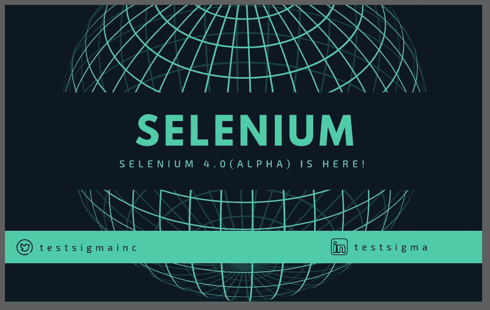

# Selenium 4.0 alpha 发布——测试自动化工程师可以期待什么！

> 原文：<https://medium.com/hackernoon/selenium-4-0-alpha-released-what-test-automation-engineers-can-expect-6c1838b79243>

Selenium 团队在两周前(4 月 24 日)将 Selenium 4.0alpha 添加到了 mvnrepository 中，这在自动化 QA 社区中引起了轰动。

QA 兄弟会一直在急切地等待这个版本中提出的一些特性。其中最重要的是 T2 的 W3C 标准化 T3。这将使框架更加稳定，并减少不同浏览器之间的兼容性问题。这个主要版本带来的另一个对初学者友好的变化是更新了文档。在版本 2 之后，Selenium 文档没有彻底更新。更新后的文档将极大地帮助初学者和有经验的人。

我们希望文章中的一些缺点[Selenium 作为自动化测试工具的利弊](https://testsigma.com/blog/selenium-automation-testing-pros-cons/)将由 Selenium 4 解决。让我们来看看这个版本中一些值得期待的显著变化。如果你挖对了地方，你可以在 CHANGELOG 或变更文件中看到完整的变更列表— [Selenium Github Repo](https://github.com/SeleniumHQ/selenium)

注意:这不是一个完整的列表，我故意省略了许多底层实现和架构变化，像我这样的普通 QA 自动化人员不会每天都要处理这些变化😀

# 建筑变化

## 1.现在使用 W3C 协议进行浏览器驱动程序通信

Selenium 的早期版本使用 JSON wire 协议，该协议需要对 API 进行编码和解码。然而，Selenium 4 现在将使用标准的 W3C 协议在驱动程序和浏览器之间进行通信。优点是 W3C 协议不需要编码或解码 API，测试将能够直接与浏览器通信。

## 2.符合 W3C WebDriver 规范

Selenium 4 将完全符合 W3C WebDriver 标准，这也包括文档。因此，更新后的文档将包含详细的使用说明。

此外，actions API 已经过改进，以符合 WebDriver 规范。

## 3.移除了对少数浏览器的支持

该团队将取消对 Opera 和 PhantomJS 的本地支持。尽管如此，需要测试 Opera 的用户可以依赖 Chrome，因为 Opera 是基于 Chrome 的(Chrome 就是从 Chrome 派生出来的)，而对于 PhantomJS 用户来说，可以在无头模式下使用 [Chrome 或 Firefox](https://github.com/SeleniumHQ/selenium/blob/master/javascript/node/selenium-webdriver/example/headless.js)。
Selenium 服务器现在不再默认包含 HtmlUnit。

## 4.优化的硒栅极

新网格服务器的 Alpha 版本支持“独立”、“中心”、“T3”、“节点”和完全分布式使用。此外，这个新的网格服务器可以将单行 JSON 格式的日志输出到 stdout。

## 5.增加了对 Opentracing 和 Docker 的有限支持

对 OpenTracing 的基本支持已登陆。对新的网格服务器使用 ext 标志，为 OpenTracing 实现提供类路径。

Selenium 4 将引入对新网格服务器使用 Docker 容器的基本支持。一旦官方文档发布，将会提供更多信息。

查看*[***Test sigma***](https://testsigma.com/signup)看看这些东西是如何被考虑的，并使测试自动化变得毫不费力。*

# *API 变更*

## *1.对窗口类的更改*

*   ***现在支持所有窗口操作命令—** 将添加全屏()和最小化()方法。*
*   ***将 driver.switchTo 添加到()。parentFrame() —** 我们可以用它直接从子帧跳到父帧。*
*   ***增加了 getRect() & setRect()并删除了 getSize()&getPosition()—**getRect()和 serRect()方法分别检索和设置描述当前顶层窗口大小和位置的 Rect。这将取代 getSize()和 getPosition()方法(这一变化在一般使用中并不太相关)*
*   ***增加了打开新窗口的命令***

## *2.对生成器类的更改*

*   ***添加了“setChromeService”、“setEdgeService”、“T30”、“setFirefoxService”方法— setChromeService** 设置服务构建器，用于在创建新的 Chrome 会话时管理 chromedriver 子进程。其他人在他们各自的浏览器上做同样的事情*

## *3.更改为 chrome。驾驶员*

*   ***增加了 sendDevToolsCommand()—**sendDevToolsCommand()方法向浏览器发送一个任意的 devtools 命令，并返回一个承诺，该承诺将在命令完成时被解析。*
*   ***增加了 setDownloadPath()—**setDownloadPath()方法发送一个 DevTools 命令来改变 Chrome 的下载目录，并返回一个承诺，该承诺将在命令完成时得到解决。*

## *4.火狐的变化。驾驶员*

*   ***Added install addon(path)—**install addon()方法在当前会话中安装一个新的插件。这个函数将返回一个“id”，可以使用 uninstallAddon()卸载插件。*
*   ***添加了卸载插件(id)——**使用 ID 卸载插件。*
*   ***添加了 addExtensions()** —轻松地向自动化会话添加扩展。*
*   ***添加了 setPreference() —** 向会话添加首选项。*

## *5.对选项/功能类的更改*

*   *选项类现在扩展了 Chrome、Firefox、IE 和 Safari 的功能类。*
*   ***移除了火狐。配置文件类。它的所有功能现在都直接由 Firefox.Options 提供***
*   ***setProfile()现在只接受现有概要文件的路径***
*   ***移除了静态工厂方法 android()、ipad()、iphone()、opera()、phantomjs()、htmlunit()和 htmlunitwithjs()。用户仍然可以手动配置这些功能，但是不推荐使用它们，并且它们将不再出现在 API 中。***

## *6.错误的更改*

*   ***添加了 ElementClickInterceptedError**—当点击命令由于点击目标被页面上的其他元素遮挡而无法完成时，Selenium 代码抛出**ElementClickInterceptedError**。*
*   ***增加了 InsecureCertificateError** —当导航事件导致浏览器生成证书警告时，Selenium 代码抛出**InsecureCertificateError**。过期或无效的 TLS 证书通常会导致这种情况。*
*   ***增加了 InvalidCoordinatesError** —当交互操作因传递无效坐标而无效时，Selenium 代码抛出**InvalidCoordinatesError**。*
*   ***添加了 NoSuchCookieError** —当当前文档的 cookie jar 中缺少命名的 Cookie 时，Selenium 代码抛出 **NoSuchCookieError** 。*
*   ***删除了 ElementNotVisibleError***
*   ***移除了 InvalidElementCoordinatesError***

## *7.对 WebDriver 的更改*

*   ***删除了触摸操作—** 触摸操作 **i** 实现启用触摸的设备的操作，如 doubleTap()、singleTap()、flick()、longPress()、scroll() e.t.c。这可能已被移动到 **Appium 库**中，但只有在完整的文档可用时才能确认。*

## *8.对警报的更改*

*   ***移除认证信息***

## *9.其他人*

*   ***修改了动作 API 以符合 WebDriver 规范***
*   ***可能会添加元素截图***
*   ***删除了许多不推荐使用的方法和类。***

# *更好的标准文档*

*困扰 Selenium 用户的一个主要问题是过时的文档。Selenium 团队从 Selenium 2.0 开始就没有更新过文档。在 Selenium 4 中，他们更新了 Selenium 的官方文档来解释最新的变化，并且它现在符合 W3C 标准。*

# *脚注*

*虽然很高兴看到改进，但对于中小型团队来说，通读 API 文档、分析更改以及纠正由于大量更改而被更新破坏的测试将是一件麻烦的事情。*

*根据用户的反馈或要求，我们已经在本版本发布之前的*中实施了上述许多变更。这也是 Testsigma 这样的基于云的无脚本工具更适合这样的团队的原因之一。**

**使用 Testsigma 这样的基于云的工具，更新将在内部进行审查，并自动应用到客户的所有测试中，而不需要团队付出任何额外的时间、资源和努力。
[**免费注册 Testsigma！**](https://testsigma.com/signup)**

***原载于 2019 年 5 月 8 日*[*https://testsigma.com*](https://testsigma.com/blog/selenium-4-automation-engineer-expect/)*。***

**如果你有什么要补充的，欢迎随时留言评论！**