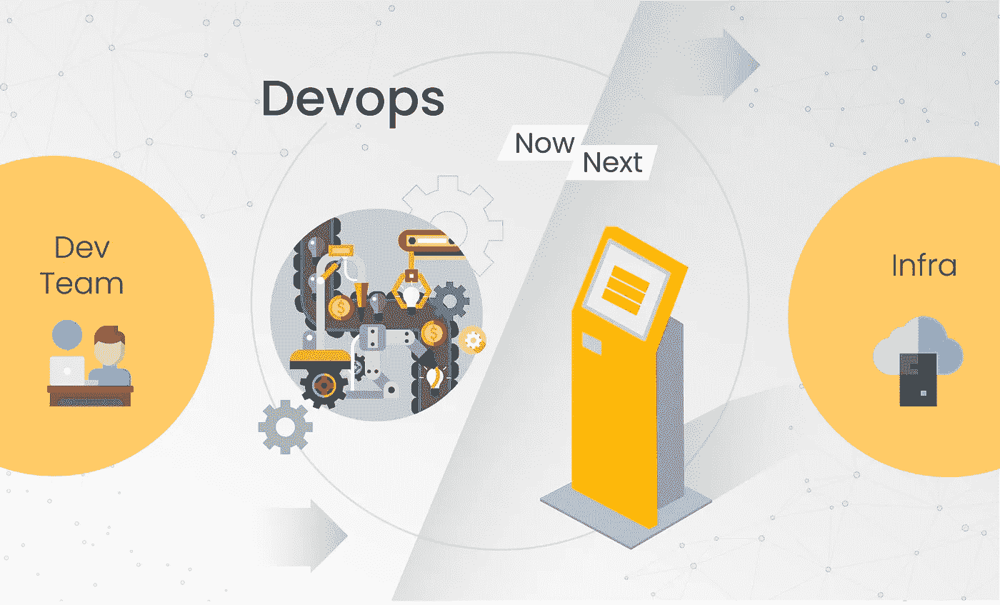

# 自助服务——开启开发运维的钥匙

> 原文：<https://medium.com/hackernoon/self-service-the-key-to-unlock-devops-51d50fd39e1d>

如今的企业投入了大量的时间和资源，以确保他们构建的应用程序在各方面都是自己的最佳版本。与此同时，开发人员和 IT 运营人员正共同努力建立一个持续的应用交付渠道，以实现轻松的按需应用部署。然而，[并不是所有的团队](https://techbeacon.com/enterprise-it/survey-paints-discouraging-scenario-enterprise-it-software-delivery-development)都能够实现持续交付。

在目前的情况下，应用程序面临着比以往任何时候都更大的压力，要求它们在不损害安全性或可靠性的情况下更快、更敏捷，这促使企业寻找软件开发的替代方法。除了采用现代的应用架构，改变工作流程也很重要，因为旧的应用开发方法不能用来加快应用交付。这就是为什么世界各地的企业都试图采用 DevOps 方法的原因。DevOps 被[定义为](https://searchitoperations.techtarget.com/definition/DevOps)开发和 IT 运营团队的融合，以增强应用交付流程，并有一个持续的交付渠道。

DevOps 的采用并不普遍。这是因为 DevOps 工作流不能通过将责任分配给一个专业人员来实现。DevOps 包括在应用程序开发和交付过程中有利害关系的每个人。每个人都在协作过程的早期参与进来。开发运维要取得成功，首先要了解应用和企业的关键需求。因此，DevOps 不仅仅是一个角色——团队中的每一个人都需要参与到这个过程中，并承担明确的责任，这样才能有效地工作。

> DevOps 是一种文化、一种运动、一种哲学——一种将软件开发和 IT 运营的精华结合在一起的方式。

**The DevOps workflow (**[**ref**](https://aws.amazon.com/devops/what-is-devops/)**)**

# **大规模开发运维面临的挑战**

当今的组织正在处理由云、移动、大数据和物联网(IoT)引入的大量应用程序、设备和数据。随着自动化和连续一切的到来，情况可能会变得更具挑战性。企业试图更多地强调拥有清晰的 DevOps 策略，以使工作流平稳运行。但是，由于 DevOps 是开发人员和 IT 团队之间高效同步的结果，使其大规模工作可能会遇到许多问题。以下是开发运维工作流中团队通常面临的一些常见问题:

*   过多的干扰
    在与两个或更多的团队一起工作时，肯定会有干扰。像在每个团队中一样，IT 运营将有计划的和未计划的工作共存。对他们来说，分析新技术以交付新平台、为应用程序构建合适的环境以及致力于扩展和性能等工程任务是永久性的。但是，随之而来的是不断的中断，原因是需要立即关注的事件，如安全事件、客户请求和突然中断。所有这些中断都是时间敏感的，需要团队立即关注。由于知识和技能分布不均以及资源有限，不可能有单独的团队来处理这种中断。
    因此，每个团队最终都会在某一点上处理所有类型的工作。这反过来会延迟与应用程序交付相关的任务，并延长截止日期。
*   **筒仓摧毁工作流** 大多数试图实现 DevOps 工作流的组织都有团队在筒仓中工作。筒仓造成了基于工作专业化的隔离，这些划分最终成为壁垒。理论上，筒仓看起来是一个组织良好的系统，其中每个团队根据他们的能力处理任务，并将其余的任务传递给其他团队，即:创建请求队列。但是，在实践中，这些请求队列有时会导致稳定工作流的死亡。如前所述，中断在每个团队中都是不可避免的。在线性工作流中，中断的延迟效应是累积的。
*   **等待时间更长，因为任务是相互依赖的** 筒仓中的每个团队都依赖其他团队来完成任务。此外，所有团队都有单独的任务优先级。考虑到这一点，每个团队在等待另一个团队为他们做一些事情时都会损失时间，反之亦然。因此，除非某个团队在切换上下文和完成分配给另一个团队的任务方面是专家，否则肯定会有很多延迟，因为要花时间等待。延迟会降低反馈回路的速度，而慢的反馈回路会导致更多的错误。延误还会增加工作环境发生变化的可能性，从而引发更多问题。简而言之，即使是很小的延误也会变成大问题。

# **实现大规模平滑开发**

这些小故障可能很难解决，因为没有直接的解决方案。这就是组织倾向于追求自助式开发运维的原因。但是，要实现手动自助式开发运维，要么需要精通 REST、ESB、SOA、SOAP 和所有需要的上下文切换，要么完全依赖 IT 团队来预先构建每个集成。这两个选项中的任何一个看起来都很难实现，但是却可以为持续交付创造奇迹。但是，考虑到工作流中的差距，必须有一个能够实现自助式应用交付的系统。

想象一下，如果能有一个自助服务亭，就像银行自动取款机一样。在自动取款机的操作中有两个参与方——银行和顾客。客户可以自己完成简单的任务，如取款或存钱，而无需联系银行主管。同样，如果有一个类似信息亭的系统，IT 操作员可以预定义和构建所有必需的应用交付构件，如预配置的环境配置文件、容器化的应用堆栈、目标基础架构选择等。，开发人员可以将他们需要的规范添加到合适的集成中，并自行部署应用程序，而无需联系 IT 团队。

考虑一个现代应用程序，其微服务架构包含 X 个服务。每个服务可能会有多个微服务。现在，为了构建每个微服务，将有一个单独的开发团队在工作，每个团队显然都有不同的工作管道。来自开发团队的每个管道的输出将被转储到它的表上，从而导致一个经典的筒仓工作流模型。但是，如果有一种方法可以让 IT 团队拥有一个独立的工作管道，**那岂不是简化了一切？**

DevOps now vs self-service DevOps

这就是自助式 DevOps 所能提供的。**自助式开发服务**是一种让开发人员能够按需自行部署应用的方式，因为 IT 团队已经按照自己的进度提前完成了必要的工作。这样，应用交付的中断和延迟最小，从而达到持续交付的状态。

简而言之，支持自助式开发运维可带来以下优势:

*   大幅缩短周期时间
*   加速发布
*   减少应用程序积压和其他瓶颈
*   降低运营成本并提高运营效率

拥有用于软件交付的[虚拟自助服务亭](https://www.hyscale.io/solutions-for-it-ops/)的想法实际上可以通过建立一个流程或拥有一个能够提供此类功能的应用交付平台来实现。一个构建良好的应用交付平台可以为任何规模的应用简化 CI/CD 管道。我们的想法是建立一个预定义的应用交付流程，让任何企业都能轻松实现开发运维的优势。