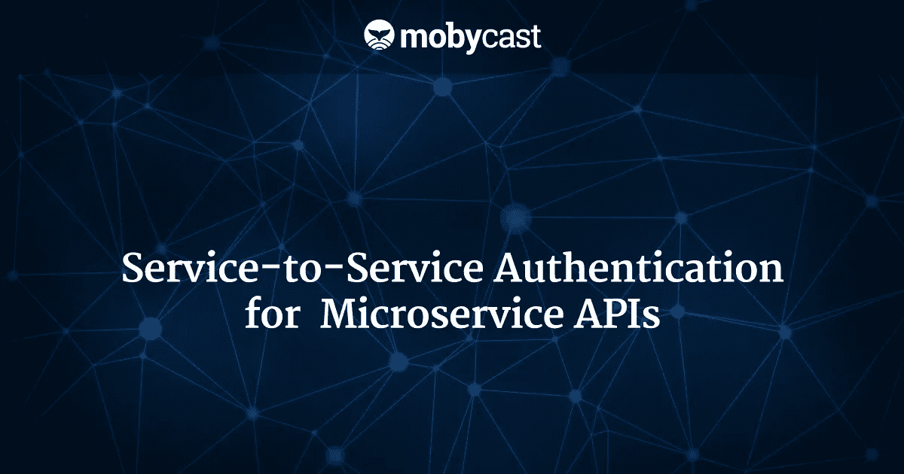

# 微服务 API 的服务对服务认证

> 原文：<https://medium.com/hackernoon/service-to-service-authentication-for-microservice-apis-ccf4ab8073e6>

凯尔萨斯的乔恩·克里斯滕森和克里斯·希克曼讨论微服务 API 的服务对服务认证。

该节目的一些亮点包括:

*   谁打来的？认证是设计 API 的基础
*   两种类型的身份验证:
*   用户认证
*   服务对服务(微服务)认证
*   服务网格、Istio、SPIFFE:为分布式系统的组件提供安全身份
*   合适和简单选项的优缺点，包括签名的 JSON Web 令牌(jwt)和 X.509 证书/API 密钥
*   JWT 组件:
*   页眉
*   有效载荷索赔
*   签名
*   你能保守一个共享的秘密吗？保护接收者和呼叫者都知道的密码
*   实现考虑:不要在服务调用和依赖链中丢失原始用户

**链接和资源**

[反应过来](https://reactjs.org/)

[Auth0](https://auth0.com/)

[OneLogin](https://www.onelogin.com/)

[秋田](https://www.okta.com/)

[AWS 认知到](https://aws.amazon.com/cognito/)

微软 Azure

[Istio](https://istio.io/)

[实用 Istio](https://www.docker.com/dockercon/2019-videos?watch=practical-istio)

什么是“服务网格”，如果我得到一个，它会让一切都好起来吗？

[JWT.io 通过 Auth0](https://jwt.io/)

[JSON Web 令牌(JWT)](https://www.jsonwebtoken.io/)

[X.509 证书](https://searchsecurity.techtarget.com/definition/X509-certificate)

[气枪](https://www.mailgun.com/)

[MailChimp](https://mailchimp.com/)

[最后一道工序](https://www.lastpass.com/)

[哈希公司跳马](https://www.vaultproject.io/)

[AWS 秘密管理器](https://aws.amazon.com/secrets-manager/)

[亚马逊 S3 桶](https://docs.aws.amazon.com/AmazonS3/latest/dev/UsingBucket.html)

[GitHub](https://github.com/)

[凯尔苏斯](https://kelsus.com)

[秘密存储媒体](https://www.secretstache.com/)

**成绩单**

Rich:在 Mobycast 的第 63 集，Jon 和 Chris 讨论了微服务 API 的服务对服务认证。欢迎来到 Mobycast，这是一个关于云原生开发、AWS 和构建分布式系统的每周对话。让我们直接开始吧。

乔恩:欢迎你，克里斯。又是一集 Mobycast。

克里斯:嗨，约翰，回来真好。

乔恩:是的，很高兴你能来。我们今天错过了里奇，因为我们在周五而不是周四做这件事，里奇今天很忙，所以我们会错过他。今天，我们将要谈论一些令我非常兴奋的事情，因为这不是我所知道的事情。我认为这是让微服务难以运作的原因之一。我认为这种事情会被谷歌搜索很多次，因为人们会问，“我该怎么办？”事情是微服务的认证。

只是，“我必须这么做。我必须检查这个箱子。我该怎么处理？有什么办法让我不写任何代码，勾选这个框？”我认为这是很多人的做法，尤其是在项目开始的时候。我们将探讨有哪些方法，有哪些好的做法。希望通过这个能学到很多东西。因为这是一个很大的话题，我希望能在一集里讲清楚，我们不会知道你这周都在忙些什么。这将是一个谜，但让我们开始吧，克里斯。告诉我们要谈什么。

克里斯:我们会看看我们是否能坚持那一集。我有点怀疑这不会是一个两部分，只是因为这里有很多，我有点希望它是。我认为尽管身份验证感觉起来像是安全，有点像是房主，但我认为它实际上会非常有趣。

乔恩:是的。对我来说这不同于安全。人们不会问，“我如何保护我的微服务？”他们说，“糟糕，我知道我必须这么做，所以让我谷歌一下怎么做。”每个人都在试图解决这个问题，所以我认为这是不同的。

克里斯:对，我觉得这更像是 API 设计，对吧？你要求[……]设置这个。我们构建微服务，我们做 API，不管它们是 RESTful、graphQL 还是基于 RPC 的，或者不管是什么。但你会有一些终点，也许你确实有一些任何人都能达到的终点。你不需要他们的任何身份，所以他们没有被认证。但总的来说，你构建的 API 应该是经过身份验证的，即使没有其他原因，你只想做一些事情，比如能够进行利率限制和配额，以及跟踪谁在呼叫什么。大多数 API 都可能需要某种身份验证。你需要一些身份来证明这一点。这是你所设计的 API 的基础。

通常，当我们考虑标识身份时，您有一个用户上下文。典型的客户端-服务器类型的应用程序，所以你有一些前端，javascript 客户端，web 客户端，可能内置于 React or 或 Angular 或其他一些 javascript 框架中。它正在做一些事情，现在它正在对一些后端微服务进行 API 调用。它的工作原理是通过用户上下文实现的，因此它就是“约翰·史密斯”。他们通过某种方式进行了登录，并提供了身份信息。这种登录非常简洁、清晰、清晰，而且易于理解。

乔恩:即使存在依赖关系(比如一个微服务调用另一个，调用另一个，调用另一个)，只要它们都是同步的，它们也可以从一个调用到另一个调用保留用户上下文。对吗？

克里斯:哦，天啊。这实际上又是一大堆麻烦。会很有意思。也许我们可以绕过去。

乔恩:好吧。

克里斯:在你接到一连串的微服务电话时，你是否会如实说出是谁打电话给你？你可以做到这一点，它有利弊，相对而言，你不泡沫回上下文下来，相反，它现在是一个服务对服务的调用？如果我们有时间，我们可以回到这个话题上来谈谈。这是那些很快变得非常棘手的实现问题之一。情况实际上变得非常复杂。我很高兴你提到了这一点，但也许我们会在这一点上重新考虑。

概括地说，我们的微服务和 API 有两种类型的身份验证。我们刚刚讨论了用户身份验证。也就是当你真正拥有了身份，它就是一个真正的最终用户。身份机制来自一些知名的系统。做这件事有很多渠道。您可以将身份用作服务提供者，例如 Auth0 Okta、OneLogin，甚至 AWS Cognito。这些都只是现有的现成系统和框架，您可以使用它们来实现您的用户配置文件，即您的用户身份存储类型。您可以使用 OAuth 或 SAML、安全断言标记语言系统之类的东西来执行身份和单点登录之类的操作。

最终，您会有这些最终用户，他们以某种方式在您的系统中注册，他们拥有帐户，最终，他们会提供凭据，比如说用户 ID 和密码。作为交换，我们现在有了一个众所周知的身份，而这个上下文就是传递给微服务的内容。那就是用户认证，那就是常见的路径，那就是众所周知的路径。我们不会花太多时间来讨论这个问题，因为这是一个众所周知的、容易解决的问题。

这一集我们真正想关注的是，当调用者实际上不是用户而是其他微服务时会发生什么？我们称之为服务到服务的认证。这带来了一个有趣的问题，比如“我们如何给这些调用者身份？”这是一个常见的[…]，一旦你开始构建服务，并且肯定有很多服务，你就会遇到这个问题，当你进行重构、架构和设计时，你将拥有为其他微服务提供服务的核心服务。然后，现在该服务成为另一个服务的客户端。

你可以把它想象成一个轴辐式架构，或者再一次，当你有越来越多的服务时，它就是你设计的自然发展。这种情况会越来越常见，因为其他服务需要通用的功能，然后它们需要对这些其他服务进行 API 调用。在那里我们如何处理身份？这就是我们这一集要关注的。

Jon:你能给我们一个我们能理解的，需要调用另一个服务的服务的例子吗？只是一些真实世界的例子？

克里斯:对。一个真实的例子是配置状态。假设您希望有一种跨应用程序实时处理配置的方法。它可以是任何它可能喜欢的设定。一个真实的例子是，我们有一个允许以 CSV 格式导出数据的应用程序。出于各种原因，我们需要能够限制这些导出的范围，限制正在进行的数据量。我们有一些配置设置，并说，“嘿，让我们限制它 3000 行数据。”这是一个配置设置。通常，您会将它作为配置文件添加到您的服务中。也许你可以在环境变量中这样做。有很多技巧。你可能想把它作为数据库或其他什么东西来做。

乔恩:[……]它。

克里斯:对，还有那个。关键是，在很大程度上，如果您想要更改配置，并说，“哦，我们现在想将其提升到 5000，而不是 3000。”这可能是一个代码更改和重新部署，以改变这一点。如果能有一个管理员用户界面，让一些管理员可以进入并改变它，那就太好了。当那个设置被改变时，把改变推给任何对此感兴趣的人。通过这种方式，it 部门可以实时获得配置更新，而这现在是实时的。

您可能会让这些微服务负责托管该分布式配置，然后允许其他人向它注册并说:“给我我的配置”，并在发生更改时注册回调。这种配置，即分布式网络配置服务，将成为其他微服务调用的枢纽微服务之一。

乔恩:好的。

Chris:同样，我们希望锁定它，拥有经过认证的 API，知道谁在呼叫。这就是一个例子。

乔恩:好的，酷。

Chris:这是问题的关键，当是另一个微服务调用时，我们如何给这些调用方身份？这就像是狂野的西部。这个问题已经存在一段时间了，尤其是当我们从 monoliths 转向微服务这个时髦词的时候。基本上，它只是让我们的服务像编码一样被重构。

Jon:我认为这个问题的特征也与大约 10 年前的态度类似，“哦，都在我们自己的数据中心。一切都很安全。服务可以互相调用。嗯，也许我们会附送一个 API 密匙。”我认为很长时间以来事情都是这样处理的。

克里斯:实际上我认为这也是他们被处理的方式，我的意思是，大多数情况下。这是一个伟大的观点。这肯定是你可以着手做这件事的各种可能方式之一，这肯定是其中之一。可能更常见的情况是，“我们不会对服务对服务的调用进行身份验证。”也许我们会从网络的角度锁定它，并以这种方式处理它。从这个意义上说，我们不是在处理身份问题，我们只是在处理安全问题。我们不一定知道是谁在呼唤我们，但我们知道无论是谁在呼唤我们，都是来自允许的空间。

乔恩:你有那栋楼的钥匙。

克里斯:是的，是的。这绝对是你可以做的事情之一，也是人们一直在做的事情。随着服务网格等事物变得越来越流行，其他可能性也随之出现，我们在之前的章节中讨论过这一点，它提供了这一功能。特别是，我们讨论了 Istio 及其组件之一 Citadel，它处理安全性和身份。它使用 X509 证书为系统中的每个组件提供标识。它实际上使用了一种叫做 SPIFFE 的东西。

SPIFFE 是一个新标准。它仍在被定义的过程中，但它对像“如何为分布式系统的组件提供安全身份”这样的人来说是很好的 SPIFFE 代表面向所有人的安全生产身份框架，所以它绝对是为这个问题而构建的。

Jon:我想更详细地描述一下他们的问题。我刚刚开了个玩笑，“你有这栋楼的钥匙。”我认为这是一个很好的类比，因为现在的建筑是云和它的多个区域，以及它在每个区域的多种可用性，可能是相互对等的不同网络。“你确定你的网络工程师已经把所有东西都绑住了，所以没人能进来？你真的确定吗？”“现在，我再也不确定了。有如此多的防火墙在运行，如此多的东西可能会被打开。我最好确保我运行的所有东西都能自我保护。”

克里斯:当然。同样，还有另外两个部分。第一，是它的安全方面，确保给我打电话的人被允许。但是你也有身份部分，比如，“这是服务 A 还是服务 B？或者只是某个我很确定被允许打电话给我的匿名来电者有这栋楼的钥匙？”它有两个部分。保护您的云并非易事。就像说，“好的，我已经保护好了我的云。”只是不要处理认证，那会有很多问题。

SPIFFE 是由一群人开发的标准。它全面地处理这些问题，并有自己的各种组件。它有创建身份名称空间的方法，也有处理身份文档的方法，最终，这些文档要么是 X509 证书，要么是经过签名的 jwt。然后，它还有一个 API，用于讨论系统上的组件如何发出、检索和发出这些请求。

我想这里的要点是它不是轻量级的；这是一个相当复杂、全面的系统。如果你是一家大公司，有很多人从事这方面的工作，这是你一定要去看看的。这有点像我们讨论的服务网格，对吗？

乔恩:如果你有一个更大的公司，你有很多人在这上面工作。请这样做，以便我们其他人可以更容易地使用它，我们可以开始使用它。

克里斯:对。确实如此。还有其他更全面、更复杂的方式来处理这种情况，因此您可以像 OAuth2 一样使用特定的服务帐户，进行来回交换，使用这些帐户协商凭据，并将其用作您的身份。但是同样，实现自己的 OAuth2 实现也很有价值。然后，您有更多特定于供应商的方法来完成。这与你的类比一致，“你有大楼的钥匙。”但如果你在 AWS 或 Azure 中，你可以使用诸如 IAM 角色和安全组之类的东西来锁定谁可以调用谁。

如果用户和其他微服务都可以调用服务，那么这些方法确实会遇到一些复杂性。你是怎么处理的？如果你有经过认证的 API，有时你会有用户上下文，有时你没有，因为它是一个微服务。在 IAM 安全级别上，您将如何处理这个问题？事情变得有点棘手了。

这些是更全面、更复杂的方法。我想，再一次，为了这次讨论的目的，这就是我们需要说的，因为现在，我想让我们更多地关注更简单的方法，这些方法可能对大多数人来说更合适和实用。因为我们大多数人不在网飞工作，我们也不在谷歌，我们也没有成千上万的微服务。真的是屈指可数。

Jon:我还想说的是，如果你正在构建一个支付应用程序，我们将要讨论的这些方法可能仍然能够通过安全审核。这并不是说它们不安全，只是从开发的角度来看，它们可能更容易接近。

克里斯:又一次，很好的观点。那绝对是真的。我们讨论的内容构成了其他一些系统的基础。具体来说，像 SPIFFE 这样的东西，说到底，SPIFFE，要么是 X509 certs，要么是带签名的 jwt，我们要说的是带签名的 jwt。这与 SPIFFE 正在进行的工作非常相似，并且基本上试图形式化。我们只是拿走一部分。我们不打算让它遵循任何一个特定的标准，并处理他们已经想到的所有各种边缘情况。相反，我们只是将它保持在一个实用的水平。但就其核心而言，从身份认证的角度来看，这是相同的技术，同样有效。

另一个参考点，如果你愿意，是这些签名的 jwt，这实际上是谷歌为他们的谷歌云和开放 API 推荐的服务对服务认证之一，这完全相同的技术。尽管这些更简单，但这并不意味着它们的有效性、安全性或健壮性会降低。

乔恩:酷。告诉我们更多。

克里斯:有两个。我们将这些称为更简单、更实用的服务对服务认证方法。第一个基本上只是 API 密钥，第二个我们称之为签名的 jwt。首先，我们讨论 API 键，因为我认为这是一个非常普遍的东西，它是非常众所周知的。

乔恩:它们在你的电子邮件里，在你的 GitHub 账户里。

克里斯:对。

乔恩:他们无处不在。

Chris:如果你在使用邮件发送服务，比如 Mailgun，或者 MailChimp，或者诸如此类的服务，你很有可能会注册使用 API 密钥进行 API 调用。他们给你一个 API 密匙，最终成为它的标识，就像许多 webhook 类型的系统等等。在这种特殊情况下，API 密匙实际上就是一个密码。这个密码也能识别你的身份。这是一种独特的价值，是由发行它的人产生的。当它发行的时候，你基本上是在说你是谁。通过这一独特的价值，你基本上同时获得了身份和你是谁的证明，因为你知道那个秘密，那个密码。这就是 API 键的真正含义。

非常容易实现，因为它基本上只是一个密码。最常见的方法是将它放入 HTTP 请求链、身份验证头中，并将您的 API 密钥放在那里，这是它的核心，这并不安全，因为它只是 base64 编码，但您通过 TLS 发送它，现在它是加密的。它最终成为处理身份和认证问题的一种非常好、体面的方式，只要你使用 TLS，它就是安全的。它工作了。很简单。再说一次，这很普遍，很受欢迎，你会看到的。自己卷也很容易。

但这也有一些不利之处。一是，你现在必须管理这些键的列表。你必须决定，这些密钥的粒度级别是什么，这需要你，你的实现者，为你的系统决定，你的所有服务都有一个 API 密钥，你是在每个服务的基础上这样做，还是把它们发给单个调用者。这实际上取决于您希望身份的粒度级别。此外，从安全角度来看，如果密钥被泄露，爆炸半径是多少。这些是你必须弄清楚的事情。它增加了你必须管理多少密钥的复杂性。你拥有的密钥越多，像证书轮换这样的事情就越难做，而且考虑到[…]，你该如何做呢？

乔恩:它们可能被硬编码到人们的代码中。

克里斯:对。这些 API 键的另一个问题是，归根结底，它们是开发人员需要知道的东西，所以你需要把它们传来传去，就像“嘿，在 staging 上点击服务的 API 键是什么？”现在，你打算怎么分享呢？你在空闲时做吗？是 DM 吗？是聊天吗？是电子邮件吗？你应该使用类似 Lastpass 的东西，一些安全的密码凭证共享服务。谁知道呢，也许乐购的某个人会不小心把它评论到 GitHub 上，然后噗，现在你完蛋了。现在该做旋转了。

这些绝对是 API 键的一些缺点。一般来说，我们不使用这种方法的原因之一。很简单，你可以让它发挥作用，只要知道有一长串的缺点或陷阱需要你去处理。

我想谈的第二种方法是签名的 jwt。这是我们在凯尔萨斯用这种模式做的事情，对我们来说效果很好。这也是与另一种身份认证形式——用户身份认证——保持对等最相似的方式。最终，用户认证看起来就像一个 JWT，还有身份之类的东西，“他们的帐户名是什么？”也许它有一些关于用户的信息，像名字和姓氏，电子邮件地址，诸如此类的东西。

对于我们的服务认证，我们可以对 JWT 做同样的事情。我们可以得到诸如调用服务的名称和相关信息。甚至可能是诸如它有什么角色和访问级别之类的事情——关于呼叫上下文的一些附加信息。拥有 JWT 给了我们灵活性。实际上，我们可以构建一个单独的微服务来处理这些事情，发布这些 jwt，并负责做一些事情，比如，“好的，角色是什么，访问级别是什么？”不仅仅是认证，还包括授权。因此，非常灵活，但也可以保持简单。

Jon:我想现在可能有些听众知道什么是 JWT，JSON web token，你能告诉我们那是什么吗？

克里斯:对。它代表 JSON Web Token，实际上，它就是一个 JSON 文档。它基本上由三部分组成。它有一个标题，表明这是一个 JWT。它明确地说，“这就是我，我是 JWT。”它还说，签署这个的加密算法是什么，所以它在头中。它的有效载荷基本上是，索赔去的地方。声明基本上是身份信息。有一些非常著名的说法，大多数是三个字母的缩写。但是在一天结束的时候，他们表明了他们是谁，也许他们想和谁说话。你可以有标准的权利要求，权利要求的标准属性，或者你可以扩展它。你做你想放进去的东西。

乔恩:有没有三个字母的声明，我甚至无法想象那会是什么。你能马上想到什么吗？

克里斯:一些常见的是 EXP，代表到期。它说，“这是这个 JWT 有这个 TTL 的时间。”另一个是 AWD，代表观众。也就是说，我想与之交谈的东西叫什么名字。SUB，我想那可能是 subscriber 的简称。我们用它来命名正在调用的服务。如果你愿意的话，是客户。

Jon:最初构建这个 JWT 的是发出调用的服务。它将把一个放在一起，并发送给正在调用的服务。正在调用的服务将对它进行物理评估，并确保它看起来是正确的。

Chris:最简单的方法就是两个服务互相对话。是发起服务——调用服务——需要将它的身份文档放在一起，这就是 JWT。JWT 被创造出来，并随着它的请求被发送出去。然后在接收端，它可以查看该 JWT，决定它是否有效并允许它。

我们已经讨论了报头部分，讨论了声明的有效载荷部分，最后一部分是签名。这是计算。这是基于我用来签名的加密方法，使用了一个秘密，这是签名。这就是身份验证部分通过签名来验证声明的身份和完整性的地方。当然，另一个 JWT 基本上能够在两边运行相同的算法。发起者和接收者都使用相同的密码运行相同的算法。如果他们得出相同的结果，并且签名匹配，那么他们知道，“嘿，我们被允许互相交谈。我知道给我发这封信的人是谁，因为……”

乔恩:不，错了。"我知道发这个的人有密码。"可能是[…]其他的[…]……

克里斯:当然。

乔恩:……但是你不[…]他们就是他们。

克里斯:当然。是的，他们有我们能做的最好的密码。这是我们能做的最好的了。

乔恩:我知道我们……对吗？

克里斯:对。绝对的。

乔恩:酷。实际上，就我个人而言，我以前没有实现过 JWT，所以这对我来说是一个很好的小教训。谢谢你。

Chris:我们已经在这里介绍了这种方法的大部分内容。从调用者的角度来看，当他们想要调用另一个微服务进行身份验证时，他们有责任构建一个 jwt，一个身份文档。他们真正的关键部分是，他们需要能够加密签名，所以他们必须使用这个共享的秘密。这必须是一个接收者和打电话者都知道的秘密。

同样，这是密码，这是你需要保护的东西，并确保范围仅限于谁可以使用它。这就是你可以利用杠杆的地方，就是你可以保护整个系统的各种方式。你可以使用 secret 的管理器，比如 HashiCorp 的 Vault 或者 AWS 的 secret 的管理器。你可以使用像 S3 桶和政策，并锁定它。你可能会说，“这个服务只允许被这些服务调用。”只允许其他三个服务访问 S3 密钥。

乔恩:当你解释这个的时候，当我学习这个的时候，我突然意识到 JWT 提供了什么，这太酷了。如果你只是说一个用户名或类似的 ID，那么记录谁是谁将是呼叫者的责任。“哦，身份证号 14656。这是我们之前设置的配置客户端。它存储在我保存的这个数据库中，因为我是一项服务，我必须知道每个人是谁。”然而，在 JWT，你似乎可以获得新的来电者，而不必维护他们是谁，只要他们符合你的规格。你得说，“你得告诉我你的名字。”也许你甚至可以让它告诉你其他事情，比如，“你在哪里。”“我在 AWS 地区 us-east-1。这是我的可用区域。”

你可以做各种很酷的事情。您可以将附加信息放入 JWT，然后所有这些信息都可以被记录。如果它不在那里，你可以说，“嗯，你给了我正确的密钥，所有的东西都签好了，但是你没有在 JWT 中包括我想要的信息。你被拒绝了。不好意思。”你能这么做真是太酷了。

克里斯:是的。非常非常灵活。API 密钥的缺点是，您必须维护密钥列表，因此，密钥既是身份也是身份验证。这意味着你可能有一些数据库表，记录着这个特定的 API 键，“这是对那个用户或者那个调用者是谁的描述。”你必须有 TTLs 在上面。与 JWT 方法相比，所有的信息都是伴随而来的，你基本上是在说，“这些信息是呼叫者的责任。”但是他们可以在里面放任何他们想要的东西。他们可以说他们想成为谁就成为谁，所以当你设计和编码这个的时候，你需要有一些约定，你需要有一个合理的方式来做这件事。

但是这种特殊的方法并不是说这样或那样。实际上，它所保证的是，通过共享秘密，它基本上验证了双方拥有相同的共享秘密，他们可以访问共享秘密。因此，他们被允许互相交谈，因此它是经过认证的，它在 JWT 中传递身份信息，这些信息来自呼叫者。这完全是灵活和明智的。

就像你说的，接收者可能会说，“嗯，我需要这个东西。”我现在正在实施 RBAC，基于角色的访问控制，因此，“我也需要一个角色列表。”您可以拥有类似于另一个微服务的东西，它负责生成您的 JWT，不仅确定身份验证，还确定授权。这种方法有很大的灵活性。它的伟大之处在于，你不必做任何重新架构或设计。您可以扩展所有这些功能，而无需对系统的其余部分进行任何更改。

如果你想有一些独立的微服务，负责做你的 JWT 一代，这是一个知道秘密，并跟踪谁可以打电话给谁。这些都可以在不真正改变接收者的情况下完成。处于呼叫中的服务，他们不关心，他们仍然只是得到 JWT。他们不关心它实际上是由调用者创建的，还是调用者使用其他人生成的。

Jon:如果 JWT 没有通过验证，或者没有正确签名，或者没有你期望的内容，那么 HTTP 中的……会发回一个，我想，JWT 会发回一个 401。

克里斯:当然。这就是这些服务的接受者正在做的事情。他们得到了 JWT，同样，它是通过 HTTP 请求链传过来的，所以您可以使用身份验证报头将 JWT 打包到其中，如果您愿意，它实际上是密码信息。同样，这将被转到 TLS，所以它是加密的。它将从报头中提取 JWT，现在将使用共享密钥对其进行解码操作，并将其与 JWT 中的签名进行比较。如果它们都匹配，它说，“好的，这个东西是有效的，”这就是身份验证，它现在可以做另一个。

如果这不起作用，如果它无效，如果签名不正确，如果解码失败，那么它现在可以拒绝它作为 401，未经授权。如果成功了，如果服务愿意，它现在可以更进一步说，“好的。我知道这个身份是谁。我要做进一步的检查吗？”如果你愿意，我现在就做授权检查。我现在可以加入一些规则，比如，我可能不会接受来自这两个服务的请求。如果同一性不是那样，那么我可以在那里拒绝它。但这也是系统的可扩展性，以及你想怎么做。

乔恩:对。这不在我们的概述中，所以这可能会让您有点为难，但是如果有人在听，他们想实施这一点，他们想抢先一步，您有什么建议他们可以查找或寻找，以便在实施 JWT 作为微服务授权时不要重新发明轮子？

克里斯:当然，使用 JSON 库和 JWT 库来处理这个问题，处理编码和解码的东西。外面有成千上万的图书馆。不要试图重新安装轮子。从字面上来看，它几乎适用于任何语言，无论是 Ruby、java 还是 node 或。net 中，使用其中一个库来创建 JWT 或对其进行解码应该不超过 10 行代码。

去 jwt.oi，那个网站，那是一个很棒的网站，有很多信息。我相信它是由 AltZero 主办的，他们可能是 JWT 规范的原始支持者之一。他们有自己的开源库。但是每个平台都有处理 jwt、签署 jwt、编码和解码 jwt 的库。一定要用那个。

实际上，它只是归结为你分发共享秘密的机制，并使呼叫方和接收方都知道它。你要在那上面滚动你自己的。无论你做什么，确保你已经考虑到了这一点，并在其中规定了谁可以访问这些共享秘密的范围。另外，基本上要让开发者不需要知道这些。只要通过代码编程就行了。这对开发者来说更具挑战性。他们不能只做一个临时的 cURL 语句，他们可能需要运行一个脚本来生成一个有效的 JWT。但这是非常值得的，因为这就像是，“只需让代码运行并进行安全获取，以获得共享秘密，从而进行 JWT。”而不是传递共享的秘密，这样任何人都可以去做。

利用现有的库来处理 jwt 和歌唱以及编码和解码。然后认真思考你将如何保护你的共享秘密。

乔恩:当然。我认为这就涵盖了我们在微服务身份认证方面想要讨论的内容。如果你听完了，谢谢。但是有一个部分我想花几分钟时间给那些有时间的人，如果你有一个服务调用链，你在第一个调用上有一个用户联系，然后服务在依赖链中互相调用，你难道不会在服务间传递这个凭证吗？

我想我现在明白答案可能是什么了，我们可以不这样做，而是将联系人作为我们 JWT 信息的一部分从一个服务保留到另一个服务，而不是使用在第一个服务中有用户联系人的原始 JWT。

在你回答之前，我想我要先说，如果有一个深层的依赖服务，在它之前已经被其他几个服务调用过，但它都是由一个用户发起的，我会假设在我们的信息收集系统中，我们会关心最初的用户是谁。丢失这些信息似乎是令人失望的。一些数据库得到更新，我们当然希望我们知道是查理真正希望数据库更新发生，即使是微服务 XYZ 最终打电话更新数据库。对吧，克里斯？我们确实想知道用户信息，即使是在有依赖关系服务列表的深处，我们也想记住这一点，因为这很重要。

Chris:同样，这涉及到实施方面的考虑，它必须处理您的架构、设计和各种微服务，以及它们与[…]模型的融合程度。一个很好的例子是——这是我过去遇到的一个真实的例子——假设你有一个照片分享应用程序。照片，我觉得是某类形象。归根结底，图像只是一个二进制文件。我们就叫它斑点吧。

想想这个系统。这实际上是三种不同的服务。也许我的应用程序服务中有我的朋友，他围绕照片共享和它能做的所有事情做我的所有应用程序特定的逻辑。也许我有一个单独的微服务，它所知道的只是图像，也许是它拥有的所有功能。图像过滤器之类的东西，可以做调整大小之类的事情，可以做特效，可以做翻转和裁剪之类的事情，或者任何围绕图像的事情。那么也许我有第三个服务，它只负责 blobs。它的责任是确保我有能力以一种非常可扩展的方式在 blobs 上做 cred

影像服务将使用 blob 服务，照片共享服务将使用影像服务。这有点像链条。你的照片分享服务的前端肯定有用户认证。现在问题变得棘手了，“你还会把相同的用户联系方式传递到你的图片服务中吗？您是否设计了影像服务，使其拥有完全相同的用户群？”

乔恩:没关系，是的。

克里斯:对吗？下到 blob 服务会变得更加棘手。“真的是这样设计的吗？”它和你的照片分享服务有着相同的用户基础。在某一点上，有一个破损，它不再继续延伸。需要有一个分离。你必须决定，“我是在我系统的哪个层次上做这件事的？什么负责进行身份验证和授权？”你可能会决定，“这都是在前端完成的，在照片共享服务。”所有的身份、所有的认证、所有的授权和问题都在那里处理。然后，此时，在影像服务之间以及影像服务和 blob 服务之间的服务到服务级别上完成身份验证。他们只是说，“我们不关心用户的联系人，因为我们甚至不知道那个数据库。”

乔恩:在我看来，打破这种局面的方法和经验法则是，如果你的微服务正在做的事情可能会改变使用你的应用程序的特定用户的状态，那么你会希望有这种联系，但是如果你是一个微服务，你可能会称之为一般性的工作，那么谁在乎你做一般性的工作？只要它知道其他服务对该通用工作有什么要求，那么您就可以开始了。

克里斯:对。我认为这实际上可以归结为建筑设计，但这似乎是一种自然的倾向。这就像，“是啊，我只是把用户联系方式传下来。”真的很简单。" blob 服务知道是约翰·史密斯打了这个电话."但是当你执行的时候，就像是，“等一下。它怎么知道约翰·史密斯是谁？”它很快变得相当复杂。

乔恩:有道理。我认为这是总结的好方法。

克里斯:我想是的。我们经历的比我想象的要多得多。虽然我不知道我们花了多少时间。对我来说时间过得很快。

乔恩:在这个时候，人们都坐着等着进去吃饭。[……]坐在车道上听，我希望。

克里斯:对。但愿如此。

乔恩:好吧。非常感谢，克里斯。下周我再和你谈。

克里斯:好的。谢谢你乔恩。再见。

亲爱的听众，你坚持到了最后。感谢您抽出时间，并邀请您继续与我们在线交流。这一集，以及显示笔记和其他宝贵的资源，可在 mobycast.fm/63.如果你有任何问题或额外的见解，我们鼓励你给我们留下评论。谢谢你，我们下周再见。