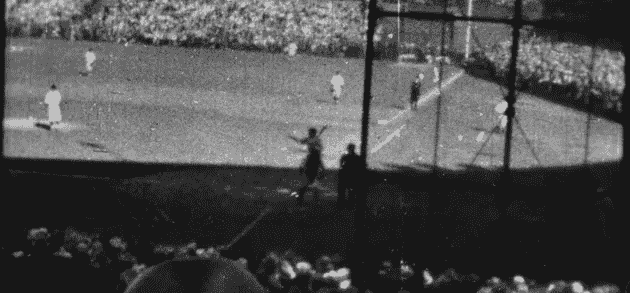
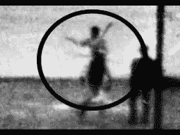

# 设定目标？你所要做的就是指向。。。

> 原文：<https://medium.com/hackernoon/setting-goals-all-you-have-to-do-is-point-e774a4f18848>

Babe Ruth’s “called shot”

有一张我喜欢的旧照片。贝比·鲁斯在 1932 年世界职业棒球大赛中击出全垒打前指向看台。你可能已经看到或至少听说过这个。为什么这个特别的全垒打在 85 年后仍然引人注目？原因很简单，因为 Bambino 在击球之前就指向了*。由于设定然后实现目标的力量，该图像是标志性的。*

每一个现代组织都被分成团队。团队被定义为两个或两个以上的人一起工作来实现一个目标。朝着一个目标努力是我们职业结构的内在组成部分。那么，为什么我们如此不擅长设定和实现目标呢？

在我被指责为不必要的愤世嫉俗之前，我可以用一些数据来证明这一点。以软件世界为例，根据最近的 [KPMG 项目管理调查](https://assets.kpmg/content/dam/kpmg/nz/pdf/July/projectmanagementsurvey-kpmg-nz.pdf)，只有 33%的项目达到了最初的项目目标。所有的工具、任务、票据、仪表盘和图表都在我们的指尖，我们只能设法实现既定目标的三分之一。太可怕了！

那么这是为什么呢？这当然不是因为缺乏内容或一个朗朗上口的记忆。有成千上万的博客和文章介绍如何设定和实现 **S-M-A-R-T** 目标。但是很明显我们还不擅长做这个。

像许多事情一样，表达和交流是关键。你需要把目标写下来，如果没有别的，这将有助于抵消你自我欺骗的能力。与参与实现目标的其他人分享目标。两个或两个以上的人听到同一件事，却带走两种完全不同的意思，这种能力一直让我感到惊讶。确保每个人(字面上)都在同一页上。

在写下和分享目标的过程中，“什么时候”的概念会不约而同地出现。这不需要太多的讨论——目标应该有一个与之相关的日期。同意一个，继续前进。

要发展的关键技能是以正确的方式陈述目标的诀窍。在最基本的层面上，必须明确目标是否已经实现。理想情况下，你应该能够量化成功或失败的程度。“扭捏话”不是你的朋友。用消除主观性的方式表达事情是很重要的。

思考这个问题的一个好方法是，思考一个完全公正的人是否会以同样的方式“得分”。使我们的产品更好。”是一个非常糟糕的目标的例子。倡议完成后情况是否“更好”很可能是有争议的。然而，“*增加了 100ms 的响应时间。*“是一个伟大的目标。如果结果是反应时间增加了 90 毫秒，即使是没有什么背景知识的人也可以承认，虽然你没有达到目标，但你确实完成了 90%。

一个常见的异议是“*但是我们的项目很复杂，所以我们的目标也一定很复杂*”。我完全拒绝这一点。保持事情简单。要成为一个更高效的团队，你能做的唯一一件事就是能够反复设定和实现目标。为了做好这件事，你必须练习。也就是说，在你成功之前，你必须经历很多次的失败。然而，一旦你真的擅长它——那么，这是一件如此了不起的事情，人们可能在 85 年后仍会谈论它。

Pointing to the bleachers!