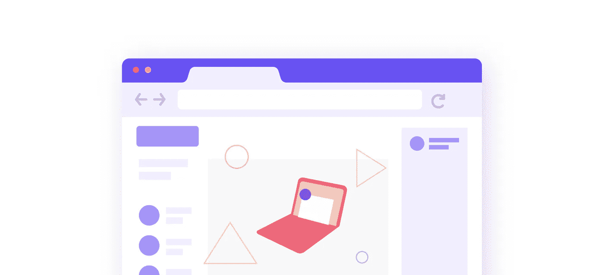

# 在 React 中设置无服务器联系人表单—使用 Nodemailer 和 Express

> 原文：<https://medium.com/hackernoon/setting-up-a-serverless-contact-form-in-react-using-nodemailer-and-express-19df9fdb20ed>



Illustration by [Akriti Bhusal](http://dribbble.com/akritibhusal) 🥳

拥有一个联系方式总比仅仅在我们的网站上显示一个电子邮件地址要好。联系表格给我们的访问者提供了一个与我们联系的简单方法。在这篇文章中，我们将通过一个简单的方法来使用[节点邮件](https://nodemailer.com/)和 [Express](https://expressjs.com/) API 在 [React](https://reactjs.org/) 中设置我们自己的。这篇文章还将带我们了解现在如何使用 [Zeit](https://zeit.co/now) 部署无服务器 it。

## **这个应用程序将做什么:**

本教程结束时，您的网站上将会有一个联系表单，它会将邮件直接发送到您的收件箱。

GIFs from [Gip](https://giphy.com/gifs/stefanie-shank-house-of-joy-stef-l46Cq6Bro9CsP149q)[hy](https://media.giphy.com/media/3o6Mbfsf4DI4Cds5Ms/giphy.gif)

## 此应用将使用的工具

*   [**GitHub**](http://github.com)——(用于托管代码。稍后还需要与 Zeit 一起部署)
*   [**Npm**](https://www.npmjs.com/)——(用于使用 create-react-app 等 JS 包)
*   [**节点 JS**](https://nodejs.org/)[**Express JS**](https://expressjs.com/)**(因为我们的 API 会内置在 Express 中)**
*   **[**React JS**](https://reactjs.org/)([create-React-app](https://github.com/facebook/create-react-app)用于引导标准 React 应用程序并设置我们的表单)**
*   **[**Axios**](https://github.com/axios/axios) (用于向我们的远程 API 提交表单数据)**
*   **[**Zeit Now**](https://zeit.co/now) (部署我们的 app 无服务器)**

## **步伐**

## **1.准备好东西**

****GitHub repos —** 我们首先创建两个 [GitHub](http://github.com) repos，一个托管 React 表单，另一个托管节点 API。我们也可以在单个回购中完成，但是为了更好的可维护性，我们使用了两个回购。**

****Node & npm —** 从[链接](https://nodejs.org/en/)下载最新版本的 [node.js](https://hackernoon.com/tagged/node-js) 。在本帖中，我们使用的是 11.7.0 版本。节点附带 npm。要确保安装了 node 和 npm，请在终端上使用以下命令检查它们的版本:**

```
// For node version
node -v
v11.7.0//For npm version
npm -v
6.4.1
```

****React —** 我们在 React 应用程序中使用[**create-React-app**](https://github.com/facebook/create-react-app)来构建表单。使用以下命令全局安装 create-react-app 并生成 react 应用程序:**

```
//Install create-react-app globally
npm install create-react-app -g//Generate a new react app called my-app
create-react-app my-app && cd my-app && npm start
```

## ****2。表单****

**让我们从设置一个返回 HTML 表单的组件开始。我们在下面的代码中使用了 [Bootstrap](https://getbootstrap.com/) 类，所以它们是可选的，你也可以使用自己的 CSS 类。**

**这里，每个输入都有一个 *onChange* 处理程序，对应于组件状态中的一个特定变量。因此，当输入改变时，状态也会更新。表单本身有一个 *onSubmit* 处理程序，它调用处理我们的 API 调用的 *formSubmit* 函数。**

**我们将看一下这个函数，但是在此之前，让我们安装 axios(我们将在函数中使用它)来向 API 发出 HTTP 请求。**

```
//Install axiosnpm install axios --save
```

**设置我们的组件 src/App.js:**

**现在，我们在组件中添加处理表单提交的函数。**

***preventDefault()函数(在第 2 行)，*顾名思义*，*阻止表单的默认动作，否则会导致页面重载。发送消息时，按钮文本变为“…发送”，并且 [axios](https://github.com/axios/axios) 进行 API 调用。**

***注意:“API_URI”(第 14 行)是我们的 API 的端点的 URI，这将在本文的部署部分讨论(步骤 4)。***

**如果一切顺利，调用 *resetForm* ，我们还没有定义。因此，让我们定义重置函数，该函数将重置我们的表单字段并更新我们的按钮标签:**

## ****3。API****

**现在，我们需要将表单输入传输到 API，所以我们设置了 nodemailer、配置文件和路由。但在此之前，我们需要在我们的节点 API repo 中设置 [Express.js](https://expressjs.com/) :**

```
//Initialize
npm init//Install express and other dependencies
npm install express body-parser nodemailer cors --save
```

**现在我们需要在 package.json 文件中做一个小的改动。找到“脚本”并在其中添加以下“开始”行:**

```
"scripts": {
  "start": "node ."
}
```

**现在，在我们的目录中，我们用以下代码创建一个 index.js 文件:**

> *****重要提示*** *:由于我们是开发版，所以* ***凭证会在 GitHub*** *上暴露，所以要确保你的回购是私密的，或者使用开发版的测试邮箱。在以后的生产中，您可以使用 Zeit 环境变量* *来安全地存储凭证。***

**我们安装了 body-parser 来处理表单数据，安装了 CORS 来允许跨源请求。**

**我们已经设置了一个 Nodemailer SMTP 传输和路由，它将接收来自 React 表单的数据，并向我们指定的目标电子邮件地址发送一封电子邮件。**

## **4.部署**

**终于！完成所有这些后，是时候部署我们的应用程序了。我们现在使用 Zeit 进行部署，你可以选择你喜欢的任何其他服务。**

**GIF form [Giphy](https://media.giphy.com/media/zLrMT1J1RuJ9u/giphy.gif)**

**首先在 [Zeit](https://zeit.co/) 上创建一个账户。登录，从顶部的导航栏进入“现在”。连接您的 GitHub 帐户，添加我们刚刚创建的两个回购。现在，我们回到代码，在两个 repos 中添加一个空的 now.json 文件。**

**现在是时候把我们的代码推送到各自的 github repos 了。**

**现在，我们在两个回购中创建新分支，并与它们一起工作，因为我们需要为 Zeit now 创建拉请求来运行部署。**

```
//create and change to new branch
git checkout -b new-branch
```

**现在我们向 now.json 文件添加一些内容。对于我们的 React 回购，我们将在 now.json 上使用以下内容:**

**对于我们的节点回购，我们将使用 now.json 上的以下内容:**

***注:更多 Zeit Now 配置的例子可以在* [*这里*](https://github.com/zeit/now-examples) *找到。***

**最后，我们在 React repo 中对 package.json 做了一点小小的修改。
找到“脚本”,并在其中添加“现在构建”行:**

```
{
    "scripts": {
        ...
        "now-build": "react-scripts build && mv build dist"
    }
}
```

**现在，我们将代码推送到它们各自的 Github repos(new-branch ),然后在每个 repos 中创建一个 Pull 请求。Zeit Now 将立即部署识别 now.json 文件的应用程序。您可以通过单击“显示所有检查”，然后单击“拉取请求摘要”中的“详细信息”来查看应用程序 URL。最后， ***一定要复制链接，替换 React app*** 中 App.js 文件中的 API_URI。现在我们的表单应该可以成功发送电子邮件了。**

***感谢阅读！
快乐编码！***