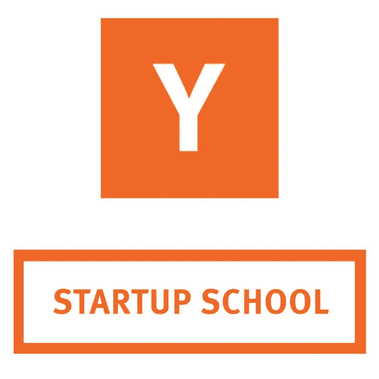
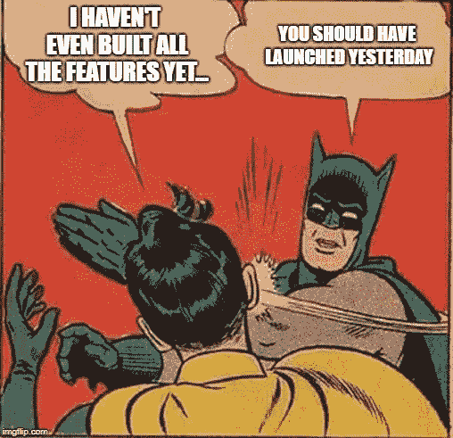
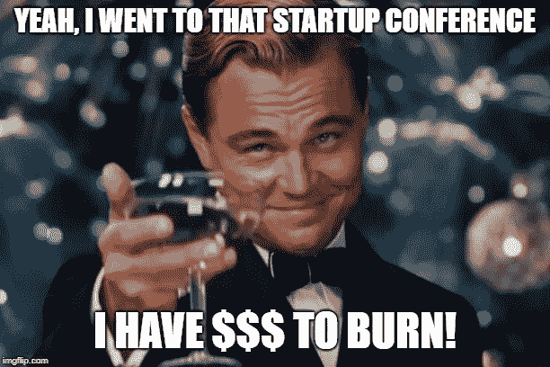
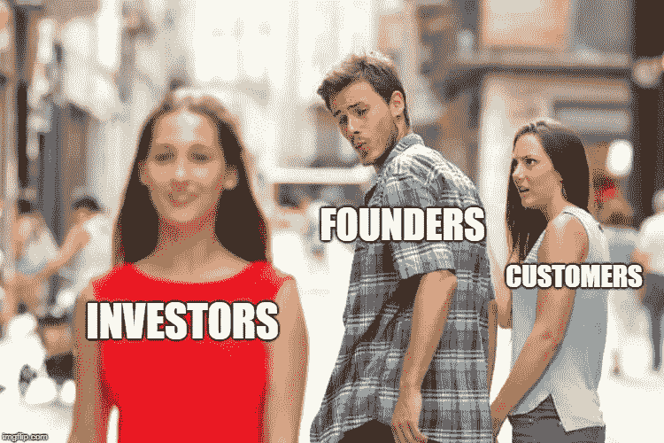
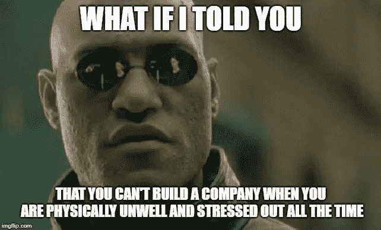

# 我们在 Y Combinator 创业学校的旅程中的七个关键收获

> 原文：<https://medium.com/hackernoon/seven-key-takeaways-from-our-journey-through-y-combinator-startup-school-f4249a2d4f42>

去年年底，我的团队代表我们的初创公司 Affine Finance 参加了备受关注的 Y Combinator 创业学校。我们被指派了一位伟大的导师(Zynga 的前 C 级高管和其他多家知名加速器的创业顾问)。这是一个为期 10 周的项目，每周都有面对面和在线的现场会议(因为我离 YC 的山景城办公室很近，所以我最终亲自参加了大多数会议)。现场会议涉及广泛的话题，从法律事务到设计和产品开发，无所不包。

YC 将参与该项目的创业公司分成 10-15 个团队。为了“毕业”,这些小组必须:

1)每周一次的导师办公时间(与我们团队中所有初创公司的导师进行 2 小时的小组通话)

2)提供每周公司更新，报告我们根据自选指标的周环比增长情况

我们非常幸运地被分配到一个伟大的创业导师以及一个高度参与的同伴团体。我们不断听到导师失踪、同伴停止参与等故事。这影响了他们的整体编程体验。实际上，**虽然这个项目是由 YC 团队精心设计的，但它的执行却主要落在了导师和创业公司自己身上**！

从这个项目中学到的东西远远超出了我的预期。当我们加入时，我们已经“研究”了将近一年的想法，除了传统智慧/讨论要点之外，我不期望学到任何新的东西，但 YC 的人很早就证明我错了！现场会议很棒，但使该计划真正有效的是将它们与指导会议和同龄人团体相结合。对于后者来说，YC 内部论坛还可以，但是 Slack 小组(由初创公司直接成立)更好，提供了巨大的价值。*恰当的例子:在 YC 项目结束几个月后，湾区集团仍然为 YC 的 SS 初创公司组织每月一次的烧烤聚会！*

下面我强调了我们团队的七个关键要点，这些要点很大程度上是基于我们自己对该计划的体验以及我们公司经历该计划时所处的阶段。我敢肯定，根据他们自己的经历，其他创始人会有不同的收获。

# **一、“做出人们想要的东西”:你需要活出 YC 的座右铭**

创业公司大多会失败，因为他们致力于开发没人想要的产品。在硅谷的疯狂中，创始人往往很容易迷失方向(我们在 Affine 时也犯过这种错误)，因为他们优先考虑了错误的事情——例如筹款、过度构建产品/功能、在没有核实真实市场需求的情况下攻击“空白空间”(研究只在纸上看起来不错的想法)——而不是专注于最终客户。

**Make** :你有合适的团队吗？专业知识、友情、经验、对行业的热情、解决问题的热情、创办公司的热情的正确组合。

**人们想要的东西:**他们真的想要这个吗？持续的市场验证、客户反馈、向正确的人提出正确的问题(“你会为这个支付 x 美元吗”还是“你会尝试这个/喜欢使用这个吗？”)。

# **二世。现在发射！！**

快速启动是 YC 团队和导师们非常强调的事情。早期发布的重要性怎么强调都不为过——除非你发布并站在客户面前，否则你无法真正了解他们想要什么。

但是……我的产品快好了，但是我还需要添加一些功能！

*…你早就应该推出了！立即发布，并在下一次更新中包含这些功能！*

***但是……我的产品还没完成呢！！***

*…针对需求如此之大，以至于他们愿意使用不完整或不完整产品的客户推出有限的试点项目，这将有助于指导您添加/修改什么，以及可以从您的产品路线图中删除什么功能。这可以为您节省数百个小时，并可能带来早期收入和其他有价值的客户反馈。*

但是……我甚至还没有开始构建我的产品呢！！

你在这里有很多选择:建立一个产品大纲或线框，并使用它们从潜在客户那里获得关于特定需求/功能的反馈；或者尝试让潜在客户以“代理方式”为你的产品开发提供资金，在这种方式下，你构建他们的解决方案，但保留知识产权；或者在构建您的产品之前尝试打折预售产品许可，以测试您的客户的支付能力以及他们解决问题的紧迫性。

虽然这个建议可能不适用于极少数初创公司，但对于大多数初创公司来说，没有理由不从今天开始。

# **三。产品与市场的契合度——这是旁观者(或投资者)眼中的定义！)**

许多演讲嘉宾被问及他们何时发现“产品-市场匹配”(PMF)，每个人都有自己不同的答案(有趣的是，没有一个人回答说他们还没有发现，IIRC)。

“我怎么知道我得了 PMF”的答案非常复杂，取决于每个创业公司的商业模式和独特的环境。许多创业公司很早就发现了 PMF，许多人在他们的公司生命周期中从未发现过它(包括成功退出的“成功创业公司”)。一些早期投资者只有在找到 PMF 后才会投资初创公司，一些人明确表示会资助初创公司以帮助他们找到 PMF，但对 PMF 到底是什么没有一致的定义。

在听取了多种定义和观点后，我们对 PMF 的想法大致反映了 YC 团队的想法:如果

I .你在做人们想要的东西(来自上面的外卖# 1；如果你的产品不存在，你的客户会非常沮丧/痛苦)，以及

二。你的需求超过了供应，以至于你似乎不能足够快地雇佣/建造/运输(你正在努力跟上客户的需求)，并且

三。新客户正在有组织地和/或通过现有客户的推荐找到你

第二点对我个人来说是非常突出的。这也是你可能需要额外资本来雇佣和满足客户需求的地方——在你潜在的“曲棍球棒”转折点期间，这是一个以有利条件筹集资金的好时机。

同样，这个定义会因公司和商业模式的不同而不同。在创业之后，值得花时间思考一下获得 PMF 对你的创业意味着什么——这是你从那时起努力达到的目标。

# **四。作为企业家，你的时间价值**

在共同创立 Affine 之前，我得到的最好的建议之一来自一位朋友，他在几年前创立了一家数字健康创业公司——尽可能多地做前期工作，因为一旦我“正式开始”，我就没有时间了。直到我“正式开始”自己的创业之旅后，我才完全理解了这个建议。作为一名创始人，你需要做的事情包括:组建团队、开发产品、寻找早期客户(即持续跟进 1000 条潜在客户线索，只是为了获得初步反馈和潜在的试点)、创作内容、筹资、制定战略、日常项目管理——所有这些都是启动项目的基本要求。不要忘记家庭时间和个人时间来锻炼、吃饭和睡觉。

*你真的有时间参加那个华而不实的创业会议吗？你真的能从中得到什么？你有 4 个小时(加上恢复时间)的快乐时光吗？在你有初始客户兴趣之前，值得花无数个小时去追逐投资人吗？在项目的这个阶段，你花 X 个小时在设计/社交媒体帖子上有意义吗？*

虽然只有你能回答这些问题，并找出你自己的优先事项，但在早期阶段有意识地监控你(和你的团队)的时间，并适当地分配时间可能直接意味着更高的成功机会——将更多的时间分配给构建你的产品和倾听客户，而不是做其他无意义的活动。

一位 YC 演讲人强调，思考某件事是否值得花时间的一个好方法是给你的时间分配一个金钱价值。你可以给你的时间分配一个年值，然后分解成你的“小时费率”。这不是你的市场收益率——这是你为你的创业公司增加的价值。例如，如果你新成立的公司有三个联合创始人，你希望你的公司在年底时估值达到 600 万美元，那么每个联合创始人每年都会为公司增加 200 万美元的价值。如果你预计在创业期间每周工作 100 小时，每年工作 52 周，那么今年你总共工作 5200 小时，每小时工资为 400 美元(200 万美元/ 5200 英镑；四舍五入)。*因此，如果你想参加 TechCrunch Disrupt，为期 2 天，每天 6 个小时，你将花费 12 个小时或 4800 美元——这还不包括会议门票和其他直接费用。*

# **V .跟踪一项主要绩效指标的周增长**

我们必须向 YC 团队报告我们的每周增长指标；我们团队中所有创业公司的成长也在我们每周的小组办公时间进行了讨论。YC 一直非常重视跟踪和提高周增长率。最好的跟踪指标是净收入——这是对你的增长和业绩的直接衡量。然而，由于许多早期创业公司都是预营收或没有显著收入，他们选择了其他相关指标，如用户数量、发布周数(这不是一个很好的指标！)等。创业公司在成长过程中可以并且经常改变他们的核心指标。

我们选择了“预定收入”来跟踪我们的每周增长，其定义适用于我们的业务模式。每周看到真实的增长率被打印出来并被讨论是非常令人羞愧的——这真的给了我们一种新的关注感。**去除所有干扰后，优化单一指标才是最重要的**。虽然我读到和听到了反对这种跟踪方法的论点，但在项目期间经历了 10 周的生活让我们相信了它的有效性和重要性。关于跟踪指标/衡量重要因素(okr)有许多理论和概念，我们可能会在适当的时候深入探讨这些理论和概念——目前，建立和跟踪一个指标的简单实践对我们很有效，是我们从 YC SS 那里学到的一个好习惯。

> “在 YC 期间，一个好的增长率是每周 5-7%。如果你一周能达到 10%，你做得非常好。如果你只能做到 1%，这表明你还没有搞清楚自己在做什么。”
> 
> —保罗·格拉厄姆，Y Combinator 联合创始人

# **六。不是所有的初创公司都有风险投资支持，也不是所有的公司都想成为独角兽**

我认为硅谷精神错乱的另一个原因是只考虑“独角兽”想法，而忽略其他一切。在今天的环境下，创始人通常喜欢在早期追逐投资者，这可能并不符合他们的最佳利益。你可以做一些人们想要的东西，但仍然没有风险支持——如果你的市场不够大，如果你的市场增长不够快，如果你没有足够的防御能力——你仍然可以建立一个伟大的企业，但在这种情况下，追逐投资者可能是浪费时间。建立一个“非风险可支持”的企业是完全可以的——你应该担心你的客户并做出人们想要的东西，而不是担心成为风险投资的目标。这是一个令人惊讶的建议，来自一家初创企业加速器，它是硅谷基金的首选猎场。

探索所有的资本来源是至关重要的——即使你属于风险投资的目标市场。风投从事投资业务，因此受到激励，向创始人宣传风险投资的理念。虽然资本是击败竞争对手的重要工具，但你必须确定你的公司是否真的需要资本，什么来源最适合你，什么合作伙伴(投资者)最适合你。融资太多太快导致了许多公司的倒闭，虽然这看起来是一个“好问题”，但如果你不需要，你的时间花在建立你的公司上确实比追逐投资者更好。优秀的投资者也意识到这一点，当他们感兴趣时，通常会迅速做出承诺，并为创始人和公司的最大利益而努力。

在很高的层面上，当你决定你是否是“风险投资可支持的”时，需要考虑一些问题:

-你的目标市场够大吗？(这必须是一个自下而上的数字，即你的产品价格*潜在买家总数)。

你的估值将取决于你的商业模式和其他因素。如果你(a)是一家 SaaS 企业，你可能只需要 1.5 亿至 2 亿美元的资产即可达到 10 亿美元的估值，但如果你(b)销售一次性产品，你可能需要 10 亿美元的销售额才能达到 10 亿美元的估值(假设增长和其他因素也是有利的)。反向计算，如果你估计在退出时占领 1%的目标市场，对于(a)你需要 150-200 亿美元的目标市场，但是对于(b)你需要 1000 亿美元的目标市场。

-你的目标市场年复一年有意义地增长吗？

-你的目标市场的竞争动态是什么？

-你的防御能力如何？你有显著的 IP 或差异化吗？

# **七世。将自我保健放在首位，赢得长期胜利**

该项目最精彩的部分之一是关注创始人的自我保健。如果你的精神和身体状况都不好，你就无法建立一家公司。建立睡眠、锻炼和休息的基本规律，加上良好的饮食习惯，可以在创业旅程中频繁的低谷期保持精神饱满和平衡。虽然这一概念听起来像是常识，但创始人往往未能优先考虑自我保健，因此不仅对他们自己不利，也对他们的团队和公司的所有利益相关者不利。

Daniel Gross 的讲座恰如其分地命名为“如何获胜”，被许多参与者誉为整个项目中最棒的一次(如果我必须推荐观看一个 YC 党卫军的视频，我会推荐这个):

在招聘、产品设计等方面，还有很多其他很好的建议——但以上七条对我和我的团队来说是最有意义的。可以在这里观看所有 2018 年创业学校届视频:【https://www.youtube.com/watch?v=rzVbFeiEbds】T2&list = PLQ-uhsnfig 5 nvnj _ clwm 7 dlumqrdeekox

https://www.startupschool.org*下一届 YC 创业学校项目将于 7 月举行——你可以在这里加入他们的候选名单*