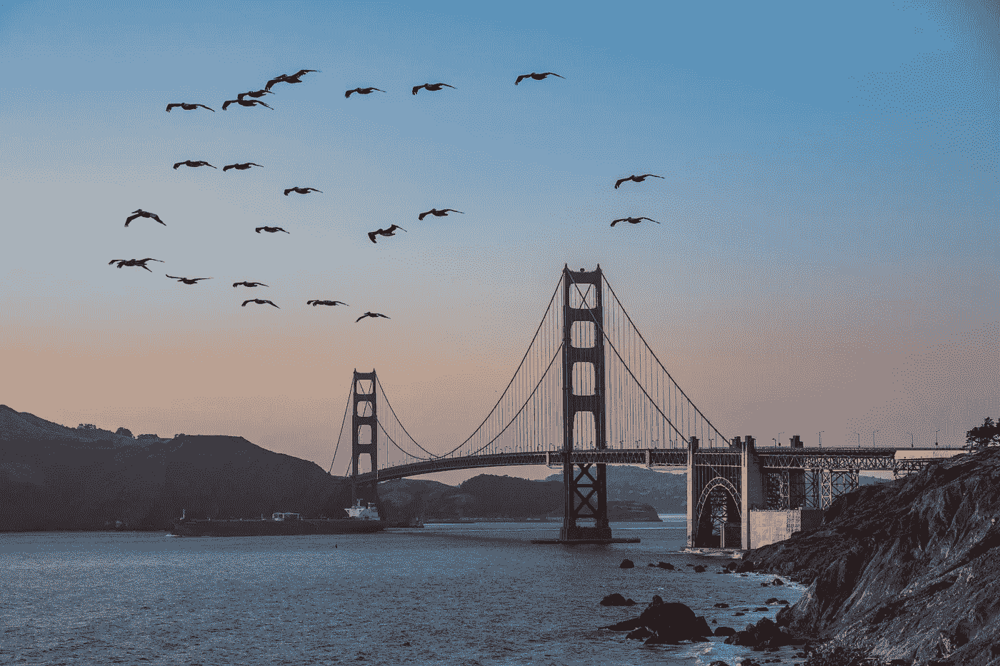

# 硅谷不复存在了？

> 原文：<https://medium.com/hackernoon/silicon-valley-no-more-bc04c9197e6b>

## 创业不再集中在任何一个地方，而是分散在各个地方。

Photo by [Jakub Gorajek](https://unsplash.com/photos/xC41_fGtp6A?utm_source=unsplash&utm_medium=referral&utm_content=creditCopyText) on [Unsplash](https://medium.com/u/2053395ac335?source=post_page-----bc04c9197e6b--------------------------------)

山姆·奥特曼说的话一定是真的。硅谷正在发生变化，它不再是初创公司显而易见的地方。

seed 加速器 [Y Combinator](https://medium.com/u/cb8adc841a29?source=post_page-----bc04c9197e6b--------------------------------) 的总裁兼非营利人工智能研究公司 OpenAI 的联合主席最近在 Twitter 上谈论三藩市和旧金山湾区正在发生的变化。

“我认为 2017 年左右，创业公司在湾区不再是一个明显的好主意，但它在某种程度上被廉价种子资金的大幅飙升所掩盖，”奥特曼在推特上详细阐述道。

他继续说道:“令人难以置信的高生活成本、脸书/谷歌/etc 的力量以及一些文化问题(例如，大多数工作的人任期较短)，最终成为了对湾区令人难以置信的强大网络效应的制衡。在湾区之外，仍然很难找到一些东西，比如优秀的初创企业高管人才、特殊类型的工程人才。”

奥尔特曼仍然预计，“100 亿美元以上的初创公司中有很大一部分将在这里创立，因此投资者仍然关注这里是有意义的。但我敢打赌，很多价值 1 亿美元左右的初创企业将出现在其他地方。”

根据企业家和投资者的说法，新的趋势表明，创业公司不再集中在任何一个地方，“而是分散在每个地方。”

奥尔特曼甚至更进一步，预测未来没有其他美国城市“会在软件创业公司的集中方面超越旧金山。”

其他创始人和企业家也同意这一观点。

[cloud flare](https://medium.com/u/a00e599743a7?source=post_page-----bc04c9197e6b--------------------------------)的联合创始人兼首席执行官马修·普林斯在推特上表示，硅谷“相对于其他愿意全力以赴寻求创新和高薪工作的城市来说，已经变得过于昂贵和过于敌对。”

然而，金钱和关系网似乎仍然在湾区盛行。“我们已经注意到越来越多的 YC 公司来这里参加这个项目，筹集资金和建立网络，然后去其他地方，”奥特曼说。“这是有道理的——湾区的筹资环境和网络仍然是无与伦比的。”

视频广告网络 [BrightRoll](https://medium.com/u/bf1fb01eea8e?source=post_page-----bc04c9197e6b--------------------------------) 的创始人兼首席执行官、投资人兼企业家 Tod Sacerdoti 在奥特曼的推特上回应道:“在湾区和/或在 YC，很少有人讨论的一个好处是能够快速接触并加入早期客户网络。在许多城市，如果没有某种与愿意与初创公司合作的公司网络的联系，这是很难做到的。”

事实上，对于一些创业者来说，硅谷仍然是他们应该去的地方。[Curai 的联合创始人兼首席技术官 Xavier Amatriain](https://medium.com/u/dfc102dddf47?source=post_page-----bc04c9197e6b--------------------------------) 在回应奥特曼时指出，虽然他同意，“人才密度+网络效应+资金可用性仍然高于一切。”Amatriain 补充说:“作为一名在海湾的联合创始人，他为几个不在海湾的创业公司提供建议。”

但是有利也有弊。在最近的一篇文章中，谷歌的 Gloria Liou 形容硅谷是“一个充满机会的地方”。

 [## 这是硅谷

### 我很荣幸生活在硅谷。我在这里出生，在这里长大，现在我在这里工作，是一名产品经理，在…

medium.com](/@glorialiou/this-is-silicon-valley-3c4583d6e7c2) 

但她也对该地区带来的财富的影响以及湾区科技泡沫的身心影响提出了警告。

“我觉得自己受到了硅谷泡沫的影响，”Liou 解释道。“我觉得自己正在将注意力转移到金钱和职业轨迹上，而不是为当地和全球有需要的人服务，我看到自己因此受到了称赞，并融入其中。我觉得自己成了机器的一部分。住在这里，我回想起我的高中经历，充满了痛苦和愤怒。硅谷高中生的心理健康危机越来越严重。我想到了社交媒体对心理健康的负面影响，我和我的朋友们在高中时遭受了这些负面影响，而这些朋友现在在脸书工作，这是多么讽刺啊。”

有人说，科技初创公司和投资者正在放眼全球。

[库珀的创始人罗伯特·加尔](https://medium.com/u/f8700a8bc497?source=post_page-----bc04c9197e6b--------------------------------)说，“看到湾区的大多数种子基金因此更加重视国际创始人，这真是太好了。”

据《财富》报道，国际市场似乎也是 Altman 和 Y Combinator 关注的焦点，他们“最早将于明年夏天”在中国启动一个项目。这家公司已经为 Airbnb、 [Stripe](https://medium.com/u/3ecae35d6d66?source=post_page-----bc04c9197e6b--------------------------------) 、Reddit、 [Dropbox](https://medium.com/u/2d2c8f4cb281?source=post_page-----bc04c9197e6b--------------------------------) 和许多其他公司提供了种子公司。去年 8 月，百度前高管、微软资深人士陆弃宣布加入该团队，担任 Y Combinator 中国区负责人，这标志着这家美国初创企业孵化器的首次全面国际化努力。

“如何帮助美国公司在中国很好地着陆一直是一个共同的斗争，”卢在 Y 组合中国在北京推出时告诉记者。“有结构性原因，这些公司遇到困难有很多原因。”

阿尔特曼说，鲁“将能够把在美国对起作用的东西拿来为中国所用”。“我最大的猜测是，未来十年，很大一部分科技公司将在中国或美国。让中国创始人加入这个社区将是令人兴奋的。”

据伦敦 LinkedIn 的校园编辑兼科技博客作者艾米丽·沃纳(Emily Warna)称，“看起来中国的科技领域继续发展壮大。在某种程度上，的确如此。”她最近[写道](/@emilywarna/silicon-valley-vs-electronics-street-who-should-we-fear-more-8e9ff1941ebf)“中国已经推出了成为人工智能(AI)、自动驾驶汽车和机器人领域全球领导者的计划，作为其*中国制造* 2025 计划的一部分。简而言之，中国是一个值得追随的科技超级大国。”

但她警告称:“尽管由于我们宝贵的脸书，我们每天都在谈论美国的科技场景，但我们是否应该转而关注一种结合了威权控制、社团主义和大规模监控特征的模式的崛起？虽然我仍然不知道答案是什么，但我*会*说，一个政府和技术之间几乎没有区别的系统的想法——以及最低限度的问责制——是非常可怕的。”