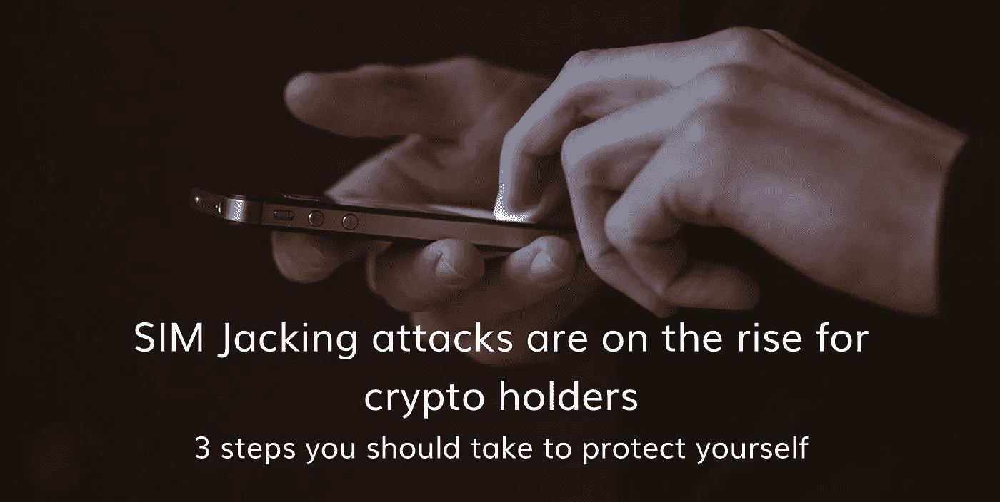

# 对于密码持有者来说，SIM 卡劫持攻击正在上升

> 原文：<https://medium.com/hackernoon/sim-jacking-attacks-are-on-the-rise-for-crypto-holders-829899dab2f8>

## 以下是你应该采取的保护自己的 3 个首要步骤

你醒来时收到一封来自比特币基地的电子邮件，通知你你的提款已被确认。

“真奇怪，”你想。昨晚你没有动任何硬币。

你开始打电话给比特币基地询问发生了什么事，但是意识到你的手机不能用了。你在家通常会得到四格服务，但今天你只看到四个空的点“…

太奇怪了。你借了室友的手机，打电话给你的手机供应商。您在手机提供商的电话号码、选项和安全挑战中找到了自己的路。在等待中听了几分钟劣质的贝多芬第五交响曲后，你终于可以和一个真人通话了。

他们解释说你昨天打电话来，要求把你的 SIM 卡换成你的新手机。他们尽职尽责地完成了请求。但你解释说你没有买新手机，也没有给手机公司打电话。不是你。你登录到比特币基地，并意识到最坏的情况。都没了。

你被模拟劫持了。

# 什么是 SIM 卡劫持？

简单地说，SIM 卡劫持是指有人冒充你的手机供应商，以窃取你的手机号码。模仿你的人可能是你的隔壁邻居，但更有可能的是，他们远在地球的另一端，像热寻的导弹一样在寻找未受保护的资产。

你的手机号码是你数字生活的关键。你的电子邮件、社交账户、信息平台都使用手机号码作为密码恢复选项。由于加密交易的不可逆转性，SIM 卡黑客越来越多地瞄准加密货币的用户，使用基于短信的账户恢复方法登录交易所，扣押你的资金，并将其转移到他们自己的钱包。

这一 2018 时代的攻击有 3 个简单的步骤:

1.  一名黑客说服一家电话公司将某人的电话号码换成黑客控制的 SIM 卡。
2.  黑客使用该电话号码登录受害者的比特币基地账户，或另一个交易所。
3.  然后黑客将密码转移到他们控制的地址。

第一个警告信号包括失去手机服务，以及突然的账户恢复通知，正如一位 BitGo 工程师最近详述的那样，他在一次劫持攻击中损失了 10 万美元。

我们在 2019 年看到的一种更流行、更邪恶的攻击是 SIM 卡劫持和勒索。它是这样工作的。

1.  黑客说服一家电话公司将某人的电话号码换成黑客控制的 SIM 卡。
2.  黑客在受害者的数字生活中翻箱倒柜，试图找到一些尴尬的东西。尴尬可能意味着任何事情，从裸照，到商业记录，到外遇的证据。
3.  黑客威胁要公开发布这些信息，并向受害者勒索他们认为可以得到的钱。

一位密码社区成员最近向我指出，这些勒索活动的受害者通常是女性，因此成为目标。据推测，破坏职业生涯的威胁，加上关于关系或私人照片的淫秽信息，可以用来敲诈他们。

加密社区的重要成员最近被盗了。安德里森·霍洛维茨公司的前合伙人、比特币基地公司的技术专家普瑞蒂·卡西雷迪最近在推特上写道:“这已经是第三次了(T-MOBILE)。”以太坊社区基金的前雇员卡珊德拉·施，[在五月](https://twitter.com/cassshih/status/1132390095338786816)*发微博说“我正在换 sim 卡…我的电报账户包括。”*

*有[报道称，在过去的几周内，数十名著名的密码社区成员](https://www.zdnet.com/article/wave-of-sim-swapping-attacks-hit-us-cryptocurrency-users/) SIM 被劫持。*

# *塞弗朋克煤矿里的金丝雀*

*这个巨大的问题是主流采用加密货币的障碍。*

*随着区块链从社会边缘走向早期采用者，我们看到加密资产的合法使用增加了十倍。随着区块链从早期采用者转变为早期多数，我们将再次看到加密资产的使用增加十倍。*

*每次区块链使用率的增长，都有更多的骗子寻求快速赚钱的目标。这个问题越来越严重，现有的手机运营商没有能力以任何方式处理这个问题(甚至公开承认其严重性)，这也于事无补。*

*从某些方面来说，这是一个**数学**问题。主要的消费者运营商每天可能会收到数千个 SIM 卡转发请求，而只有十几个 SIM 卡移植攻击。通过采用巧妙的社会工程策略，或者在你所在社区的呼叫中心内部有联系人，黑客可以在一天内赚取数千甚至数百万美元。*

*也是一个**责任**问题。许多社交媒体、电子邮件和消息平台已经将认证措施的责任推卸给了手机提供商。这是一个很大的问题，因为作为身份验证的来源，以及某种程度上的身份，并不是服务提供商与客户签订合同的目的。他们通常只提供手机服务和数据。*

*在其他方面，这是一个激励问题。一个移动电话提供商可能会在一个离岸呼叫中心以每年 9000 美元的价格雇佣一个人。他们的员工可能士气低落，甚至对他们的顾客评价很低。有了足够大的报酬，这些雇员可能愿意勾结起来，出售手机数据库的访问权。*

*这也是一个**训练**的问题。移动电话代表大部分是根据脚本操作的，并不总是能够处理最新的社会工程技术。*

*最后，还有一个**透明度**的问题。不要求蜂窝提供商向 FCC 报告 SIM 卡移植攻击，也没有以任何有意义的方式对他们进行监管以保护他们的客户免受这些攻击。*

*这些问题与日益增长的密码使用相结合，为密码窃贼制造了一场完美风暴。*

# *如何分三步采取适当的预防措施*

**1。要求手机运营商提供额外的安全性**

*上面提到的 Kasireddy，[最近发推文](https://twitter.com/iam_preethi/status/1132332122805424129):“这其实是第三次发生这种事了(T-MOBILE)。我添加了个人识别码，但没用。我甚至要求他们不要对我的账户做任何更改，除非我亲自出现，但在这一点上，社会工程超出了我的能力。”*

*如果你希望你的手机运营商能保护你，那么我有一些严肃的消息要告诉你:它可能不能。尽管如此，寻求帮助和额外的压力可以带来意识。*

*移动运营商可以在您帐户的注释字段中添加“特殊说明”来防止 SIM 卡被盗，例如要求帐户所有者亲自到商店更换 SIM 卡的注释。然而，加密社区中的猜测是，这些注释并没有被强制执行，并且经常被忽略。加密社区的进一步猜测是，这些 SIM 卡交换攻击非常有利可图，有足够的动机在电话公司的普通员工中进行内部工作。*

*理想情况下，消费者不必依靠猜测来理解为什么这些攻击不断发生，但许多手机运营商尚未公开这个问题。不幸的现实是，除非你愿意改变你的电话号码，否则你将无法保证防止这种黑客攻击。*

*也就是说；如果你愿意换电话号码，就有希望。尽管这很令人头疼，但这是一个值得考虑的选择。*

*考虑切换到 Google Fi 或 Google Voice 使用 Google Voice，您可以设置一个电话号码，该号码将转发到您的手机运营商提供的号码。从那时起，你永远不会给出手机运营商的号码，从而防止任何潜在的 SIMJackers 在他们开始之前。*

**2。限制你的负面风险**

*另一个策略是限制 SIM 卡劫持攻击的负面影响。首先，从尽可能多的云帐户中禁用“基于手机的帐户恢复”。请注意，帐户恢复不同于二元身份验证。*

*   ***2FA** (双因素认证)需要两个因素，通常是输入一封电子邮件，加上一个发送到你手机的密码，才能登录。*
*   ***账户恢复**是当您忘记登录信息时，如何重置您的登录凭证。*

*检查您的双因素身份验证设置。如果您使用 [Authy](https://authy.com/) ，请确保您禁用了多设备设置，因为黑客在 SIM 卡被劫持后会使用多设备来劫持您的 Authy。*

*接下来，**在您的主要电子邮件提供商上禁用** **基于手机的帐户恢复**。你的主要电子邮件提供商是 SIMJacker 首先试图侵入的，因为它包含了你的许多在线帐户的密钥。你会想改变电话为基础的帐户恢复 2 因素为基础的恢复，或电子邮件为基础的恢复。*

*你要做的第三件事是在你的其他社交账户上禁用基于手机的账户恢复。[这里的](https://twitter.com/owocki/status/1133785109599883264)是你可以浏览的清单。*

*最后，确保你的密码是在一个安全的地方。[已经有很多关于这个话题的内容了](https://coinsutra.com/cryptocurrency-wallet-secure/)，我鼓励勇敢的读者深入了解这个话题，但是 TLDR 是“硬件钱包很棒”*

*以太坊基金会的“猫牧人”Hudson Jameson 指出:“如果你被换成 SIM 卡，确保你有一个计划。我的 SIM 卡交换者登录了我的脸书信使，告诉我的朋友我被绑架了。当我的手机服务重新启用后，我终于能够给我的配偶打电话时，我的妻子非常沮丧，但她有很好的操作技巧，并告诉我，“我要问你两个问题，以确定你确实是哈德逊。”回答完这些问题后，她知道是我。如果你有足够多的加密货币，你可能有被绑架的风险(或者即使你没有),考虑使用某种单词或短语来表明你违背自己的意愿说话或有麻烦。"*

*他继续说道，“每当我换了 SIM 卡，我的配偶就会在 Twitter 上宣布我的手机被黑或被盗了。在那之后，MyCrypto 的 Harry 和 Taylor 在 Twitter 和一些重要的聊天室里传播这个消息。我当时在以太坊基金会工作，并创办了一家名为 Oaken Innovations 的公司。Oaken 立即切断了我的所有访问，并与我的配偶取得了联系。以太坊基金会召开了紧急安全会议，切断了我的所有访问权限。如果您是 devops 团队的一员或有员工，请制定一个计划，以防他们更换 SIM 卡，这样攻击者就无法访问您的系统。”*

*北海巨妖关于手机的安全建议也是一本好书。*

*这可能看起来很多(确实如此)。解决这个巨大的待办事项列表的一个方法是开一个 **SIM 卡劫持派对**。邀请四个朋友过来，试着侵入对方的在线账户。创造性地思考，看看你发现了什么，并在晚上结束前修补任何安全漏洞。*

**3。攻击后，进行伤害控制:**

*如果你受到了攻击，希望你能完成上面的清单——毕竟，一盎司的预防胜过一磅的治疗。如果你已经完成了前面的清单，你的情况会好得多。*

*加密社区也和我分享了这个建议:*

1.  *联系您的手机运营商，最好是亲自联系，并取回您的电话号码。*
2.  *不要回应攻击你的人。关闭已读回执。变得黑暗，让他们认为你是不可及的。*
3.  *要求您的手机提供商在您不在商店的情况下禁用您帐户中的移植功能。*
4.  *拿回你的邮件。*
5.  *给每个社交账户和 Dropbox 等云账户打电话(从最重要的账户开始)，取回你的访问权限。这里的是你可以浏览的清单。*
6.  *办一张新的 SIM 卡，保留旧的，以备不时之需*
7.  *确保不重复密码，并开始使用类似 [1Password](https://1password.com/) 的工具*
8.  *接触决策者和法律官员。ConsenSys 西海岸负责人 Ron Patiro 最近在推特上写道:“如果你在美国，并且已经被 simswapped，我建议你给 starazi@rtf.sccgov.org 地区执法联盟计算机团队的 Samy 发电子邮件。保持安全和 2FA！”*

# *手机运营商，我们指望你改变。*

*作为一个社会，随着时间的推移，我们的电话号码的使用已经从仅仅用于打电话演变为许多许多的使用案例——个人、社会和金融。*

*正如 ConsenSys 的律师 Joyce Lai 所说，“移动运营商需要明白他们需要在保护人们的电话号码方面做得更好。电话号码已经不是 20 年前的样子了。它不仅仅是用来和人交谈的。事实上，它可能很少用于交谈。”*

*我个人花了 4 个小时在电话树上，在 Twitter 上，和我的手机供应商讨价还价，认真对待这个问题。我不知道我的经历是否代表了其他人，但是[社区杰出成员在社交媒体](https://twitter.com/iam_preethi/status/1132332122805424129)上的观点似乎表明了这一点。*

*手机供应商是时候更新他们过时的 OpSec 实践，并认真对待这个问题了。*

*我建议我们从要求手机供应商开始:*

1.  *提供关于 SIM 卡劫持的每月公开透明报告，包括攻击数量、根本原因和补救措施*
2.  *创建一个内部纪律程序，让那些允许客户被欺骗的员工承担责任。*
3.  *为 SIM 卡被劫持的受害者创建一个基金和保险帮助，以便受害者可以继续他们的生活。*

*如果你像我一样认真对待这个问题，要求你的手机供应商认真对待这个问题，否则就离开。让我们团结起来，解决这个问题。*

# *关于作者*

*凯文·奥沃基是[Gitcoin.co](https://gitcoin.co)的创始人，这是一个基于以太坊的网络，通过激励机制发展开源软件。他拥有计算机科学学士学位，在初创公司和开源软件领域拥有 10 年的工程领导经验，并且是博尔德科罗拉多技术领域的社区组织者。*

*Kevin 坚信开源软件开发应该得到可持续的资助。Gitcoin 是一个一站式商店，为软件开发人员提供在这个新的区块链生态系统中生存和发展的技能和联系。*

*你可以在[https://gitcoin.co](https://gitcoin.co)和[https://owocki.com](https://owocki.com)找到更多关于 Gitcoin 的信息*