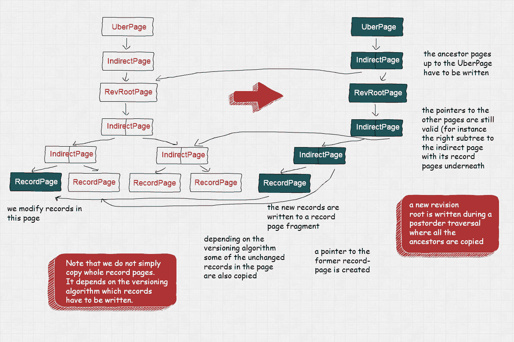

# 为什么写时复制语义和节点级版本控制是高效快照的关键

> 原文：<https://medium.com/hackernoon/sirix-io-why-copy-on-write-semantics-and-node-level-versioning-are-key-to-efficient-snapshots-754ba834d3bb>

生命受制于不断的进化。我们的数据也是如此，无论是研究、商业还是个人信息管理。因此，令人惊讶的是，数据库通常只保持当前状态。

# 介绍

通常，数据库系统要么就地覆盖数据，要么执行写时复制操作，然后删除过时的数据(后者可能在一段时间后从后台进程中删除)。然而，数据自然会随着时间的推移而演变。保存历史往往是很有价值的。例如，我们可能会记录一名员工在 2019 年 3 月 1 日的工资单。假设是 5000€ /月。然后在 4 月 15 日，我们注意到记录的工资是错误的，并将其更正为 5300€。现在，2019 年 3 月 1 日的工资单是什么的答案是什么？只保存最新版本的数据库系统甚至不知道工资单不对。我们对这个问题的回答取决于我们认为最权威的来源:记录还是现实？事实上，他们不同意有效地分裂这一工资事件分为两个轨道的时间，使任何来源都不完全准确。诸如此类的问题可能很容易被 Sirix 这样的时态数据库系统回答。我们随时提供系统/事务时间，这是在事务提交后设置的(当事实在数据库/记录中有效时)。应用程序或有效时间必须由应用程序自己设置(什么时候一个事实在真实世界/现实中是有效的？).我们首先希望通过一些示例用例来激励 Sirix 的使用，然后深入研究技术方面和概念。

# 数据审计

因此，Sirix 的一个使用场景是数据审计。我们在(双)时态数据的专用索引结构和我们新颖的滑动快照版本控制算法中跟踪过去的修订，该算法平衡了读取和写入性能，同时避免了任何峰值(我们的系统非常节省空间，并且根据版本控制算法，我们仅复制更改的记录以及写入期间可能更多的记录)。例如，如果只有一条记录发生了变化，我们通常不会简单地复制整个数据库页面；我们也不必像在 B+-树和 LSM 树中那样在每次提交期间聚集数据)，此外，我们可以简单地通过挂钩和我们的用户定义的二级索引结构来跟踪变化，以避免整个资源的潜在的昂贵的差异(即使我们可以利用散列，其可以可选地在更新操作期间构建用于完整性检查，并且因此如果散列和稳定的、唯一的节点标识符匹配，则跳过整个子树的比较)。如前所述，如果我们不想跟踪额外索引中的变化，我们可以使用基于 ID 的 diff 算法。我们从不允许覆盖或删除旧版本(也就是说，如果需要的话，我们可能会研究如何删除旧版本)。单个读/写事务始终追加数据。当然，您可以恢复到特定的修订版并提交新的修订版，但是中间的所有修订版都可以进行数据审核。因此，我们能够帮助回答谁在何时改变了什么。

# 时间旅行查询

数据审计是关于特定的记录/节点是如何改变的。时间旅行查询可以回答这些问题，而且还允许在特定时间或特定时间跨度内重建整个子树，或者整个文档/资源如何随时间变化。你可能想分析过去来预测未来。通过额外的时态 XPath 轴和 XQuery 函数，我们鼓励您研究数据是如何演变的。

一个示例查询可能如下所示:

这将打开数据库 mycol.jn，并在其中打开数据库在特定时间看到的文档/资源 mydoc.jn，从而加载快照/特定修订。这个例子打开并查询一个 JSON 数据库/资源，但是您也可以创建本地 XML 数据库。然后，我们搜索日期时间在 2018 年 2 月 1 日之后的状态，该状态在之前的版本中不存在。然后我们输出修订号和找到的状态(投影)的文本。您还可以在给定的时间间隔内打开一个资源，并接收一系列 JSON 条目，这代表了这个时间间隔内的修订列表。这只是一个简单的例子:我们提供了更多的时态函数。

# 修复应用程序或人为错误/简单的撤销/重做操作/回滚/重现实验

您可以简单地恢复到某个特定的修订/时间点，其中所有内容都处于已知的良好状态，然后再次提交该修订，或者您可以简单地选择一个特定的记录/节点，然后更正错误并提交新的修订。

所有这些使用场景是如何实现的？让我们将注意力转向这样一个问题:为什么历史数据在过去没有被保留，以及近年来新的存储技术的进步如何使得构建复杂的解决方案来帮助回答这些问题成为可能，而没有最先进的系统所带来的障碍。

# 为什么现在存储历史数据变得可行

正如马克·克拉米斯在他的论文《让持久的树木生长到 21 世纪》中指出的那样:

> 切换到闪存驱动器强烈地促使人们从“当前状态”范式转向记住导致这种状态的进化步骤。

From Marc Kramis: Modifications evolving the state of your data.

主要观点是，如今常见的固态硬盘等闪存驱动器具有零寻道时间，同时无法对数据进行就地修改。闪存驱动器被组织成页面和块。由于它们的特性，它们能够在精细粒度的页面级别上读取数据，但是只能在较粗的块级别上擦除数据。此外，在更新块之前，首先必须擦除块。因此，更新的数据被写到另一个地方。垃圾收集器将已经被重写到新位置的数据标记为在先前的块位置被擦除，以便将来可以存储新的数据。更新在新位置查找数据的元数据。

因此，现在可以存储自然演变数据状态的精细颗粒变化。

时态数据库的搜索/插入/删除操作应该以对数时间( *O(log(n)* )进行，以与常用的索引结构竞争。

# 临时存储系统 Sirix.io

Sirix.io 是一个临时存储系统，其灵感来自文件系统 ZFS 和版本系统 Git 等。它基于写入时复制语义和节点级版本控制，因此永远不会覆盖数据。

让我们首先定义一个时态数据库系统是什么。

时态数据库能够有效地存储和检索数据的过去状态。通常，它存储事务时间，即数据实际提交到数据库的时间。如果我们也存储有效时间，即一个事实在现实世界中为真的时间，我们有一个双时态关系，即两个时间轴，交易时间和有效时间。

Sirix 已经被开发来回答这样的问题:给我上个月美元对英镑欧元汇率的历史。根据当天的记录，2019 年 2 月 12 日的客户地址是什么？是他们移动了还是我们纠正了一个错误？我们在数据库中有错误吗，这些错误后来被纠正了吗？

# Sirix.io 的概念/架构

我们支持 **N 个只读**事务，这些事务被绑定到一个**单一修订**(每个事务可以在任何过去的修订上开始)*并发*到**一个写**事务。因此，我们的系统基于**快照隔离**。写事务可以将最近的修订恢复到任何过去的修订。然后，可以提交对此过去修订的更改，以创建新的快照，从而创建新的修订。中间的修订永远不会丢失。我们从头开始编写我们的存储管理器，因此现在让我们将注意力转移到 Sirix 的内部。

下图描述了**一个版本**的页面结构。注意，在每个事务提交期间，创建新的修订根页面及其子树，而未改变的页面只是在它们的原始文件偏移位置被引用。

Page-Structure of Sirix.io

**UberPage** :这里的`UberPage`是主入口。它包含关于资源配置的头信息以及对一个`IndirectPage`的引用。该引用包含数据文件或事务意图日志中间接页的偏移量和内存中的指针。在 transaction-commit 期间，uber 页面总是作为最后一页写入。因此，即使在事务失败的情况下，我们也总是有一个有效的、一致的存储状态。

**IndirectPage:** `IndirectPages`用于增加树的扇出，本质上能够存储和检索大量的记录(而只需要在必须再次读取记录时读取预定义数量的页面)。我们目前在`IndirectPage`中存储了 512 个对另一层间接页或数据页的引用，或者是`RevisionRootPage`或者是`RecordPage`。每当我们用完了可以存储在叶子页面中的记录数量(修订或记录)，就会添加一个新的间接页面级别，这些页面由`IndirectPages`引用。当前子树的高度，即间接页面的层数，总是存储在相应的子树根页面中。我们借鉴了文件系统 ZFS 和基于散列数组的尝试，因为我们也将校验和存储在父数据库页面/页面片段中，这又形成了一个自验证 merkle 树。由于间接页可能有许多`null`-指针，我们使用一个位集来跟踪哪些数组索引被真正设置，从而能够在内存中存储一个紧凑的数组或列表。

**revisionroot page:**`RevisionRootPage`是一个修订的主入口点。它以 unix epoch(自 1970 年以来的毫秒数)的形式存储 author-ID、可选的 commit-message 和时间戳。此外，它存储了对一个`PathPage`、`CASPage`(如果存在的话)、一个`NamePage`和一个`IndirectPage`的引用。间接页面是存储在叶节点`RecordPage`中的数据的入口点。由`IndirectPage`开始的`RevisionRootPage`的右边子树实际上是存储在叶节点`RecordPage`中的数据的主要入口点。为了支持对 RevisionRootPage 的快速访问，我们在一个 revisions-file 中存储了第二个文件，其中只包含特定修订的偏移量，在启动时将该文件读入内存。

其他页面主要用于在它们的子树中存储不同种类的索引结构(AVL-tree 节点存储在记录页面中),但是为了简洁起见这里省略了。更多信息可以在 https://sirix.io/concepts.html.找到

# 事务提交

快照，即在每次提交期间创建的新修订。除了数字*修订号*之外，*时间戳*被序列化。随后可以通过指定 ID 或时间戳来打开修订。使用时间戳需要对时间戳数组进行二进制搜索，时间戳数组持久存储在第二个文件中，并在启动时加载到内存中。如果找到准确的时间戳或与给定时间点最接近的修订，则搜索结束。数据永远不会写回同一个位置，因此不会就地修改。相反，Sirix 在节点/记录级别使用写时复制(COW)语义(创建页面片段，通常不复制整个页面)。每次必须同步页面的新版本时，已经改变的修改记录以及一些未改变的记录被写入新位置。具体复制哪些记录取决于使用的版本控制算法。因此，它特别适合固态硬盘等基于闪存的驱动器。对数据库中资源的更改发生在上述资源绑定的单次写事务中。因此，首先必须在特定资源上打开资源管理器，以启动单个资源范围的事务。请注意，我们已经开始处理数据库范围的事务:-)

Copy-on-write nature of Sirix.io

我们假设已经在最左边的记录页中插入/更新/删除了一条记录。根据版本化算法，被修改的记录以及页面的一些其他记录被复制到新的页面片段。首先，所有更改都存储在内存事务(intent)日志中，如果需要，可以在内存压力下持久化。第二，在事务提交期间，当前`RevisionRootPage`的页面结构在后序遍历中被序列化。所有更改过的`RecordPags`都被写入磁盘/闪存驱动器，从最左边开始。如果间接页下存在其他已更改的记录页，这些记录页将在指向已更新记录页的间接页之前被序列化。然后写入指向更新的修订根页面的`IndirectPage`。用对记录页的新持久位置的更新引用来写入间接页。我们还像在 ZFS 一样将校验和存储在父指针中，这样，一旦我们对数据进行分区，特别是复制数据，未来的存储就能够检测数据损坏并自我修复。整个页面结构以这种方式序列化。我们还希望将来在引用中存储一个加密密钥，以支持静态加密，类似于 OpenZFS 中使用的方法。

请注意，我们必须更新每个已更改的`RecordPage`的祖先路径。然而，存储间接页面以及`RevisionRootPage` / `CASPage`、`PathSummaryPage`和`PathPage`是很便宜的。我们目前存储了`NamePages`的副本，但是将来也可能根据所选择的版本化算法对其进行版本化，就像`RecordPages`一样，这样我们就不需要复制整个字典，从而节省存储成本。不指向新页面或页面片段的每个引用都保持不变。因此，未更改的页面(也不在已更改页面的祖先路径上)只是在它们在先前修订中的相应位置被引用，而不会被重写。

Sirix 最与众不同的特性之一是我们在每个版本/每个记录级别上进行版本控制。因此，`RecordPages`不会被简单地复制到一个新的永久位置，即使只有一条记录被修改。相反，我们实现了备份系统中已知的版本控制算法，并发明了一种新颖的滑动快照算法来克服它们的缺点。新记录页片段总是包含对以前版本的引用。因此，我们的版本控制算法能够解引用最多固定的、预定义数量的页面片段，以在内存中重建一个`RecordPage`。

# 用于存储和检索节点级快照的版本控制算法

对于大多数数据库系统，我们最多存储固定数量的节点/记录，即每个数据库页面的实际数据(目前最多 512 条记录)。记录本身的大小是可变的。超过预定义字节长度的超长记录存储在额外的溢出页中，仅在记录页中引用。

我们实现了许多版本控制策略，这些策略在备份系统中最为人所知，用于记录页的写时复制操作。也就是说，我们要么复制

*   完整记录-页面，即页面中的任何记录(**完整**)
*   仅记录页中关于前一版本的变更记录(**增量**)
*   仅记录页中自整页转储以来发生变化的记录(**差异**)

**增量版本**是另一个极端，写性能是最好的，因为它存储了最佳值(仅更改的记录)，但另一方面，重建页面需要间歇性的完整页面快照，这样，性能不会随着页面的每个新版本而下降，因为增量的数量随着每个新版本而增加。

**差异版本控制**试图更好地平衡读写，但仍然不是最佳的。每次修改页中的记录时，都会写入一个新页，其中包含自上次完全转储该页以来所有已更改的记录。这意味着只需读取页面片段的两次修订即可重建记录页面。然而，写入性能也会随着页面的每个新修订而恶化。

关于写入性能的增量版本控制，由于需要间歇性完全转储页面，会导致写入峰值。差异版本控制也有类似的问题。如果没有间歇性的完整转储，每次新写入时都必须复制大量数据。

*Marc Kramis* 提出了一种新颖的**滑动快照算法**的想法，这种算法可以平衡读/写性能，以避开任何写峰值。

该算法利用了滑动窗口。第一，必须存储任何改变的记录，第二，任何比窗口的预定义长度 N 旧并且在这 N 次修订期间没有改变的记录。最多只能读这 N 个版本。获取页面片段可以并行进行，或者一旦从最近的修订开始重建了整页，我们就简单地停止。或许在 Marc 的论文中可以找到对该算法最好的高层次概述:[进化树结构存储:概念、接口和应用](http://kops.uni-konstanz.de/handle/123456789/27695)

一旦我们确定我们的存储系统线性地获取旧版本和最新版本，对数地获取和存储单个记录以及整个版本，我们就把注意力集中到上层。

# 支持我

如果你喜欢这个，请给我一些掌声，让更多的人看到它或 Github 上的一颗星…最重要的是，请检查它并让我知道，因为几年来我是唯一一个在 Sirix 上工作的人，现在比以往任何时候都更渴望提出一个版本化的、安全的时态分析平台作为社区的想法(**)我很乐意听到任何建议、反馈、对未来工作的建议，例如在云中水平扩展(即复制/分区)的工作，bug 报告；-)，只是一切…请联系** ) :-)

## 开源库:h[ttps://github . com/Siri xdb/sirix](https://github.com/sirixdb/sirix)

## 新社区论坛:https://sirix.discourse.group

## Sirix 网址: [https://sirix.io](http://sirix.io)

 [## Sirix

### Sirix 通过快照和一个新的……

sirix.io](https://sirix.io)