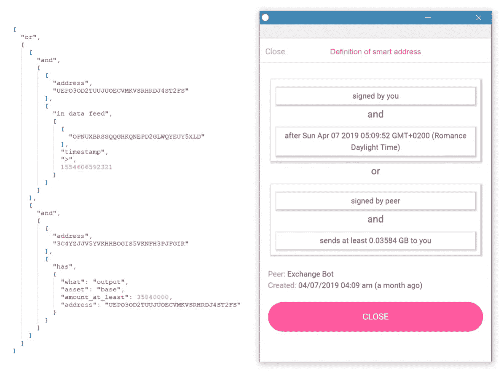

# 智能合约:以太坊 vs. Obyte

> 原文：<https://medium.com/hackernoon/smart-contracts-ethereum-vs-obyte-72f95ab6bde7>

智能合同已经成为以太坊上的实体脚本的同义词，它们可以用来创造许多东西:多签名钱包、可替代和不可替代的代币、使用托管支付等等。在大多数情况下，你不需要分散所有的用户交互，所以智能合同应该尽可能少做。有些人已经发现，当他们的智能合同[由于区块气限制和无限循环](https://blog.b9lab.com/getting-loopy-with-solidity-1d51794622ad)而无法执行时，这是一个艰难的过程。

在 Solidity 中，相同的功能可以用不同的方式编写，这意味着这些智能合同通常对普通用户来说是不可读的(即使在源代码已经被验证之后)，并且相同功能的每个实现都可能有不同的错误，因为开发者可能忘记了限制对默认情况下应该被限制的东西的访问([奇偶校验黑客](https://blog.zeppelin.solutions/on-the-parity-wallet-multisig-hack-405a8c12e8f7))。很高兴看到 Solidity 代码上基本功能(ERC20、ERC721、SafeMath)的标准化，但如果您的损坏代码已经存在，并且您没有考虑如何替换智能合同的损坏部分，通常为时已晚。另外， [ERC20 只为令牌](https://cointelegraph.com/explained/erc-20-tokens-explained)定义了必需的函数，但是每个开发者仍然可以编写自己的实现——所以[并非所有的 ERC20 令牌都是相同的](/hummingbot/the-myth-of-the-erc-20-token-standard-ab0d76cf8532)。实现替换智能合约某些部分的功能的可能性也意味着，同样的 ERC20 标准令牌明天可能会有不同的消费规则，甚至被开发人员暂停。

Obyte 上的智能合约对开发者和用户都是可读的。

**内置 Obyte 平台**

幸运的是，这不是智能合约的唯一方式。 [Obyte](https://obyte.org/) 是一个使用 DAG(有向无环图)构建的开放式加密货币平台，它具有人类可读的智能合同，这些合同具有一组需要为真才能将资金转出的条件。Obyte 平台还内置了多签名钱包、用户创建的令牌、托管支付和许多其他常见的智能合同用例。开发人员仍然有可能错过智能合约中的一些条件，这可能会在部署的智能合约中留下错误，但更难犯其他错误，因为智能合约语言在 Obyte 上是声明性的。

**成本可预测性**

在以太坊上，大多数情况下，开发者将不得不[只为部署智能合约付费，用户将为所有其他交互付费](https://ylv.io/how-much-does-it-costs-to-run-dapp-in-2018/)。实际上，企业也是用户的另一个对手，也需要执行一些功能。由于以太坊智能合约中的每一项操作都需要耗费大量的资源，如果开发者添加了一个需要遍历不断增长的用户地址列表的函数，那么执行该函数的成本也会随着列表的增长而上升。以太坊的吞吐量也像比特币一样受到块大小的限制，所以当用户越多，费用也就越高。

在 Obyte 上，oracles 发布的每一笔付款和每一个数据的成本都与它在公共数据库中占用的空间一样多，这意味着费用对开发人员来说是可预测的，企业可以估计他们在下一年或更长时间内需要获得多少 Obyte 字节(原生硬币)。这是可能的，因为 DAG 体系结构没有数据块大小限制，也没有数据块时间限制。

最后，但同样重要的是，Solidity 是一种类似 Javascript 的语言，但它不是 Javascript，这意味着它比其他现有语言有更陡峭的学习曲线。这意味着更多的开发成本和更多的 bug。Obyte 是在众所周知的 NodeJS 上编写的，Obyte 智能契约只是 JSON 代码中的嵌套条件。