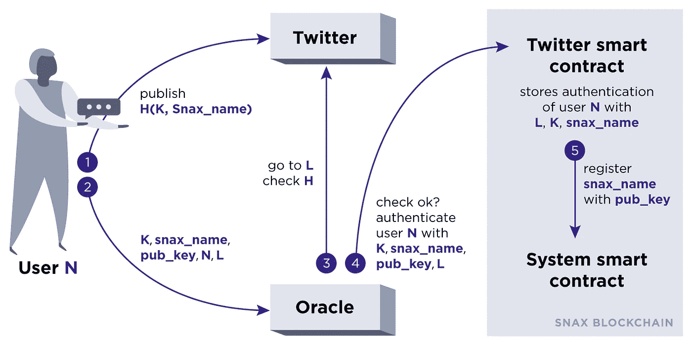

# 解释:Snax 无信任认证协议

> 原文：<https://medium.com/hackernoon/snax-trustless-authentication-protocol-f925216ae7d2>

Snax 运营的基本技术是将区块链交易与 Twitter、Reddit 等社交媒体平台上的账户绑定在一起。

Snax 区块链允许你[将交易](https://hackernoon.com/snax-social-transaction-and-why-sharing-is-caring-afc32c8f1646)发送到整合到 Snax **的任何公共平台上的任何账户名下，而无需接收者**事先开具发票(我们称之为社交交易)。

你可以确定交易将到达接收方，而不必依赖于集中的第三方(当然，除了社交平台本身)。本文将使用 Twitter 帐户的认证示例来解释 Snax 无信任认证协议是如何工作的。

# 不要相信。但是核实一下。

这是构建开放密码系统(包括区块链系统)的主要原则。

使用 oAuth 2.0 构建的认证解决方案，例如 OpenID connect，可以很好地与集中式服务器一起工作，但是，在分散式系统中很难实现它们。

这些系统旨在解决一个特定的问题，即用户(*客户端*)何时需要获得某项服务的授权(*集中式服务器*)。然而，使用基于区块链的系统，任何用户的认证和授权必须不是由一个服务器来验证，而是由外部观察者(*第三方*)在任何时刻来验证。

**Snax 无信任认证协议为以下问题提供了解决方案**:

1.  对来自 Snax 区块链上任何公共平台的用户进行身份验证。
2.  随时向任何第三方提供用户身份验证的证明。
3.  在没有公共平台参与的情况下，使用 Snax 帐户完成任何后续认证。

# 第一步。认证。

以 Twitter 为例，它是一个在线公共平台(Twitter 将在 main net 发布时集成到 Snax 区块链)。

让我们假设您有一个 Twitter 帐户，并且希望使用该帐户在 Snax 区块链中完成身份验证。将使用以下算法进行身份验证:

1.  客户端(用户)生成一对密钥( *priv_key，pub_key* )。
2.  客户在 snax 区块链上选择任何未分配的账户名称(*Snax _ name*)(*Snax _ name*账户将在区块链上注册)。
3.  客户端生成一个密钥( *K* )。
4.  客户端计算一个哈希函数
    *H(K，snax _ name)= hmac _ sha 256(K | | hmac _ sha 256(K | | snax _ name))*
5.  客户通过从他们的 Twitter 帐户创建一条推文来发布接收到的散列值*H*,**确认他们的意图** **在 Snax 区块链上完成认证**。
6.  客户端向 oracle 发送以下信息:
    - Pair ( *K，snax _ name*)
    -Their*pub _ key*，将为其注册帐户名 *snax_name* 。
    -他们在 Twitter 上的帐户名 *N* 和一个到认证 tweet 的链接(可选，因为 oracle 可以使用 Twitter API 在提要上找到认证 tweet)
7.  然后，Oracle 会计算您的散列值 *H* ，并将其与认证 tweet 中的散列值进行比较。如果哈希值相同，Oracle 认为身份验证过程已经完成。
8.  Oracle 使用参数( *K，snax_name，pub_key，N，L* )调用 Twitter 平台智能合约的注册方法。
9.  twitter 平台智能合约然后用公钥 *pub_key* 注册账户 *snax_name* ，并向区块链添加关于 Twitter 用户 *N* 成功认证的信息、公钥 *K、*和链接 *L* 。

Snax authentication process

# 第二步。证明。

现在有必要解释为什么第三方可能不信任已经完成用户认证的集中式 oracle。

让我们考虑以下媒介攻击的可能性:

1.  甲骨文受到威胁。
2.  入侵者伪造用户的身份验证请求。

**对这种攻击的主要防御来自于暴力强制传入数据** ( *K，snax_name* )满足认证散列 *H* 的不可能性。

因为包含 hash *H* 的认证 tweet 是由 twitter 帐户的所有者在 Twitter 上发布的，所以入侵者无法生成有效的对( *K，snax_name* )，除非该对是由帐户的实际所有者提供的。

这样，任何第三方在任何时候都可以使用下面的算法来验证 Twitter 账户 *N* 的所有者的认证:

1.  把嵌入到区块链对中的关于用户的认证( *K，snax_name* )。
2.  生成 hash *H(K，snax_name* )。
3.  转到已发布的链接 *L.*
4.  验证发布推文 *L* 的账号确实属于用户 *N* 的账号。
5.  检查 tweet *L* 中是否存在 hash *H* 。如果找到了散列，那么用户认证是有效的。

# 第三步。使用 Snax 帐户作为验证者。

现在，用户的认证可以被证明，区块链账户的名字 *snax_name* 可以随后被用作 Twitter *N* 的用户的认证。例如，snax 区块链使用账户 *N* 的 *snax_name* 来进行 Snax 令牌的[发行。](/@Snax/snax-token-distribution-a181610ffe8)

这一过程还使得有可能创建到公共网络的任何账户的交易，集成到 Snax 平台中，而无需接收者事先开具发票。平台智能合约将自动完成对 *snax_name* 的交易，从该处完成对接收方的认证。如果身份验证尚未完成，则平台智能合约将等待其完成以执行交易。

# 结论

我们已经了解了 Snax 无信任认证协议在宏观层面上是如何工作的。

当然，发布认证消息的行为(例如 tweet)可能会给用户带来不便，但是，我们还没有看到任何可靠的替代技术来创建无信任认证。

这种不便可以通过在现有社交网络的 API 中集成 Snax 无信任认证协议(或类似协议)来解决。一般来说，这不是一个复杂的过程，但是，它确实需要平台为第三方请求创建一个公共认证 API。

如果您对 Snax emission 如何工作、如何获得出版商奖励或如何成为 Snax network 的一名制作人有任何疑问，请随时加入我们在[https://discord.gg/qygxJAZ.](https://discord.gg/qygxJAZ.)的讨论，不要忘记在 [Twitter](https://twitter.com/SnaxTeam) 上关注我们，并为这篇文章鼓掌！

此外，你可以在这里找到常见问题的答案[https://snax.one/faq.](https://snax.one/faq.)