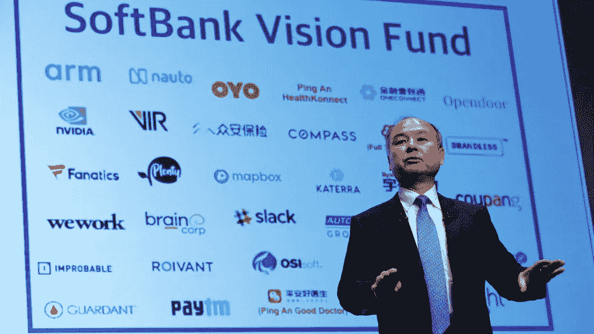

# 软银的 300 年愿景已经过时，原因如下..

> 原文：<https://medium.com/hackernoon/softbanks-300-year-vision-is-already-out-of-date-here-s-why-700fed5d1c35>

> “去中心化程度更高的区块链对数据的移除，以及随之而来的人工智能垄断，是对谷歌经济学的文化反弹，就像比特币对金融危机的反弹一样。”——Jamie Burke，Outlier Ventures。

1000 亿美元风险基金软银(Softbank)魅力非凡的领导人孙正义(Masayoshi Son)及其对未来 300 年的愿景一直是头条新闻，但对我来说，这错过了当今互联网正在发生的一个根本性范式转变。这一变化可能会让他的许多投资变得脆弱。简而言之，未来最具变革性的技术，从数据收集到人工智能，将越来越开源、符号化和高度去中心化。

# **为什么软银的‘赢家通吃’网络 2 战略有缺陷**

软银的模式将规模经济和网络效应(Web 2 风险投资的核心)的逻辑发挥到了极致，专注于“赢家通吃”的领域。孙正义经常以“想象资本不再是问题”为开场白，让团队优先考虑激进增长而非盈利能力。

如果我们看看软银的投资组合，他们专注于少数几个协同类别，如:多边市场、房地产(办公室、存储、机器人)、电子商务和物流(最后一英里交付)。这些投资通常基于一个主要前提:它们是“人工智能优化”的公司，在规模上具有数据优势，可以更好地优化利用率和产能，以在长期内战胜其市场的基本经济单位成本。

为了支持这一论点，他们还投资了 ARM 和 Nvidia 等硬件公司，这些公司正在让机器学习变得更容易、更快、更便宜，还投资了 Improbable 等软件初创公司，这些公司提供了一个虚拟环境来支持复杂数字世界的发展。有趣的是，在不可能的情况下，他们已经认识到网络问题解决的游戏化可能是大规模并行机器学习的最佳方式。这里有一个暗示，暗示着等待他们的可能是什么。

# **向共享“全球公共事业”的转变**

这个故事始于计算能力从云到开源互联网协议的转移，开源互联网协议通过分布式市场实现了同样的规模效益。最著名的例子是比特币区块链:在这里，包括专业硬件和能源在内的数十亿资源已经在一个简单的算法和奖励系统的协调下“自下而上”地出现。然而，这只是第一个例子。在比特币挖矿专注于动员硬件解决一个非常特殊的数学游戏的地方，许多其他分布式系统正在兴起，各方投入资源解决各种问题，以换取数字奖励。

在我们自己的产品组合中，我们有 [Haja Networks](https://haja.io/) (实现传统数据库孤岛之间的互操作性) [Ocean Protocol](https://oceanprotocol.com/) (通过分散的数据市场出售数据，以帮助训练算法)和 [Fetch。AI](http://www.fetch.ai) (那些算法可以获得经济代理权，把自己的价值卖给别人)。当它们结合在一起时，它们提供了一系列新兴的技术，通过为大量市场参与者带来规模经济，为初创公司创造了公平的竞争环境。这意味着，支撑孙正义愿景的许多旧优势，如数据垄断和集中式 IT 基础设施，将通过这些新的“全球公共事业”向所有人开放。

随着开放网络提供了一个有吸引力的替代方案，专有数据集、其算法和内部人才的优势将逐渐消失。随着政府推动数据主权，用户逐渐对令牌化网络的激励做出反应，这些新协议将挑战 Son 的“赢家通吃”平台。

如果软银的投资组合没有对这些趋势做出回应，那么建立具有任何有意义的人工智能优势的可持续公司的梦想将受到威胁，它们的估值也将受到威胁。优步将成为一家没人愿意为之开车的公司，Doordash 将成为一家招不到快递员的公司，而我们将成为一家负债累累的商业房地产公司。

事实上，正如《监控资本主义的时代》(The Age of Surveillance Capitalism)一书中所生动描述的那样，作为孙正义愿景核心的硅谷自由放任的“快速行动、打破常规”资本主义的经济模式本身正在过时。相信像优步这样的平台开发善意的人工智能来提取和利用我们互动的“数字废气”的想法很快变得不可接受和过时。

# **那么，软银接下来会做什么呢？**

好吧，鉴于他们已经动用了 1000 亿美元中的 40%，他们所能做的最好的事情就是至少对冲一些资本进入反叙事。然而，这些新协议的独特之处在于，因为它们是开源的，所以它们不容易受到现任者的典型反应:购买、同化或消灭。

目前,“加密”市场比 2017 年的历史高点下跌了 90%,此外，许多下一代协议刚刚上市，这一次是在熊市估值的情况下。目前在加密领域，有一样东西是短缺的，那就是耐心资本。

因此，如果孙正义重复他在互联网泡沫后做得那么好的事情，投资雅虎和阿里巴巴，他就可以“买入 dip”。理论上，软银可以领导每一个即将上市的具有威胁性的新协议的投资回合，或者更重要的是，那些补充其投资组合的协议。

为什么？因为所有这些协议都在寻求有效地将其技术转化为互联网标准。如果软银的投资组合是这些技术的早期采用者，他们可以适应并保护他们的多方面市场现金牛，这些现金牛由无处不在的服务、品牌和网络效应所保障..

将如此多的资本引入市场并结合现实世界的采用，将会看到所有牛市之母，具有万亿美元密码产业的潜力。