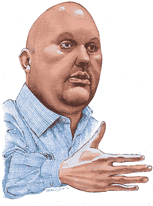
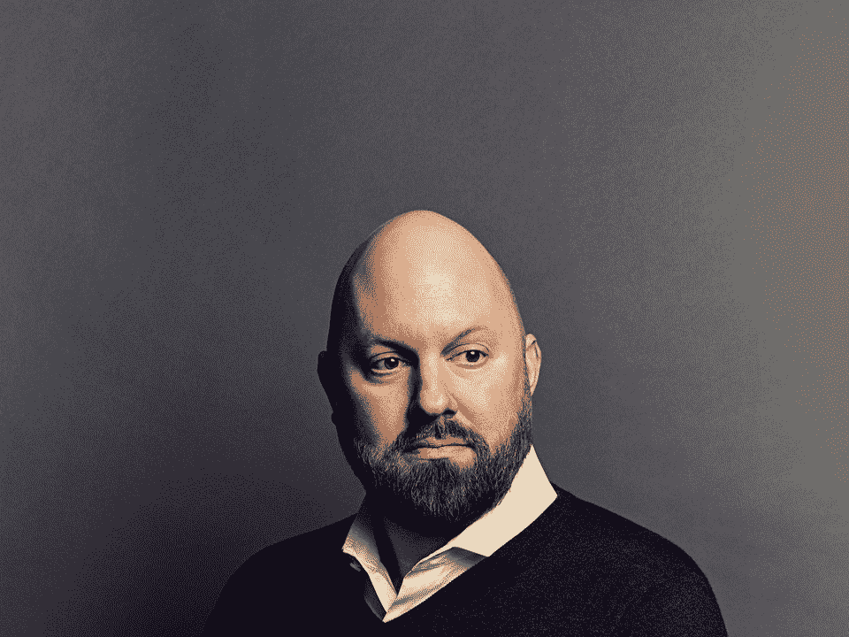
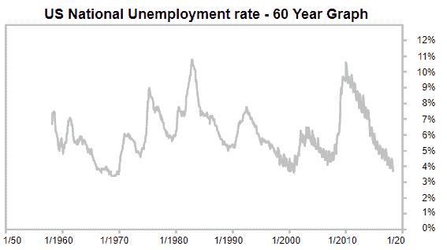
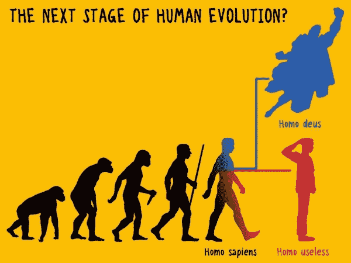
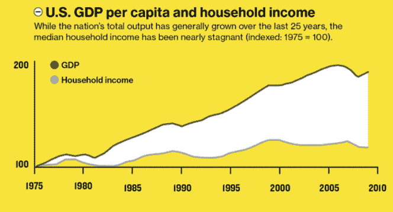
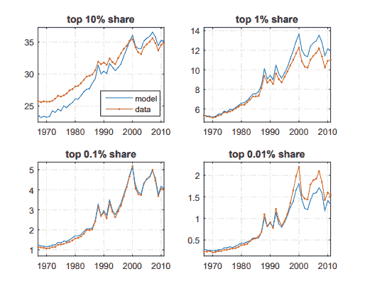
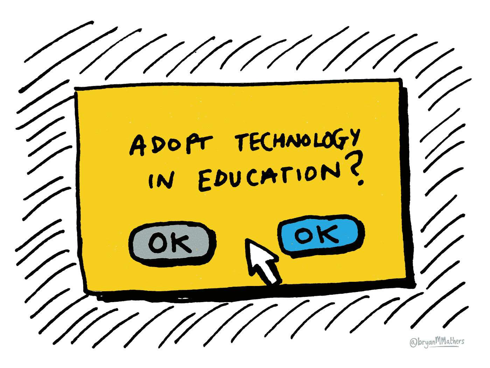
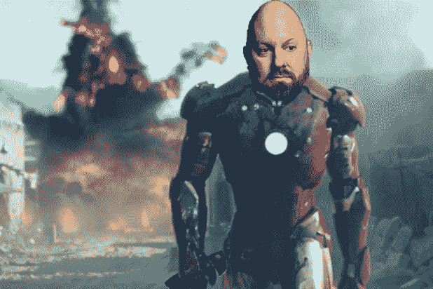
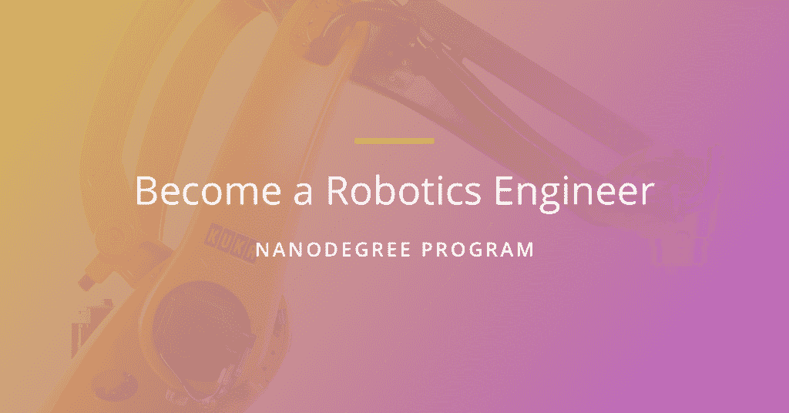
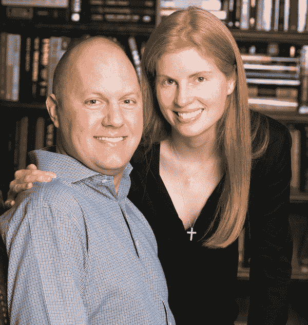

# 软件是在吃无用阶层吗？

> 原文：<https://medium.com/hackernoon/software-is-eating-the-useless-class-c2b04461bb67>

## 马克·安德森的故事

Tom Chanter

# 互联网传道者

“他不擅长基本的日常生活:方向让他困惑，因为道路不符合逻辑，他对太阳镜如此心不在焉，以至于他在大厅的桌子上放了九副太阳镜，”泰德·弗兰德在《纽约客》杂志的简介中写道。

他在威斯康星州的新里斯本长大。人口？1,500.8 岁时，他自学了 BASIC 编程语言。然而，他的小镇缺乏满足他好奇心的资源。“我们有一个非常小的公共图书馆，最近的书店也有一个小时的路程。所以我来自一个渴望信息、渴望联系的环境，”他在接受科技杂志《连线》的[采访](https://www.wired.com/2012/04/ff-andreessen/)时说。

在他的《纽约客》简介中，他把自己的家人描述为“斯堪的纳维亚人，顽固，非常自我否定，一辈子都不指望幸福。”有一年冬天，由于手头拮据，他的父亲决定停止支付煤气、暖气的费用，“……我们花了很多时间砍他妈的木头。”

他的同事本·霍洛维茨[这样评价他](https://www.newyorker.com/magazine/2015/05/18/tomorrows-advance-man)，“他让我想起了坎耶，那种强烈的情感——他的童年太糟糕了，他不会去那里的。”

[Time Magazine](http://content.time.com/time/covers/0,16641,19960219,00.html)

作为伊利诺伊大学的大四学生，他在高科技智库国家超级计算应用中心找到了一份每小时 6.85 美元的编程工作。他接触到了互联网。

他立即发现了对易于使用的互联网浏览器的需求。他拼凑了一个原型。他的浏览器想法后来成为有影响力的马赛克浏览器，以及他的公司网景。

1995 年 8 月，网景公司上市。23 岁时，他身价 5300 万美元，并创造了“黄金极客”和“互联网传道者”。截至 12 月，他的股票价值 1.74 亿美元。到 1998 年，网景以 42 亿美元的价格卖给了美国在线。但是今天他并不仅仅被认为是一个从互联网上致富的人，由于他的浏览器，他被认为是帮助建立它的人。

> “网景是基于我心爱的人小时候无法在一个小镇上接触到知识。”

他的妻子[将](https://www.newyorker.com/magazine/2015/05/18/tomorrows-advance-man)的成功归功于他的童年，“网景是基于我心爱的人小时候无法在一个小镇上接触到知识。”然而，他的成功可能是以新里斯本的工人阶级为代价的。

[Financial Times](/financial-times/lunch-with-the-ft-marc-andreessen-8478fa9476b3)

这是一个来自威斯康星州的男孩如何成为一名精英科技企业家和风险资本家的故事。就是他的软件吃无用类的故事。这是一个关于那个男孩的故事，他现在身高 6 英尺 5 英寸，有着后卫的体格，他是否能拯救日益壮大的无用阶层，以及他是否足够在乎去尝试。这是马克·安德森的故事。

# 有些事情不太对劲

[New Yorker](https://www.newyorker.com/magazine/2015/05/18/tomorrows-advance-man)

《纽约客》写道:“它的头盖骨如此巨大、光秃秃、呈长方形，你不禁会想到‘巨型’和‘A 级’这样的词。”。对一个如此有深度的人来说，这是一种肤浅的批评。正如安德森自己所说，“伟大的首席执行官不只是生来就有闪亮的头发和领带。”

然而，对安德森和他的技术精英比较的批评是有根据的。MIT Technology review 发表了文章 [*技术如何摧毁乔布斯*](https://www.technologyreview.com/s/515926/how-technology-is-destroying-jobs/) ，而 TechCrunch 发表了 [*技术正在扼杀乔布斯，只有技术才能拯救他们*](https://techcrunch.com/2017/03/26/technology-is-killing-jobs-and-only-technology-can-save-them/) 。这些文章是众多批评科技行业扼杀人们就业机会的文章中的两篇。

2017 年，安德森[回应了](https://youtu.be/F63zWfQwqzI?t=1770)这一批评；

> “这是劳动谬误的集合。这是勒德派谬论。这种周期性的恐慌每 25 到 50 年发生一次。人们对机器将取代所有工作感到兴奋，但这永远不会发生。”

事实上，正如图表所示，失业率在过去 50 年中一直保持稳定:

[Forecast Chart](http://www.forecast-chart.com/graph-unemployment-rate.html)

然而，尽管有不言而喻的数据和安德森对他正在创造就业机会的信心，正如他们在威斯康星州所说的那样，有些事情不太对劲。但是什么？

# 软件正在吃掉无用的类

[Bandaequals](http://blog.bandaequals.com/afrikan-boy-homo-deus-google-earth-voyager-think-and-reflect-earth-day-ba-bulletin-81/)

在接受《连线》采访时，巴拉克·奥巴马同意安德森的观点，工作可能会被取代。但是奥巴马描述了一个更深层次的问题:

“高技能人才在这些系统中表现出色。他们可以利用他们在机器方面的天赋来扩大他们的影响、销售、产品和服务。**低工资、低技能的个人变得越来越多余，他们的工作可能不会被取代，但工资受到抑制。**【强调我的】

还记得上面提到的那篇 TechCrunch 文章吗，[技术是如何摧毁工作岗位的](https://www.technologyreview.com/s/515926/how-technology-is-destroying-jobs/)？它显示了美国经济在过去 50 年中是如何变得更有生产力的，然而工资却几乎没有增长:

[MIT Technology Review](https://www.technologyreview.com/s/515926/how-technology-is-destroying-jobs/)

2013 年，经济学教授泰勒·考恩出版了畅销书**。考恩总结道:“这或许可以被称为天才机器的时代，与它们一起工作的人将会崛起。很快有一天，我们会回头看，看到我们创造了两个国家，一个非常成功的国家，在技术活跃的领域工作，**和其他人**。平均结束了。”【强调我的。]**

> *这个“无用的阶层”将不仅仅是失业，而是无法就业。*

*2017 年，畅销书作家、历史学家、耶路撒冷希伯来大学历史系教授尤瓦尔·诺亚·哈拉里(Yuval Noah Harari)探讨了“其他人”会发生什么。以下是他的两个预测:*

***1。对于大多数现代工作来说，99%的人的品质和能力都是多余的***

***2。在 21 世纪，我们可能会见证一个庞大的新无产阶级的诞生:没有任何经济、政治甚至艺术价值的人，他们对社会的繁荣、权力和荣耀毫无贡献。这个“无用阶层”不仅会失业，还会失业。**【强调我的。]*

*技术不会扼杀就业机会(就目前而言)。但它正在压低工资。随着精英技术工人生产越来越多，普通工人贡献越来越少，普通工人的工资将继续下降。假以时日，工资将降至零。总有一天，技术会毁掉他们的工作。*

*这听起来很黑暗。但请记住，比特币还有另一面。对于能够利用技术的人来说，这是一个巨大的机会。马克·安德森已经利用他的技术实力建立了一个十亿美元的公司。他能利用技术创造更强大的变革吗？*

# *一个来自威斯康星州的男孩如何成为尤达*

**

*[Deviant Art](https://www.deviantart.com/makinita/art/Redneck-yodie-21455051)*

*安德森说，“我自己的理论是，我们正处于一个巨大而广泛的技术和经济转变之中，软件公司准备接管经济的大部分。”*

*如果像安德森一样，你相信软件正在吞噬世界，你会怎么做？*

*安德森自己的职业生涯向我们展示了五种可供选择的策略:*

## ***1。吸盘策略***

*这种策略就是用手捂住耳朵，无视技术革命。这是唯一不以名人命名的策略。为什么？因为历史会忘记傻瓜。*

*许多来自威斯康星的男孩长大后都成了傻瓜。安德森说，他们“只是呆在那里”。他走了。*

## ***2。马库斯·图利乌斯·泰若战略***

*马库斯·图利乌斯·泰若是西塞罗的忠实仆人。在服务了一生之后，他被释放了。这个策略就是在科技行业找一份工作，忠实地工作直到退休。*

*当马克·安德森在大学接受每小时 6.85 美元的编程工作时，他遵循了这一策略。但是随着他对互联网的了解，他发展了自己的策略。*

## ***3。爱迪生战略***

*托马斯·爱迪生的战略是开发更好的技术并拥有公司。他的公司通用电气依然繁荣。是创业。*

*我们知道安德森创建了网景公司。但在 1998 年，他创办了另一家名为 Loudcloud 的公司。它为面向消费者的互联网和电子商务公司提供托管和软件服务。2003 年，Loudcloud 出售了他们的主机业务，并更名为 Opsware。2007 年，Opsware 被惠普以 16 亿美元收购。*

*然而爱迪生策略并没有持续很久。安德森也不再坚持这一策略。[正如马克·扎克伯格所说](https://nathanwailes.atlassian.net/wiki/spaces/MTOVT/pages/3211883/Marc+Andreessen+of+Netscape+Andreessen+Horowitz)，“马克创办安德森·霍洛维茨公司时，我问他为什么不创办另一家公司，他说，‘这就像回到幼儿园一样。’"*

## ***4。费迪南德国王战略***

*哥伦布发现了美洲。但是西班牙国王费迪南和王后伊莎贝拉资助了他的航行。费迪南德国王的策略是筹集资金，然后把钱给一群潜在的哥伦布，他们可能会发现有价值的东西。是风险投资。*

*2005 年，安德森开始投资其他人的创业公司。网景公司的同事、Loudcloud 的创始人本·霍洛维茨也是如此。到 2009 年，他们已经投资了 45 家初创公司，包括 Twitter。大多数投资创业公司的成功个体商人被称为天使。但是安德森和霍罗威茨被称为超级天使。*

*2009 年，当他们创办了风险投资公司 Andreessen Horowitz 时，他们的合作关系正式确立。他们筹集了 3 亿美元。*

*他们公司的昵称是 a16z(这甚至是他们的网址[www.a16z.com](http://www.a16z.com))。a16z 是一个数字——公司名称的第一个和最后一个字母(**A**ndreessen Horowit**z**)以及中间的字符数。对于开发者来说，Numeronyms 是一个圈内人的笑话。安德森和霍洛维茨就是这样的人。不需要谷歌就能理解笑话的人就是 a16z 投资的那类人。*

*他们投资的那些技术人员建立了 Instagram、Reddit、Skype、Box、GitHub、Oculus 和 Business Insider。*

*截至 2018 年 9 月，a16z 已经融资[66 亿美元](https://www.crunchbase.com/organization/andreessen-horowitz/exits/exits_image_list#section-exits)。他们的迅速成功促使竞争对手风险投资公司给他们另一个绰号，AHo。*

*尽管他们最初取得了成功，但风险资本家的长期成功是罕见的。大多数公司的表现都不如纳斯达克。安德森不会让他的公司成为其中之一。安德森再次重新发明了他的策略。*

## ***5。尤达战略***

*《星球大战》中的尤达是一位传奇的绝地大师。他比大多数人更强壮、更聪明。他训练绝地长达 800 年。他是卢克·天行者的导师。这一战略超越了费迪南德国王的战略。它不仅像大多数风险投资家一样提供财务资源，还积极帮助他们发展公司和市场。是马克·安德森。*

**

*[J6 Design](http://www.j6design.com.au/leadership-lessons-from-yoda/)*

*大多数风险投资公司都有一个小的员工团队。合伙人向初创公司砸钱，让它们自生自灭。a16z 不像大多数风险投资公司。他们更像好莱坞的天才经纪公司创意艺术家经纪公司(C.A.A .)。*

*中央美术学院于 20 世纪 70 年代中期来到好莱坞。“60 年来，电影公司真的利用了创意人才，”C.A.A .创始人迈克尔·奥维兹(Michael Ovitz)说。“我们试图改变整个曲线。”奥维兹为他的明星事业奋斗。他雇佣了教练和公关人员来帮助他们。他关注的是人才，而不是工作室。明星们蜂拥到他的公司。*

*安德森在 C.A.A 模型上设计了 a16z。正如安德森在他的[《纽约客》简介](https://www.newyorker.com/magazine/2015/05/18/tomorrows-advance-man)中解释的那样，“我们给我们的创始人网络超能力，在五年内加速某人成为一个功能齐全的首席执行官。”*

*他们是怎么做到的？他们有一个超过 145 人的团队和一个 2 万人的网络。他们不仅投资创业公司；他们积极支持他们的执行人才，公关，技术人才，营销和市场开发。*

*在 Airbnb 的早期，他们面临着一场公关灾难。他们在旧金山的一个租房屋被捣毁了。Airbnb 是 a16z 的投资。*

**

*[SYFY Wire](https://www.syfy.com/syfywire/image-day-luke-skywalker-trains-reyyoda-style)*

*Airbnb 的创始人 Brian Chesky 描述了事情的经过，“Marc 在午夜来到我们的办公室，读了我写给我们社区的关于 Airbnb 担保的信，他做出的两项改变永远改变了公司。我说我们保证 5000 美元的财产损失，他加了一个零，这看起来很疯狂。他告诉我添加我的个人电子邮件地址。他允许我们大胆一点。”*

> *他允许我们大胆一点。*

*安德森对自己的初创公司如此投入，以至于他会在午夜时分去他们的办公室校对一封电子邮件。初创公司蜂拥至他的公司。安德森曾经是科技初创企业领域的创新者，现在是科技风险投资领域的创新者。他是一个已经成为大师的绝地。*

# *垄断者撒谎来保护自己*

**

*[Wordpress](https://pdhall.wordpress.com/2013/03/11/monopoly-board-printing/)*

*还记得预言无用阶层崛起的尤瓦尔·诺亚·哈拉里吗？这不是他预测的唯一一个新阶级。*

*“随着算法将人类挤出就业市场，财富和权力可能会集中在拥有全能算法的少数精英手中，造成前所未有的社会和政治不平等。”*

*哈拉里并不孤单。哈佛大学教授兼名誉校长拉里·萨默斯说:*

***“最富有的 1%的人的崛起很可能与科技息息相关。**当乔治·伊斯曼有了一个关于摄影的绝妙想法时，他变得相当富有，罗彻斯特市成为了一个繁荣了几代人的城市，养活了成千上万的中产阶级工人。当史蒂夫·乔布斯有非凡的想法时，他和他的同事们赚了一大笔钱，但剩下的就少多了——**没有蓬勃发展的中产阶级紧随其后**【重点地雷】*

**

*[Yale](http://www.econ.yale.edu/smith/hks_v13.pdf)*

*但是这些数字支持哈拉里和萨默斯的假设吗？加州大学伯克利分校的两位经济学家在《经济学季刊》上发表的一篇论文发现，在美国:*

*“最富有的 1%的人拥有的总财富份额从 1980 年的 25%左右增加到今天的 40%以上；同一时期，收入最高的 0.1%人群的失业率从不到 10%上升到了 20%以上。”*

*马克·安德森是这一现象的中心。他是前 1%。*

*还记得安德森在被问及科技扼杀就业机会时说的话吗？*

*“这是劳动谬误的集合。这是勒德派谬论。这种周期性的恐慌每 25 到 50 年发生一次。人们对机器将取代所有工作感到兴奋，但这永远不会发生。”*

*他关注的是工作岗位的数量，而不是财富从中产阶级向科技精英的转移。为什么？*

> *垄断者撒谎是为了保护自己。*

*也许彼得·泰尔的名言解释了这一点，“垄断者为了保护自己而撒谎。”*

*但如果安德森为了保护自己而撒谎，他是怎么做到的？毕竟，勒德派谬论在技术上是正确的——工作岗位正在被取代。*

*也许他们使用了一种罗素变形法[(或情感变形法)来撒谎。你可能猜到它是以哲学家伯特兰·罗素命名的。](https://www.edge.org/response-detail/27181)*

*埃里克·温斯坦获得了哈佛大学数学物理学博士学位，他解释说:*

*“为了正确理解这个概念，你必须认识到大多数单词和短语实际上不是由单一的字典描述来定义的，而是由两个不同的属性来定义的:*

*I)单词或短语的事实内容。*

*II)结构的情感内容。*

*其中如果单词带有相同的事实内容(I)而不考虑情感内容(II ),则单词可以被认为是“同义词”。然而，这导致了一种特殊的效果，即像“告密者”这样的肯定词的同义词不能用在它的位置上，因为它们几乎都是否定的(典型的例子有“告密者”、“告密者”、“告密者”)。这是我们的第一个线索，表明有些事情是错误的，或者至少我们的同义词概念是不完整的，需要升级以区分可能是内容同义词但却是情感反义词的单词。"*

*伯特兰·罗素举了一个例子。*

*>我很坚定，*

*>你很固执，*

*他是个顽固的傻瓜。*

*在这三个例子中，罗素描述了那些不轻易改变主意的人。然而，通过将这些描述如此紧密地放在一起，并且没有进一步的事实信息来区分个案，我们被迫面对这样一个事实，即我们大多数人对坚定的叙述者持积极态度，对顽固的傻瓜持消极态度，所有这些都没有任何事实依据，”埃里克·温斯坦写道。*

*换句话说，我们可以用情绪化的语言来掩盖重要的事实。当垄断者可以使用罗素共轭时，他们不需要撒谎。*

*那么让我们来剖析一下马克·安德森对罗素变位的使用。*

*记住安德森所说的，*“这是劳动谬误的肿块。这是勒德派谬论。这种周期性的恐慌每 25 到 50 年发生一次。人们对机器将取代所有工作感到兴奋，但这永远不会发生。”**

*你可以看到罗素的变形:“勒德分子。”事实是真实的；技术并没有夺走人们的工作。这种情绪操纵称这种想法为“勒德谬误”，暗示着落后的傻瓜形象。事实是真的，新闻是假的。垄断者利用罗素共轭来保护自己。*

*在马克·安德森的例子中，垄断者是科技行业，它获得了越来越多的创造财富。攻击可能来自受苦的中产阶级，他们可以投票向最富有的 1%征税。安德森是不是通过关注中产阶级稳定的就业率而夸大了他们的经济实力，这样他的垄断利润就不会受到影响了？*

*科技不会扼杀工作。这是事实。马克·安德森没有说谎。但是他用了一个罗素变形法来转移人们对日益扩大的贫富差距这一真正问题的注意力。他的事实是真的，他的故事是骗人的。*

*也就是说，除非，我们遗漏了什么。另一种解释。也许这个来自威斯康星的男孩关心人们就像关心利润一样。*

# *去他妈的独立书店*

**

*[Pinterest](https://www.pinterest.com/pin/507992032953521966/?lp=true)*

*“普通人喜欢 iPhone、脸书、谷歌搜索、Airbnb 和 Lyft。只有知识分子才会担心，”安德森在他的《纽约客》简介中写道。*

*也许像伯特兰·罗素和埃里克·温斯坦这样的知识分子多虑了。他们是理论家，安德森是实干家。但是他的行为会产生什么影响呢？*

*2011 年，马克·安德森在《华尔街日报》上发表了一篇文章，题为， [*为什么软件正在吞噬世界*](https://www.wsj.com/articles/SB10001424053111903480904576512250915629460) 。他写道，“未来 10 年，在位者和软件驱动的反叛者之间的战斗将是史诗般的。创造了“创造性破坏”一词的经济学家约瑟夫·熊彼特会为此感到自豪*

*7 年后，显然安德森是正确的。Lyft 破坏了出租车工作。Airbnb 破坏了酒店工作。亚马逊摧毁了独立书店。*

> *“去他的独立书店，”他在《纽约客》的个人资料中写道。“我长大的地方附近没有。只有在大学城才有。我们其余的人可以去捣沙子。”*

*安德森对此有何感想？“去他的独立书店，”他在《纽约客》的个人资料中写道。“我长大的地方附近没有。只有在大学城才有。我们其余的人可以去捣沙子。”*

*迄今为止，软件驱动的叛乱分子已经摧毁了许多蓝领工作。许多以前的出租车司机和酒店接待员正在陷入无用的阶层。*

*许多中上阶层的人，医生、会计师、律师，都同情这些人。但他们不会感同身受。他们认为他们的工作是安全的。*

*那些人可能有兴趣了解[中庭法律](https://www.atrium.co/)。得益于 a16z6500 万美元的投资，他们正在将昂贵的法律劳动力自动化。机器学习正在取代律师。无用阶层也在蚕食白领工作。*

*“无用阶层”的概念让人感觉很抽象。到底谁是无用的阶级？让我们以两个从事正常非技术工作的人，一对已婚夫妇为例，看看他们的工作将如何受到技术的影响。*

*我们的第一个人是帕特。她在一家名为 Lands' End 的服装连锁店的客户服务部工作。很可能机器人和个人销售点机器，就像那些目前正在麦当劳实施的，将使她的工作角色变得多余。软件正在吞噬世界，帕特的工作就在菜单上。*

*我们的第二个人是洛厄尔。他是一家名为先锋杂交种子公司的销售经理。销售似乎是计算机做不到的事情，但正如安德森所说，“越来越多的主要企业和行业都在软件上运行，并作为在线服务提供——从电影到农业到国防。”安德森直接提到洛厄尔的工业；农业。洛厄尔的工作将被网上商店取代。*

*虽然这些例子说明了今天的非技术工人阶级会发生什么，但实际上帕特和洛厄尔不会受到这些变化的影响。他们是真实的人。现在，马克·安德森的父母帕特和洛厄尔·安德森很可能已经幸福地退休在威斯康星州了。*

*尤瓦尔·诺亚·哈拉里(Yuval Noah Harari)清楚地看到了这个问题，“21 世纪经济学中最重要的问题很可能是:一旦我们拥有了几乎一切都比人类做得更好的高度智能的无意识算法，我们应该拿所有多余的人怎么办？”*

*哈拉里专注于这个问题。马克·安德森怎么样？他会像父母一样担心普通工人吗？*

*也许是，也许不是。*

**

*[BGR](https://bgr.com/2015/05/20/mad-men-finale-explained-jon-hamm/)*

*他的公司 a16z 的口号是*软件正在吞噬世界。他似乎为自己的创造性破坏而自豪。毕竟，一个对自己的财富感到羞耻的人会在办公室里放一个电视节目《广告狂人》中用过的留声机吗？**

*“然后是《纽约客》说的，”一个非常了解安德森的朋友告诉我，“我们从来没有谈论过他的父母或兄弟——他只说‘他们不喜欢我，我也不太喜欢他们。"*

# *只有技术能拯救他们*

**

*[Fine Art America](https://fineartamerica.com/featured/atlas-rockefeller-center-new-york-daniel-hagerman.html)*

*听到安德森说“去他妈的独立书店”和“我不太喜欢它们”听起来很刺耳。但我们能理解他的心情。这是威斯康辛州的一个智力超群、好奇心极强的小男孩，“渴望信息，渴望联系”。如果不是独立书店，而是亚马逊在他还是个孩子的时候就已经存在，他可能已经把世界知识送到他家门口了。如果他资助的公司存在的话，Reddit 和 Skype，他可能已经从他在威斯康星州的小镇上找到了网上知识分子的联系。如果说现在技术正在伤害人们，那么当安德森还是个孩子的时候，缺乏技术就伤害了他。但是就像逃离威斯康星的男孩一样，无用阶层也有逃脱的机会。*

*在《纽约客》对泰德的朋友安德森的采访中，安德森提出了财富差距的问题，“安德森改变了话题，说这种差距是“一个技能问题”，而且“随着机器人吃掉了旧的、无聊的工作，人类应该简单地更新一下。"*

*因此，对于哈拉里提出的“21 世纪最重要的问题”，安德森似乎有了答案:*一旦我们拥有了几乎在所有事情上都比人类做得更好的高度智能的无意识算法，我们该拿所有多余的人怎么办？**

*这是“技能问题”*

*还记得 TechCrunch 的那篇文章吗， [*技术正在扼杀工作岗位，只有技术才能拯救他们*](https://techcrunch.com/2017/03/26/technology-is-killing-jobs-and-only-technology-can-save-them/) 。他们同意安德森的观点，认为这是一个技能问题。如标题所示，他们还假设技术可以帮助解决问题；*

*“为了向前发展，我们需要将技术作为一种生产手段和创造新角色的方法。但是，实现这样一个妙招将需要在教育方面进行一些大规模投资，既包括希望将有价值的员工转移到新角色的公司，也包括为工人进入现实世界做准备的教育系统。做不到这一点只会加速所谓的低技能和高技能工人之间日益扩大的鸿沟，而我们的整个经济——以及未来——将因此受损。”*

**

*[Bryan Mathers](https://bryanmmathers.com/adopt-technology-education/)*

*简而言之，日益扩大的贫富差距凸显了建立在更好技术基础上的新教育体系的必要性。**只有技术才能拯救无用的阶级。***

# *我要教他如何接管那个世界！*

**

*像比尔·盖茨一样，安德森承诺在有生之年，他将把至少 50%的收入捐给慈善事业。和盖茨一样，马克·安德森不仅仅是向慈善机构捐款。*

*“假设一个世界，所有的物质需求都由机器人和材料合成器免费提供。。。。想象一下 60 亿或 100 亿人除了艺术、科学、文化、探索和学习之外什么也不做。这将是一个怎样的世界，“特别是因为”技术进步正是让一个强大、严格的社会安全网变得负担得起的东西，“安德里森在推特上写道。*

*2011 年，一家名为 Udacity 的公司成立。他们使用技术以不同的方式进行教育。好多了。*

*正如联合创始人巴斯蒂安·特龙[对 TechCrunch](https://techcrunch.com/2012/10/25/software-eats-education-with-15-million-in-series-b-funding-andreessen-horowitz-bets-on-udacity/) 所说，“学生们被问题、谜题和测验轰炸，而不是听讲座。我们完全避开了讲座。我们认为，边做边学比边听边学更重要。”*

*2012 年，安德森的公司 a16z 投资了 Udacity。*

*到 2018 年，[福布斯报道【Udacity 在任何给定时间都有超过 50，000 名学生注册纳米学位项目，全球有超过 1000 万名学生在该网站注册。](https://www.forbes.com/sites/michaelbernick/2018/08/01/udacitys-next-strategies-for-the-upskilling-market/#2906c4cc5afd)*

**

*[Udacity](https://blog.udacity.com/2017/03/introducing-udacity-robotics-nanodegree-program.html)*

*Stuart Frye 是业务发展和伙伴关系副总裁，他说:“随着技术技能差距的不断扩大，越来越多的行业合作伙伴正在广泛投资人才生态系统，以确保人才渠道的多样化。这些合作伙伴关系取得了一些成果，如“与谷歌一起成长”在世界各地资助了超过 10 万份奖学金，Lyft 赞助了一项奖学金计划，以让更多代表不足的群体进入自主系统领域，埃森哲赞助了一项退伍军人计划，帮助过渡服务成员在技术领域找到工作。”*

*早些时候我们讨论过 Lyft 是如何扼杀出租车司机的工作，并代之以不太安全的 Lyft 驾驶工作。但在这里，我们看到 Lyft 内部新的、有利可图的技术工作，任何有互联网的人都可以接受培训。其他招聘伙伴包括 IBM、宝马、奔驰、iRobot、优步和洛克希德·马丁公司。*

*Udacity 为时已晚，无法阻止马克·安德森令人沮丧的童年。但是阻止一堂无用的课，为时未晚。*

*正如 Udacity 的使命声明所言，“几乎地球上任何一个拥有互联网连接并致力于通过学习自我赋权的人都可以来到 Udacity，掌握一系列就业技能，并追求有回报的就业。”*

*我们可以看到马克·安德森在努力拯救工人阶级，以免他们成为无用的阶级。但是他真的关心这些人吗，或者他只是为了利益才这样做的？*

*没错，马克·安德森使用了一个罗素变形，即卢德谬误，将对话聚焦于就业水平，而非财富差距。但这是因为他是一个垄断者，利用罗素变形来保护自己吗？马克的性格表明他是一个强硬的创造者，而不是任人唯亲的资本家。他的罗素变形值得另一种解释。*

*罗素词形变化的意义在于表明，我们选择词语是基于它们的情感。马克·安德森使用勒德派谬论不是因为他有意误导，他使用它是因为他对技术的未来真正乐观，而不是悲观的勒德派。*

*他的事实仍然属实。但是他的故事并不是胡扯，而是乐观的。*

*他为什么不能乐观？他是一个来自威斯康星州的男孩，曾经渴望获得信息，现在已经成为硅谷最伟大的科技企业家和风险资本家之一。当他有更远大的理想时，他为什么要满足于一个充斥着无用阶层的未来呢？*

*上面我们看到美国的贫富差距正在扩大，但是全球的情况如何呢？“随着科技的发展，世界变得越来越平等。全球收入不平等正在下降而不是上升，”安德森在接受《财富》杂志采访时说。*

*他看到了技术改变了自己的生活，也看到了技术如何弥合全球财富差距。他为什么不应该对美国工人阶级的未来感到乐观？*

> *我们希望每个人都能照顾好自己的孩子。*

*正如安德森所说，“我们想要的是机会平等。我们希望每个人都有机会参与。我们希望每个人都有受教育的机会。我们希望每个人都有机会找到一份好工作。**我们希望每个人都能照顾好自己的孩子。**要做到这一点，我们需要开拓机会，然后我们需要的另一件事就是更多的增长。”*

*通过 Udacity，他创造了机会。他看到了问题所在。他正在构建一个解决方案。*

**金雕*是一种日本艺术，用漆粉或混合金粉、银粉或白金粉来修补破损的陶器。它代表了一种哲学，即拥抱破碎的东西，创造更有价值的东西。马克·安德森和科技精英住在金城。*

*现在，由于 Lyft、Airbnb 和亚马逊等公司的创造性破坏，工人阶级的就业模式是破碎的陶器。但像 Udacity、Andreessen 和其他技术精英这样的公司正在使用镀金漆。假以时日，工人阶级不会成为无用的阶级。他们将成为有创造力的阶层。*

*想象一下 60 亿或 100 亿人除了艺术、科学、文化、探索和学习之外什么也不做。那将是一个怎样的世界。”*

*马克·安德森把坏掉的东西拿出来，给它镀上一层金。记得他的妻子说，“网景是基于我心爱的人，作为一个孩子，无法在一个小镇获取知识。”*

*那么，马克·安德森在乎吗？*

*当他还是个孩子的时候，在威斯康辛州，他渴望得到信息。他创建了一个从威斯康辛州到非洲都可以接触到的教育机构。*

*当他还是个孩子的时候，在威斯康辛州，他渴望与外界联系。他娶了一位创新的慈善家兼作家劳拉·阿里拉加-安德森。他们有一个儿子叫约翰。*

**

*[Stanford](https://med.stanford.edu/news/all-news/2007/11/silicon-valley-couple-pledge-27-5-million-to-stanford-hospital-for-cutting-edge-emergency-care.html), Eliot Holtzman*

*安德森对工人阶级和未来的科技精英都持乐观态度。在他的《纽约客》简介中，他这样描述他的儿子，“他将在一个十倍或百倍于他的人能够为科学、医学和艺术做出贡献的世界里长大，一个更加和平和繁荣的世界。”他半开玩笑地补充道，“我要教他如何接管那个世界！”*