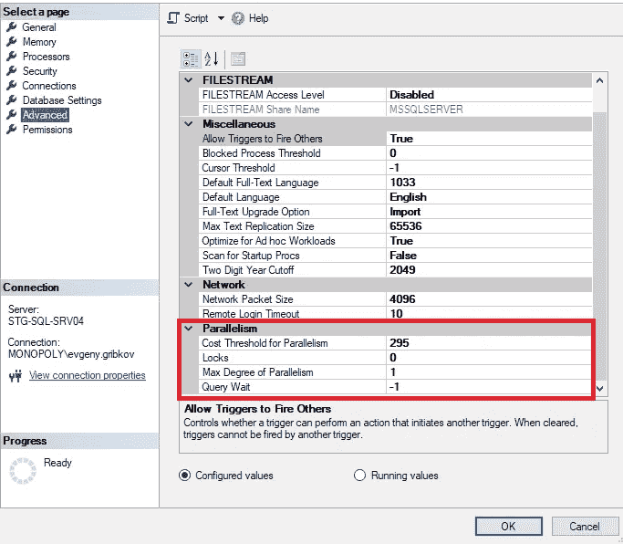
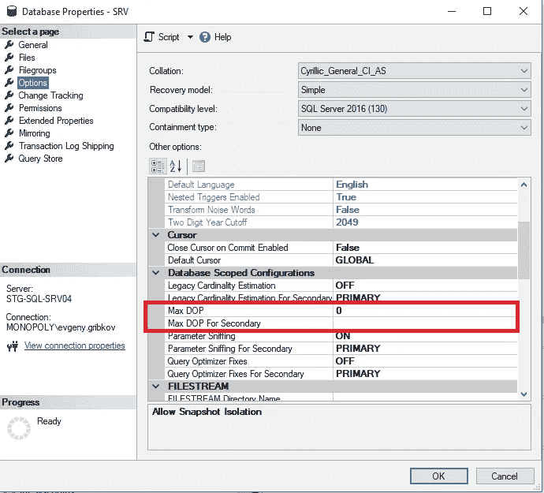
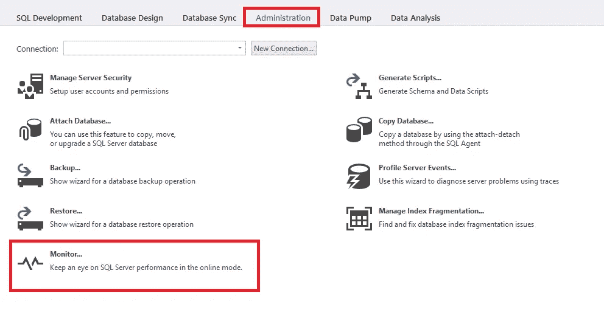
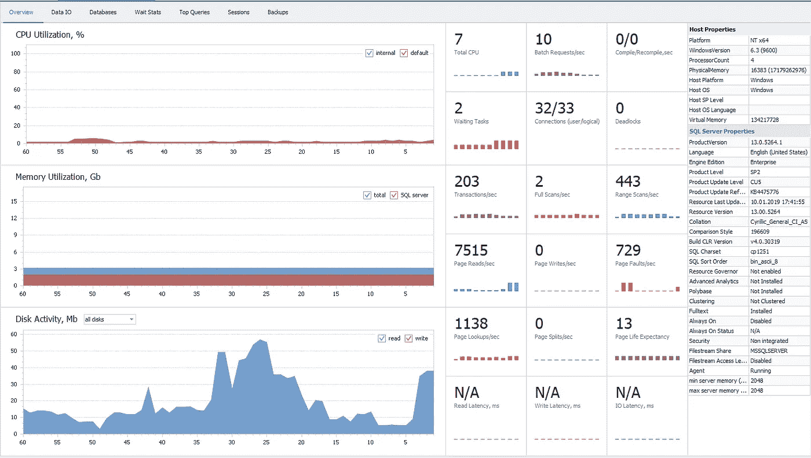

# MS SQL Server 监视的某些方面。第一部分。

> 原文：<https://medium.com/hackernoon/some-aspects-of-ms-sql-server-monitoring-part-1-b6e67b313f6f>


MS SQL Server 用户、开发人员和管理员经常面临数据库或 RDBM 的性能问题。这就是 MS SQL Server 性能监控非常重要的原因。

在本文中，我们将研究这个过程的一些方面，主要问题是——“如何发现当前缺少哪些资源？”

在本指南的课程中，我们将使用许多不同的脚本。为了让它们正常工作，我们首先需要在所需的数据库中创建“inf”模式。这可以通过执行以下代码来实现:

```
use <database_name>;gocreate schema inf;
```

# **如何检测 RAM 不足**

RAM 不足的第一个迹象是 MS SQL Server 实例使用了它专用的所有 RAM。

让我们创建以下 inf.vRAM 视图:

这样，我们可以检查我们的 MS SQL Server 实例当前是否使用了所有专用内存:

```
select SQL_server_physical_memory_in_use_Mb, SQL_server_committed_target_Mbfrom [inf].[vRAM]
```

如果 SQL _ server _ physical _ memory _ in _ use _ Mb 值不低于 SQL_server_committed_target_Mb，那么我们将需要执行等待统计信息检查。

为了通过等待统计信息检测 RAM 的缺乏，让我们创建一个 inf.vWaits 视图:

在这种情况下，以下查询可以帮助我们检测 RAM 不足:

```
SELECT [Percentage],[AvgWait_S]FROM [inf].[vWaits]where [WaitType] in (‘PAGEIOLATCH_XX’,‘RESOURCE_SEMAPHORE’,‘RESOURCE_SEMAPHORE_QUERY_COMPILE’)
```

具体来说，我们需要关注百分比和 AvgWait_S 值。如果这两个值都产生令人担忧的结果，那么 MS SQL Server 很有可能缺少内存。确切地说，什么结果可以被认为是不想要的在很大程度上取决于您的系统。但是，我们可以从百分比> =1 和 AvgWait_S>=0.005 开始，这是 RAM 不足的良好迹象。

要将这些值输出到监控系统(即 Zabbix)，我们可以创建以下查询:

1.  RAM 等待类型使用的资源百分比(从所有此类等待类型的总和计算得出):

```
select coalesce(sum([Percentage]), 0.00) as [Percentage]from [inf].[vWaits]where [WaitType] in (‘PAGEIOLATCH_XX’,‘RESOURCE_SEMAPHORE’,‘RESOURCE_SEMAPHORE_QUERY_COMPILE’)
```

2)花费在 RAM 等待类型上的时间，单位为毫秒(从所有此类等待类型的平均延迟列表中选择的最大值):

```
select coalesce(max([AvgWait_S])*1000, 0.00) as [AvgWait_MS]from [inf].[vWaits]where [WaitType] in (‘PAGEIOLATCH_XX’,‘RESOURCE_SEMAPHORE’,‘RESOURCE_SEMAPHORE_QUERY_COMPILE’)
```

基于这些值的动态变化，我们可以对 MS SQL Server 实例是否有足够的 RAM 做出明智的结论。

# **检测 CPU 负载过大**

要检测 CPU 时间的不足，我们可以简单地使用 sys.dm_os_schedulers 系统视图。如果 runnable_tasks_count 值总是大于 1，那么我们的 MS SQL Server 实例很有可能需要更多的 CPU 内核来实现最佳操作。

要将该值输出到监控系统(即 Zabbix)，我们可以使用以下查询:

```
select max([runnable_tasks_count]) as [runnable_tasks_count]from sys.dm_os_schedulerswhere scheduler_id<255
```

根据检索值的动态变化，我们可以做出明智的决策，判断 MS SQL Server 实例是否有足够的处理器时间(或 CPU 内核数量)。

但是，您应该记住，查询本身可能需要执行多个线程。此外，优化器有时会误判查询的复杂性。因此，可能会有太多的线程专用于执行查询——此时无法同时处理的线程。这就产生了一种额外的等待类型，这种等待类型与处理器时间不足和使用特定 CPU 内核的调度程序的队列增加相关联。因此，在这种情况下，runnable_tasks_count 值将会增加。

在这种情况下，在增加专用 CPU 内核数量之前，我们首先需要配置 MS SQL Server 实例的并行度设置。此外，从 2016 版本开始，我们还需要为所有必需的数据库正确设置并行度:



Fig.1\. Configuring the parallelism settings of an MS SQL Server instance.



Fig.2\. Setting up parallelism for databases (starting from the 2016 version)

这里，我们应该考虑以下参数:

1) Max Degree of Parallelism(最大并行度)—设置可用于每个查询的最大线程数量(默认值为 0，这意味着限制会根据您的操作系统和 MS SQL Server 版本自动设置)

2)并行的成本阈值—估计的并行成本(默认值为 5)

3) Max DOP —设置数据库级每个查询可以专用的最大线程数量。该值不能超过“最大平行度”。(默认值为 0，这意味着限制是根据您的操作系统和 MS SQL Server 版本以及整个服务器的“最大并行度”值自动设置的)

在这里，不可能为所有情况设计出一个正确的策略，所以您需要根据具体情况分析复杂的查询。

我个人推荐使用以下算法来配置 OLTP 系统中的并行性设置:

1)通过将整个实例的“最大并行度”值设置为 1 来禁用并行度

2)分析最复杂的查询，并为它们选择最佳的线程数量

3)将“Max Degree of Parallelism”值设置为我们在步骤 2 中获得的数字，包括单个数据库和整个实例。

4)分析最复杂的查询，并检测多线程是否有任何负面影响。如果是这种情况，增加“并行成本阈值”值。

对于像 1C、微软 Crm 和微软 NAV 这样的系统，最好的决定是禁用并行性。

如果您使用标准版，同样的解决方案也适用，因为它对 CPU 内核的数量有限制。

然而，这种算法不适用于 OLAP 系统。

我建议 OLAP 系统采用以下并行设置算法:

1)分析最复杂的查询，并为它们选择最佳数量的线程

2)将“Max Degree of Parallelism”值设置为我们在步骤 1 中获得的数值，包括单个数据库和整个实例。

3)分析最复杂的查询，并检测多线程是否有任何负面影响。如果是这种情况，要么增加“并行成本阈值”值，要么重复步骤 1-2。

因此，对于 OLTP 系统，我们的目标是从单线程切换到多线程，而对于 OLAP 系统，情况正好相反——我们希望从多线程切换到单线程。这样，我们可以为整个 MS SQL Server 实例和单个数据库选择最佳的并行度设置。

还必须知道，随着时间的推移，应根据 MS SQL Server 性能监控的结果定期重新配置并行设置。

# **db forge Studio For SQL Server 中的 SQL Server 监控**

一个 [SQL Server 性能监视器](https://www.devart.com/dbforge/sql/studio/monitor.html)在 Devart 的[db forge Studio for SQL Server](https://www.devart.com/dbforge/sql/studio/)中可用:



Fig.3 SQL Monitor in dbForge Studio for FQL Server

让我们看看主工作窗口，它实时显示以下统计数据:



Fig.4 Overview Tab of SQL Monitor

1.  CPU 利用率，% —显示服务器产生的 CPU 负载的图表
2.  内存利用率，Gb —显示 ram 使用情况的图表(总内存—所有进程总共使用了多少内存，SQL Server—SQL Server 使用了多少内存)
3.  磁盘活动，Mb —显示磁盘读写操作的图表
4.  磁盘操作延迟
5.  总 CPU —总 CPU 负载的百分比
6.  总 CPU —总 CPU 负载的百分比
7.  僵局
8.  等待任务
9.  连接(用户/登录)
10.  每秒事务数
11.  每秒完全扫描
12.  范围扫描/秒
13.  每秒页面读取数
14.  每秒页面写入数
15.  每秒页面查找数
16.  每秒页面拆分次数和页面预期寿命
17.  每秒页数
18.  主机属性(处理器计数、物理内存、平台、windows 版本、虚拟内存、主机平台、主机操作系统、主机 SP 级别、主机操作系统语言)
19.  SQl Server 属性(产品版本、语言、引擎版本、产品级别、产品更新级别、产品更新参考、上次更新的资源、资源版本、排序规则、比较样式、生成 CLR 版本、SQL 字符集、SQL 排序顺序、资源调控器、高级分析、聚合、群集、全文、始终打开、始终打开状态、安全性、文件流共享、文件流访问级别、代理)

# **总结**

在本文的第一部分中，我们研究了监视 MS SQL Server 活动以检测 RAM 不足的方法。

我们还看到了由 [Devart](https://www.devart.com/) 在[db forge Studio for SQL Server](https://www.devart.com/dbforge/sql/studio/)中提供的主要统计数据，这些数据有助于 MS SQL Server 监控。