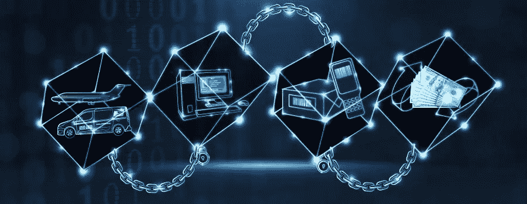

# 关于许可的区块链解决方案，我希望我知道一些事情

> 原文：<https://medium.com/hackernoon/some-things-i-wish-i-had-known-about-permissioned-blockchain-solutions-3e505f69969d>

在 Invector Labs，我们有幸为世界上一些顶级品牌开发高度复杂的许可区块链。与其他技术趋势不同，实现这种类型的解决方案没有成熟的最佳实践和技术。因此，我们经常在许可的区块链应用中遇到没有规定解决方案的情况。虽然其中一些挑战非常明显，但其他一些挑战了传统软件开发的传统智慧。今天，我想探讨许可区块链系统的一些非显而易见的挑战，只有在现实世界中构建这种类型的解决方案时，您才有可能遇到这些挑战。

企业环境中大多数许可的区块链实现都受限于一些不同的记录保存场景。这些用例从根本上关注于利用区块链运行时的不变性来支持特定领域中更复杂的跟踪功能。虽然这些简单的场景很有价值，但是它们没有充分利用区块链的 Web3 堆栈的潜力。当您的解决方案从基本的记录保存过渡到更复杂的智能契约开发场景时，各种不可预见的挑战开始浮现，对此没有简单的解决方案。

企业环境的丰富性和复杂性给许可的区块链解决方案带来了挑战。虽然许可的区块链架构不会受到公共区块链的可伸缩性和资源稀缺的限制，但它们在其他领域受到了挑战，这些领域乍一看并不十分明显。我在下面列出了一些我最喜欢的:

# 忘掉敏捷开发吧

在过去的十年中，软件开发已经从漫长的、基于瀑布的周期发展到敏捷的方法学，该方法学通过持续的部署和故障排除来促进快速迭代。敏捷软件开发实践已经成为企业环境中的标准，并产生了整整一代工具，用于管理使用这些方法构建的应用程序的生命周期。

当谈到区块链智能合同时，敏捷方法的快速移动和打破事物的咒语不太管用。区块链运行时的不可变性使得不可能定期对智能合约进行版本控制、合并新功能或故障排除。因此，智能合同通常经历漫长的开发和测试周期，这与解决方案的其他组件所遵循的快速迭代方法是不一致的。

无论是在许可的还是公开的区块链，智能合约开发周期更类似于构建硬件，而不是现代软件。硬件开发方法通常基于漫长的开发和令人讨厌的详细测试周期，以及精心制作的分发机制。毫不奇怪，硬件开发中使用的许多方法和最佳实践可以推广到智能合同。

根据我们的经验，许可的区块链解决方案应该使用瀑布模型来构建，这些模型在某种程度上独立于解决方案其余部分的开发周期。

# 什么身份？

许可的区块链解决方案在参与者的身份众所周知的可信环境中运行。几十年来，企业经历了身份管理技术的多个周期，这些技术支持诸如身份验证、访问控制、联合和其他几个身份构建模块等功能。利用这些身份作为获得许可的区块链解决方案的一部分，无异于一场噩梦。

想象一个会计应用程序调用一系列智能合约来代表特定用户记录一些交易的场景。在该模型中，用户通过其公司目录进行身份验证，并且他们的身份需要以某种方式传递给智能合约以执行特定的操作。从概念上讲，这是一个传统的身份联合场景，除了没有建立用于联合链上和链下身份的协议。一些最先进的工作，其中空间来自分散的身份基金会(DIF)，但仍处于非常早期的阶段。

利用其中的一些想法，我们实现了一些模式，在这些模式中，智能合约以基于企业身份提供者发布的令牌的分散标识符(did)的形式接收用户的身份。

# 监控噩梦

在许可的区块链解决方案中，监控智能合同的执行是另一个无处不在的挑战。执行了哪些操作？被谁？处理了哪些交易？哪些失败了？块探索者是在许可的区块链场景中跟踪事务的默认机制，但是当应用于端到端、链外链上事务流时，它们的结果非常有限。

大多数企业已经拥有应用程序性能监控(APM)堆栈，用于跟踪不同应用程序的工作流。从这个角度来看，将智能合同工作流的跟踪集成到这些工具中比反过来更容易。

我们已经多次成功实现的一个模式是使用 Oracle 来桥接与 APM 堆栈的通信，并记录有关智能合同执行的相关事件。该模型允许开发人员使用相同的熟悉工具和流程来监控许可的区块链应用程序的运行状况。

# 我如何使用这个智能合同？

随着智能合约在企业环境中变得越来越普遍，它们的可发现性和分布将变得更加相关。如果您正在构建一个带有两个智能合约的试运行，那么发现不是首要要求。然而，当您希望智能合约在多个应用程序之间重用时，这种情况很快就会发生变化。

启用发现、测试智能合约并与之交互的机制是简化许可区块链堆栈采用的一个重要方面。智能合同目录是一种模式，我们已经成功实施了几次来应对这一挑战。

在该模型中，目录将作为一个存储库，包含与不同智能合约相关的元数据，以及测试它们并以编程方式与之交互的 JavaScript 接口。

# 什么共识？

被许可的区块链在已知身份的环境中操作。然而，大多数许可的区块链运行时依赖于共识机制，如工作证明或利害关系证明，这些机制用昂贵的计算来代替身份。基于计算的共识协议只有在网络规模合适的情况下才有意义，但在许可的区块链应用中并不总是如此。

结果，大多数许可的区块链堆栈的一致协议最终在没有增加任何好处的情况下引入了不必要的事务性能损失。现实是，大多数许可的区块链解决方案未能有效地利用共识模型，它们将更好地利用完全基于已知身份的协议，如授权证明。

这些是我们在许可的区块链解决方案中经常遇到的一些不明显的挑战。随着行业的发展，许可的区块链堆栈应该适应用本机功能来解决这些挑战，而不是强迫开发人员绕过它们。