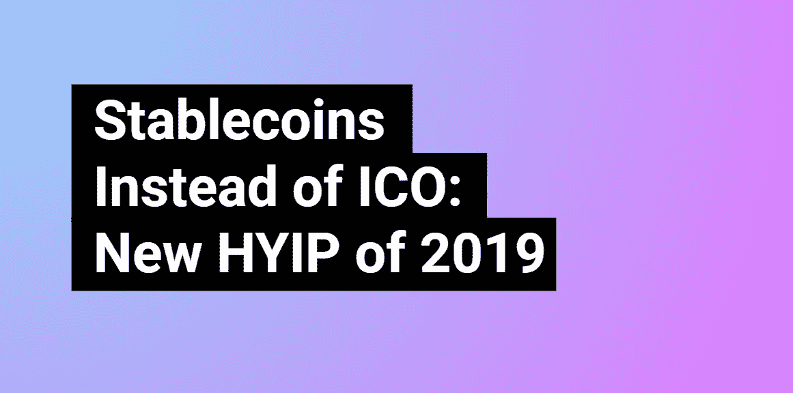

# Stablecoins 代替 ICO:2019 年的新 HYIP

> 原文：<https://medium.com/hackernoon/stablecoins-instead-of-ico-new-hyip-of-2019-66f4e8919c70>

## 虽然 ICO 数量大幅下降，但加密货币市场出现了一个新趋势——stable coins。厌倦了波动性，市场正在等待 100 多种与法定货币、加密货币等挂钩的新硬币。它能让这个行业免于不断的起伏吗？稳定的公司的未来是什么？

# 离任 ico

可以通过 ICO 融资的轻松赚钱时代已经结束。之所以得出这样的结论，是因为这一年的筹资动态。许多评级机构和研究公司推出他们的数字:有 [ICORating](https://icorating.com/report/monthly-icorating-overview-report-6-october-2018/) 和 [TokenData](https://twitter.com/TokenData/status/1057953301440983040) ，他们的数据接近事实。不考虑计算参数，趋势很明显。

根据 ICORating 的数据，11 月份与去年利润最高的月份相比，ICO 融资下降了 86%，根据 TokenData 的数据，下降了 97%。对 ICO 项目缺乏信任，加上大量诈骗和加密货币价格下跌的背景，导致了他们的工作。

然而，让我们称之为 ICO 衰退，它已经成为加密货币细分市场之一——稳定的加密货币——发展的触发器，其价格相对于整个市场是稳定的。

# 稳定的未来

纵观历史，当市场下跌时，投资者会转向更稳定的资产。这也不是关于加密货币市场，其规模甚至无法与苹果或亚马逊的市值相提并论。这是关于全球资本市场的特征(细节)。

2008 年危机期间，对美国国债的投资达到创纪录水平，而美国国债传统上被视为最无风险的投资选择。加密货币也是如此——在比特币和以太坊崩溃最严重的时期，稳定货币的购买量会激增。

在这个领域，越来越多的新创公司越来越受欢迎。

根据流行的加密钱包 Blockchain.com 的一项研究，尽管目前有 23 个 stablecoin 项目，还有 34 个项目正在开发中。

值得注意的是，一家这样的初创公司可以同时发行几种稳定的加密货币，比如一种与美元挂钩，另一种与欧元挂钩。正因如此，近期将会出现的 stablecoins 的真实数量可能会超过 50 个。

新项目数量的增长不仅与稳定的加密货币资产的市场需求不断增长有关，也与当今最受欢迎的稳定货币——Tether 的声誉不佳有关。理论上，其 USDT 代币的价值应该等于 1 美元。尽管在 10 月份，由于法定货币抵押品的问题，USDT 利率达到了 0.92 美元，比要求的价格低 8%。

# 稳定的未来

据 Blockchain.com 称，现有 stablecoin 公司的总市值为 30 亿美元，约占加密货币市场的 2%。考虑到金融行业对稳定、低风险、分散资产的需求，2%这个数字有很大的增长潜力。有 4 种类型的稳定图标:

1.  与法定货币挂钩的稳定货币
2.  算法稳定积分
3.  与现实世界商品贸易相关的稳定收入
4.  与加密货币绑定的稳定货币

# 1.与法定货币挂钩的稳定货币

这种稳定币最容易向远离加密货币的人解释。那种硬币与法定货币挂钩。

例如， [Tether](https://tether.to) ，其 USDT 币与美元挂钩。这是最受欢迎的 stablecoin，按大写金额计算，它位于世界十大加密货币之列。现有稳定货币的 66%与美元挂钩。但是这个行业的未来很难在这种工具之后。

事实上，所有与法定货币挂钩的稳定硬币只不过是一张数字银行收据。这是一个电子证据，表明某个银行有一定数量的美元、欧元、卢布或其他法定货币。对于一些加密货币来说，这些收据不会引起怀疑([双子座](https://gemini.com/dollar/))。以系绳为例，这并不适合所有人。所有十亿美元的抵押品都存在一家可疑的离岸 Deltec 银行。

这种 stablecoin 过于集中，这些硬币的创始人可以随时“烧毁”或“冻结”代币:正如他们自己的文件中所见(例如，Gemini stablecoin 项目的智能合同代码)。

# 2.算法稳定积分

算法稳定代码是完全数字化的，独立于任何类型的抵押品，其供应和目标价格仅由代码控制。这种稳定的信贷是完全分散的，没有第三方参与，并且高度可扩展，因为随着供应的增加，它们不需要额外的抵押品。

然而，这类项目的工作实例很少。最近，已经筹集了 1.33 亿美元的算法硬币基础(algorithmic coin Basis)的开发者之一宣布打算归还这笔钱并关闭该项目(需要注意的是，Basis 甚至没有时间开始，仍停留在白皮书阶段)。

# 3.与现实世界商品贸易相关的稳定收入

这种稳定的货币是实体经济、国家间贸易和加密货币之间的一种桥梁，它承载着去中心化和透明的原则。与法定货币或算法相关的硬币不同，它们的价值与营业额相关。

区块链的一个独立项目是 [MILE](http://mile.global) ，它包括 MILE 和 XDR 硬币。如果 XDR 是一种稳定的硬币，与 SDR(国际货币基金组织特别提款权，其价值在过去 30 年中变化了 11%)挂钩，那么 MILE 就是一种波动的硬币和 XDR 需求指数。

# 4.与加密货币绑定的稳定货币

这些稳定货币将其价值与其他加密货币联系在一起。在根本不存在汇率稳定的地方——加密货币市场——寻求汇率稳定似乎不合逻辑。然而，早在 2013 年，BitUSD 就推出了，它是 stablecoins 的先驱和最聪明的代表，推出了加密货币 colateral。硬币的稳定性提供了过多的抵押品，抵消了价格波动。

这些稳定资本的未来是不确定的，因为它们不与现实世界互动，与实体经济分离。至于 BitUSD，项目创始人早就离开了。没有人开发它，而其他工作的加密担保稳定币项目几乎找不到。

# 结论

2019 年，用于实体经济的加密货币的流动性将大大增加。这将吸引大量机构资本进入市场。

今天，数百种不同的硬币已经死亡，这意味着没有办法成为没有在实体经济中使用的价值。为了对实体部门有价值，一枚硬币必须有稳定的汇率。人们更需要的不是商品交易，而是高效、廉价的资金转移方式。

最受欢迎的加密货币比特币由于其波动性而不适合实体经济部门，尽管它不会去任何地方。小众只会被那些稳定的圈子占据，这些圈子是去中心化的，开放的，方便普通人和投资者。