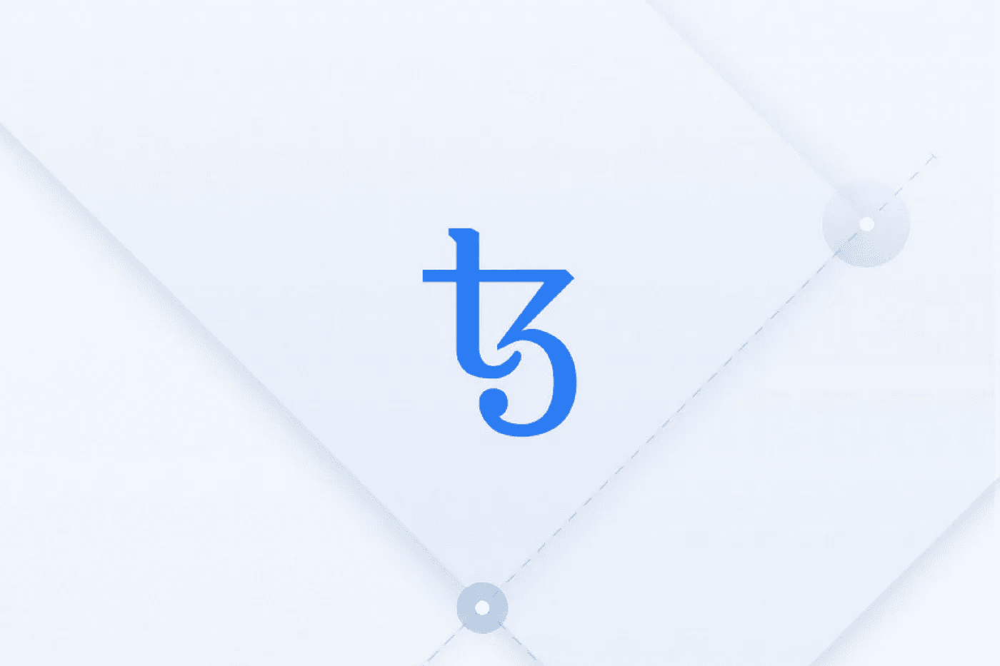
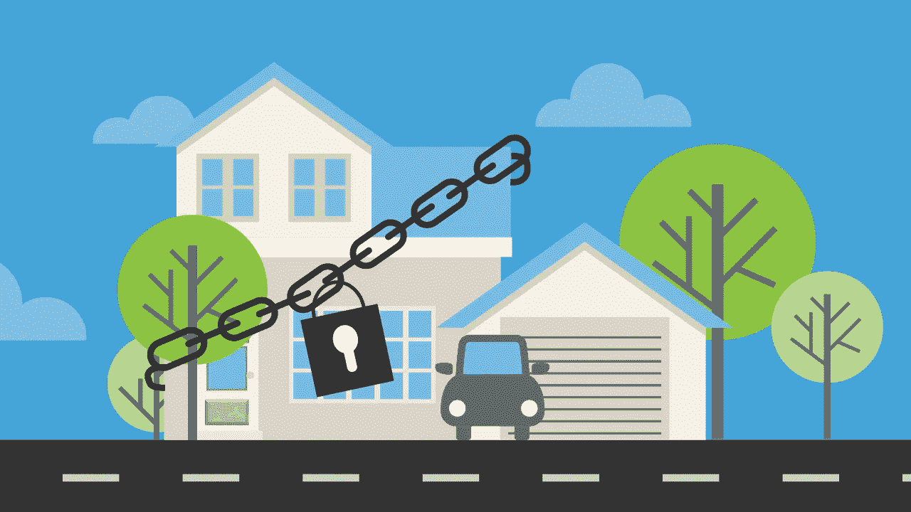

# 赌注时代正向我们走来

> 原文：<https://medium.com/hackernoon/staking-era-is-coming-our-way-6f7534d90e28>

*Staking the growing tree. That’s also true for PoS economy.*

# **什么是赌注经济？**

“Staking”实际上来源于“Stake”这个词。

“股份”首先指的是投资于企业或公司的一笔资金，以及由此带来的相应价值和权利。从更普遍的意义上来说，比方说，如果你拥有一家公司的股票，你就拥有这家公司的这种形式的“股份”。就这一点而言,“赌注”的概念就在表面上，也就是说，是对赌注活动的抽象表示。

在区块链的背景下，Staking 通常处理持有人通过遵循 PoS/DPoS 共识机制持有一定数量的令牌以质押给系统，同时获得令牌回报，从而获得铸造或系统维护权利的行为。实际上，**‘赌注’已经隐含了‘抵押品’**，即代币持有人在参与赌注活动时，需要明确对自己行为的承诺，相应的成本将是赌注代币的所有权。

跑马圈地本身就是一种非常创新的经济合作机制。有些人可能会说，赌注非常类似于公司制度中的“股份”,股东出资换取股份，自己出资，并获得应得的红利。是的，当代币持有者入股代币时，他们确实需要首先获得这些代币(通常是购买初始份额)，才能承担系统维护的权利，最终获得新发行的代币或交易手续费收入。从这一点来说，赌注的确与股份制有相似之处，但这种想法没有给赌注经济最诱人的一点—**—参与感**留下位置。

让整个赌注经济如此生动和充满活力的是代币持有人的参与感，这是一种无形的价值，通过每个项目增加和沉淀。我们经常说**区块链已经改变了人类的协作系统，并用我们历史上从未出现过的去中心化模式取而代之**。正是在这个意义上，区块链被视为一个具有深远前景的技术概念。因此，区块链技术的真正价值不是它的技术参数有多棒，而是影响和重塑我们合作方式的想法。

经过 5 年的公共链生态系统发展，特别是以 PoS 和 dpo 为特色的生态系统，我们终于看到了赌注经济的兴起。这个想法，真正具有历史意义和开创性，标志着我们的市场开始重新评估对协作模式的理解和探索，这是一个更进一步触及区块链灵魂的大跳跃。

# **PoS 酝酿的跑马圈地风波**

那么为什么 2019 年上半年，跑马圈地经济成功吸引了我们的眼球呢？

从 2017 年末 2018 年初的大牛市开始，整个 2018 年见证了一个在曲折中慢慢降温的市场环境。不过我们还是可以看到有**一大波 2017-2018 年间推出的 PoS 项目**陆续上线。对于那些在 2018 年初或更早推出的项目，在运行了一年左右后，现在也进入了相对成熟的阶段。

*the Tezos ICO: a real phenomenon*

其中包括众所周知的明星项目 Tezos。在 2015 年的众筹阶段，Tezos 以 2.3 亿美元的众筹金额成为历史上最大的 ICO 项目。因此被市场寄予厚望。

Tezos 是一个可以通过自我升级而进化的区块链。利益攸关方就《议定书》的修正案，包括表决程序本身的修正案进行表决，以就提案达成社会共识。自我修正机制允许 Tezos 自我升级，而不必将网络分成两个不同的区块链。在其上运行的项目采用了类似模块化的技术架构，主链协议背后的代码和算法可以有选择地替换，升级过程保持简单明了。

Tezos 使用 DPOS 共识机制，并引入了随机验证系统。XTZ (Tezos 原生代币)持有者可以通过下注一定数量的代币成为面包师，Tezos 主网的区块由面包师随机生成。

更有趣的是，如果你不想直接参与烘焙，你也可以把你的 XTZ 委托给别人烘焙。另外，这种委托不涉及私钥的移动，持有人的资产安全在技术上可以得到保证。

作为明星项目，Tezos 和 EOS 都在去年直接助推了一波 PoS/DPoS 项目。此外，纯 PoW 项目现在在市场上非常少见(也许只有 BCH 的闹剧仍在吸引市场注意力)。这也解释了为什么赌注经济变得越来越热——市场不再那么热衷于计算能力的竞争，而是转向更和平和协作的节点竞选和股权挖掘，这些事情对参与者更有吸引力。毕竟这才是真正的双赢阶段。

# **赌注之魂:作为抵押品的令牌**

赌注机制无疑是**对项目方和令牌持有者双方的双赢设计**，至少在理念上是这样的。

对于项目生态整体而言，跑马圈地吸引持有人先锁定一部分代币，参与挖矿，然后获得收益。项目本身(或公共链)将需要维护，以确保主链的正常运行，同时避免不必要的腐败和欺骗。

*Collateral: fear of losing one’s fund displays great containing power. In mortgage loans, one may lose his/her house when there’s a repayment problem.*

这里体现了一个非常微妙而巧妙的逻辑:押记机制一般需要附属令牌，作为一个简单但有效的约束。比特币 PoW 机制的哈希计算能力挖掘也是一个限制，但太昂贵了。相反，赌注利用持有人对失去资金的恐惧，巧妙地遏制了他们在抵押期间可能出错的行为。

这就是跑马圈地的灵魂。如果你还是不能理解它的意思，我们就用更简单的方式来说吧:

1) **基于公众的利益欲望**，PoW 引导矿工自发投资计算能力，以争夺整个系统产生的收益，从而实现更好的安全性。

2) **由于公众担心资金损失**，PoS/dpo 的赌注机制引导参与者自愿做“正确的事情”因为如果不是这样，参与者就会迷失自我。

更重要的是，当系统发展到相当大的规模时，PoW 消耗的资源将成比例增加。这肯定会非常可怕。而且**由于它需要巨大的资源消耗**，不可能有第二个比特币。而跑马圈地，以更温和、更轻松的方式消耗资源，足以维持一个相当大的区块链网络。

# **你可以遵循的一些赌注惯例**

为什么我们需要关注利益相关机制项目？

在熊市中，去抵押代币获得收益远比单纯持有基金好。因为前者从长期来看可以获得巨大的累积收益。作为参与者，不仅可以保证自己的资产不被增发摊薄，还可以洞察所涉及项目的社区生态。生态活跃的 PoS/DPoS 项目，值得继续参与和检验下一轮牛市。

所以我在这里推荐几个值得关注的跑马圈地项目。都是在自己的领域具有很高的典型性和代表性，可供投资人和社区爱好者研究。

尼奥:

NEO 是 DPoS 的特殊变种，我觉得很典型。

首先，NEO 使用 dBFT 机制，这与传统的 PoS/dpo 有很大不同。BFT 是一种基于拜占庭容错的共识机制，具有权限特性。(只有当至少 2/3 的参与节点是诚实节点时，BFT 共识才有效，这是对所有参与共识的节点设置的信任要求。)然而，近地天体将通过投票选择和决定使相互信任的节点能够参与 BFT 的共识。所以，这实际上是 DPoS 的一个变种，在核心上分享相同的信条。

此外，NEO 是少数采用双层令牌模型的项目之一。你入股 NEO 做矿就能获得气，气作为副令牌也能给参与者带来可观的回报。

**以太坊**和**夸克链**:

之所以把两者放在一起提，是因为两者都侧重于 PoW 和 PoS 是否可以共存或者相互切换。

从 PoW 到 PoS 的技术转移对以太坊来说已经不是什么新鲜事了，其实两年前就有人提出来了。许多人可能认为以太坊已经过了它的全盛时期，但我仍然坚持认为我们应该继续关注以太坊，因为它聚集了最好的开发团队。而且向 PoS 转型，如果成功，将会给以太坊的业绩和生态带来巨大的改变。

然而，QuarkChain 正在探索一种介于 PoW 和 PoS 之间的混合机制。你可以粗略地把它理解为通过改变公布权重来调整的幂。也就是说，如果挖掘者要提供散列计算挖掘，他们必须根据他们的计算能力来确定一定数量的令牌。这意味着任何攻击主网络的恶意企图不仅必须有足够的能力发起 51%的攻击，而且还应该随时准备接受以损失为抵押的大量令牌——这显然是不可能的。

**LBTC** :

LBTC 是比特币协议的一个变种，因此很特别。它探索了将传统和稳定的 UTXO 机制与 dpo 相结合的可能性。

到目前为止，这种技术方案被证明是非常稳定的。值得期待的是，如果 LBTC 也完善了跑马圈地生态，会给这样一个基于支付的网络(你可能理解为 Lite 版的比特币)带来怎样的改变？

LivePeer :

这个项目也值得我们关注，因为它目前的收益还是很高的。这对于投机经济的实践是一个强有力的刺激。

LivePeer 是一个专门利用闲置资源进行图文解码的平台。它基于以太坊，因此获得了大量用户。

LivePeer 的生态系统非常复杂，这里不打算描述。这是一个 Web3 媒体层和一个潜在的 CDN 网络，我认为这很有趣。作为我们在这里列出的唯一一个具有明确应用方向的项目，您可以亲自看看 LivePeer 如何将节点的力量结合在一起。