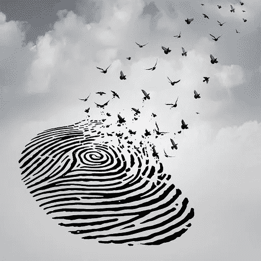
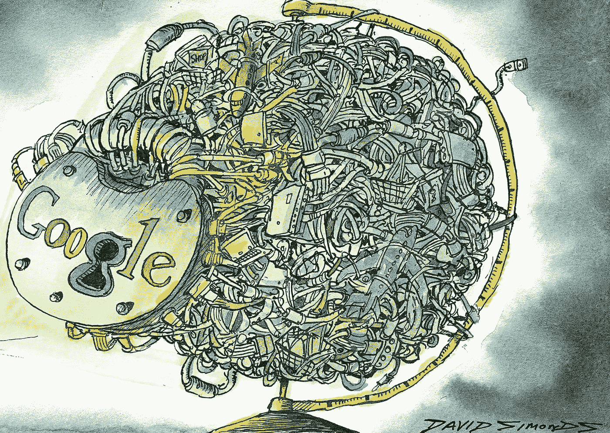
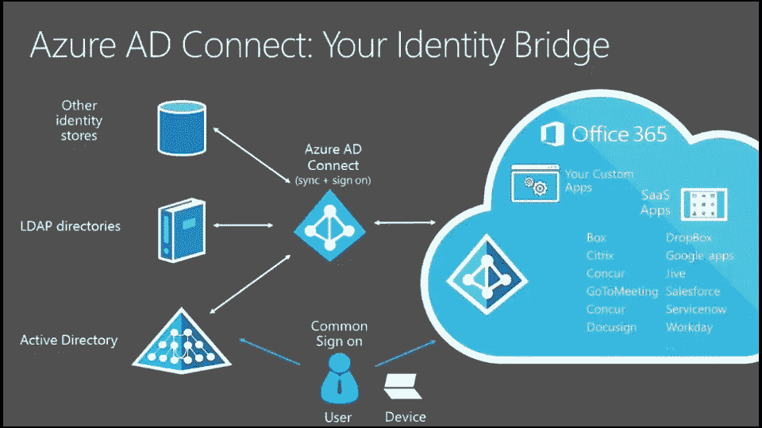
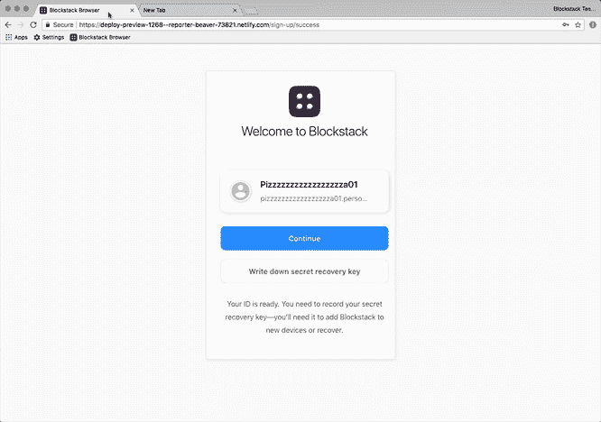
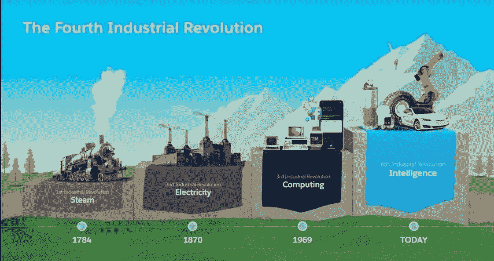

# 为新的分散经济解决身份问题

> 原文：<https://medium.com/hackernoon/state-of-identity-for-the-new-decentralized-economy-1d0a70477f5f>

# 身份问题

随着我们进入一个加密货币有望在全球市场发挥关键作用的世界，传统的身份识别方法现在成了瓶颈。传统的身份认证是一种工具，允许公民进入当前的经济体系，并证明他们对社会的贡献。随着互联网的兴起，经济和数据活动转移到了网络世界，并由主要平台掌控。主要寡头现在正在利用数据和身份来更好地了解人类未来可能需要或不需要什么服务。人类能相信寡头垄断吗？他们有意提供的数据正受到保护，免受恶意行为的侵害。

自我主权身份的想法变得更加引人注目。一个人可以保护自己的身份和数据不被他人窃取，同时能够进入一个经济系统的概念。经济系统的一个例子是开放金融。开放金融的前提是，任何人，来自任何司法管辖区，都可以进入一个开放的网络，并有能力参与其中。有数百万人在场外等待机会，但却无法参与。为什么？**身份**问题必须解决，数百万人才能蜂拥而至，从这个开放的网络中受益。

# 历史和瓶颈

认知革命引发了理性主义，同时提高了人类的协调性。部落[交流信任的最早方式之一是通过珠宝和纹身。随着部落的成长，信任的能力也增强了，敌人有能力制造珠宝来渗透到村庄里。在罗马帝国时期，书写和记录技术的进步随着经济的发展呈指数增长。他们已经开发并创建了书面归档系统，以识别和跟踪房屋所有权、企业或欠款。随着经济的增长，人口和扩大信任的能力也在增长。在 19 世纪晚期，政府发布了带有照片的身份证明以及追踪出生、教育、所有权或企业的文件。](https://www.trulioo.com/blog/infographic-the-history-of-id-verification/)

与这一识别系统并行的是，银行和商家[创建了](https://www.prosperitycenter.org/sites/default/files/CreditReportingHistory_062002.pdf)一份个人借贷活动的人工清单。这份清单在城镇间共享，作为追踪借书的一种方式。越来越多的人成为建立信用局的一个强制功能。这个新的信用系统将跟踪债务、支付历史、信用历史和信用使用情况。照片身份、书面记录和信用的结合创造了现代身份系统，该系统一直沿用至今。这个系统帮助政府确定他们的公民、他们的贡献以及他们如何融入社会。而在可预见的未来，企业有能力信任和参与经济活动。最后，它允许其公民有能力参与经济活动并融入其社会。然而，随着互联网的发明，现代身份系统已经开始达到它的临界点。

# 异质身份的诞生

与认知革命类似，互联网降低了协调成本，激励了新的用户行为。人们不再依赖陈旧的系统，而是寻找更新更快的方式来开展业务。无论是寻找新家、寻找共乘汽车、通过社交网络联系还是远程工作。这些平台降低了协调成本，建立了巨大的网络效应。这使得较大的平台，如谷歌、优步、脸书或微软，成为大型数据聚合器，同时了解更多关于他们的用户。

人类已经变得如此依赖这些平台，从而产生了数字身份。这种转变标志着异构身份的诞生，也就是说，身份可以被分割成特定的用户行为。我将把身份分成三个部分，传统身份(政府)，信任认证网络(谷歌，脸书)和管理身份解决方案(微软，俄克拉荷马州)。我将介绍新的部分，如基于 web 的证明和托管身份解决方案。

基于网络的证明
我们可以把脸书、推特、谷歌和 Snapchat 归为数据交换平台的主要例子。当我们免费使用这些平台时，他们会收集我们的使用情况、在线行为和其他元数据，这样他们就可以有针对性地投放相关广告和服务。这些平台已经聚集了足够多的数据，现在被称为身份验证代理。身份验证使得应用程序可以很容易地跟踪真实用户，同时作为回报提供对数据的访问。因此，在这方面，身份不仅成为认证一个人的手段，也成为收集用户行为数据的手段。这些数据在用户手中可能是有用的，但在平台手中也是危险的。正如我们所见，我们的在线身份可能会被剑桥分析公司(脸书)等实体用来对付我们。

**托管身份解决方案** 企业在封闭的 IT 网络基础设施下管理身份解决方案。自从 Windows NT 推出以来，管理员可以利用目录服务来保存身份和登录信息。目录服务的背后是 [LDAP](https://tools.ietf.org/html/rfc1823) 协议，这是一个开放的协议，被大多数目录应用程序使用，如微软的 Active Directory。这使得任何规模的公司都能够无缝同步用户数据和应用程序。基于云的身份以及一套云产品使得任何规模的公司都可以更轻松地从世界任何地方部署远程员工。这也使得黑客能够部署复杂的网络钓鱼攻击，从而危害工作凭证。正如我们在最近的 [Equifax](https://www.cnet.com/news/equifaxs-hack-one-year-later-a-look-back-at-how-it-happened-and-whats-changed/) 黑客事件中看到的，有价值的信息可能会被黑客窃取，从而危及人们的生命。

# 机会(异构 2.0)

正如我们所看到的，在计算时代，我们现在已经达到了认同的沸点。我们已经将互联网从 2005 年的 1B 用户扩大到 2019 年的 32 亿。为了说明这个问题有多严重， [Shape Security](http://info.shapesecurity.com/rs/935-ZAM-778/images/Shape_Credential_Spill_Report_2018.pdf) 最近发布了一份网络安全报告，报告显示登录零售商网站的人中有 80%到 90%是使用窃取数据的黑客。将自己的数据托付给大公司对企业和用户来说都是极其危险的。与此同时，中本聪共识算法的发明带来了秘密经济增长。这导致了从分散金融到身份的用例的寒武纪大爆发。正如乔希·沃尔夫所说，“我们必须遵循自然的发展顺序。”如果我们遵循进展的自然顺序，我们将被引导到基于密码的身份解决方案。

如今，基于区块链的身份识别系统的问题在于，它们从单一的角度来解决身份问题。这可能适用于一个特定的用例，比如试图从自动售货机中取出一瓶[啤酒](https://www.coindesk.com/you-can-now-pre-order-this-15000-crypto-powered-beer-vending-machine)。它没有解决利用开放金融或游戏等经济系统的能力。例如，从达摩贷款需要一个人抵押高达 150%的贷款。现在想象一下，如果一个基于身份的解决方案可以跟踪一个人历史上偿还贷款的速度。现在，承销商信任你，可以在没有抵押的情况下发放贷款。因此，我认为企业家不应该为我们今天生活的世界解决身份问题，而是为我们将生活的世界解决身份问题。身份随着经济系统的发展而发展，项目应该关注未来的用例。

# 基于区块链的身份

分散化未来的身份将是最重要的问题之一，有数百家公司正在致力于此。无论是企业端的微软、IBM、RSA，还是加密端的 Blockstack、比特币基地、Uport。最终，我们将看到几个平台胜出，因为我们将生活在一个更加分散的世界中。基于我们的行为或用例，我们的身份将被进一步分离。

我们需要重新想象身份，不要认为这是一种识别我们是谁的方式，而是通过我们对协议或经济的贡献来识别。这可以鼓励好的行为，同时减少恶意的行为。这可能会创造出整个经济体，这些经济体中的工人身份不明，但他们可能都对整体经济做出同等贡献。这可能是我们生活的世界，但为了实现这一目标，我们需要了解可用的解决方案类型，并量化其影响。

## 分散的 Web 证明

分散式 web 认证使用户能够认证其他应用程序或服务，而无需放弃个人信息。有趣的是，比特币基地[最近收购了](https://techcrunch.com/2018/08/15/login-with-coinbase/)分布式系统，这是一个为 Clear 协议构建的身份解决方案。收购的前提是，当今大多数身份解决方案都是死气沉沉的。必须下载 chrome 扩展、创建钱包、为钱包提供资金并签署交易是最大的障碍之一。比特币基地的 KYC 用户已经超过 2000 万，它拥有丰富的身份数据，可以用于分散式金融等新领域。比特币基地正计划推出一个类似脸书的 SDK，允许其他 dApps 和服务无缝集成。这可以减少摩擦，并允许用户在 Dapps 和服务之间无缝移动。从开发者的角度来看，在专注于增长的同时，获取和留住用户会更容易。这将把身份从认证个人信息转变为认证个人信息和金钱。这种转变将带来新的应用和服务，这些应用和服务将创造出以加密货币为核心的新商业模式。

## 生态系统方法

[Blockstack 的](https://blog.blockstack.org/announcing-the-blockstack-whitepaper-2-0/)愿景是让用户在浏览互联网时，只需认证一次，就再也不用认证了。它们有四个组件，使用户能够无缝地进行身份验证并保护数据。**第一个**组件是 stacks 区块链，它为网络提供全球共识，Stacks 令牌使用户能够购买用户名，执行智能合同功能或连接到存储柜。第二个**是盖亚存储系统，它可以让你将所有数据存储到加密的私人数据存储柜中。这些储物柜可以托管在你的硬盘或云提供商。第三个组件是协议本身，它验证用户拥有的身份和 Gaia 存储的位置。 **final** 组件允许开发人员轻松地将 Blockstack SDK 集成到其核心应用程序中，以实现无缝登录功能。Blockstack 团队正在采取一种受控的方法，从区块链本身到终端用户体验构建整个堆栈，并牢记身份。**

## 基于协议

微软[通过引入身份覆盖网络(ION)采用了](https://techcommunity.microsoft.com/t5/Azure-Active-Directory-Identity/Toward-scalable-decentralized-identifier-systems/ba-p/560168)一种开放的标准方法。ION 是建立在比特币区块链之上的开放协议。ION 网络是管理和锚定分散标识符(DID)的通信、批处理层。did 是不可变的文档，用唯一的 id 表示，可以存储用户的个人信息。微软选择构建第 2 层解决方案，这样它可以最大化吞吐量并避免共识算法。结果是，它使开发人员能够构建可扩展的解决方案，同时提供通用的确定性状态解析。Cloudflare 等公司可以运行一个 ION node，将数据无缝地锚定到比特币区块链，并向最终用户收取象征性的费用。微软认为，通过建立一个开放标准，它可以吸引多样化的开发者群体，同时专注于与传统网络的互操作性。

Circle Research 的 RIA Bhutoria—[写了大量关于微软 ION 的文章](https://research.circle.com/weekly-recaps/weekly-crypto-recap-shield-your-id-with-did)。

## 其他激动人心的解决方案

[**Formatic**](https://fortmatic.com/) 走的是一条以开发者为中心的路线，通过提供开发者工具使 dApps 能够无缝地搭载用户。他们通过允许用户使用传统的电话号码登录和使用 dApps 来做到这一点。这种方法减少了摩擦，让用户可以快速使用 dApps。它还允许用户在不同的应用程序和服务之间移动时保护他们的个人信息。到目前为止，他们已经集成了 OpenSea、Set Protocol、Zerion 等。

[**Uport**](https://www.uport.me/) 也有一个有趣的解决方案，他们建立在以太坊协议之上。他们为 dApps 提供自主钱包和单点登录服务。它们允许来自 Web 2.0 和 Web 3.0 的应用程序无缝集成，同时提供颁发和重用凭证的能力。他们在 iOS 和 Google Play 商店上都有一个应用程序，可以与 MeleonPort、Gnosis、Status 等一起使用。

[**人性道**](https://www.humanitydao.org/) 是一种基于去中心化自治组织的身份解决方案。这是第一个将治理和普遍基本收入整合到身份认证流程中的身份认证系统。使用由用户管理的身份系统可能会有一个有趣的价值主张。我们正处于人道道发展的早期阶段，但我对创建者们的信心十足。

# 结论

随着技术和社会的进步，我们识别和鉴定身份的能力也在提高。我们现在的数据是我们拥有的最有价值的资产。我们可以控制我们的数据，做出有益于未来的明智决策。计算时代为我们开启了一个机遇，应用和服务帮助改善了社会。但它也留下了我们可以改进的开放领域。随着我们从计算时代转向机器智能时代，基于区块链的身份解决方案是必要的。我相信，基于身份的解决方案将变得更加精细，并专注于开放金融、游戏和/或市场等经济用例。

