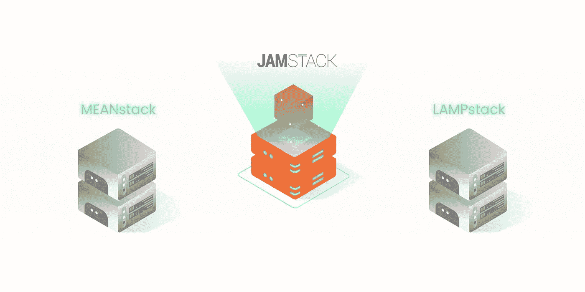

# 静态 vs 动态网站—2019 年有什么不同？

> 原文：<https://medium.com/hackernoon/static-vs-dynamic-website-whats-the-difference-in-2019-327064bfd4a9>

Static (JAMstack) sites vs Dynamic — what’s the difference in 2019?

最近，整个开发社区都在谈论传统的 web 开发以及事情如何朝着某个方向发展。静态网站回来了，大时代！
多亏了像 **JAMstack、**这样的现代网络架构，静态网站正成为网络开发者更好的解决方案。

很长一段时间以来，我一直试图传播关于 [JAMstack](https://hackernoon.com/tagged/jamstack) 的消息，仅仅是因为我一直依赖于它的架构和 JAMstack，因为它有很多优点。逐渐关注 JAMstack 改进了我的工作流程和开发过程，但更重要的是，它帮助我摆脱了标准 web 服务器中心架构的问题。

# **jam stack 到底是什么？**

JAMstack — JavaScript, APIs, and Markup — Landscape

[**JAMstack 代表 JavaScript、API 和标记。**](https://jamstack.org/) 这个讨人喜欢的缩写是 Netlify 的 CEO 马蒂亚斯·比尔曼(Mathias Biilmann)提出的。描述它的最佳方式是:利用巧妙的现代开发架构，它提供了静态网站的所有优点，还具有以动态数据库为中心的 CMS 的优点。我不会用一个深入的解释来烦你，但是如果你对一个更彻底的解释感兴趣的话[检查这个链接](https://bejamas.io/blog/jamstack-modern-web-development/)。

# 我的 JAMstack 经验

为即将到来的事情做好准备的最好方法是让自己能够快速学习和适应。我已经知道了这一点，它促使我走出我的 web 开发舒适区，探索上升的趋势。JAMstack 的最大优势之一是超低成本，这一点我很快就明白了。除此之外，还有其他巨大的优势，这些优势已经为许多人所熟知:

*   **可负担性**:我的预算很紧，而且专注于项目的各个方面，尽管如此，我还是非常渴望改进我的编码方式；简而言之，任何不必要的服务器和带宽成本都是一种痛苦和麻烦。通过过渡到 JAMstack，我的基础设施开支显著减少。
*   简单:有了 JAMstack，事情就简单了。对于开发人员来说，设置起来很简单，而且活动部件很少，因此，出错和搞砸的可能性更小。
*   安全性和可靠性:现在使用特定的 API，我犯的错误非常少。没有服务器端和数据库操作意味着额外的安全性和对 SQL 注入的免疫力。

JAMstack vs LAMP stack & MEAN stack

# JAMstack 与 LAMP stack 和 MEAN stack

JAMstack 的另一个好处是为[灯](https://en.wikipedia.org/wiki/LAMP_(software_bundle))和[均值堆栈](https://en.wikipedia.org/wiki/MEAN_(software_bundle))提供了一个极其实用有效的替代方案。LAMP stack 在 21 世纪初很有用，它由开源组件组成，许多开发人员用这些组件来构建网站(PHP 语言、Linux 操作系统、Apache HTTP 服务器和 MySQL RDBMS)。到了 2013 年，平均堆栈出现了，它包括 MongoDB、Express.js、Angular.js 和 node.js。

我在这里想说的是，相对于 LAMP stack，MEAN stack 是一个相当大的改进，主要是因为它为 SPA 提供了灵活性和更好的环境，并且它支持 NoSQL 数据库。此外，它还采用了单一语言——JavaScript。这种语言用于前端和后端功能之间的通信。类似于灯堆栈，视图层和模型层之间的平均堆栈。

开门见山地说，LAMP 是可靠的，但在过去也是可靠的，而 MEAN stack 是一种改进。这两种传统的系统现在都可以被更快、更现代的系统(如 JAM stack)迅速取代。

# 静态网页与动态网页

## 动态网站

在当前的 Web 开发场景中，依赖动态网站是一种长期的做法，主要是因为您可以进行大量的定制、简单的更新等等。你真的可以轻松制作复杂的页面。然而，所有这些都需要付出高昂的代价。

事实是，大多数动态网站容易耗尽系统资源，因为这意味着网络服务器和数据库的合并。

此外，传统的数据库驱动的 CMS(想想 WordPress，Drupal 等。)容易受到来自许多端点的恶意攻击。如果你的目标是保证你的网站安全，保持所有这些移动部件是强制性的。

## 静态网站

这些年来，我逐渐意识到静态网站有着显著的优势，即可以下载并保存在服务器上的现成网页(HTML 和 JS)。在这个时代，缺乏速度和巨大的加载时间是你不能承受的劣势。随着移动优先的索引和页面速度成为排名最靠前的因素之一，很容易理解为什么对任何类型的网站或在线业务来说都像是搬起石头砸自己的脚。

静态网站会给你带来更好的整体性能和大幅减少的加载时间——更不用说，更好地抵御黑客攻击。因此，使用静态网站可以让你获得更好的功能和更容易的维护。

它们没有很长的加载时间，任何开发人员在安装它们时都不会有困难。此外，如果需要的话，可以很容易地包含各种形式、支付或认证。您可以通过利用无处不在的 API 来做到这一点。

# 地平线上有什么

JAMstack 确实在去年大大简化了我的开发过程，但是事情并没有就此停止。对于那些对专业知识不感兴趣的人来说，说了这么多，做了这么多，为什么还要求助于 JAMstack 呢？

首先，对于 SEO 来说，这是一个非常可靠的策略。谷歌和其他强大的搜索引擎更喜欢静态网站，因为它们加载速度非常快。更重要的是，谷歌不断激励网站所有者整合加速移动页面(AMP)，这种特别的开源努力本质上通常是静态的(相当于桌面上的动态页面)。在开发方面，PWAs(渐进式网络应用)正在获得动力。毕竟，随着移动网络取代了桌面网络，出版商们选择退出，为所有平台和所有设备上的用户带来类似本土的体验。

我真的希望我已经给了你一些关于这个特殊的系统是如何有价值的见解，如果你想作为一个 web 开发人员来改进你的工作流程的话。我肯定会和 JAMstack 继续我的旅程，所以不要走。